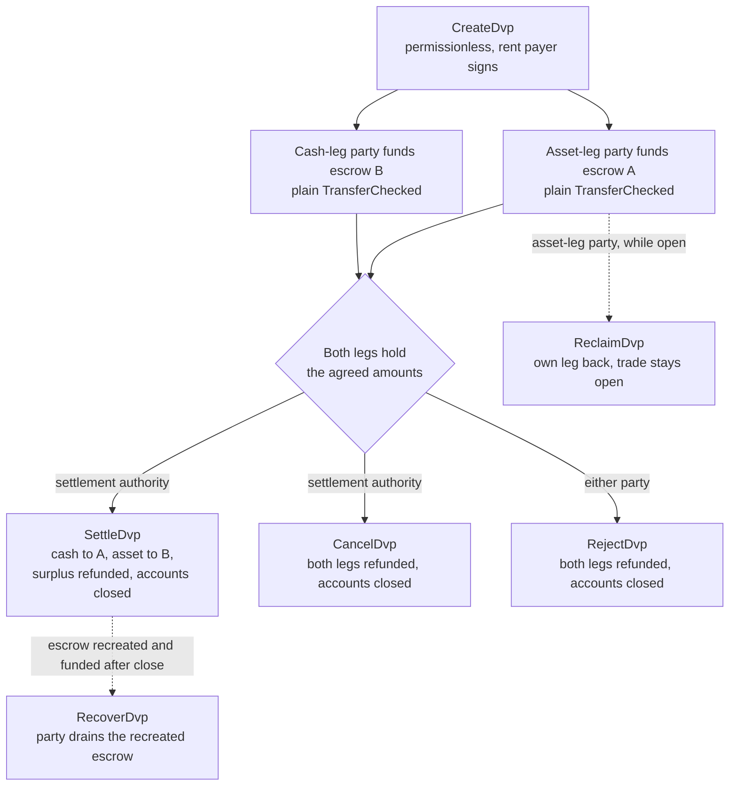
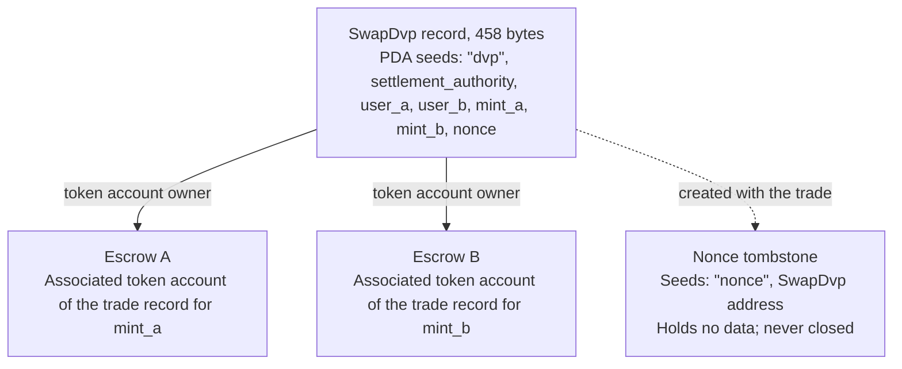

برنامج DvP هو البرنامج القياسي للتسليم مقابل الدفع على سولانا،
تتولى مؤسسة سولانا صيانته، وقد دقّقته Cantina. يتفق طرفان على
صفقة، ويرسل كل منهما σκέλος الخاص به إلى حساب ضمان (escrow) عبر تحويل
رموز عادي، وتقوم جهة التسوية بتسوية الطرفين في معاملة واحدة، فإما أن
يتحرك الطرفان معًا أو لا يتحرك أي منهما. جهة التسوية هي عنوان ثالث
مذكور في الصفقة، مثل المنصة أو الوكيل الذي رتّبها. لا يكتب أي من الطرفين برنامجًا ولا ينشره، ويمكن لأي محفظة أو أمين حفظ قادر على إرسال تحويل
رموز قياسي (`TransferChecked`) أن يموّل σκέλος دون أي
تكامل خاص بـ DvP. وحتى لحظة التسوية، يستطيع أي من الطرفين استرداد σκέλος الخاص به أو إلغاء
الصفقة.

<Callout type="warn" title="اقرأ السجل قبل التصرف بناءً عليه">

إنشاء سجل الصفقة لا يتطلب أي إذن، لذا فالسجل ليس دليلًا على
وجود اتفاق. يقرأ كل طرف الشروط المخزّنة قبل أن يموّل، وتقرؤها جهة
التسوية قبل أن تُجري التسوية (راجع
[التحقق](#verification-before-funding-and-settlement)).

</Callout>

## كيف يعمل

تحصل كل صفقة على سجل مملوك للبرنامج وحسابَي ضمان، واحد لكل σκέλος. يموّل
طرف σκέλος الأصل (`user_a`) وطرف σκέλος النقد (`user_b`) كلٌّ منهما σκέλος
عبر تحويل الرموز إلى حساب الضمان الخاص بذلك σκέλος. جهة التسوية
هي الموقِّع الوحيد القادر على التسوية. تنقل التسوية المبلغ المتفق عليه من كل σκέλος
إلى الطرف الآخر، وتعيد أي فائض إلى الطرف المالك لذلك
σκέλος، وتغلق السجل وحسابَي الضمان معًا. تأتي الذرّية من [معاملات](/docs/core/transactions)
سولانا: فكلا التحويلين في معاملة واحدة،
فإما أن يُنفَّذا معًا أو لا يُنفَّذ أي منهما.

كل استرداد أو استعادة أو إعادة فائض يذهب إلى associated
token account الخاص بالطرف نفسه: حساب `user_a` لـ `mint_a`، وحساب `user_b` لـ `mint_b`. يمكن
لأمين حفظ أو لنظام خزينة تمويل σκέλος من حسابه الخاص، لكن أي مبلغ
يُعاد يصل إلى حساب الطرف، لا إلى أمين الحفظ. كما تترك كل صفقة
حساب علامة دائمًا (راجع [الحالة](#state)).

## الأدلة

تأخذ صفحات الخطوات صفقة واحدة من الإنشاء حتى التسوية، مع أمثلة TypeScript و
Rust لكل تعليمة.

<Cards>
  <Card title="إنشاء صفقة" href="/docs/defi/dvp-program/create-a-trade">
    ثبّت العملاء وسجّل شروط الصفقة باستخدام CreateDvp
  </Card>
  <Card title="تمويل الطرفين" href="/docs/defi/dvp-program/fund-the-legs">
    تحقق من الشروط المخزّنة، ثم موّل كل σκέλος بتحويل عادي
  </Card>
  <Card title="تسوية الصفقة" href="/docs/defi/dvp-program/settle-the-trade">
    سوِّ الطرفين في معاملة واحدة بصفتك جهة التسوية
  </Card>
  <Card title="إلغاء صفقة" href="/docs/defi/dvp-program/unwind-a-trade">
    استرد σκέλος، أو ألغِ الصفقة أو ارفضها، واستعد الإيداعات المتأخرة
  </Card>
</Cards>

يشغّل [عرض devnet التوضيحي](https://solana.com/delivery-vs-payment/demo) صفقة من
البداية إلى النهاية: ينشئ الصفقة، ويموّل حسابَي الضمان بتحويلات رموز قياسية،
ويسوّي الطرفين في معاملة واحدة.

## الاختيار بين البرنامج والتفويض

يُجري [التسليم مقابل الدفع (DvP) باستخدام التفويض](/docs/tokenization/dvp) التبادل
نفسه دون برنامج: يفوّض كل طرف مركزه إلى
وكيل تسوية، يحرّك الطرفين في معاملة واحدة.

- **البرنامج** لا يحتاج إلى تفويض، لذا لا ينطبق حد مفوَّض واحد لكل token
  account، ولا تستطيع جهة التسوية إعادة توجيه العوائد.
  لكن كل صفقة تعتمد على برنامج قابل للترقية وعلى صلاحية ترقيته.
- **نمط التفويض** لا يعتمد على أي برنامج ويعمل مع الرموز (mints) التي
  تحمل Scaled UI Amount. أما البرنامج فيرفض تلك الرموز، مما يستبعد أي
  mint أُنشئ من قالب `tokenized-security` في Mosaic (راجع
  [قيود إعداد الـ mint](#mint-configuration-constraints)).

## الأدوار

البرنامج متماثل. في واجهته، الطرفان هما `user_a` الذي
يسلّم `mint_a`، و`user_b` الذي يسلّم `mint_b`. يسمّي ملف README
والعملاء المُولَّدون `mint_a` σκέλος الأصل و`mint_b` σκέλος النقد،
وتتبع هذه الصفحات هذا الاصطلاح، لكن لا شيء في البرنامج يشترط أن يكون σκέλος
النقد أداة نقدية. فأصلان، أو عملتان مستقرتان، تتم تسويتهما بالطريقة
نفسها.

| الدور                 | من                               | يوقّع                                              | ملاحظات                                                                                                                                                                                                     |
| -------------------- | --------------------------------- | -------------------------------------------------- | --------------------------------------------------------------------------------------------------------------------------------------------------------------------------------------------------------- |
| طرف σκέλος الأصل      | `user_a`، يسلّم `mint_a`       | تحويل التمويل الخاص به؛ Reclaim وReject وRecover | محفظة keypair، أو محفظة ذكية قائمة على PDA مثل خزنة متعددة التوقيع. لا يمكن لحساب SPL Token متعدد التوقيع أو لـ program account أن يكون طرفًا: يفشل Create مع `PartyNotSignerCapable`                   |
| طرف σκέλος النقد       | `user_b`، يسلّم `mint_b`       | تحويل التمويل الخاص به؛ Reclaim وReject وRecover | المتطلب نفسه                                                                                                                                                                                          |
| جهة التسوية | عنوان ثالث يُحدَّد عند الإنشاء | Settle وCancel                                     | الموقِّع الوحيد القادر على التسوية. لا يمكنها إعادة توجيه العوائد، فهي محددة عند الإنشاء. تتلقى rent الحسابات المغلقة عندما تسوّي أو تلغي                                         |
| دافع rent           | من يوقّع `CreateDvp`         | Create                                             | يموّل الـ rent (إيداع SOL الذي يُبقي الحساب مفتوحًا) للسجل، وعلامة nonce، وحسابَي الضمان. لا يُسجَّل كمستلم لـ rent: إذ يذهب rent الحسابات المغلقة إلى من يغلق الصفقة |

## معرّف البرنامج

```text
dvp34bdbcEm4f4FCUjGV4mDAkDshaQR4LkK8fdcsyZq
```

| الكلستر      | البرنامج                                       | صلاحية الترقية                              | آخر slot للنشر |
| ------------ | --------------------------------------------- | ---------------------------------------------- | ------------------ |
| mainnet-beta | `dvp34bdbcEm4f4FCUjGV4mDAkDshaQR4LkK8fdcsyZq` | `DXtFpbPjcn2hxPnw79x1Pfoj35vXh5AsWBkS37YnXMVv` | 452,058,374        |
| devnet       | `dvp34bdbcEm4f4FCUjGV4mDAkDshaQR4LkK8fdcsyZq` | `5EX1zFeJWj4rGYZv432WnYw8CbaSUeTdxPx4r573UgYU` | 479,376,863        |

البرنامج قابل للترقية على كلا الكلسترين. الأرقام أعلاه هي ما أبلغ عنه
`solana program show` بتاريخ 2 أكتوبر 2026؛ شغّل الأمر نفسه للحصول على
القيم الحالية. إصدار devnet أقدم من الـ commit الذي كُتبت صفحات الخطوات
بالاستناد إليه (راجع [التثبيت](/docs/defi/dvp-program/create-a-trade#install))،
مع مجموعة التعليمات والأخطاء نفسها.

## دورة الحياة



تبقى الصفقة مفتوحة من `CreateDvp` حتى تغلقها إحدى التعليمات Settle أو Cancel أو Reject.
لا توجد تعليمة مستقلة للتمويل: يُعدّ σκέλος ممولًا عندما يحتفظ حساب الضمان
الخاص به بالمبلغ المتفق عليه على الأقل. يتم Reclaim لكل σκέλος على حدة ويُبقي
الصفقة مفتوحة، لذا فإن مشكلة في σκέλος واحد لا تُجبر الطرف الآخر على إلغاء
الصفقة بأكملها.

## الحالة

لكل صفقة حساب `SwapDvp` واحد بحجم 458 بايت، مملوك للبرنامج. يُشتق
عنوانه من جهة التسوية، والطرفين، والـ mint
ين، وقيمة nonce (البذور
`["dvp", settlement_authority, user_a, user_b, mint_a, mint_b, nonce]`). تُخزَّن
المبالغ والأوقات داخل الحساب ولا تؤثر في العنوان،
ولهذا يجب قراءتها لا استنتاجها. يُنشأ حساب علامة صغير،
هو nonce tombstone عند `["nonce", swap_dvp]`، مع الصفقة ولا
يُغلق أبدًا، لذلك لا يمكن استخدام كل تركيبة من الأطراف والـ mints والجهة والـ nonce
إلا لصفقة واحدة فقط.



| الحقل                                  | النوع          | المعنى                                                                                                 |
| -------------------------------------- | ------------- | ------------------------------------------------------------------------------------------------------- |
| `bump`                                 | `u8`          | قيمة bump الخاصة بـ PDA                                                                                                |
| `user_a`، `user_b`                     | `Pubkey`      | الطرفان                                                                                         |
| `mint_a`، `mint_b`                     | `Pubkey`      | رمزا σκέλος الأصل وσκέλος النقد (mints)                                                                        |
| `settlement_authority`                 | `Pubkey`      | الموقِّع الوحيد القادر على التسوية أو الإلغاء                                                               |
| `token_program_a`، `token_program_b`   | `Pubkey`      | الـ token program الذي يملك كل mint؛ يمكن أن تجمع الصفقة بين σκέλος SPL Token وσκέλος Token-2022                    |
| `amount_a`، `amount_b`                 | `u64`         | المبلغ المتفق عليه لكل σκέλος، بأصغر وحدة للـ mint (الوحدات الأساسية)                                 |
| `expiry_timestamp`                     | `i64`         | بعد وقت الشبكة هذا (ساعة السلسلة)، يُرفض Settle. ويستمر عمل Reclaim وCancel وReject |
| `nonce`                                | `u64`         | يميّز بين الصفقات التي تتشارك البذور الأخرى. للاستخدام مرة واحدة                                             |
| `ref_string`                           | `[u8; 64]`    | مرجع عميل معتم، مُمَلّأ بالأصفار؛ لا يقرؤه البرنامج أبدًا                                     |
| `user_a_settlement_destination`        | `Pubkey`      | يتلقى σκέλος النقد عند Settle؛ والافتراضي هو `user_a`                                                   |
| `user_b_settlement_destination`        | `Pubkey`      | يتلقى σκέλος الأصل عند Settle؛ والافتراضي هو `user_b`                                                  |
| `mint_a_authority`، `mint_b_authority` | `Pubkey`      | صلاحيتا الـ mint المسجّلتان عند الإنشاء؛ يفشل Settle إذا تغيّرت إحداهما                           |
| `earliest_settlement_timestamp`        | `Option<i64>` | إذا حُدِّد، يُرفض Settle قبل وقت الشبكة هذا                                                     |

قائمة الحقول مأخوذة من IDL الخاص بالبرنامج عند الـ commit المذكور تحت
[إنشاء صفقة](/docs/defi/dvp-program/create-a-trade#install).

## التعليمات

| التعليمة  | الموقِّع               | الأثر                                                                                                                                                              |
| ------------ | -------------------- | ------------------------------------------------------------------------------------------------------------------------------------------------------------------- |
| `CreateDvp`  | أي جهة دافعة            | تنشئ سجل `SwapDvp` وعلامة nonce الخاصة به وحسابَي الضمان. لا تنقل أي رموز                                                                        |
| `ReclaimDvp` | `user_a` أو `user_b` | تعيد σκέλος الموقِّع نفسه من الضمان. تبقى الصفقة مفتوحة ويمكن تمويل σκέλος مرة أخرى                                                                      |
| `SettleDvp`  | جهة التسوية | تنقل `amount_a` إلى وجهة `user_b` و`amount_b` إلى وجهة `user_a`، وتعيد أي فائض إلى طرف σκέλος، وتغلق السجل وحسابَي الضمان |
| `CancelDvp`  | جهة التسوية | تعيد ما يحتفظ به الضمان A إلى `user_a` وما يحتفظ به الضمان B إلى `user_b`، وتغلق السجل وحسابَي الضمان                                                            |
| `RejectDvp`  | `user_a` أو `user_b` | الأثر نفسه كـ Cancel، لكن بتوقيع أحد الطرفين                                                                                                                            |
| `RecoverDvp` | `user_a` أو `user_b` | بعد إغلاق الصفقة: تفرغ حساب ضمان أُعيد إنشاؤه إلى token account الخاص بالموقِّع وتغلقه. تغطي إيداعًا وصل بعد Settle أو Cancel أو Reject  |

كل استرداد يذهب إلى associated token account الخاص بالطرف لـ mint ذلك
σκέλος، أيًّا كان من موّل حساب الضمان.

حسابات كل تعليمة ووسائطها موجودة في صفحة الخطوة الخاصة بها.

## الأخطاء

| الرمز | الخطأ                            | متى                                                                                                   |
| ---- | -------------------------------- | ------------------------------------------------------------------------------------------------------ |
| 0    | `SignerNotParty`                 | Reclaim أو Reject أو Recover موقَّع من عنوان ليس `user_a` أو `user_b`                      |
| 1    | `DvpExpired`                     | Settle بعد `expiry_timestamp`                                                                        |
| 2    | `SettlementAuthorityMismatch`    | Settle أو Cancel موقَّع من عنوان غير جهة التسوية                              |
| 3    | `SettlementTooEarly`             | Settle قبل `earliest_settlement_timestamp`                                                          |
| 4    | `LegNotFunded`                   | Settle بينما يحتفظ أحد حسابَي الضمان بأقل من المبلغ المتفق عليه                                               |
| 5    | `ExpiryNotInFuture`              | Create بتاريخ انتهاء يساوي وقت الشبكة الحالي أو يسبقه                                            |
| 6    | `EarliestAfterExpiry`            | Create بأبكر وقت تسوية يأتي بعد تاريخ الانتهاء                                               |
| 7    | `SelfDvp`                        | Create مع `user_a` مساوٍ لـ `user_b`                                                                 |
| 8    | `SameMint`                       | Create مع `mint_a` مساوٍ لـ `mint_b`                                                                 |
| 9    | `ZeroAmount`                     | Create بمبلغ صفري في أي من σκέλος                                                                |
| 10   | `BlockedMintExtension`           | Create أو Settle مع mint يحمل TransferFee أو InterestBearing أو ScaledUiAmount أو NonTransferable |
| 11   | `SettlementAuthorityIsParty`     | Create مع جهة تسوية تساوي أحد الطرفين                                                  |
| 12   | `SettlementAuthorityExecutable`  | Create مع جهة تسوية قابلة للتنفيذ                                                         |
| 13   | `NonceAlreadyUsed`               | Create يعيد استخدام `(seeds, nonce)` لديه tombstone بالفعل                                         |
| 14   | `ExpiryTooFarInFuture`           | Create بتاريخ انتهاء يتجاوز سنة واحدة من الآن                                                         |
| 15   | `RefStringTooLong`               | Create بمرجع أطول من 64 بايت                                                           |
| 16   | `DvpStillOpen`                   | Recover بينما الصفقة لا تزال مفتوحة؛ استخدم Reclaim                                                     |
| 17   | `DvpNeverCreated`                | الاستعادة باستخدام seeds لا يوجد لها tombstone                                                              |
| 18   | `EscrowPreloadedWithLamports`    | إنشاء عندما يحتفظ حساب ضمان غير أصلي بـ lamports تفوق الحد الأدنى المعفى من rent                           |
| 19   | `SettlementDestinationIsSwapDvp` | إنشاء مع وجهة تسوية مساوية لسجل الصفقة                                         |
| 20   | `SwapDvpPreloadedWithLamports`   | إنشاء عندما يحتفظ عنوان السجل بـ lamports تفوق احتياطي rent الخاص به                                   |
| 21   | `RecipientAtaMismatch`           | token account الخاص بالمستلم أو بالاسترداد لم يعد يعود إلى المحفظة والـ mint المتوقعين                  |
| 22   | `PartyNotSignerCapable`          | إنشاء مع طرف ليس حسابًا مملوكًا للنظام وغير قابل للتنفيذ                                 |
| 23   | `MintAuthorityChanged`           | تسوية عندما تختلف سلطة mint في إحدى الساقين عن القيمة المسجّلة عند الإنشاء                         |

## الأحداث والفهرسة

لا يُصدر البرنامج أي أحداث على السلسلة. يقرأ المفهرس أو نظام المطابقة
حالة حساب `SwapDvp` وأرصدة الرموز في حسابَي الضمان، ويستخدم
`ref_string` لربط الصفقة بأمرها خارج السلسلة. ولأن السجل يُغلق
عند التسوية، فإن النظام الذي يحتاج إلى الشروط لاحقًا يخزّنها عند قراءتها،
أو يعيد بناءها من المعاملة التي أنشأت الصفقة.

## الرموز المدعومة

يمكن للصفقة أن تجمع بين ساق SPL Token وساق Token-2022؛ إذ تحمل كل ساق
token program خاصًا بها. وتُدعم سيقان SOL المغلّفة (Wrapped SOL).

| امتداد Token-2022 على mint الخاص بالساق                                                     | سلوك البرنامج                                                  |
| ---------------------------------------------------------------------------------------- | ----------------------------------------------------------------- |
| TransferFee, InterestBearing, ScaledUiAmount, NonTransferable                            | يُرفض عند Create وSettle مع `BlockedMintExtension`         |
| PermanentDelegate, Pausable, DefaultAccountState, a freeze authority, MintCloseAuthority | مقبول؛ يمكن لكل سلطة التصرف في الرموز المودعة في الضمان           |
| ConfidentialTransfer                                                                     | مقبول؛ المبالغ في تلك الساق عامة                          |
| TransferHook                                                                             | مدعوم، حتى 32 حسابًا إضافيًا لكل ساق                        |
| MemoTransfer على حساب وجهة أو حساب استرداد                                          | مقبول؛ يُصدر البرنامج المذكرة (memo) المطلوبة قبل التحويل |

ستؤدي رسوم التحويل إلى نقص المبلغ الذي يستلمه الطرف المستقبِل عن المبلغ المتفق عليه.
أما Interest Bearing وScaled UI Amount فلا يغيّران المبالغ الخام، لكن معدلهما
أو معاملهما قد يتغير بين إنشاء الصفقة وتسويتها، مما يغيّر
طريقة عرض المبالغ المتفق عليها. وسيؤدي NonTransferable إلى حبس الساقين معًا.

يمكن للسلطات المقبولة نقل الرموز المودعة في الضمان أو تجميدها أو إيقافها طوال
عمر الصفقة (انظر أدناه). ولا يمكن إعداد حساب الضمان لاستقبال
التحويلات السرية، لذا فإن المبالغ المودعة والمسوّاة في الساق السرية
عامة.

بالنسبة إلى mint ذي hook، يحدد العميل الحسابات الإضافية الخاصة بالـ hook ويلحقها
بـ Settle وCancel وReject وReclaim وRecover. ويشمل الحد الأقصى البالغ 32 لكل ساق
برنامج الـ hook وحساب التحقق الخاص به. وإذا وسّعت سلطة الـ hook
قائمة حسابات الـ hook متجاوزةً هذا الحد، فستفشل كل عملية تحويل على تلك الساق،
بما في ذلك Reclaim وCancel وReject وRecover، إلى أن تتراجع السلطة عن ذلك. وقد يتحقق حد الحسابات في المعاملة قبل الحد الأقصى لكل ساق عندما
تحمل الساقان كلتاهما hooks.

عندما يتطلب حساب الوجهة أو الاسترداد مذكرات (memos)، يستدعي البرنامج برنامج Memo
قبل التحويل، ولهذا تأخذ كل تعليمة تنقل الرموز
خارج الضمان حساب `memo_program`.

### قيود إعداد mint

**Scaled UI Amount.** يضيف القالب `tokenized-security` في
[Mosaic](https://github.com/solana-foundation/mosaic)، مجموعة أدوات الإصدار التابعة لمؤسسة سولانا،
الامتداد Scaled UI Amount دائمًا، لذا لا يقبل البرنامج
mint أُنشئ من ذلك القالب كساق. ويمكن إنشاء mint مخصص لهذا البرنامج
دون هذا الامتداد (انظر
[Token Extensions](/docs/tokens/extensions))؛
أما [DvP باستخدام التفويض](/docs/tokenization/dvp) فيُسوّى عبر
سلطة مفوَّضة ولا يطبّق هذا الفحص.

**mint المجمّدة افتراضيًا.** حساب الضمان لكل صفقة هو associated token account
يملكه program-derived address جديد لتلك الصفقة. في mint ضُبطت فيه Default Account State على «مجمّد»، يُنشأ حساب الضمان مجمّدًا، ويفشل
تحويل التمويل إليه إلى أن يُفك تجميده. وفي ظل
[Token ACL](/docs/tokenization/token-acl) يعني ذلك أن الجهة المُصدِرة أو وكيل التحويل التابع لها
يقبل حساب ضمان الصفقة قبل التمويل: إما بإضافة عنوان سجل الصفقة
(مالك حساب الضمان) إلى قائمة السماح، بحيث يستطيع أي شخص فك تجميد
حساب الضمان حيثما يفعّل إعداد Token ACL الخاص بالـ mint خاصية فك التجميد دون إذن، وإما بأن
تفك سلطة التجميد تجميده مباشرةً. كما يمنع حساب الضمان المجمّد
Settle وReclaim وCancel وReject وRecover على تلك الساق، ولذلك تُعدّ سلطة التجميد،
وسلطة الـ hook في mint ذي hook، طرفًا موثوقًا طوال
عمر الصفقة. ويُوصف مسار حساب الضمان المجمّد هنا ولا يُمارَس
في مقتطفات devnet.

## الحدود

- لا مطابقة ولا اكتشاف أسعار ولا دفتر أوامر. يتفق الطرفان على الشروط خارج
  السجل ويسجّلها أحدهما.
- لا مقاصة، وثنائية فقط: سجل واحد يمثل صفقة واحدة بين طرفين.
- لا تنفيذ جزئي. تنقل Settle المبلغ المتفق عليه بالضبط من كل ساق
  وتعيد أي فائض إلى طرف الساق.
- لا ساق خارج السجل. الساقان كلتاهما token accounts على سولانا؛ أما الساق النقدية
  عبر القنوات القائمة فتُسوّى بشكل منفصل وتجري مطابقتها.
- لا فحص أهلية ولا قائمة سماح ولا KYC. تفرض ضوابط الـ mint نفسه
  أهلية الحائزين.
- لا تسوية تلقائية. يجب أن توقّع سلطة التسوية.
- لا أحداث، ولا رسوم بروتوكول سوى رسوم المعاملات وrent.

يزيل البرنامج مخاطر الأصل بين الطرفين: لا تتحرك أي ساق
ما لم تتحرك الأخرى. لكنه لا يزيل مخاطر ائتمان المُصدِر أو الاسترداد على أي من
الرمزين، ولا قدرة سلطة التجميد أو الإيقاف المؤقت أو المفوَّض الدائم في mint على
التصرف في الرموز المودعة في الضمان (انظر [الرموز المدعومة](#supported-tokens))، ولا
الاعتماد على توفر سلطة التسوية للتوقيع.

## التحقق قبل التمويل والتسوية

`CreateDvp` لا يتطلب إذنًا: يوقّع الدافع فقط، ولا يوقّع الطرفان
ولا سلطة التسوية. لذلك يمكن لأي شخص إنشاء سجل يسمّي أي
أطراف وأي شروط. قبل التمويل، ومجددًا قبل التسوية، اقرأ حساب
`SwapDvp` وتأكد مما يلي:

1. الحساب مملوك لبرنامج DvP وحجمه 458 بايت بالضبط. يمكن ملء حساب
   غير مملوك للبرنامج ببايتات تُفك ترميزها كأنها
   سجل حقيقي.
2. تطابق `user_a` و`user_b` و`mint_a` و`mint_b` و`settlement_authority`
   الصفقة المتفق عليها.
3. تطابق `amount_a` و`amount_b` و`expiry_timestamp` و
   `earliest_settlement_timestamp` الشروط المتفق عليها.
4. وجهتا التسوية كلتاهما العنوانان المتفق عليهما. يمكن لسجل مزوّر
   إعادة توجيه العائدات.

يسرد [تمويل الساقين](/docs/defi/dvp-program/fund-the-legs#verify-the-terms) القارئات المفحوصة
في العملاء المولَّدين ويعرض الفحص في الكود.

اعتبر الصفقة مسوّاة عندما تصل معاملة Settle إلى
[`finalized`](/docs/rpc#configuring-state-commitment). وهذا مستوى التزام في الشبكة؛ أما كونه يمثل أيضًا
نهائية التسوية لأغراض قانونية فيعتمد على اتفاقيات الطرفين والأنظمة المعمول بها.

## الإصدارات

لا يحمل حساب `SwapDvp` حقل إصدار. تخطيطه ثابت عند 458 بايت
(`SwapDvp::LEN`)، وترفض القارئات المفحوصة أي حساب بطول مختلف.
ويحمل IDL إصداره الخاص، وهو `0.1.0` اعتبارًا من 2 أكتوبر 2026.

البرنامج قابل للترقية على كلا الكتلتين (clusters) (انظر [معرّف البرنامج](#program-id)). لا يوجد
سجل الصفقة إلا إلى أن تُسوّى أو تُلغى أو تُرفض، لذا راجع
المستودع لمعرفة كيف تعامل الترقية الصفقات المفتوحة، وأعد توليد العملاء
من IDL للإصدار المنشور.

## المستودع والتدقيق

المصدر وIDL والعملاء المولَّدون والاختبارات موجودة في
[`solana-foundation/dvp`](https://github.com/solana-foundation/dvp) بترخيص
MIT. البرنامج هو برنامج Pinocchio من نوع `no_std`؛ ويُولَّد العملاء
من IDL باستخدام Codama. تُرسل تقارير الثغرات عبر رابط الإشعار الأمني في
المستودع، وفق `SECURITY.md` الخاص به.

خضع البرنامج للتدقيق من قِبل
[Cantina](https://cantina.xyz/portfolio/fe870bb4-d96d-4902-8aec-9dfcfa2d6a79).

## ذو صلة

- [التسليم مقابل الدفع (DvP) باستخدام التفويض](/docs/tokenization/dvp): نمط
  التفويض دون برنامج
- [Token ACL](/docs/tokenization/token-acl): كيف يتفاعل mint المقيَّد مع
  حسابات الضمان
