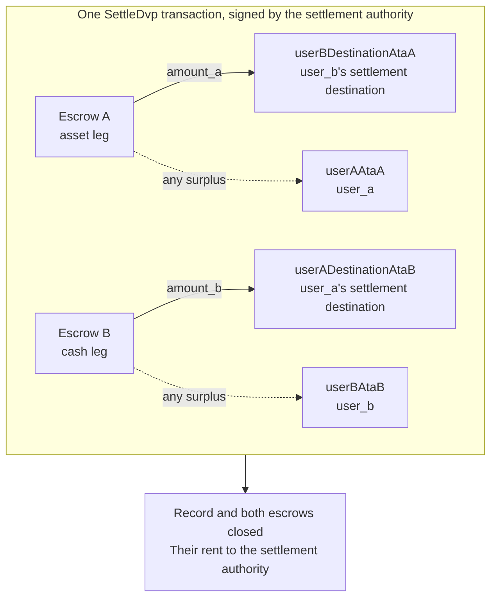

يوقّع على `SettleDvp` سلطة التسوية المذكورة في سجل الصفقة. وفي معاملة واحدة ينقل `amount_a` من ساق الأصل إلى وجهة طرف ساق النقد، و`amount_b` من ساق النقد إلى وجهة طرف ساق الأصل، ويعيد أي فائض في أي من حسابَي الضمان إلى طرف تلك الساق، ويغلق السجل وحسابَي الضمان كليهما. وإذا تعذّر إتمام أي من هذه التحويلات، تفشل التعليمة ولا يتحرك شيء.

تتابع هذه الصفحة ما بدأناه في [إنشاء صفقة](/docs/defi/dvp-program/create-a-trade) و[تمويل الساقين](/docs/defi/dvp-program/fund-the-legs)؛ إذ يستمر استخدام العميل والموقّعين و`trade` وtoken accounts الخاصة بالأطراف كما هي.

## أعد التحقق قبل التوقيع

توقّع سلطة التسوية على المعاملة التي تنقل الساقين معًا، ولذلك تُجري القراءة نفسها التي يجريها كل طرف قبل توقيعه: المالك، والحجم، والأطراف، وmints، والمبالغ، وتاريخ الانتهاء، والوجهتين (راجع [تمويل الساقين](/docs/defi/dvp-program/fund-the-legs#verify-the-terms)). كما يعيد البرنامج نفسه عند التسوية التحقق من أن كل mint لا يزال تابعًا لـ token program المسجّل عند الإنشاء، وأنه لا يحمل أي امتداد محظور، وأن له سلطة mint نفسها التي كانت وقت إنشاء الصفقة. وبالتالي لا يمكن تسوية صفقة إذا أُعيد إنشاء mint بامتداد محظور، أو بـ token program مختلف، أو بسلطة mint مختلفة.

## أنشئ حسابات المستلمين

تكتب عملية Settle في أربعة token accounts لا ينشئها البرنامج:

| الحساب                | يستلم                     | المالك                           |
| ---------------------- | ---------------------------- | ------------------------------- |
| `userADestinationAtaB` | ساق النقد (`amount_b`)    | `user_a_settlement_destination` |
| `userBDestinationAtaA` | ساق الأصل (`amount_a`)   | `user_b_settlement_destination` |
| `userAAtaA`            | أي فائض في ساق الأصل | `user_a`                        |
| `userBAtaB`            | أي فائض في ساق النقد  | `user_b`                        |

لا تُستخدم حسابات الفائض إلا عندما يحتوي حساب ضمان على أكثر من المبلغ المتفق عليه، لكن يستطيع أي شخص يملك mint إنشاء فائض بإرسال بضع وحدات أساسية إلى حساب الضمان. وإذا لم يكن حساب الاسترداد موجودًا، تفشل عملية Settle بأكملها، لذا أنشئ الحسابات الأربعة جميعها بشكل idempotent (آمن عند التكرار) ضمن المعاملة نفسها.

<Tabs items={["TypeScript", "Rust"]}>
  <Tab value="TypeScript">
    ```ts
    import {
      findAssociatedTokenPda,
      getCreateAssociatedTokenIdempotentInstruction,
    } from "@solana-program/token-2022";

    const destinationA = t.userASettlementDestination; // defaults to userA
    const destinationB = t.userBSettlementDestination; // defaults to userB

    const [userADestinationAtaB] = await findAssociatedTokenPda({
      mint: mintB,
      owner: destinationA,
      tokenProgram: tokenProgramB,
    });
    const [userBDestinationAtaA] = await findAssociatedTokenPda({
      mint: mintA,
      owner: destinationB,
      tokenProgram: tokenProgramA,
    });
    // userAAtaA and userBAtaB are from fund the legs.

    const createRecipientAccounts = [
      { ata: userADestinationAtaB, owner: destinationA, mint: mintB, tokenProgram: tokenProgramB },
      { ata: userBDestinationAtaA, owner: destinationB, mint: mintA, tokenProgram: tokenProgramA },
      { ata: userAAtaA, owner: userA, mint: mintA, tokenProgram: tokenProgramA },
      { ata: userBAtaB, owner: userB, mint: mintB, tokenProgram: tokenProgramB },
    ].map(({ ata, owner, mint, tokenProgram }) =>
      getCreateAssociatedTokenIdempotentInstruction({
        payer: authoritySigner,
        ata,
        owner,
        mint,
        tokenProgram,
      }),
    );
    ```

  </Tab>

  <Tab value="Rust">
    ```rust
    use spl_associated_token_account_client::address::get_associated_token_address_with_program_id;
    use spl_associated_token_account_client::instruction::create_associated_token_account_idempotent;

    let authority: Pubkey = pubkey!("SETTLEMENT_AUTHORITY_ADDRESS_HERE");
    let destination_a = trade.user_a_settlement_destination; // defaults to user_a
    let destination_b = trade.user_b_settlement_destination; // defaults to user_b

    let user_a_destination_ata_b =
        get_associated_token_address_with_program_id(&destination_a, &mint_b, &token_program_b);
    let user_b_destination_ata_a =
        get_associated_token_address_with_program_id(&destination_b, &mint_a, &token_program_a);
    let user_a_ata_a = get_associated_token_address_with_program_id(&user_a, &mint_a, &token_program_a);
    let user_b_ata_b = get_associated_token_address_with_program_id(&user_b, &mint_b, &token_program_b);

    let create_recipient_accounts = [
        create_associated_token_account_idempotent(&authority, &destination_a, &mint_b, &token_program_b),
        create_associated_token_account_idempotent(&authority, &destination_b, &mint_a, &token_program_a),
        create_associated_token_account_idempotent(&authority, &user_a, &mint_a, &token_program_a),
        create_associated_token_account_idempotent(&authority, &user_b, &mint_b, &token_program_b),
    ];
    ```

  </Tab>
</Tabs>

## التسوية

يخبر `legAExtrasCount` البرنامجَ بعدد الحسابات المُلحقة بعد القائمة الثابتة التي تعود إلى transfer hook الخاص بتحويل ساق الأصل؛ أما الباقي فيعود إلى ساق النقد. وبالنسبة إلى mints التي لا تحتوي على transfer hooks، مرّر صفرًا ولا تُلحق شيئًا. أما memo program account فتطلبه التعليمة، ولا يُستخدم إلا مع الوجهات التي تشترط memo.

<Tabs items={["TypeScript", "Rust"]}>
  <Tab value="TypeScript">
    ```ts
    import { MEMO_PROGRAM_ADDRESS } from "@solana-program/memo";
    import { getSettleDvpInstruction } from "./dvp";

    const settleInstruction = getSettleDvpInstruction({
      settlementAuthority: authoritySigner,
      swapDvp,
      mintA,
      mintB,
      dvpAtaA: escrowA,
      dvpAtaB: escrowB,
      userADestinationAtaB,
      userBDestinationAtaA,
      userAAtaA,
      userBAtaB,
      tokenProgramA,
      tokenProgramB,
      memoProgram: MEMO_PROGRAM_ADDRESS,
      legAExtrasCount: 0,
    });

    const { context: settleContext } = await client.sendTransaction([
      ...createRecipientAccounts,
      settleInstruction,
    ]);
    const settleSignature = settleContext.signature;
    console.log("Submitted:", settleSignature);

    // sendTransaction returns at the client's commitment (confirmed by default).
    // Wait for finalized before recording the trade as settled.
    let finalized = false;
    for (let attempt = 0; attempt < 30 && !finalized; attempt++) {
      const {
        value: [status],
      } = await client.rpc.getSignatureStatuses([settleSignature]).send();
      if (status?.err) {
        throw new Error("Settle transaction failed");
      }
      finalized = status?.confirmationStatus === "finalized";
      if (!finalized) {
        await new Promise((resolve) => setTimeout(resolve, 2_000));
      }
    }
    if (!finalized) {
      // A closed record means it settled; an open one is safe to settle again.
      throw new Error("Settle not finalized after 60s; read the trade record");
    }
    console.log("Settled:", settleSignature);
    ```

  </Tab>

  <Tab value="Rust">
    ```rust
    use dvp_swap_program_client::instructions::SettleDvpBuilder;

    const MEMO_PROGRAM_ID: Pubkey = pubkey!("MemoSq4gqABAXKb96qnH8TysNcWxMyWCqXgDLGmfcHr");

    let settle_ix = SettleDvpBuilder::new()
        .settlement_authority(authority)
        .swap_dvp(swap_dvp)
        .mint_a(mint_a)
        .mint_b(mint_b)
        .dvp_ata_a(escrow_a)
        .dvp_ata_b(escrow_b)
        .user_a_destination_ata_b(user_a_destination_ata_b)
        .user_b_destination_ata_a(user_b_destination_ata_a)
        .user_a_ata_a(user_a_ata_a)
        .user_b_ata_b(user_b_ata_b)
        .token_program_a(token_program_a)
        .token_program_b(token_program_b)
        .memo_program(MEMO_PROGRAM_ID)
        .leg_a_extras_count(0)
        .instruction();
    ```

  </Tab>
</Tabs>



### خطافات التحويل (Transfer hooks)

لا يسرد IDL المُولَّد سوى الحسابات الثابتة، ولذلك لا تعرف أدوات البناء المُولَّدة شيئًا عن حسابات الخطافات. حلّ extra account metas لكل mint يحتوي على hook بالطريقة نفسها التي تتبعها عند تحويل مباشر لذلك الرمز، ثم أضفها إلى التعليمة: حسابات ساق الأصل أولًا، ثم حسابات ساق النقد، مع ضبط `legAExtrasCount` على عدد حسابات المجموعة الأولى. في TypeScript، وزّع (spread) الـ metas المحلولة على مصفوفة `accounts` الخاصة بالتعليمة؛ وفي Rust، استخدم `add_remaining_accounts` على أداة البناء. الحد الأقصى هو 32 حسابًا لكل ساق، بما في ذلك برنامج hook وحساب التحقق؛ وقد يصبح حد الحسابات في المعاملة هو القيد الأول عندما تحمل الساقان كلتاهما hooks. ويزيل البرنامج علامة الموقّع من كل حساب يُمرَّر، فلا يستطيع hook الحصول على توقيع سلطة التسوية عبر هذا المسار.

## سجّل النتيجة

اعتبر الصفقة قد سُوّيت عندما تصل معاملة Settle إلى `finalized`. فالسجل وحسابا الضمان لا يعودان موجودين بعد التسوية، لذا فإن النظام الذي يحتاج إلى الشروط لاحقًا يخزّنها من قراءته السابقة للتسوية أو من معاملة الإنشاء. أما rent الخاص بالحسابات المغلقة فقد آل إلى سلطة التسوية.

## أخطاء التسوية

يعني `LegNotFunded` أن حساب ضمان يحتوي على أقل من المبلغ المتفق عليه؛ ويعني `DvpExpired` و`SettlementTooEarly` أن النافذة الزمنية قد فاتت؛ ويعني `MintAuthorityChanged` و`BlockedMintExtension` أن mint قد تغيّر بعد الإنشاء؛ ويعني `RecipientAtaMismatch` أن token account الخاص بوجهة أو استرداد مفقود أو لم يعد تابعًا للمالك وmint المتوقعَين، وغالبًا بسبب تخطي خطوة إنشاء الحسابات أعلاه. وفي كل الحالات لم يتحرك شيء، ويمكن للأطراف التراجع عن الصفقة، مع مراعاة سلطات الـ mint (راجع [التراجع عن صفقة](/docs/defi/dvp-program/unwind-a-trade)).

## الخطوات التالية

- [التراجع عن صفقة](/docs/defi/dvp-program/unwind-a-trade): استرداد الساقين الممولتين
  عندما لا تتم تسوية الصفقة
