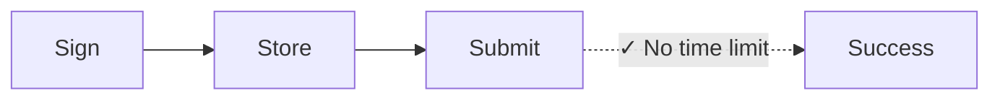
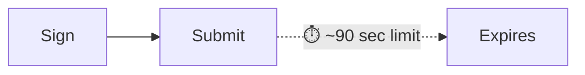

تتضمن كل معاملة على سولانا قيمة تجزئة كتلة حديثة—وهي إشارة إلى حالة شبكة حديثة
تثبت أن المعاملة تم إنشاؤها "الآن". ترفض الشبكة أي معاملة تحتوي على قيمة تجزئة
كتلة أقدم من ~150 كتلة (~60-90 ثانية)، مما يمنع هجمات إعادة التشغيل والإرسالات
القديمة. يعمل هذا بشكل مثالي للمدفوعات في الوقت الفعلي. لكنه يعطل سير العمل الذي
يحتاج إلى فجوة بين التوقيع والإرسال، مثل:

| السيناريو                     | لماذا تفشل المعاملات القياسية                                              |
| ----------------------------- | -------------------------------------------------------------------------- |
| **عمليات الخزينة**            | المدير المالي في طوكيو يوقّع، المراقب في نيويورك يوافق—90 ثانية ليست كافية |
| **سير عمل الامتثال**          | تحتاج المعاملات إلى مراجعة قانونية/امتثال قبل التنفيذ                      |
| **التوقيع من التخزين البارد** | تتطلب الأجهزة المعزولة عن الشبكة نقلًا يدويًا للمعاملات الموقعة            |
| **إعداد الدفعات**             | إعداد كشوف الرواتب أو الصرفيات خلال ساعات العمل، وتنفيذها ليلاً            |
| **تنسيق التوقيع المتعدد**     | عدة موافقين عبر مناطق زمنية مختلفة                                         |
| **المدفوعات المجدولة**        | جدولة المدفوعات لتنفيذها في تاريخ مستقبلي                                  |

في التمويل التقليدي، لا تنتهي صلاحية الشيك الموقع في 90 ثانية. بعض عمليات
البلوكشين لا ينبغي أن تنتهي صلاحيتها أيضًا. **القيم الفريدة الدائمة** تحل هذه
المشكلة عن طريق استبدال قيمة تجزئة الكتلة الحديثة بقيمة مخزنة ومستمرة لا تتقدم
إلا عند استخدامها—مما يمنحك معاملات تظل صالحة حتى تصبح جاهزًا لإرسالها.

## كيف يعمل

بدلاً من blockhash حديث (صالح لحوالي 150 كتلة)، تستخدم **حساب nonce**، حساب خاص
يخزن قيمة _فريدة_ يمكن استخدامها بدلاً من blockhash. يجب على كل معاملة تستخدم
هذا nonce "تقديمه" كأول تعليمة. يمكن استخدام كل قيمة nonce لمعاملة واحدة فقط.





<Callout type="info">
  يكلف حساب nonce حوالي 0.0015 SOL للإعفاء من الإيجار. حساب nonce واحد = معاملة
  معلقة واحدة في كل مرة. لسير العمل المتوازي، قم بإنشاء عدة حسابات nonce.
</Callout>

### إنشاء حساب Nonce

يتطلب إنشاء حساب nonce تعليمتين في معاملة واحدة:

1. **إنشاء الحساب** باستخدام `getCreateAccountInstruction` من System Program
2. **تهيئته كـ nonce** باستخدام `getInitializeNonceAccountInstruction`

<ScrollyCoding>

## !!steps توليد Keypair

قم بتوليد keypair جديد لاستخدامه كعنوان حساب nonce واحسب المساحة المطلوبة
والإيجار.

<CodePlaceholder title="Create Nonce Account" />

```ts !! title="Create Nonce Account"
const nonceKeypair = await generateKeyPairSigner();
const nonceSpace = BigInt(getNonceSize());
const nonceRent = await rpc
  .getMinimumBalanceForRentExemption(nonceSpace)
  .send();
```

## !!steps تعليمة إنشاء الحساب

قم بإنشاء الحساب المملوك من قبل System Program مع ما يكفي من lamports للإعفاء من
الإيجار.

<CodePlaceholder title="Create Nonce Account" />

```ts !! title="Create Nonce Account"
const nonceKeypair = await generateKeyPairSigner();
const nonceSpace = BigInt(getNonceSize());
const nonceRent = await rpc
  .getMinimumBalanceForRentExemption(nonceSpace)
  .send();

// !focus(1:7)
const createNonceAccountIx = getCreateAccountInstruction({
  payer: sender,
  newAccount: nonceKeypair,
  lamports: nonceRent,
  space: nonceSpace,
  programAddress: SYSTEM_PROGRAM_ADDRESS
});
```

## !!steps تعليمة تهيئة Nonce

قم بتهيئة الحساب كحساب nonce، مع تعيين الصلاحية التي يمكنها تقديمه.

<CodePlaceholder title="Create Nonce Account" />

```ts !! title="Create Nonce Account"
const nonceKeypair = await generateKeyPairSigner();
const nonceSpace = BigInt(getNonceSize());
const nonceRent = await rpc
  .getMinimumBalanceForRentExemption(nonceSpace)
  .send();

const createNonceAccountIx = getCreateAccountInstruction({
  payer: sender,
  newAccount: nonceKeypair,
  lamports: nonceRent,
  space: nonceSpace,
  programAddress: SYSTEM_PROGRAM_ADDRESS
});

// !focus(1:4)
const initNonceIx = getInitializeNonceAccountInstruction({
  nonceAccount: nonceKeypair.address,
  nonceAuthority: sender.address
});
```

## !!steps بناء المعاملة

قم ببناء معاملة تحتوي على كلتا التعليمتين.

<CodePlaceholder title="Create Nonce Account" />

```ts !! title="Create Nonce Account"
const nonceKeypair = await generateKeyPairSigner();
const nonceSpace = BigInt(getNonceSize());
const nonceRent = await rpc
  .getMinimumBalanceForRentExemption(nonceSpace)
  .send();

const createNonceAccountIx = getCreateAccountInstruction({
  payer: sender,
  newAccount: nonceKeypair,
  lamports: nonceRent,
  space: nonceSpace,
  programAddress: SYSTEM_PROGRAM_ADDRESS
});

const initNonceIx = getInitializeNonceAccountInstruction({
  nonceAccount: nonceKeypair.address,
  nonceAuthority: sender.address
});

// !focus(1:7)
const { value: blockhash } = await rpc.getLatestBlockhash().send();
const createNonceTx = pipe(
  createTransactionMessage({ version: 0 }),
  (tx) => setTransactionMessageFeePayerSigner(sender, tx),
  (tx) => setTransactionMessageLifetimeUsingBlockhash(blockhash, tx),
  (tx) =>
    appendTransactionMessageInstructions(
      [createNonceAccountIx, initNonceIx],
      tx
    )
);
```

## !!steps التوقيع والإرسال

قم بتوقيع وإرسال المعاملة لإنشاء وتهيئة حساب nonce.

<CodePlaceholder title="Create Nonce Account" />

```ts !! title="Create Nonce Account"
const nonceKeypair = await generateKeyPairSigner();
const nonceSpace = BigInt(getNonceSize());
const nonceRent = await rpc
  .getMinimumBalanceForRentExemption(nonceSpace)
  .send();

const createNonceAccountIx = getCreateAccountInstruction({
  payer: sender,
  newAccount: nonceKeypair,
  lamports: nonceRent,
  space: nonceSpace,
  programAddress: SYSTEM_PROGRAM_ADDRESS
});

const initNonceIx = getInitializeNonceAccountInstruction({
  nonceAccount: nonceKeypair.address,
  nonceAuthority: sender.address
});

const { value: blockhash } = await rpc.getLatestBlockhash().send();
const createNonceTx = pipe(
  createTransactionMessage({ version: 0 }),
  (tx) => setTransactionMessageFeePayerSigner(sender, tx),
  (tx) => setTransactionMessageLifetimeUsingBlockhash(blockhash, tx),
  (tx) =>
    appendTransactionMessageInstructions(
      [createNonceAccountIx, initNonceIx],
      tx
    )
);

// !focus(1:6)
const signedCreateNonceTx =
  await signTransactionMessageWithSigners(createNonceTx);

await sendAndConfirmTransactionFactory({ rpc, rpcSubscriptions })(
  signedCreateNonceTx,
  { commitment: "confirmed" }
);
```

</ScrollyCoding>

### بناء معاملة مؤجلة

بدلاً من تجزئة كتلة حديثة، استخدم `blockhash` الخاص بحساب nonce كعمر افتراضي
للمعاملة.

<ScrollyCoding>

## !!steps جلب قيمة nonce

اجلب البيانات من حساب nonce. استخدم `blockhash` من حساب nonce كعمر افتراضي
للمعاملة.

```sh title="Example Nonce Account Data"
{
  version: 1,
  state: 1,
  authority: 'HgjaL8artMtmntaQDVM2UBk3gppsYYERS4PkUhiaLZD1',
  # !mark
  blockhash: '5U7seXqfgZx1uh5DFhdH1vyBhr7XGRrKxBAnJJTbbUa',
  lamportsPerSignature: 5000n
}
```

<CodePlaceholder title="Build Deferred Transaction" />

```ts !! title="Build Deferred Transaction"
// !focus(1:1)
const { data: nonceData } = await fetchNonce(rpc, nonceKeypair.address);
```

## !!steps إنشاء تعليمة التحويل

أنشئ التعليمة الخاصة بالدفع. يوضح هذا المثال تحويل رمز مميز.

<CodePlaceholder title="Build Deferred Transaction" />

```ts !! title="Build Deferred Transaction"
const { data: nonceData } = await fetchNonce(rpc, nonceKeypair.address);

// !focus(1:6)
const transferInstruction = getTransferInstruction({
  source: senderAta,
  destination: recipientAta,
  authority: sender.address,
  amount: 250_000n
});
```

## !!steps بناء معاملة باستخدام nonce دائم

استخدم `setTransactionMessageLifetimeUsingDurableNonce` الذي يعين nonce كتجزئة
كتلة ويضيف تلقائياً تعليمة تقديم nonce في البداية.

<CodePlaceholder title="Build Deferred Transaction" />

```ts !! title="Build Deferred Transaction"
const { data: nonceData } = await fetchNonce(rpc, nonceKeypair.address);

const transferInstruction = getTransferInstruction({
  source: senderAta,
  destination: recipientAta,
  authority: sender.address,
  amount: 250_000n
});

// !focus(1:14)
const transactionMessage = pipe(
  createTransactionMessage({ version: 0 }),
  (tx) => setTransactionMessageFeePayerSigner(sender, tx),
  (tx) =>
    // !mark(1:8)
    setTransactionMessageLifetimeUsingDurableNonce(
      {
        nonce: nonceData.blockhash as Nonce,
        nonceAccountAddress: nonceKeypair.address,
        nonceAuthorityAddress: nonceData.authority
      },
      tx
    ),
  (tx) => appendTransactionMessageInstructions([transferInstruction], tx)
);
```

## !!steps توقيع المعاملة

قم بتوقيع المعاملة. تستخدم الآن nonce الدائم بدلاً من تجزئة كتلة قياسية.

<CodePlaceholder title="Build Deferred Transaction" />

```ts !! title="Build Deferred Transaction"
const { data: nonceData } = await fetchNonce(rpc, nonceKeypair.address);

const transferInstruction = getTransferInstruction({
  source: senderAta,
  destination: recipientAta,
  authority: sender.address,
  amount: 250_000n
});

const transactionMessage = pipe(
  createTransactionMessage({ version: 0 }),
  (tx) => setTransactionMessageFeePayerSigner(sender, tx),
  (tx) =>
    setTransactionMessageLifetimeUsingDurableNonce(
      {
        nonce: nonceData.blockhash as Nonce,
        nonceAccountAddress: nonceKeypair.address,
        nonceAuthorityAddress: nonceData.authority
      },
      tx
    ),
  (tx) => appendTransactionMessageInstructions([transferInstruction], tx)
);

// !focus(1:2)
const signedTransaction =
  await signTransactionMessageWithSigners(transactionMessage);
```

</ScrollyCoding>

### تخزين أو إرسال المعاملة

بعد التوقيع، قم بترميز المعاملة للتخزين. عندما تكون جاهزًا، أرسلها إلى الشبكة.

<ScrollyCoding>

## !!steps الترميز للتخزين

قم بترميز المعاملة الموقعة إلى base64. قم بتخزين هذه القيمة في قاعدة البيانات
الخاصة بك.

<CodePlaceholder title="Store and Execute" />

```ts !! title="Store and Execute"
const signedTransaction =
  await signTransactionMessageWithSigners(transactionMessage);

// !focus(1:2)
const base64EncodedTransaction =
  getBase64EncodedWireTransaction(signedTransaction);

// Store base64EncodedTransaction in your database
```

## !!steps إرسال المعاملة

أرسل المعاملة الموقعة عندما تكون جاهزًا. تظل المعاملة صالحة حتى يتم تقديم nonce.

<CodePlaceholder title="Store and Execute" />

```ts !! title="Store and Execute"
const signedTransaction =
  await signTransactionMessageWithSigners(transactionMessage);

const base64EncodedTransaction =
  getBase64EncodedWireTransaction(signedTransaction);

// When ready to execute (could be days later):
// !focus(1:3)
await rpc
  .sendTransaction(base64EncodedTransaction, { encoding: "base64" })
  .send();
```

</ScrollyCoding>

### عرض توضيحي

<CodeTabs flags="r">

```ts !! title="Demo"
// !collapse(1:39) collapsed
// Click ">" icon on left to expand demo imports
import {
  airdropFactory,
  appendTransactionMessageInstructions,
  assertIsTransactionWithBlockhashLifetime,
  assertIsTransactionWithDurableNonceLifetime,
  createSolanaRpc,
  createSolanaRpcSubscriptions,
  createTransactionMessage,
  generateKeyPairSigner,
  getSignatureFromTransaction,
  lamports,
  type Nonce,
  pipe,
  sendAndConfirmTransactionFactory,
  setTransactionMessageFeePayerSigner,
  setTransactionMessageLifetimeUsingBlockhash,
  setTransactionMessageLifetimeUsingDurableNonce,
  signTransactionMessageWithSigners,
  type KeyPairSigner,
  getBase64EncodedWireTransaction
} from "@solana/kit";
import {
  fetchNonce,
  getCreateAccountInstruction,
  getInitializeNonceAccountInstruction,
  getNonceSize,
  SYSTEM_PROGRAM_ADDRESS
} from "@solana-program/system";
import {
  getCreateAssociatedTokenInstructionAsync,
  getInitializeMintInstruction,
  getMintSize,
  TOKEN_2022_PROGRAM_ADDRESS,
  findAssociatedTokenPda,
  getMintToInstruction,
  getTransferInstruction
} from "@solana-program/token-2022";

// Generate keypairs for sender and recipient
const sender = await generateKeyPairSigner();
const recipient = await generateKeyPairSigner();

console.log("Sender Address:", sender.address);
console.log("Recipient Address:", recipient.address);

// Demo Setup: Create RPC connection, mint, and token accounts
const { rpc, rpcSubscriptions, mint } = await demoSetup(sender, recipient);

// =============================================================================
// Step 1: Create a Nonce Account
// =============================================================================

// !mark
const nonceKeypair = await generateKeyPairSigner();
console.log("\nNonce Account Address:", nonceKeypair.address);

// !mark(1:4)
const nonceSpace = BigInt(getNonceSize());
const nonceRent = await rpc
  .getMinimumBalanceForRentExemption(nonceSpace)
  .send();

// Instruction to create new account for the nonce
// !mark(1:7)
const createNonceAccountIx = getCreateAccountInstruction({
  payer: sender,
  newAccount: nonceKeypair,
  lamports: nonceRent,
  space: nonceSpace,
  programAddress: SYSTEM_PROGRAM_ADDRESS
});

// Instruction to initialize the nonce account
// !mark(1:4)
const initNonceIx = getInitializeNonceAccountInstruction({
  nonceAccount: nonceKeypair.address,
  nonceAuthority: sender.address
});

// Build and send nonce account creation transaction
const { value: blockhash } = await rpc.getLatestBlockhash().send();
const createNonceTx = pipe(
  createTransactionMessage({ version: 0 }),
  (tx) => setTransactionMessageFeePayerSigner(sender, tx),
  (tx) => setTransactionMessageLifetimeUsingBlockhash(blockhash, tx),
  (tx) =>
    appendTransactionMessageInstructions(
      [createNonceAccountIx, initNonceIx],
      tx
    )
);

const signedCreateNonceTx =
  await signTransactionMessageWithSigners(createNonceTx);
assertIsTransactionWithBlockhashLifetime(signedCreateNonceTx);

await sendAndConfirmTransactionFactory({ rpc, rpcSubscriptions })(
  signedCreateNonceTx,
  { commitment: "confirmed" }
);

console.log("Nonce Account created.");

// =============================================================================
// Step 2: Token Payment with Durable Nonce
// =============================================================================

// Fetch current nonce value from the nonce account
// !mark
const { data: nonceData } = await fetchNonce(rpc, nonceKeypair.address);
console.log("Nonce Account data:", nonceData);

const [senderAta] = await findAssociatedTokenPda({
  mint: mint.address,
  owner: sender.address,
  tokenProgram: TOKEN_2022_PROGRAM_ADDRESS
});

const [recipientAta] = await findAssociatedTokenPda({
  mint: mint.address,
  owner: recipient.address,
  tokenProgram: TOKEN_2022_PROGRAM_ADDRESS
});

console.log("\nMint Address:", mint.address);
console.log("Sender Token Account:", senderAta);
console.log("Recipient Token Account:", recipientAta);

const transferInstruction = getTransferInstruction({
  source: senderAta,
  destination: recipientAta,
  authority: sender.address,
  amount: 250_000n // 0.25 tokens
});

// Create transaction message using durable nonce lifetime
// setTransactionMessageLifetimeUsingDurableNonce automatically prepends
// the AdvanceNonceAccount instruction
const transactionMessage = pipe(
  createTransactionMessage({ version: 0 }),
  (tx) => setTransactionMessageFeePayerSigner(sender, tx),
  (tx) =>
    // !mark(1:8)
    setTransactionMessageLifetimeUsingDurableNonce(
      {
        nonce: nonceData.blockhash as string as Nonce,
        nonceAccountAddress: nonceKeypair.address,
        nonceAuthorityAddress: nonceData.authority
      },
      tx
    ),
  (tx) => appendTransactionMessageInstructions([transferInstruction], tx)
);

const signedTransaction =
  await signTransactionMessageWithSigners(transactionMessage);
assertIsTransactionWithDurableNonceLifetime(signedTransaction);
const transactionSignature = getSignatureFromTransaction(signedTransaction);

// Encode the transaction to base64, optionally save and send at a later time
// !mark(1:2)
const base64EncodedTransaction =
  getBase64EncodedWireTransaction(signedTransaction);
console.log("\nBase64 Encoded Transaction:", base64EncodedTransaction);

// Send the encoded transaction, blockhash does not expire
// !mark(1:6)
await rpc
  .sendTransaction(base64EncodedTransaction, {
    encoding: "base64",
    skipPreflight: true
  })
  .send();

console.log("\n=== Token Payment with Durable Nonce Complete ===");
console.log("Transaction Signature:", transactionSignature);

// =============================================================================
// Demo Setup Helper Function
// =============================================================================
// !collapse(1:1000) collapsed

/**
 * Sets up for a token transfer demo:
 * - Creates RPC connection
 * - Airdrops SOL to sender for transaction fees
 * - Generates mint keypair and creates/initializes mint account
 * - Creates associated token accounts for sender and recipient
 * - Mints initial tokens to sender
 *
 * @param sender - The sender's keypair (will be funded and used as mint authority)
 * @param recipient - The recipient's keypair
 * @returns RPC connection and mint address
 */
async function demoSetup(sender: KeyPairSigner, recipient: KeyPairSigner) {
  const rpc = createSolanaRpc("http://localhost:8899");
  const rpcSubscriptions = createSolanaRpcSubscriptions("ws://localhost:8900");

  // Fund sender with SOL for transaction fees
  await airdropFactory({ rpc, rpcSubscriptions })({
    recipientAddress: sender.address,
    lamports: lamports(1_000_000_000n),
    commitment: "confirmed"
  });

  // Create Mint and Token Accounts
  const mint = await generateKeyPairSigner();

  const mintSpace = BigInt(getMintSize());
  const mintRent = await rpc
    .getMinimumBalanceForRentExemption(mintSpace)
    .send();

  const createMintAccountIx = getCreateAccountInstruction({
    payer: sender,
    newAccount: mint,
    lamports: mintRent,
    space: mintSpace,
    programAddress: TOKEN_2022_PROGRAM_ADDRESS
  });

  const initializeMintIx = getInitializeMintInstruction({
    mint: mint.address,
    decimals: 6,
    mintAuthority: sender.address
  });

  const [senderAta] = await findAssociatedTokenPda({
    mint: mint.address,
    owner: sender.address,
    tokenProgram: TOKEN_2022_PROGRAM_ADDRESS
  });

  const createSenderAtaIx = await getCreateAssociatedTokenInstructionAsync({
    payer: sender,
    mint: mint.address,
    owner: sender.address
  });

  const createRecipientAtaIx = await getCreateAssociatedTokenInstructionAsync({
    payer: sender,
    mint: mint.address,
    owner: recipient.address
  });

  const mintToIx = getMintToInstruction({
    mint: mint.address,
    token: senderAta,
    mintAuthority: sender.address,
    amount: 1_000_000n // Mint 1.00 tokens (1,000,000 base units with 6 decimals)
  });

  const { value: latestBlockhash } = await rpc.getLatestBlockhash().send();

  const instructions = [
    createMintAccountIx,
    initializeMintIx,
    createSenderAtaIx,
    createRecipientAtaIx,
    mintToIx
  ];

  const transactionMessage = pipe(
    createTransactionMessage({ version: 0 }),
    (tx) => setTransactionMessageFeePayerSigner(sender, tx),
    (tx) => setTransactionMessageLifetimeUsingBlockhash(latestBlockhash, tx),
    (tx) => appendTransactionMessageInstructions(instructions, tx)
  );

  const signedTransaction =
    await signTransactionMessageWithSigners(transactionMessage);

  assertIsTransactionWithBlockhashLifetime(signedTransaction);

  await sendAndConfirmTransactionFactory({ rpc, rpcSubscriptions })(
    signedTransaction,
    { commitment: "confirmed" }
  );

  return { rpc, rpcSubscriptions, mint };
}
```

</CodeTabs>

## إبطال معاملة معلقة

كل حساب nonce `blockhash` يمكن استخدامه مرة واحدة فقط. لإبطال معاملة معلقة أو
إعداد حساب nonce لإعادة الاستخدام، قم بتقديمه يدويًا:

```ts
import { getAdvanceNonceAccountInstruction } from "@solana-program/system";

// Submit this instruction (with a regular blockhash) to invalidate any pending transaction
getAdvanceNonceAccountInstruction({
  nonceAccount: nonceAddress,
  nonceAuthority
});
```

هذا ينشئ قيمة nonce جديدة، مما يجعل أي معاملة موقعة بالقيمة القديمة غير صالحة
بشكل دائم.

## سير عمل الموافقة متعدد الأطراف

قم بإلغاء تسلسل المعاملة لإضافة توقيعات إضافية، ثم قم بالتسلسل مرة أخرى للتخزين
أو التقديم:

```ts
import {
  getBase64Decoder,
  getTransactionDecoder,
  getBase64EncodedWireTransaction,
  partiallySignTransaction
} from "@solana/kit";

// Deserialize the stored transaction
const txBytes = getBase64Decoder().decode(serializedString);
const partiallySignedTx = getTransactionDecoder().decode(txBytes);

// Each approver adds their signature
const fullySignedTx = await partiallySignTransaction(
  [newSigner],
  partiallySignedTx
);

// Serialize again for storage or submission
const serialized = getBase64EncodedWireTransaction(fullySignedTx);
```

يمكن تسلسل المعاملة وتخزينها وتمريرها بين الموافقين. بمجرد جمع جميع التوقيعات
المطلوبة، قم بالتقديم إلى الشبكة.

## اعتبارات الإنتاج

**إدارة حسابات Nonce:**

- إنشاء مجموعة من حسابات nonce للتحضير المتوازي للمعاملات
- تتبع حسابات nonce "قيد الاستخدام" (التي لديها معاملات موقعة معلقة)
- تنفيذ إعادة تدوير nonce بعد إرسال المعاملات أو التخلي عنها

**الأمان:**

- تتحكم صلاحية nonce في إمكانية إبطال المعاملات. يُنصح بفصل صلاحية nonce عن
  الموقعين على المعاملات للحصول على تحكم إضافي وفصل المهام
- _يمكن لأي شخص_ لديه بايتات المعاملة المتسلسلة إرسالها إلى الشبكة

## الموارد ذات الصلة

- [مقدمة إلى Durable Nonces](https://solana.com/developers/guides/advanced/introduction-to-durable-nonces)
