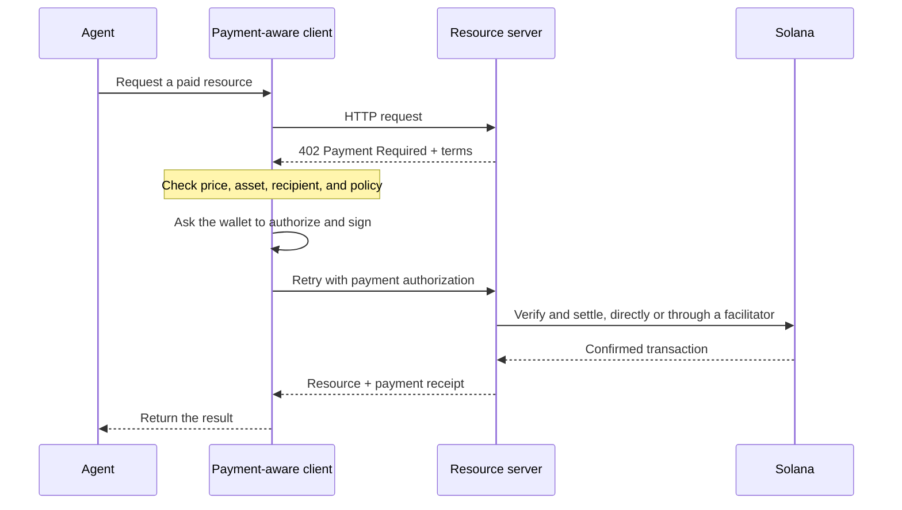

تتيح المدفوعات الوكيلية للبرمجيات اكتشاف السعر، وتفويض الدفع، واستلام
المورد ضمن مسار HTTP واحد. يمكن للوكيل الدفع مقابل استعلام بيانات أو استدلال نموذج
أو استدعاء أداة دون الحاجة إلى إنشاء حساب فوترة أو نسخ
مفتاح API.

<Cards>
  <Card title="MPP" href="/docs/payments/agentic-payments/mpp">
    استخدم مصادقة HTTP للرسوم لمرة واحدة وجلسات الدفع المقاسة.
  </Card>
  <Card title="x402" href="/docs/payments/agentic-payments/x402">
    أضف متطلبات الدفع والتوقيعات والتسوية وفق x402 V2 إلى مورد
    HTTP.
  </Card>
</Cards>

## مسار الدفع المشترك

يستخدم MPP وx402 ترويسات ونماذج بيانات مختلفة، لكن مسار HTTP الأساسي لديهما
متشابه:

## MPP وx402

يمكن لكلا البروتوكولين تسوية مدفوعات العملات المستقرة على سولانا. اختر بناءً على
نموذج الدفع ومستوى التوافق الذي تحتاجه خدمتك، وليس فقط بناءً على رمز الحالة
`402` المشترك.

|                         | MPP                                                               | x402                                                                     |
| ----------------------- | ----------------------------------------------------------------- | ------------------------------------------------------------------------ |
| التحدي               | `WWW-Authenticate: Payment`                                       | `PAYMENT-REQUIRED`                                                       |
| تفويض العميل    | `Authorization: Payment`                                          | `PAYMENT-SIGNATURE`                                                      |
| الإيصال                 | `Payment-Receipt`                                                 | `PAYMENT-RESPONSE`                                                       |
| نماذج الدفع على سولانا   | نيّة `charge` للرسوم لمرة واحدة ونيّة `session` للجلسات المقاسة ذات الحد الأقصى           | مخططات مثل `exact` و`upto`؛ يختلف الدعم حسب الشبكة والعميل |
| بنية التسوية | تحقق من الخادم، أو ترحيل أو بوابة اختيارية                | خادم الموارد مع تحقق محلي أو وسيط تسوية (facilitator)                 |
| نقطة بداية جيدة     | واجهات برمجة التطبيقات التي تحتاج إلى دلالات مصادقة HTTP أو قياس متكرر للاستخدام | الموارد التي تُدفع عن كل طلب وعملاء x402 الحاليون                      |

MPP هو **بروتوكول مدفوعات الآلات (Machine Payments Protocol)**. لا تخلط بينه وبين **بروتوكول سياق النموذج
(Model Context Protocol - MCP)**. يتيح MCP الأدوات والموارد للوكلاء، بينما يمكن لـ MPP أو x402
اشتراط الدفع عندما يستدعي الوكيل إحدى تلك الأدوات.

<Callout type="info">
  قد تعلن الخدمة عن أكثر من بروتوكول. يختار العميل خيار دفع
  يدعمه، ثم يستخدم ترويسات التحدي والتفويض
  والإيصال المطابقة طوال عملية التبادل.
</Callout>
