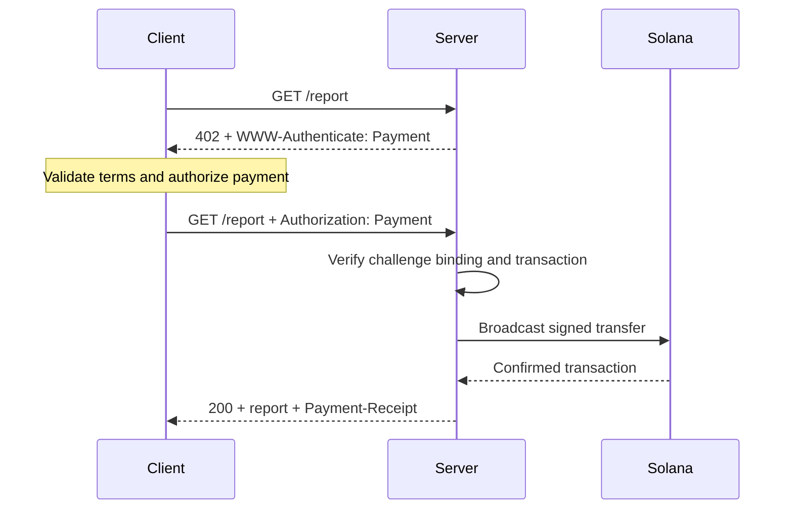
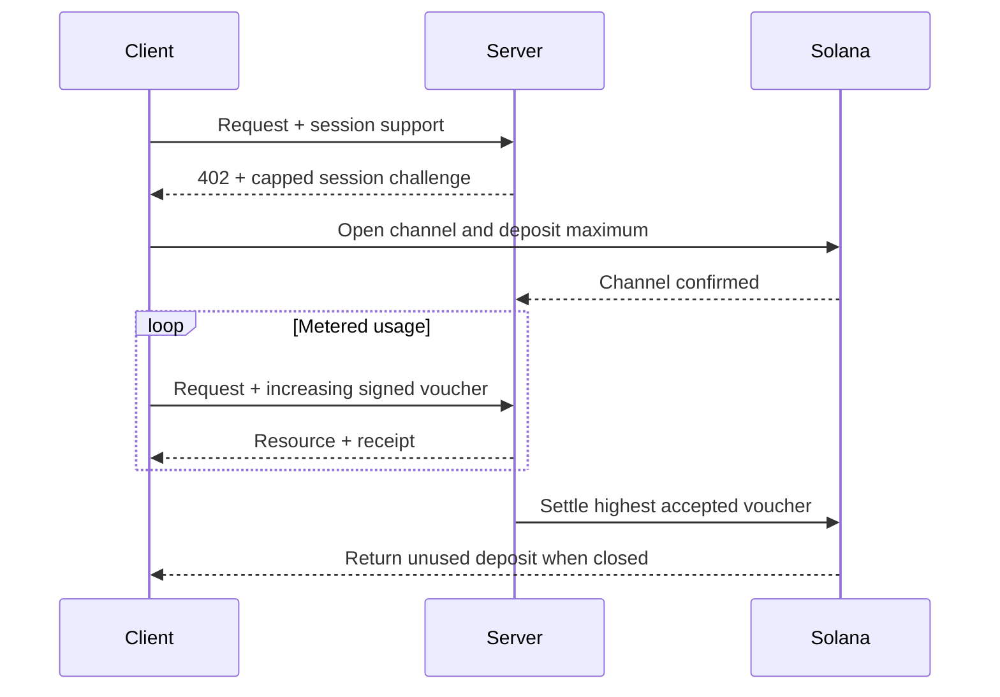

يطبّق [بروتوكول مدفوعات الآلات (MPP)](https://mpp.dev/) دلالات مصادقة HTTP
على المدفوعات. يرسل الخادم تحديًا للطلب غير المدفوع، ويعيد
العميل بيانات اعتماد الدفع، ثم يعيد الخادم إيصالًا بعد أن
يقبل الدفعة.

يفصل MPP بين ثلاثة جوانب:

- يصف **الغرض (intent)** التفاعل التجاري، مثل
  `charge` لمرة واحدة أو `session` مقاسة.
- تصف **طريقة الدفع** كيفية انتقال القيمة. تدعم طريقة سولانا
  عملة SOL الأصلية ورموز SPL للرسوم.
- يحمل **وسيط نقل** HTTP التحديات وبيانات الاعتماد والإيصالات والأخطاء.

يُنشر MPP كمجموعة من مسودات الإنترنت (Internet-Drafts). اعتبر
[المواصفات الحالية](https://paymentauth.org/) المصدر المرجعي، وتوقّع
أن تتطور التفاصيل ما دامت المسودات قيد العمل.

## تبادل HTTP

يستخدم MPP حقول مصادقة HTTP القياسية بدلًا من ترويسات الدفع
الخاصة بالبروتوكول:

| الرسالة                 | تمثيل HTTP                                         |
| ----------------------- | ----------------------------------------------------------- |
| تحدي الدفع       | `402 Payment Required` مع `WWW-Authenticate: Payment ...` |
| بيانات اعتماد الدفع      | طلب معاد إرساله مع `Authorization: Payment ...`           |
| إيصال ناجح      | استجابة المورد مع `Payment-Receipt: ...`               |
| تفاصيل دفع غير صالحة | نص Problem Details باستخدام `application/problem+json`       |



يتضمن التحدي معرّفًا يولّده الخادم، والنطاق (realm)، والطريقة، والغرض، وطلب
الدفع المشفّر، ومدة الصلاحية. تعيد بيانات الاعتماد ذكر التحدي وتضيف
إثبات الدفع الخاص بالطريقة. يجب على الخادم التحقق من الجزأين؛ فلا يجوز
لتحويل صالح يعود إلى تحدٍّ مختلف أن يفتح الوصول إلى المورد.

## رسوم سولانا لمرة واحدة

يدعم غرض `charge` على سولانا نوعين من بيانات الاعتماد:

- **وضع السحب (Pull)** يستخدم معاملة موقّعة. يوقّع العميل التحويل
  ويرسل المعاملة إلى الخادم. يتحقق الخادم منها، ويضيف اختياريًا
  توقيع دافع الرسوم، ثم يبثّها ويؤكدها ويعيد توقيع المعاملة
  في إيصاله.
- **وضع الدفع (Push)** يستخدم توقيع معاملة. يبثّ العميل المعاملة أولًا، ثم
  يرسل التوقيع المؤكَّد إلى الخادم. يجلب الخادم المعاملة ويتحقق منها
  قبل إعادة المورد.

يتيح وضع السحب رعاية الخادم لرسوم المعاملات ومنطق إعادة المحاولة من جانب الخادم.
ويفيد وضع الدفع عندما تتطلب المحفظة أن يرسل العميل معاملته
بنفسه، لكنه لا يستطيع استخدام رعاية الرسوم من الخادم.

للاطلاع على الحقول المعيارية وقواعد التحقق، راجع
[مواصفات رسوم سولانا](https://paymentauth.org/draft-solana-charge-00.html).

## إضافة رسوم MPP إلى واجهة Express API

توفر حزمة Solana Pay Kit تكاملًا حديثًا بلغة TypeScript مع MPP وx402.
ثبّتها مع Express:

```bash
pnpm add @solana/pay-kit @solana/kit@^6.9.0 express
pnpm add --save-dev @types/express tsx
```

يستخدم هذا المثال الأبسط بيئة Surfpool التجريبية المستضافة والمستلم التجريبي العام
للحزمة. وهو مخصص للتطوير المحلي فقط:

```ts filename=server.ts
import express from "express";
import { createPayKit, usd } from "@solana/pay-kit";

const pay = await createPayKit({
  accept: ["mpp"],
  rpcUrl: "https://402.surfnet.dev:8899"
});

const app = express();

app.get("/report", pay.express(usd("0.01")), (_req, res) => {
  res.json({ report: "Paid report" });
});

app.listen(4567, () => {
  console.log("Paid API listening on http://127.0.0.1:4567");
});
```

شغّله وقارن بين طلب غير مدفوع وطلب مدرك للدفع:

```bash
pnpm tsx server.ts
curl -i http://127.0.0.1:4567/report
pay --sandbox curl http://127.0.0.1:4567/report
```

لا يعمل معالج المسار إلا بعد أن تقبل الوسيطة (middleware) الدفعة.

<Callout type="warn" title="استبدل جميع الإعدادات الافتراضية للبيئة التجريبية في الإنتاج">
  اضبط شبكة صريحة، ومستلم التاجر، وRPC مخصصًا، وسرًّا ثابتًا
  لربط التحدي، وموقّعًا للإنتاج، ومخزنًا دائمًا لمنع إعادة الاستخدام. لا
  توجّه المدفوعات الحقيقية إلى موقّع تجريبي مضمّن في الحزمة.
</Callout>

## الجلسات المقاسة

استخدم `session` من MPP على سولانا عندما يجري العميل مدفوعات صغيرة ومترابطة كثيرة.
تفتح الجلسة قناة دفع على السلسلة بحد أقصى للإيداع، ثم تستخدم
قسائم موقّعة تراكمية مع نمو الاستخدام. يمكن للخادم التحقق من القسائم
خارج السلسلة وتسوية أعلى مبلغ مقبول لاحقًا.

هذا مفيد للاستدلال المقاس بالرموز، والتنزيلات المقاسة بالبايتات، والبيانات الحية،
واستدعاءات الأدوات المتكررة. وهو ليس مماثلًا لإرسال دفعة منفصلة
على السلسلة لكل حدث.



سمِّ الجلسة **دفعة جلسة** أو **قناة دفع** أو **تفويضًا متكررًا محدود السقف**. ولا تسمّها دفعًا متدفقًا
إلا إذا كانت الخدمة وعقد الدفع تقيسان فعلًا تدفقًا من الاستخدام.

## التحقق في بيئة الإنتاج

لكل رسوم على سولانا، يجب على الخادم أن يتحقق على الأقل مما يلي:

- أن التحدي أصيل وغير منتهي الصلاحية ومرتبط بهذا الطلب ومخصص
  لهذا النطاق (realm).
- أن المعاملة تستخدم الشبكة والأصل أو عملة mint والمستلم والمبلغ
  وبرنامج الرموز (token program) المتوقعة.
- أن أي تعليمات لدافع الرسوم أو لحساب الرمز المرتبط (associated token account) مسموح بها صراحةً
  ولا يمكنها استنزاف موقّع الخادم.
- أن المعاملة نجحت عند مستوى الالتزام (commitment level) المطلوب.
- أن توقيع المعاملة لم يُستهلك من قبل.
- أن فحص إعادة الاستخدام وعملية الاستهلاك ذريّان عبر جميع نسخ الخادم.

وبالنسبة إلى الجلسات، احفظ أيضًا حالة القناة، والمبلغ التراكمي المقبول، وعلامة
التسوية (settlement watermark) في مخزن مشترك. ووثّق كيف يستعيد العملاء الأموال غير المستخدمة
إذا أصبح الخادم غير متاح.

## موارد ذات صلة

- [مواصفات MPP](https://paymentauth.org/)
- [توثيق بروتوكول MPP](https://mpp.dev/protocol)
- [Solana Pay Kit](https://github.com/solana-foundation/pay-kit)
- [نظرة عامة على المدفوعات الوكيلية](/docs/payments/agentic-payments)
- [الجاهزية للإنتاج](/docs/tools/production-readiness)
