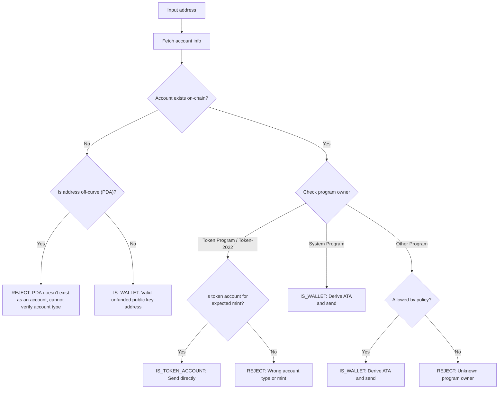

إرسال الرموز إلى عنوان خاطئ قد يؤدي إلى فقدان دائم للأموال. يضمن التحقق من
العنوان أنك ترسل الرموز فقط إلى العناوين التي يمكنها استلامها والوصول إليها بشكل
صحيح.

<Callout>
  راجع [كيفية عمل المدفوعات على سولانا](/docs/payments/how-payments-work) للتعرف
  على المفاهيم الأساسية للمدفوعات.
</Callout>

## فهم عناوين سولانا

حسابات سولانا لها نوعان من العناوين، على المنحنى وخارج المنحنى.

### العناوين على المنحنى

العناوين القياسية هي المفاتيح العامة من أزواج مفاتيح Ed25519. هذه العناوين:

- لها مفتاح خاص مقابل يمكنه التوقيع على المعاملات
- تُستخدم كعناوين محفظة

### العناوين خارج المنحنى (PDAs)

[العناوين المشتقة من البرنامج](/docs/core/pda) يتم اشتقاقها بشكل حتمي من معرف
البرنامج والبذور. هذه العناوين:

- **لا** تحتوي على مفتاح خاص مقابل
- يمكن التوقيع عليها فقط من قبل البرنامج الذي اشتُق منه العنوان

## أنواع الحسابات في المدفوعات

استخدم العنوان لجلب [حساب](/docs/core/accounts) من الشبكة، تحقق من مالك البرنامج
ونوع الحساب لتحديد كيفية التعامل مع العنوان.

<Callout>
  معرفة ما إذا كان العنوان على المنحنى أو خارج المنحنى لا تخبرك بنوع الحساب، أو
  البرنامج الذي يملكه، أو ما إذا كان الحساب موجوداً على ذلك العنوان. يجب عليك
  جلب الحساب من الشبكة لتحديد هذه التفاصيل.
</Callout>

### حسابات System Program (المحافظ)

الحسابات المملوكة من قبل System Program هي محافظ قياسية. لإرسال رموز SPL إلى
محفظة، تقوم باشتقاق واستخدام
[حساب الرمز المرتبط (ATA)](/docs/tokens/basics/create-token-account#whats-an-associated-token-account)
الخاص بها.

بعد اشتقاق عنوان ATA، تحقق مما إذا كان حساب الرمز موجوداً على السلسلة. إذا لم
يكن ATA موجوداً، يمكنك تضمين تعليمة لإنشاء حساب الرمز الخاص بالمستلم في نفس
المعاملة مع التحويل. ومع ذلك، هذا يتطلب دفع إيجار لحساب الرمز الجديد. نظراً لأن
المستلم يملك ATA، فإن SOL المدفوع للإيجار لا يمكن استرداده من قبل المرسل.

<Callout type="warn">
  بدون ضمانات، يمكن استغلال دعم إنشاء ATA. يمكن لمستخدم ضار طلب تحويل، وإنشاء
  ATA الخاص به على نفقتك، وإغلاق ATA لاستعادة SOL الخاص بالإيجار، وتكرار
  العملية.
</Callout>

### حسابات الرموز

[حسابات الرموز](/docs/tokens/basics/create-token-account) مملوكة لبرنامج Token
Program أو Token-2022 Program وتحتفظ بأرصدة الرموز. إذا كان العنوان الذي تتلقاه
مملوكاً لبرنامج رموز، فيجب عليك التحقق من أن الحساب هو حساب رمز (وليس mint
account) ويطابق حساب mint الرمز المتوقع قبل الإرسال.

<Callout type="info">
  تتحقق برامج Token Programs تلقائياً من أن كلا حسابي الرموز في التحويل يحتفظان
  برموز من نفس mint. إذا فشل التحقق، يتم رفض المعاملة ولا تُفقد أي أموال.
</Callout>

### حسابات mint

[حسابات mint](/docs/tokens/basics/create-mint) تتتبع إمداد الرموز والبيانات
الوصفية لرمز معين. حسابات mint مملوكة أيضاً لبرامج Token Programs ولكنها
**ليست** مستلمين صالحين لتحويلات الرموز. محاولة إرسال رموز إلى عنوان mint تؤدي
إلى فشل المعاملة، ولكن لا تُفقد أي أموال.

### حسابات أخرى

الحسابات المملوكة لبرامج أخرى تتطلب قراراً سياسياً. بعض الحسابات (مثل محافظ
التوقيع المتعدد) قد تكون مالكي حسابات رموز صالحين، بينما يجب رفض حسابات أخرى.

## سير عملية التحقق

يوضح الرسم التخطيطي التالي شجرة قرارات مرجعية للتحقق من صحة عنوان:



<Steps>
<Step>

### جلب الحساب

استخدم العنوان لجلب تفاصيل الحساب من الشبكة.

</Step>
<Step>

### الحساب غير موجود

إذا لم يكن هناك حساب موجود في هذا العنوان، تحقق مما إذا كان العنوان on-curve أو
off-curve:

- **خارج المنحنى (PDA)**: يُرفض العنوان بحذر لتجنب الإرسال إلى حساب رمزي مرتبط
  (ATA) قد يكون غير قابل للوصول. بدون حساب موجود، لا يمكنك تحديد من العنوان وحده
  أي برنامج اشتق هذا العنوان المشتق برمجياً (PDA) أو ما إذا كان العنوان لحساب
  رمزي مرتبط. قد يؤدي اشتقاق حساب رمزي مرتبط لهذا العنوان لإرسال الرموز إلى قفل
  الأموال في حساب رمزي غير قابل للوصول.

- **على المنحنى**: هذا عنوان محفظة صالح (مفتاح عام) لم يتم تمويله بعد. اشتق
  الحساب الرمزي المرتبط، تحقق من وجوده، وأرسل الرموز إليه. يجب عليك اتخاذ قرار
  سياسي بشأن ما إذا كنت ستمول إنشاء الحساب الرمزي المرتبط إذا لم يكن موجوداً.

</Step>
<Step>

### الحساب موجود

إذا كان الحساب موجوداً، تحقق من البرنامج الذي يملكه:

- **برنامج النظام**: هذه محفظة قياسية. اشتق الحساب الرمزي المرتبط، تحقق من
  وجوده، وأرسل الرموز إليه. يجب عليك اتخاذ قرار سياسي بشأن ما إذا كنت ستمول
  إنشاء الحساب الرمزي المرتبط إذا لم يكن موجوداً.

- **برنامج الرموز / Token-2022**: تحقق من أن الحساب هو حساب رمزي (وليس حساب
  إصدار) وأنه يحتفظ بالرمز (الإصدار) الذي تنوي إرساله. إذا كان صالحاً، أرسل
  الرموز مباشرة إلى هذا العنوان. إذا كان حساب إصدار أو حساب رمزي لإصدار مختلف،
  ارفض العنوان.

- **برنامج آخر**: هذا يتطلب قرار سياسي. قد تكون بعض البرامج مثل محافظ التوقيع
  المتعدد مالكين مقبولين لحسابات الرموز. إذا كانت سياستك تسمح بذلك، اشتق الحساب
  الرمزي المرتبط وأرسل. وإلا، ارفض العنوان.

</Step>
</Steps>

## عرض توضيحي

يوضح المثال التالي منطق التحقق من صحة العنوان فقط. هذا كود مرجعي لأغراض التوضيح.

<Callout>
  لا يوضح العرض التوضيحي كيفية اشتقاق ATA أو بناء معاملة لإرسال الرموز. راجع
  وثائق [حساب
  الرمز](/docs/tokens/basics/create-token-account#how-to-create-an-associated-token-account)
  و[تحويل الرمز](/docs/tokens/basics/transfer-tokens) للحصول على أمثلة التعليمات
  البرمجية.
</Callout>

يستخدم العرض التوضيحي أدناه ثلاث نتائج محتملة:

| النتيجة            | المعنى             | الإجراء                                    |
| ------------------ | ------------------ | ------------------------------------------ |
| `IS_WALLET`        | عنوان محفظة صالح   | اشتقاق وإرسال إلى associated token account |
| `IS_TOKEN_ACCOUNT` | token account صالح | إرسال الرموز مباشرة إلى هذا العنوان        |
| `REJECT`           | عنوان غير صالح     | عدم الإرسال                                |

<CodeTabs flags="r">

```ts !! title="Demo"
// !collapse(1:35) collapsed

import {
  type Address,
  type Rpc,
  type GetAccountInfoApi,
  createSolanaRpc,
  fetchJsonParsedAccount,
  isOffCurveAddress,
  generateKeyPairSigner,
  getProgramDerivedAddress
} from "@solana/kit";

// =============================================================================
// Constants
// =============================================================================

const defaultRpc = createSolanaRpc("https://api.mainnet-beta.solana.com");

const SYSTEM_PROGRAM = "11111111111111111111111111111111" as Address;
const TOKEN_PROGRAM = "TokenkegQfeZyiNwAJbNbGKPFXCWuBvf9Ss623VQ5DA" as Address;
const TOKEN_2022_PROGRAM =
  "TokenzQdBNbLqP5VEhdkAS6EPFLC1PHnBqCXEpPxuEb" as Address;

// =============================================================================
// Validation Function
// =============================================================================

/**
 * Possible validation results for an input address.
 */
export type ValidationResult =
  | { type: "IS_TOKEN_ACCOUNT" }
  | { type: "IS_WALLET" }
  | { type: "REJECT"; reason: string };

/**
 * Validates an input address and classifies it as a wallet, token account, or invalid.
 *
 * @param inputAddress - The address to validate
 * @param rpc - Optional RPC client (defaults to mainnet)
 * @returns Classification result:
 *   - IS_WALLET: Valid wallet address
 *   - IS_TOKEN_ACCOUNT: Valid token account
 *   - REJECT: Invalid address for transfers
 */
export async function validateAddress(
  inputAddress: Address,
  rpc: Rpc<GetAccountInfoApi> = defaultRpc
): Promise<ValidationResult> {
  const account = await fetchJsonParsedAccount(rpc, inputAddress);
  // Log the account data for demo
  console.log("\nAccount:", account);

  // Account doesn't exist on-chain
  if (!account.exists) {
    // Off-curve = PDA that doesn't exist as an account
    // Reject conservatively to avoid sending to an address that may be inaccessible.
    if (isOffCurveAddress(inputAddress)) {
      return { type: "REJECT", reason: "PDA doesn't exist as an account" };
    }
    // On-curve = valid keypair address, treat as unfunded wallet
    return { type: "IS_WALLET" };
  }

  // Account exists, check program owner
  const owner = account.programAddress;

  // System Program = wallet
  if (owner === SYSTEM_PROGRAM) {
    return { type: "IS_WALLET" };
  }

  // Token Program or Token-2022, check if token account
  if (owner === TOKEN_PROGRAM || owner === TOKEN_2022_PROGRAM) {
    const accountType = (
      account.data as { parsedAccountMeta?: { type?: string } }
    ).parsedAccountMeta?.type;

    if (accountType === "account") {
      return { type: "IS_TOKEN_ACCOUNT" };
    }
    // Reject if not a token account (mint account)
    return {
      type: "REJECT",
      reason: "Not a token account"
    };
  }

  // Unknown program owner
  return { type: "REJECT", reason: "Unknown program owner" };
}

// =============================================================================
// Examples
// =============================================================================
// !collapse(1:1000) collapsed

// Wallets
const EXISTING_WALLET =
  "H8sMJSCQxfKiFTCfDR3DUMLPwcRbM61LGFJ8N4dK3WjS" as Address;
const NEW_WALLET = (await generateKeyPairSigner()).address;

// Token accounts
const USDC_TOKEN_ACCOUNT =
  "3emsAVdmGKERbHjmGfQ6oZ1e35dkf5iYcS6U4CPKFVaa" as Address;
const PYUSD_TOKEN_ACCOUNT =
  "47od2TPRvqJipfPVWZdyenLEngPw8hC36nDxiLyvGsEP" as Address;

// Token mints (should be rejected)
const USDC_MINT = "EPjFWdd5AufqSSqeM2qN1xzybapC8G4wEGGkZwyTDt1v" as Address;
const PYUSD_MINT = "2b1kV6DkPAnxd5ixfnxCpjxmKwqjjaYmCZfHsFu24GXo" as Address;

// PDA that doesn't exist (should be rejected)
const [NON_EXISTENT_PDA] = await getProgramDerivedAddress({
  programAddress: (await generateKeyPairSigner()).address,
  seeds: ["seed"]
});

// Program account (should be rejected)
const PROGRAM_ACCOUNT =
  "p1exdMJcjVao65QdewkaZRUnU6VPSXhus9n2GzWfh98" as Address;

async function runExample(label: string, address: Address) {
  console.log(`\n${"─".repeat(60)}`);
  console.log(`Example: ${label}`);
  console.log(`Input: ${address}`);
  console.log(`${"─".repeat(60)}`);

  const result = await validateAddress(address);
  console.log("\nResult:", result);
}

console.log("\n" + "═".repeat(60));
console.log("  IS_WALLET Examples");
console.log("═".repeat(60));

await runExample("Existing funded wallet", EXISTING_WALLET);
await runExample("New wallet (unfunded)", NEW_WALLET);

console.log("\n" + "═".repeat(60));
console.log("  IS_TOKEN_ACCOUNT Examples");
console.log("═".repeat(60));

await runExample("USDC token account (Token Program)", USDC_TOKEN_ACCOUNT);
await runExample("PYUSD token account (Token-2022)", PYUSD_TOKEN_ACCOUNT);

console.log("\n" + "═".repeat(60));
console.log("  REJECT Examples");
console.log("═".repeat(60));

await runExample("USDC mint address", USDC_MINT);
await runExample("PYUSD mint address", PYUSD_MINT);
await runExample("Non-existent PDA", NON_EXISTENT_PDA);
await runExample("Program account", PROGRAM_ACCOUNT);

console.log("\n" + "═".repeat(60));
console.log("  Done!");
console.log("═".repeat(60) + "\n");
```

</CodeTabs>
