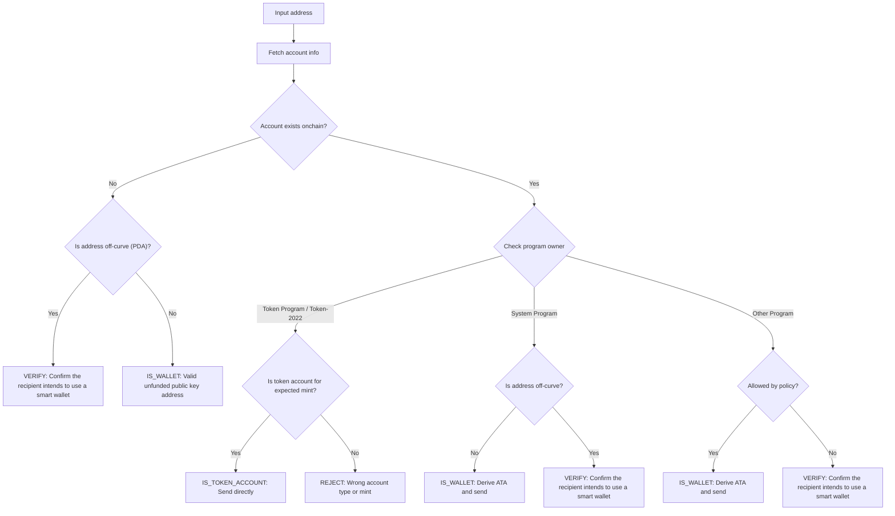

قد يؤدي إرسال الأموال إلى عنوان خاطئ إلى خسارة دائمة. يضمن التحقق من العنوان أن تُرسل أنت ومستخدموك الأموال فقط إلى عناوين قادرة على استلامها والوصول إليها بشكل صحيح. إذا كنت تُشغّل منصة تبادل، فيُوصى بإجراء هذه الفحوصات وطلب من المستخدم التحقق من العنوان قبل الإرسال.

يعتمد التحقق على ما تُرسله:

- **رموز SPL** توفر حماية جزئية ذاتية. يرفض Token Program أي تحويل لا تتطابق
  حساباته مع الـ mint المتوقع، لذا يفشل التحويل المُوجَّه بشكل خاطئ دون خسارة
  الأموال. تغطي معظم هذه الصفحة عمليات إرسال رموز SPL.
- **SOL الأصلي** لا يمتلك هذه الحماية. ينجح تحويل System Program إلى أي حساب،
  لذا فإن مستلمًا خاطئًا يُقفل SOL بشكل دائم. انظر
  [إرسال SOL الأصلي](#sending-native-sol).

<Callout>
  انظر [كيف تعمل المدفوعات على سولانا](/docs/payments/how-payments-work) لمفاهيم
  الدفع الأساسية.
</Callout>

## فهم عناوين سولانا

تمتلك حسابات سولانا نوعين من العناوين: على المنحنى وخارج المنحنى.

### العناوين على المنحنى

العناوين القياسية هي المفاتيح العامة المشتقة من keypairs من نوع Ed25519. هذه
العناوين:

- تمتلك مفتاحًا خاصًا مقابلًا يمكنه التوقيع على المعاملات
- تُستخدم كعناوين محافظ

### العناوين خارج المنحنى (PDAs)

[Program Derived Addresses](/docs/core/pda) مشتقة بشكل حتمي من معرّف البرنامج
والبذور. هذه العناوين:

- **لا** تمتلك مفتاحًا خاصًا مقابلًا
- لا يمكن التوقيع عليها إلا من قِبَل البرنامج الذي اشتُق منه العنوان

المحافظ التي تتحكم فيها البرامج، والمعروفة عادةً بالمحافظ الذكية أو الحسابات الذكية، تمتلك عناوين خارج المنحنى. يستخدم هذا الدليل مصطلح "المحفظة الذكية" طوال النص.

## أنواع الحسابات في المدفوعات

استخدم العنوان لجلب [حساب](/docs/core/accounts) من الشبكة، وتحقق من مالك
البرنامج ونوع الحساب لتحديد كيفية التعامل مع العنوان.

<Callout>
  معرفة ما إذا كان العنوان على المنحنى أو خارجه لا تخبرك بنوع الحساب، ولا
  بالبرنامج الذي يمتلكه، ولا بوجود حساب في ذلك العنوان. يجب عليك جلب الحساب من
  الشبكة لتحديد هذه التفاصيل.
</Callout>

### حسابات System Program (المحافظ)

الحسابات المملوكة لـ System Program هي محافظ قياسية. لإرسال رموز SPL إلى محفظة،
تحتاج إلى اشتقاق واستخدام
[Associated Token Account (ATA)](/docs/tokens/basics/create-token-account#what-is-an-associated-token-account)
الخاص بها.

بعد اشتقاق عنوان ATA، تحقق مما إذا كان token account موجودًا على السلسلة. إذا لم
يكن ATA موجودًا، يمكنك تضمين تعليمة لإنشاء token account الخاص بالمستلم في نفس
المعاملة مع التحويل. غير أن هذا يستلزم دفع rent لـ token account الجديد. ونظرًا
لأن المستلم يمتلك ATA، فإن SOL المدفوع مقابل rent لا يمكن استرداده من قِبَل
المُرسِل.

يمكن للحسابات الخاصة بـ System Program أن توجد خارج المنحنى. إذا أراد مستخدمك إرسال رموز مميزة إلى عنوان خارج المنحنى، فيُوصى بمطالبة المستخدم بالتأكد من أنه يعتزم إرسال الأموال إلى محفظة ذكية.

<Callout type="warn">
  بدون ضمانات كافية، يمكن استغلال دعم إنشاء ATA. إذ يمكن لمستخدم خبيث أن يطلب
  تحويلًا، وتُنشأ ATA الخاصة به على نفقتك، ثم يغلق ATA لاستعادة rent SOL، ويكرر
  العملية.
</Callout>

### Token Accounts

[Token accounts](/docs/tokens/basics/create-token-account) مملوكة لـ Token
Program أو Token-2022 Program وتحتفظ بأرصدة الرموز. إذا كان العنوان الذي تستلمه
مملوكًا لبرنامج رموز، فيجب عليك التحقق من أن الحساب هو token account (وليس mint
account) وأنه يطابق mint account الرمز المتوقع قبل الإرسال.

<Callout type="info">
  يتحقق Token Programs تلقائيًا من أن كلا token accounts في التحويل يحتفظان
  برموز من نفس الـ mint. وإذا فشل التحقق، يُرفض التحويل ولا تُفقد أي أموال.
</Callout>

### حسابات Mint

[Mint accounts](/docs/tokens/basics/create-mint) تتتبع إمداد الرمز وبيانات تعريف
رمز معين. كما أن Mint accounts مملوكة لـ Token Programs ولكنها **ليست** مستلِمين
صالحين لتحويلات الرموز. تؤدي محاولة إرسال الرموز إلى عنوان mint إلى فشل
المعاملة، دون فقدان أي أموال.

### حسابات أخرى

الحسابات التي تمتلكها برامج أخرى صالحة، إلا أنها تخضع لقواعد الصلاحيات التي يحددها البرنامج المالك المعني. يُوصى بمطالبة المستخدم بالتأكد من أنه يعتزم إرسال الأموال إلى محفظة ذكية.

## إرسال SOL الأصلي

يحدد التصنيف أعلاه الوجهات المسموح بها لرموز SPL. أما SOL الأصلي فأكثر صرامةً:
المستلم الآمن الوحيد هو **محفظة System Program** (أو عنوان غير ممول على المنحنى
يتحول إلى ذلك).

تضيف عملية نقل System Program لـ lamports إلى أي حساب، بما في ذلك عمليات السك و
token accounts والبرامج وعناوين PDA. ولا يمكن نقل lamports خارجاً إلا من خلال
البرنامج المالك للحساب، لذا فإن إرسال SOL إلى مستلم غير صحيح قد يؤدي إلى فقدان
الأموال بشكل دائم.

على خلاف عملية نقل رموز SPL، فإن المعاملة **لا** تفشل عندما يكون المستلم عنواناً
غير متوقع.

عند إرسال SOL الأصلي، لا يُقبل سوى نتيجة `IS_WALLET`. أما `IS_TOKEN_ACCOUNT` فلا
يُقبل: إذ يحتفظ token account برموز SPL، وأي SOL يُرسل إليه يخرج عن سيطرة
المرسل.

<Callout type="warn">
  هذه طريقة شائعة لفقدان SOL: يقوم المستخدم بلصق عنوان سك الرمز (أو عنوان
  برنامج) في خانة سحب SOL. تنجح عملية النقل ولا يمكن استرداد SOL. احرص دائماً
  على تصنيف المستلم قبل التوقيع على أي عملية نقل SOL.
</Callout>

## تدفق التحقق

يوضح المخطط التالي شجرة قرار مرجعية للتحقق من صحة العنوان:


```mermaid title="Address Verification Flow"
flowchart TD
    A["Input address"]
    B["Fetch account info"]

    A --> B
    B --> C{"Account exists onchain?"}

    %% --- Non-existent account path ---
    C -- "No" --> D{"Is address off-curve (PDA)?"}
    D -- "Yes" --> V1["VERIFY: Confirm the recipient intends to use a smart wallet"]
    D -- "No" --> W1["IS_WALLET: Valid unfunded public key address"]

    %% --- Existing account path ---
    C -- "Yes" --> F{"Check program owner"}

    F -- "Token Program / Token-2022" --> G{"Is token account for expected mint?"}
    G -- "Yes" --> T1["IS_TOKEN_ACCOUNT: Send directly"]
    G -- "No" --> R1["REJECT: Wrong account type or mint"]

    F -- "System Program" --> H{"Is address off-curve?"}
    H -- "No" --> W2["IS_WALLET: Derive ATA and send"]
    H -- "Yes" --> V3["VERIFY: Confirm the recipient intends to use a smart wallet"]

    F -- "Other Program" --> K{"Allowed by policy?"}
    K -- "Yes" --> W3["IS_WALLET: Derive ATA and send"]
    K -- "No" --> V2["VERIFY: Confirm the recipient intends to use a smart wallet"]
```

<Steps>
<Step>

### جلب الحساب

استخدم العنوان لجلب تفاصيل الحساب من الشبكة.

</Step>
<Step>

### الحساب غير موجود

إذا لم يكن ثمة حساب في هذا العنوان، تحقق مما إذا كان العنوان على المنحنى أم خارجه:

- **خارج المنحنى (PDA)**: اشترط التحقق الصريح من المستلم قبل إنشاء
  ATA أو إرسال رموز SPL. بدون حساب موجود مسبقاً، لا يمكنك
  تحديد البرنامج الذي اشتق هذا PDA من العنوان وحده، أو ما إذا كان
  برنامج المستلم يمكنه الوصول إلى ATA الخاص به.

- **على المنحنى**: هذا عنوان محفظة صالح (مفتاح عام) لم يُموَّل بعد. اشتق ATA، وتحقق من وجوده، وأرسل الرموز إليه. يجب عليك اتخاذ قرار بشأن السياسة المتعلقة بتمويل إنشاء ATA إذا لم يكن موجوداً.

</Step>
<Step>

### الحساب موجود

إذا كان الحساب موجوداً، تحقق من البرنامج الذي يمتلكه:

- **System Program**: هذه محفظة قياسية. اشتق ATA، وتحقق من وجوده، وأرسل الرموز إليه. يجب عليك اتخاذ قرار بشأن السياسة المتعلقة بتمويل إنشاء ATA إذا لم يكن موجوداً.

- **Token Program / Token-2022**: تحقق من أن الحساب هو token account (وليس mint account) وأنه يحمل الرمز (mint) الذي تنوي إرساله. إذا كان صالحاً، أرسل الرموز مباشرةً إلى هذا العنوان. إذا كان mint account أو token account لـ mint مختلف، ارفض العنوان.

- **برنامج آخر**: البرامج كمحافظ multisig هي مالكون مقبولون لـ token accounts. اطلب من المستخدم تأكيد نيته في الإرسال إلى محفظة ذكية.

  بعض المحافظ الذكية الشائعة:

| المحفظة                                              | عنوان البرنامج                                                                                                                |
| --------------------------------------------------- | ------------------------------------------------------------------------------------------------------------------------------ |
| [Squads](https://squads.xyz/)                       | [SQDS4ep65T869zMMBKyuUq6aD6EgTu8psMjkvj52pCf](https://explorer.solana.com/address/SQDS4ep65T869zMMBKyuUq6aD6EgTu8psMjkvj52pCf) |
| [Swig](https://github.com/anagrambuild/swig-wallet) | [swigypWHEksbC64pWKwah1WTeh9JXwx8H1rJHLdbQMB](https://explorer.solana.com/address/swigypWHEksbC64pWKwah1WTeh9JXwx8H1rJHLdbQMB) |

</Step>
</Steps>

## عرض توضيحي

يوضح المثال التالي منطق التحقق من صحة العنوان فقط. هذا كود مرجعي لأغراض توضيحية.

<Callout>
  لا يوضح العرض التوضيحي كيفية اشتقاق ATA أو بناء معاملة لإرسال الرموز. راجع
  وثائق [token
  account](/docs/tokens/basics/create-token-account#how-to-create-an-associated-token-account)
  و[token transfer](/docs/tokens/basics/transfer-tokens) للاطلاع على أمثلة
  الكود.
</Callout>

يستخدم العرض التوضيحي أدناه ثلاثة نتائج محتملة:

| النتيجة              | المعنى                                 | الإجراء                                                              |
| ------------------- | --------------------------------------- | ------------------------------------------------------------------- |
| `IS_WALLET`         | عنوان محفظة صالح                    | اشتق وأرسل إلى associated token account                         |
| `IS_TOKEN_ACCOUNT`  | token account صالح                     | أرسل الرموز مباشرةً إلى هذا العنوان                                |
| `USER_VERIFICATION` | العنوان يستلزم تأكيداً من المستلم | اشترط المراجعة الصريحة قبل إرسال رموز SPL أو تمويل ATA |
| `REJECT`            | عنوان غير صالح                         | لا ترسل                                                         |

ثم تُعيّن كل نتيجة إلى قابلية القبول لكل أصل على حدة عبر `canReceiveNativeSol`
(للمحافظ فقط) و`canReceiveSplToken` (للمحافظ أو token accounts). لا تُقبل نتيجة `USER_VERIFICATION` تلقائياً؛ ينبغي لتطبيقك أن يطلب من المستخدم تأكيد نيته قبل إرسال رموز SPL. يُعيد token account القيمة `IS_TOKEN_ACCOUNT`، لذا يمكنه استقبال رموز SPL ولكن **لا** يمكنه استقبال SOL الأصلي — وهو الفارق الذي يمنع قفل SOL.

<CodeTabs flags="r">

```ts !! title="Demo"
// !collapse(1:35) collapsed

import {
  type Address,
  type Rpc,
  type GetAccountInfoApi,
  createSolanaRpc,
  fetchJsonParsedAccount,
  isOffCurveAddress,
  generateKeyPairSigner,
  getProgramDerivedAddress
} from "@solana/kit";

// =============================================================================
// Constants
// =============================================================================

const defaultRpc = createSolanaRpc("https://api.mainnet.solana.com");

const SYSTEM_PROGRAM = "11111111111111111111111111111111" as Address;
const TOKEN_PROGRAM = "TokenkegQfeZyiNwAJbNbGKPFXCWuBvf9Ss623VQ5DA" as Address;
const TOKEN_2022_PROGRAM =
  "TokenzQdBNbLqP5VEhdkAS6EPFLC1PHnBqCXEpPxuEb" as Address;

// =============================================================================
// Validation Function
// =============================================================================

/**
 * Possible validation results for an input address.
 */
export type ValidationResult =
  | { type: "IS_TOKEN_ACCOUNT" }
  | { type: "IS_WALLET" }
  | { type: "USER_VERIFICATION"; reason: string }
  | { type: "REJECT"; reason: string };

/**
 * Validates an input address and classifies it as a wallet, token account,
 * address requiring recipient verification, or invalid.
 *
 * @param inputAddress - The address to validate
 * @param rpc - Optional RPC client (defaults to mainnet)
 * @returns Classification result:
 *   - IS_WALLET: Valid wallet address
 *   - IS_TOKEN_ACCOUNT: Valid token account
 *   - USER_VERIFICATION: Require explicit review before sending SPL tokens
 *   - REJECT: Invalid address for transfers
 */
export async function validateAddress(
  inputAddress: Address,
  rpc: Rpc<GetAccountInfoApi> = defaultRpc
): Promise<ValidationResult> {
  const account = await fetchJsonParsedAccount(rpc, inputAddress);
  // Log the account data for demo
  console.log("\nAccount:", account);

  // Account doesn't exist onchain
  if (!account.exists) {
    // An unfunded PDA may belong to a smart wallet, but the address
    // alone cannot prove that its program can access a newly-created ATA.
    if (isOffCurveAddress(inputAddress)) {
      return {
        type: "USER_VERIFICATION",
        reason:
          "Unfunded PDA: confirm the recipient is using a smart wallet and controls this address"
      };
    }
    // On-curve = valid keypair address, treat as unfunded wallet
    return { type: "IS_WALLET" };
  }

  // Account exists, check program owner
  const owner = account.programAddress;

  // A System Program account can be a standard wallet or an off-curve smart
  // wallet. Require verification before automatically sending to the
  // latter.
  if (owner === SYSTEM_PROGRAM) {
    if (isOffCurveAddress(inputAddress)) {
      return {
        type: "USER_VERIFICATION",
        reason:
          "Off-curve System Program account: confirm recipient is using a smart wallet"
      };
    }
    return { type: "IS_WALLET" };
  }

  // Token Program or Token-2022, check if token account
  if (owner === TOKEN_PROGRAM || owner === TOKEN_2022_PROGRAM) {
    const accountType = (
      account.data as { parsedAccountMeta?: { type?: string } }
    ).parsedAccountMeta?.type;

    if (accountType === "account") {
      return { type: "IS_TOKEN_ACCOUNT" };
    }
    // Reject if not a token account (mint account)
    return {
      type: "REJECT",
      reason: "Not a token account"
    };
  }

  // An account owned by another program can be a smart wallet.
  return {
    type: "USER_VERIFICATION",
    reason:
      "Program-owned account: confirm the recipient is using a smart wallet"
  };
}

/**
 * Native SOL is only safe to send to a wallet. Any other account locks it.
 */
function canReceiveNativeSol(result: ValidationResult): boolean {
  return result.type === "IS_WALLET";
}

/**
 * SPL tokens can go to a wallet (via its ATA) or directly to a token account.
 */
function canReceiveSplToken(result: ValidationResult): boolean {
  return result.type === "IS_WALLET" || result.type === "IS_TOKEN_ACCOUNT";
}

// =============================================================================
// Examples
// =============================================================================
// !collapse(1:1000) collapsed

// Wallets
const EXISTING_WALLET =
  "H8sMJSCQxfKiFTCfDR3DUMLPwcRbM61LGFJ8N4dK3WjS" as Address;
const NEW_WALLET = (await generateKeyPairSigner()).address;

// Token accounts
const USDC_TOKEN_ACCOUNT =
  "3emsAVdmGKERbHjmGfQ6oZ1e35dkf5iYcS6U4CPKFVaa" as Address;
const PYUSD_TOKEN_ACCOUNT =
  "47od2TPRvqJipfPVWZdyenLEngPw8hC36nDxiLyvGsEP" as Address;

// Token mints (should be rejected)
const USDC_MINT = "EPjFWdd5AufqSSqeM2qN1xzybapC8G4wEGGkZwyTDt1v" as Address;
const PYUSD_MINT = "2b1kV6DkPAnxd5ixfnxCpjxmKwqjjaYmCZfHsFu24GXo" as Address;

// PDA that doesn't exist (requires recipient verification)
const [NON_EXISTENT_PDA] = await getProgramDerivedAddress({
  programAddress: (await generateKeyPairSigner()).address,
  seeds: ["seed"]
});

// Program account (requires recipient verification)
const PROGRAM_ACCOUNT =
  "p1exdMJcjVao65QdewkaZRUnU6VPSXhus9n2GzWfh98" as Address;

async function runExample(label: string, address: Address) {
  console.log(`\n${"─".repeat(60)}`);
  console.log(`Example: ${label}`);
  console.log(`Input: ${address}`);
  console.log(`${"─".repeat(60)}`);

  const result = await validateAddress(address);
  console.log("\nResult:", result);
  console.log(
    `Can receive SOL?   ${canReceiveNativeSol(result) ? "YES" : "NO"}`
  );
  console.log(
    `Can receive token? ${canReceiveSplToken(result) ? "YES" : "NO"}`
  );
}

console.log("\n" + "═".repeat(60));
console.log("  IS_WALLET Examples");
console.log("═".repeat(60));

await runExample("Existing funded wallet", EXISTING_WALLET);
await runExample("New wallet (unfunded)", NEW_WALLET);

console.log("\n" + "═".repeat(60));
console.log("  IS_TOKEN_ACCOUNT Examples");
console.log("═".repeat(60));

await runExample("USDC token account (Token Program)", USDC_TOKEN_ACCOUNT);
await runExample("PYUSD token account (Token-2022)", PYUSD_TOKEN_ACCOUNT);

console.log("\n" + "═".repeat(60));
console.log("  USER_VERIFICATION Examples");
console.log("═".repeat(60));

await runExample("Non-existent PDA", NON_EXISTENT_PDA);
await runExample("Program account", PROGRAM_ACCOUNT);

console.log("\n" + "═".repeat(60));
console.log("  REJECT Examples");
console.log("═".repeat(60));

await runExample("USDC mint address", USDC_MINT);
await runExample("PYUSD mint address", PYUSD_MINT);

console.log("\n" + "═".repeat(60));
console.log("  Done!");
console.log("═".repeat(60) + "\n");
```

</CodeTabs>
