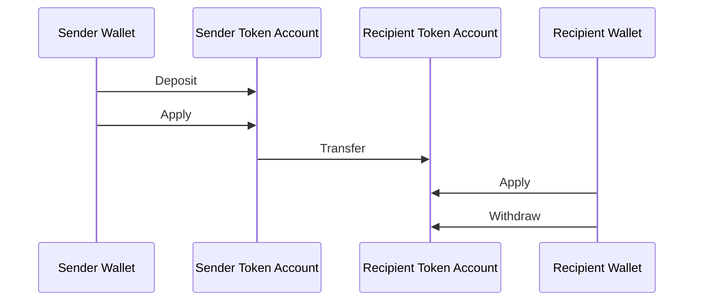
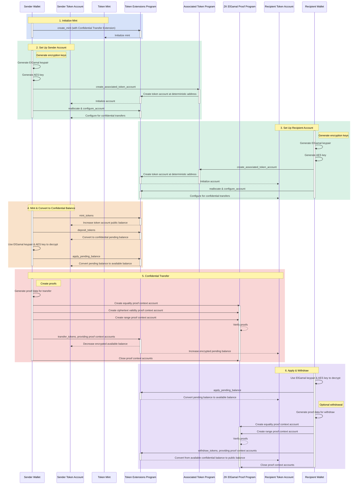

## ما هي التحويلات السرية؟

<Embed url="https://youtu.be/Bqs95tFcRIU" />

تتيح لك التحويلات السرية نقل الرموز المميزة بين token accounts دون الكشف عن مبلغ
التحويل. وهذا مفيد للمعاملات التي تحافظ على الخصوصية. فقط مبالغ التحويل وأرصدة
الرموز المميزة تبقى خاصة، أما عناوين token accounts فتظل عامة ومرئية للجميع.

- [نظرة عامة على البروتوكول](https://www.solana-program.com/docs/confidential-balances/overview) -
  تفاصيل حول بروتوكول التشفير الأساسي
- [دليل البدء السريع](https://www.solana-program.com/docs/confidential-balances#setup) -
  الإعداد وأوامر CLI الأساسية
- [كتاب وصفات الأرصدة السرية](https://github.com/solana-developers/Confidential-Balances-Sample) -
  مقتطفات من الكود توضح كيفية استخدام امتداد التحويل السري

### كيف يعمل؟

يضيف امتداد التحويل السري
[تعليمات](https://github.com/solana-program/token-2022/blob/efd0c957fefbd79882d77df5fb2dac88c001249c/program/src/extension/confidential_transfer/instruction.rs#L29)
إلى Token Extensions Program تتيح لك نقل الرموز المميزة بين الحسابات دون الكشف
عن مبلغ التحويل.

التدفق الأساسي لعمليات التحويل السري للرموز المميزة هو كما يلي:

1. إنشاء mint account مع امتداد التحويل السري.
2. إنشاء token accounts مع امتداد التحويل السري للمرسل والمستلم.
3. سك الرموز المميزة في حساب المرسل.
4. **إيداع** الرصيد العام للمرسل في **الرصيد المعلق السري**.
5. **تطبيق** الرصيد المعلق للمرسل على **الرصيد المتاح السري**.
6. **تحويل** الرموز المميزة بشكل سري من token account المرسل إلى token account
   المستلم.
7. **تطبيق** الرصيد المعلق للمستلم على **الرصيد المتاح السري**.
8. **سحب** الرصيد المتاح السري للمستلم إلى **الرصيد العام**.

لمزيد من التفاصيل حول خطوات تدفق التحويل السري، راجع الصفحات المقابلة:

<Cards>
  <Card
    title="إنشاء Mint Account"
    href="/docs/tokens/extensions/confidential-transfer/create-mint"
  >
    كيفية إنشاء mint account مع امتداد التحويل السري
  </Card>
  <Card
    title="إنشاء Token Account"
    href="/docs/tokens/extensions/confidential-transfer/create-token-account"
  >
    كيفية تهيئة token account مع امتداد التحويل السري
  </Card>
  <Card
    title="إيداع الرموز المميزة"
    href="/docs/tokens/extensions/confidential-transfer/deposit-tokens"
  >
    كيفية إيداع الرموز المميزة في الرصيد المعلق السري
  </Card>
  <Card
    title="تطبيق الرصيد المعلق"
    href="/docs/tokens/extensions/confidential-transfer/apply-pending-balance"
  >
    كيفية تطبيق الرصيد المعلق على الرصيد السري المتاح
  </Card>
  <Card
    title="سحب الرموز المميزة"
    href="/docs/tokens/extensions/confidential-transfer/withdraw-tokens"
  >
    كيفية سحب الرموز المميزة من الرصيد السري المتاح
  </Card>
  <Card
    title="تحويل الرموز المميزة"
    href="/docs/tokens/extensions/confidential-transfer/transfer-tokens"
  >
    كيفية التحويل السري للرموز المميزة بين token accounts
  </Card>
  <Card
    title="دليل التكامل"
    href="/docs/tokens/extensions/confidential-transfer/integration-guide"
  >
    كيف يمكن للمحافظ والمستكشفات والبورصات دعم رموز التحويل السري المميزة
  </Card>
  <Card
    title="دليل الجهة المُصدِرة"
    href="/docs/tokens/extensions/confidential-transfer/issuer-guide"
  >
    كيفية إصدار وتشغيل رمز التحويل السري المميز (سياسة الموافقة، المدققون،
    الرسوم، السك والحرق)
  </Card>
</Cards>

يوضح الرسم التخطيطي أدناه تسلسلاً تفصيلياً للتدفق الأساسي لعمليات نقل الرموز
السرية:

## تعليمات النقل السري

القائمة الكاملة لتعليمات امتداد النقل السري
[instructions](https://github.com/solana-program/token-2022/blob/efd0c957fefbd79882d77df5fb2dac88c001249c/program/src/extension/confidential_transfer/instruction.rs#L29)
هي كالتالي:

| التعليمة                            | الوصف                                                                                                                                |
| ----------------------------------- | ------------------------------------------------------------------------------------------------------------------------------------ |
| _rs`InitializeMint`_                | يُهيئ mint account لعمليات النقل السري. يجب تضمين هذه التعليمة في نفس المعاملة مع تعليمة _rs`TokenInstruction::InitializeMint`_.     |
| _rs`UpdateMint`_                    | يُحدّث إعدادات النقل السري لـ mint.                                                                                                  |
| _rs`ConfigureAccount`_              | يُهيئ token account لعمليات النقل السري.                                                                                             |
| _rs`ApproveAccount`_                | يوافق على token account لعمليات النقل السري إذا كان mint يتطلب موافقة على token accounts الجديدة.                                    |
| _rs`EmptyAccount`_                  | يُفرّغ الأرصدة السرية المعلقة والمتاحة للسماح بإغلاق token account.                                                                  |
| _rs`Deposit`_                       | يُحوّل الرصيد العام للرموز إلى رصيد سري معلق.                                                                                        |
| _rs`Withdraw`_                      | يُحوّل الرصيد السري المتاح إلى رصيد عام.                                                                                             |
| _rs`Transfer`_                      | ينقل الرموز بين token accounts بشكل سري.                                                                                             |
| _rs`ApplyPendingBalance`_           | يُحوّل الرصيد المعلق إلى رصيد متاح بعد عمليات الإيداع أو النقل.                                                                      |
| _rs`EnableConfidentialCredits`_     | يسمح لـ token account باستقبال عمليات نقل الرموز السرية.                                                                             |
| _rs`DisableConfidentialCredits`_    | يحجب عمليات النقل السري الواردة مع السماح بعمليات النقل العامة.                                                                      |
| _rs`EnableNonConfidentialCredits`_  | يسمح لـ token account باستقبال عمليات نقل الرموز العامة.                                                                             |
| _rs`DisableNonConfidentialCredits`_ | يحجب عمليات النقل العادية لجعل الحساب يستقبل عمليات النقل السرية فقط.                                                                |
| _rs`TransferWithFee`_               | ينقل الرموز بين token accounts بشكل سري مع رسوم.                                                                                     |
| _rs`ConfigureAccountWithRegistry`_  | طريقة بديلة لتهيئة token accounts لعمليات النقل السري باستخدام حساب _rs`ElGamalRegistry`_ بدلاً من إثبات _rs`VerifyPubkeyValidity`_. |
