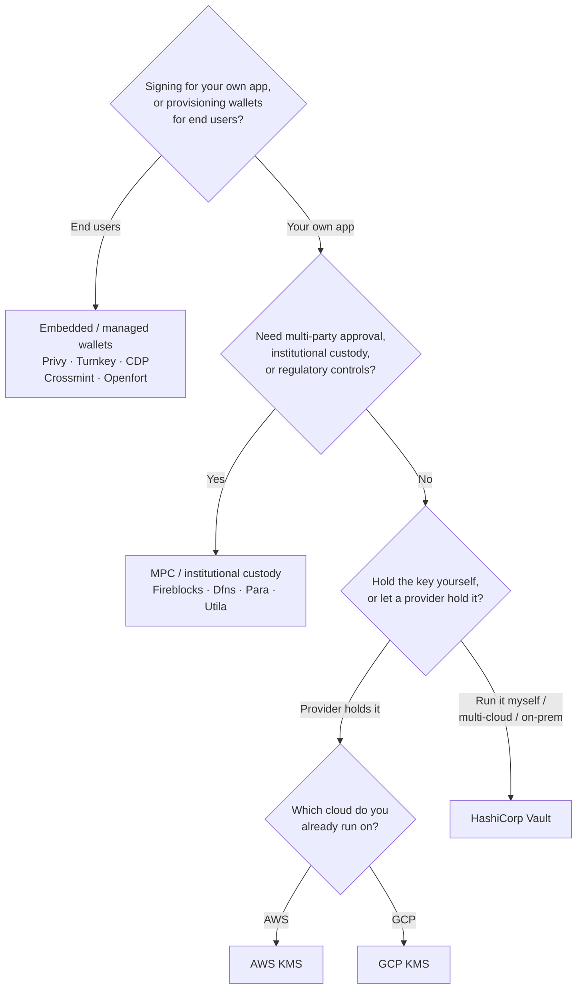

تعرض Keychain واجهة `SolanaSigner` واحدة عبر جميع الواجهات الخلفية، لذا فإن
الاختيار تشغيلي لا معماري — يمكنك تغييره لاحقاً من خلال الإعدادات. لهذا السبب،
**ابدأ من متطلباتك، لا من المنتج.** سؤالان يحسمان معظم الأمر: _أين يوجد المفتاح
الخاص، ومن يُسمح له بالتفويض بالتوقيع به؟_

لا توجد واجهة خلفية مثلى واحدة. كل واحدة أنسب لمجموعة معينة من القيود — السحابة
التي تعمل عليها بالفعل، وما إذا كنت تريد تشغيل بنية تحتية للمفاتيح، وما هي ضوابط
الحضانة والموافقة المطلوبة منك. المخطط أدناه يربط هذه القيود بالواجهة الخلفية
المناسبة.

<Callout type="info">
  يغطي هذا الدليل التوقيع من جانب الخادم (الواجهة الخلفية). عندما يوقّع مستخدموك
  النهائيون معاملاتهم الخاصة في المتصفح، استخدم محفظة عبر Wallet Standard بدلاً
  من ذلك — راجع [التوقيع في بيئة
  الإنتاج](/docs/core/transactions/signing-in-production).
</Callout>

## مخطط القرار

<Callout type="info">
  التطوير المحلي والاختبارات لا تحتاج إلى أي من هذا — استخدم الواجهة الخلفية
  **Memory** للنماذج الأولية، ثم انتقل إلى إحدى واجهات الإنتاج أعلاه من خلال
  الإعدادات.
</Callout>

## تتبع الأسئلة

<Steps>

<Step>

### هل تُوقّع لتطبيقك الخاص، أم لمستخدميك النهائيين؟

إذا كنت تُوفّر محافظ يمتلكها **المستخدمون النهائيون** ويديرونها (تطبيقات
المستهلكين، تدفقات التهيئة)، فاستخدم واجهة خلفية **محفظة مضمّنة / مُدارة** —
Privy، أو Turnkey، أو CDP، أو Crossmint، أو Openfort. تدير هذه الخدمات محافظ لكل
مستخدم والمصادقة نيابةً عنك.

إذا كنت توقّع بوصفك **تطبيقك الخاص** — جهة دفع الرسوم، أو الخزينة، أو أتمتة
خلفية — تابع القراءة أدناه.

</Step>

<Step>

### هل تحتاج إلى موافقة متعددة الأطراف، أو حضانة مؤسسية، أو ضوابط تنظيمية؟

إذا كان لا بدّ للتوقيعات من اجتياز سياسة موافقة، أو حدّ إنفاق، أو سير عمل امتثال
قبل إصدارها — أو كنت بحاجة إلى جهة حضانة منظَّمة تحتفظ بالمفاتيح — فاستخدم خلفية
**MPC / الحضانة المؤسسية**: Fireblocks أو Dfns أو Para أو Utila. تقوم هذه الحلول
بتقسيم المفتاح أو حضانته والتوقيع المشترك وفقاً لسياستك.

إذا كنت تحتاج فقط إلى مفتاح يوقّع عند الطلب، تابع القراءة أدناه.

</Step>

<Step>

### هل تريد الاحتفاظ بالمفتاح بنفسك، أم تفوّض ذلك إلى مزوّد خارجي؟

إذا كان يجب على مزوّد سحابي الاحتفاظ بالمفتاح في بنية تحتية مدعومة بالأجهزة
وتتحكم سياسة IAM الخاصة بك في صلاحية التوقيع، فاستخدم نظام KMS لتلك السحابة:

- **التشغيل على AWS** → AWS KMS
- **التشغيل على GCP** → GCP KMS

إذا كنت تريد تشغيل البنية التحتية للمفاتيح بنفسك — أو كنت تعمل عبر بيئات سحابية
متعددة أو بيئة محلية — فاستخدم **HashiCorp Vault**. أنت من يشغّله ويراجعه؛ يظل
المفتاح داخل محرك Transit ويوقّع عند الطلب.

</Step>

</Steps>

## نماذج الحضانة

تنتظم الخلفيات ضمن خمسة نماذج للحضانة. تُحيلك الخطوات أعلاه إلى أحدها.

- **الحضانة الذاتية (داخل العملية)** — يحتفظ تطبيقك بالمفتاح الخاص الخام. مناسب
  للتطوير، لكنه غير ملائم للبيئات الإنتاجية. الخلفية: **Memory**.
- **إدارة المفاتيح ذاتية الاستضافة** — أنت من يشغّل بنية المفاتيح التحتية؛ يظل
  المفتاح بداخلها ويوقّع عند الطلب. الخلفية: **HashiCorp Vault**.
- **Cloud KMS / HSM** — يخزّن مزوّد سحابي المفتاح في بنية تحتية مدعومة بالأجهزة؛
  لا يغادر المفتاح الخدمة قط وتتحكم سياسة IAM في صلاحية التوقيع. الخلفيات: **AWS
  KMS**، **GCP KMS**.
- **MPC والحضانة المؤسسية** — يُقسَّم المفتاح أو يُحتجز لدى مزوّد يتولى التوقيع
  المشترك وفقاً لسياستك (الموافقات، الحدود). الخلفيات: **Fireblocks**، **Dfns**،
  **Para**، **Utila**.
- **المحافظ المضمّنة والمُدارة** — يدير مزوّد المحافظ نيابةً عنك، غالباً لتهيئة
  المستخدمين النهائيين. الخلفيات: **Privy**، **Turnkey**، **CDP**،
  **Crossmint**، **Openfort**.

## مقارنة الواجهات الخلفية

| الواجهة الخلفية | نموذج الحضانة                | الأنسب لـ                                        | ملاحظات                                           |
| --------------- | ---------------------------- | ------------------------------------------------ | ------------------------------------------------- |
| Memory          | حضانة ذاتية (داخل العملية)   | التطوير المحلي، الاختبارات، CI                   | المفتاح الخام داخل العملية — لا تستخدم في الإنتاج |
| HashiCorp Vault | إدارة مفاتيح ذاتية الاستضافة | الفرق التي تدير بنيتها التحتية للمفاتيح          | محرك Transit؛ تتولى تشغيله ومراجعته بنفسك         |
| AWS KMS         | KMS سحابي / HSM              | الواجهات الخلفية العاملة على AWS                 | المفتاح لا يغادر KMS أبدًا؛ يتحكم IAM في التوقيع  |
| GCP KMS         | KMS سحابي / HSM              | الواجهات الخلفية العاملة على GCP                 | المفتاح لا يغادر KMS أبدًا؛ يتحكم IAM في التوقيع  |
| Fireblocks      | حضانة MPC / مؤسسية           | الخزائن والبورصات والحضانة المنظَّمة             | محرك السياسات وسير عمل الموافقات                  |
| Dfns            | بنية تحتية لمحافظ MPC        | المحافظ البرمجية ذات ضوابط السياسات              | توقيع Ed25519                                     |
| Para            | محافظ MPC                    | التطبيقات التي تريد محافظ مدعومة بـ MPC          | مفتاح API + معرّف المحفظة                         |
| Utila           | حضانة MPC + موقِّع مشترك     | محافظ سولانا المُدارة عبر Utila                  | `signMessage` غير مدعوم؛ تقوم ببث المعاملة بنفسك  |
| Privy           | محافظ مضمَّنة                | تطبيقات المستهلكين لإدخال المستخدمين إلى المحافظ | محافظ مضمَّنة يديرها التطبيق                      |
| Turnkey         | إدارة مفاتيح غير حضانية      | التوقيع البرمجي المقيَّد بالسياسات               | إدارة مفاتيح غير حضانية                           |
| CDP             | محفظة مُدارة (Coinbase)      | التطبيقات على منصة Coinbase للمطورين             | `signMessage` يقبل حمولات UTF-8 فقط               |
| Crossmint       | محافظ مُدارة                 | الأسواق وتطبيقات المحافظ المُدارة                | محافظ `smart` و `mpc`؛ `signMessage` غير مدعوم    |
| Openfort        | محافظ خلفية مضمَّنة          | المحافظ من جانب الخادم                           | مفاتيح مخزَّنة في TEE                             |

## سيناريوهات المؤسسات

غالبًا ما تحتاج التطبيقات الواحدة إلى أكثر من واحد من هذه العناصر في آنٍ واحد.
نظرًا لأن الواجهة متطابقة، يمكنك تشغيل خلفية مختلفة لكل دور دون تغيير نقاط
الاستدعاء.

- **عمليات الخزينة** — فصل موقّع "ساخن" تشغيلي عن موقّع خزينة "بارد". دعم
  الخزينة بحضانة MPC أو HSM سحابي، واشتراط سياسات موافقة قبل التوقيعات عالية
  القيمة.
- **سير عمل الموافقة** — تفرض خلفيات MPC والحضانة (مثل Fireblocks) موافقة متعددة
  الأطراف قبل إنتاج التوقيع.
- **الامتثال والتدقيق** — يُصدر KMS السحابي (AWS/GCP) وVault سجلات تدقيق
  للتوقيع؛ وتضيف الجهات الوصائية المؤسسية تطبيق السياسات وإعداد التقارير.
- **البيئات الخاضعة للتنظيم** — الاحتفاظ بمواد المفاتيح في HSM أو KMS أو جهة
  وصاية مؤسسية حتى لا تلمس المفاتيح الخام تطبيقك أبدًا.

راجع [أفضل ممارسات الإنتاج](/docs/tools/keychain/production-best-practices)
للتشغيل الآمن لهذه الخلفيات.

<Cards>
  <Card title="دليل Rust" href="/docs/tools/keychain/getting-started/rust">
    تكوين كل خلفية في Rust.
  </Card>
  <Card
    title="دليل TypeScript"
    href="/docs/tools/keychain/getting-started/typescript"
  >
    تكوين كل خلفية في TypeScript.
  </Card>
</Cards>
