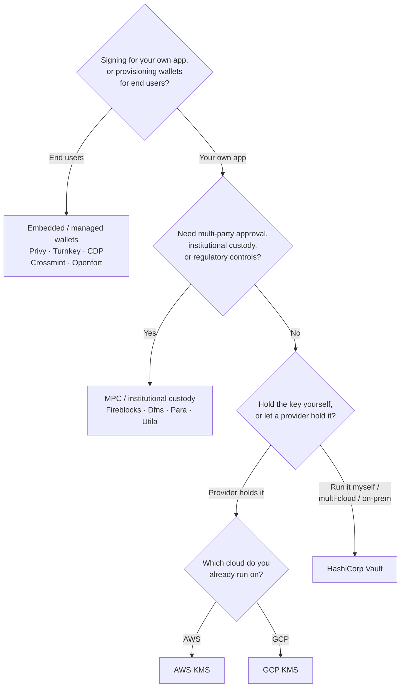

يُوفّر Keychain واجهة `SolanaSigner` واحدة عبر جميع الواجهات الخلفية، لذا فإن
الاختيار تشغيلي لا معماري — يمكنك تغييره لاحقاً من خلال الإعدادات. لهذا السبب،
**ابدأ من متطلباتك، لا من المنتج.** سؤالان يحسمان معظم الأمر: _أين تقع المفاتيح
الخاصة، ومن المسموح له بتفويض توقيع باستخدامها؟_

لا توجد واجهة خلفية مثالية واحدة. كل واجهة تناسب مجموعة معينة من القيود —
السحابة التي تعمل عليها بالفعل، وما إذا كنت تريد تشغيل بنية تحتية للمفاتيح، وما
هي ضوابط الحضانة والموافقة المطلوبة. يُرسم المخطط أدناه تلك القيود ويربطها
بالواجهة الخلفية المناسبة.

<Callout type="info">
  يغطي هذا الدليل التوقيع من جانب الخادم (الواجهة الخلفية). عندما يوقّع مستخدموك
  النهائيون معاملاتهم الخاصة في المتصفح، استخدم محفظة عبر Wallet Standard بدلاً
  من ذلك — راجع [التوقيع في بيئة
  الإنتاج](/docs/core/transactions/signing-in-production).
</Callout>

## مخطط القرار

<Callout type="info">
  لا تحتاج بيئة التطوير المحلية والاختبارات إلى أي من هذا — استخدم الواجهة
  الخلفية **Memory** للنماذج الأولية، ثم انتقل إلى إحدى واجهات الإنتاج الخلفية
  أعلاه من خلال الإعدادات.
</Callout>

## استعراض الأسئلة

<Steps>

<Step>

### هل تُوقّع لتطبيقك الخاص أم لمستخدميك النهائيين؟

إذا كنت تُهيّئ محافظ يملكها **المستخدمون النهائيون** ويديرونها (تطبيقات
المستهلكين، وتدفقات الإعداد)، فاستخدم واجهة خلفية لـ**المحافظ المُضمَّنة /
المُدارة** — Privy أو Turnkey أو CDP أو Crossmint أو Openfort. تتولى هذه الخدمات
إدارة محافظ المستخدمين والمصادقة نيابةً عنك.

إذا كنت تُوقِّع بوصفك **تطبيقك الخاص** — جهة دفع الرسوم، أو خزينة، أو أتمتة
خلفية — تابع القراءة أدناه.

</Step>

<Step>

### هل تحتاج إلى موافقة متعددة الأطراف، أو حضانة مؤسسية، أو ضوابط تنظيمية؟

إذا كان لا بد من اجتياز التوقيعات لسياسة موافقة، أو حد إنفاق، أو سير عمل امتثال
قبل إصدارها — أو كنت بحاجة إلى جهة حضانة منظَّمة تحتفظ بالمفاتيح — فاستخدم واجهة
خلفية من نوع **MPC / حضانة مؤسسية**: Fireblocks أو Dfns أو Para أو Utila. تقوم
هذه الخدمات بتقسيم المفتاح أو حضانته والتوقيع المشترك وفقاً لسياستك.

إذا كنت تحتاج فقط إلى مفتاح يُوقِّع عند الطلب، تابع القراءة أدناه.

</Step>

<Step>

### هل تريد الاحتفاظ بالمفتاح بنفسك، أم تفضّل أن يحتفظ به مزوّد خارجي؟

إذا كان ينبغي لمزوّد سحابي أن يحتفظ بالمفتاح في بنية تحتية مدعومة بالأجهزة
وتتحكم سياسة IAM الخاصة بك في من يمكنه التوقيع، فاستخدم KMS الخاص بتلك السحابة:

- **التشغيل على AWS** → AWS KMS
- **التشغيل على GCP** → GCP KMS

إذا كنت تريد تشغيل بنية تحتية للمفاتيح بنفسك — أو كنت تعمل على بيئات سحابية
متعددة أو محلية — فاستخدم **HashiCorp Vault**. أنت من يُشغّله ويُراجعه؛ يبقى
المفتاح داخل محرك Transit ويُوقِّع عند الطلب.

</Step>

</Steps>

## نماذج الحضانة

تنتمي الواجهات الخلفية إلى خمسة نماذج للحضانة. تُفضي الخطوات أعلاه إلى أحدها.

- **الحضانة الذاتية (داخل العملية)** — يحتفظ تطبيقك بالمفتاح الخاص الخام. مناسب
  للتطوير، لكنه غير ملائم للإنتاج. الواجهة الخلفية: **Memory**.
- **إدارة المفاتيح المستضافة ذاتياً** — أنت من يُشغّل بنية تحتية للمفاتيح؛ يبقى
  المفتاح بداخلها ويُوقِّع عند الطلب. الواجهة الخلفية: **HashiCorp Vault**.
- **KMS / HSM سحابي** — يخزّن مزوّد سحابي المفتاح في بنية تحتية مدعومة بالأجهزة؛
  لا يغادر المفتاح الخدمة أبداً وتتحكم سياسة IAM في من يمكنه التوقيع. الواجهات
  الخلفية: **AWS KMS**، **GCP KMS**.
- **MPC والحضانة المؤسسية** — يُقسَّم المفتاح أو يُودَع لدى مزوّد يُوقِّع
  مشاركةً وفق سياستك (الموافقات، الحدود). الواجهات الخلفية: **Fireblocks**،
  **Dfns**، **Para**، **Utila**.
- **المحافظ المضمّنة والمُدارة** — يُدير مزوّد المحافظ نيابةً عنك، وغالباً
  لاستقطاب المستخدمين النهائيين. الواجهات الخلفية: **Privy**، **Turnkey**،
  **CDP**، **Crossmint**، **Openfort**.

## مقارنة الخلفيات الخلفية

| الخلفية         | نموذج الحضانة                | الأنسب لـ                                        | ملاحظات                                                |
| --------------- | ---------------------------- | ------------------------------------------------ | ------------------------------------------------------ |
| Memory          | حضانة ذاتية (داخل العملية)   | التطوير المحلي، الاختبارات، CI                   | المفتاح الخام داخل العملية — لا تستخدم في بيئة الإنتاج |
| HashiCorp Vault | إدارة مفاتيح ذاتية الاستضافة | الفرق التي تدير بنيتها التحتية للمفاتيح          | محرك Transit؛ تتولى تشغيله ومراجعته                    |
| AWS KMS         | KMS سحابي / HSM              | الخلفيات العاملة على AWS                         | المفتاح لا يغادر KMS أبدًا؛ IAM يتحكم في التوقيع       |
| GCP KMS         | KMS سحابي / HSM              | الخلفيات العاملة على GCP                         | المفتاح لا يغادر KMS أبدًا؛ IAM يتحكم في التوقيع       |
| Fireblocks      | حضانة MPC / مؤسسية           | الخزائن، البورصات، الحضانة المنظمة               | محرك السياسات وسير عمل الموافقة                        |
| Dfns            | بنية تحتية لمحافظ MPC        | المحافظ البرمجية مع ضوابط السياسات               | توقيع Ed25519                                          |
| Para            | محافظ MPC                    | التطبيقات الراغبة في محافظ مدعومة بـ MPC         | مفتاح API + معرّف المحفظة                              |
| Utila           | حضانة MPC + موقّع مشترك      | محافظ سولانا المُدارة عبر Utila                  | `signMessage` غير مدعوم؛ تتولى أنت بث المعاملة         |
| Privy           | محافظ مضمّنة                 | تطبيقات المستهلكين لتأهيل المستخدمين إلى المحافظ | محافظ مضمّنة يديرها التطبيق                            |
| Turnkey         | إدارة مفاتيح غير احتجازية    | التوقيع البرمجي المقيّد بالسياسات                | إدارة مفاتيح غير احتجازية                              |
| CDP             | محفظة مُدارة (Coinbase)      | التطبيقات على منصة Coinbase للمطورين             | `signMessage` يقبل حمولات UTF-8 فقط                    |
| Crossmint       | محافظ مُدارة                 | الأسواق وتطبيقات المحافظ المُدارة                | محافظ `smart` و `mpc`؛ `signMessage` غير مدعوم         |
| Openfort        | محافظ خلفية مضمّنة           | المحافظ من جانب الخادم                           | مفاتيح مخزّنة في TEE                                   |

## سيناريوهات المؤسسات

غالبًا ما تحتاج التطبيقات الواحدة إلى أكثر من واحدة من هذه الميزات في آنٍ واحد.
وبما أن الواجهة متطابقة، يمكنك تشغيل واجهة خلفية مختلفة لكل دور دون تغيير مواقع
الاستدعاء.

- **عمليات الخزينة** — افصل بين موقّع "ساخن" تشغيلي وموقّع خزينة "بارد". ادعم
  الخزينة بحضانة MPC أو HSM سحابي، واشترط سياسات موافقة قبل التوقيعات عالية
  القيمة.
- **سير عمل الموافقة** — تفرض واجهات MPC والحضانة (مثل Fireblocks) موافقة متعددة
  الأطراف قبل إنتاج التوقيع.
- **الامتثال والتدقيق** — يُصدر KMS السحابي (AWS/GCP) وVault سجلات تدقيق
  للتوقيع؛ كما تُضيف جهات الحضانة المؤسسية تطبيق السياسات وإعداد التقارير.
- **البيئات الخاضعة للتنظيم** — احتفظ بمواد المفاتيح في HSM أو KMS أو جهة حضانة
  مؤسسية حتى لا تلمس المفاتيح الخام تطبيقك أبدًا.

راجع [أفضل الممارسات في الإنتاج](/docs/tools/keychain/production-best-practices)
لتشغيل هذه الواجهات الخلفية بأمان.

<Cards>
  <Card title="دليل Rust" href="/docs/tools/keychain/getting-started/rust">
    تهيئة كل واجهة خلفية في Rust.
  </Card>
  <Card
    title="دليل TypeScript"
    href="/docs/tools/keychain/getting-started/typescript"
  >
    تهيئة كل واجهة خلفية في TypeScript.
  </Card>
</Cards>
