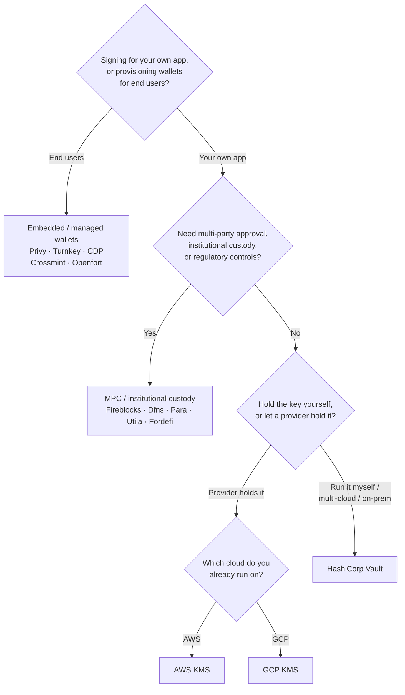

يوفّر Keychain واجهة أساسية واحدة هي `SolanaSigner` عبر جميع الواجهات الخلفية، لذا فإن الاختيار في معظم الواجهات الخلفية تشغيلي وليس معماريًا: يمكنك تغييره
لاحقًا من خلال الإعدادات. الاستثناء هو شكل المعاملة. يقوم Crossmint
ووضع Fordefi الأصلي التلقائي بالتوقيع والبث من جانب الخادم، ويعيد وضع Fordefi الأصلي
اليدوي كتابة المعاملة قبل توقيعها، لذا فإن الانتقال إلى أحدها أو منه
يغيّر طريقة استدعاء المُوقِّع. ولهذا السبب، **ابدأ من متطلباتك، لا من منتج بعينه.** سؤالان يحسمان معظم القرار: _أين
يوجد المفتاح الخاص، ومن يحق له تفويض توقيع به؟_

تتوفر كل واجهة خلفية باستثناء Ledger بجميع اللغات الأربع (Rust وTypeScript
وPython وGo). أما Ledger فهي متاحة بلغة Rust فقط، خلف الميزة الاختيارية `ledger`.

لا توجد واجهة خلفية هي الأفضل على الإطلاق. فكل واحدة منها أنسب لمجموعة معيّنة
من القيود: السحابة التي تعمل عليها بالفعل، وما إذا كنت ترغب في تشغيل بنية المفاتيح التحتية بنفسك،
وما ضوابط الحفظ والموافقة المطلوبة منك.
يربط المخطط أدناه بين هذه القيود والواجهة الخلفية المناسبة.

<Callout type="info">
  يغطي هذا الدليل التوقيع من جانب الخادم (الواجهة الخلفية). عندما يوقّع المستخدمون النهائيون
  معاملاتهم بأنفسهم في المتصفح، استخدم محفظة عبر Wallet Standard
  بدلًا من ذلك. راجع [التوقيع في
  بيئة الإنتاج](/docs/core/transactions/signing-in-production).
</Callout>

## مخطط القرار

```mermaid title="Choosing a Keychain backend"
flowchart TD
    Start{Signing for your own app,<br/>or provisioning wallets<br/>for end users?}
    Start -->|End users| Managed[Embedded / managed wallets<br/>Privy · Turnkey · CDP<br/>Crossmint · Openfort]
    Start -->|Your own app| Q2{Need multi-party approval,<br/>institutional custody,<br/>or regulatory controls?}
    Q2 -->|Yes| MPC[MPC / institutional custody<br/>Fireblocks · Dfns · Para · Utila · Fordefi]
    Q2 -->|No| Q3{Hold the key yourself,<br/>or let a provider hold it?}
    Q3 -->|Provider holds it| Q4{Which cloud do you<br/>already run on?}
    Q4 -->|AWS| AWS[AWS KMS]
    Q4 -->|GCP| GCP[GCP KMS]
    Q3 -->|Run it myself /<br/>multi-cloud / on-prem| Vault[HashiCorp Vault]
```

<Callout type="info">
  لا يحتاج التطوير المحلي والاختبارات إلى أي من هذا: استخدم الواجهة الخلفية **Memory**
  لإنشاء النماذج الأولية، ثم انتقل إلى إحدى واجهات الإنتاج الخلفية المذكورة أعلاه من خلال
  الإعدادات.
</Callout>

## تتبع الأسئلة

<Steps>

<Step>

### هل توقّع لتطبيقك الخاص أم لمستخدميك النهائيين؟

إذا كنت تُنشئ محافظ **يمتلكها المستخدمون النهائيون** ويديرونها (تطبيقات المستهلكين،
ومسارات الإعداد الأولي)، فاستخدم واجهة خلفية من نوع **المحافظ المضمّنة / المُدارة**: Privy أو Turnkey أو
CDP أو Crossmint أو Openfort. تدير هذه الواجهات محافظ كل مستخدم والمصادقة نيابةً عنك.

أما إذا كنت توقّع بصفتك **تطبيقك الخاص** (دافع رسوم، أو خزينة، أو أتمتة خلفية)،
فتابع أدناه.

</Step>

<Step>

### هل تحتاج إلى موافقة متعددة الأطراف، أو حفظ مؤسسي، أو ضوابط تنظيمية؟

إذا كان يجب أن تجتاز التوقيعات سياسة موافقة، أو حدّ إنفاق، أو مسار امتثال
قبل إنشائها، أو كنت بحاجة إلى جهة حفظ خاضعة للتنظيم تحتفظ
بالمفاتيح، فاستخدم واجهة خلفية من نوع **MPC / الحفظ المؤسسي**: Fireblocks أو Dfns أو Para أو
Utila أو Fordefi. تقوم هذه الواجهات بتجزئة المفتاح أو حفظه وتشارك في التوقيع وفقًا
لسياستك.

وإذا كنت تحتاج فقط إلى مفتاح يوقّع عند الطلب، فتابع أدناه.

</Step>

<Step>

### هل تريد الاحتفاظ بالمفتاح بنفسك، أم تترك مزوّدًا يحتفظ به؟

إذا كان ينبغي لمزوّد سحابي أن يحتفظ بالمفتاح في بنية تحتية مدعومة بالأجهزة، وكانت
سياسة IAM لديك تتحكم في من يمكنه التوقيع، فاستخدم KMS الخاص بتلك السحابة:

- **إذا كنت تعمل على AWS** ← AWS KMS
- **إذا كنت تعمل على GCP** ← GCP KMS

وإذا كنت تريد تشغيل البنية التحتية للمفاتيح بنفسك، أو كنت تعمل في بيئات متعددة السحابات أو
محلية (on-prem)، فاستخدم **HashiCorp Vault**. أنت من يشغّله ويدقّقه؛ ويبقى المفتاح داخل
محرك Transit ويوقّع عند الطلب.

</Step>

</Steps>

## نماذج الحضانة

تنقسم الواجهات الخلفية إلى ستة نماذج للحفظ. وسيقودك المخطط أعلاه إلى أحدها.

- **الحفظ الذاتي (داخل العملية)**: يحتفظ تطبيقك بالمفتاح الخاص الخام.
  مناسب للتطوير، لكنه غير مناسب للإنتاج. الواجهة الخلفية:
  **Memory**.
- **الحفظ الذاتي (محفظة أجهزة)**: لا يغادر المفتاح جهاز Ledger أبدًا،
  ويؤكد شخص ما كل توقيع على شاشته. مناسب لتوقيع المشغّل
  التفاعلي، وليس للخدمات التي تعمل دون إشراف. يعمل بلغة Rust فقط، وهو اختياري، وغير مشمول
  بالتدقيق. الواجهة الخلفية: **Ledger**.
- **إدارة المفاتيح ذاتية الاستضافة**: أنت من يشغّل البنية التحتية للمفاتيح؛ ويبقى المفتاح
  داخلها ويوقّع عند الطلب. الواجهة الخلفية: **HashiCorp Vault**.
- **KMS / HSM السحابي**: يخزّن مزوّد سحابي المفتاح في بنية تحتية
  مدعومة بالأجهزة؛ ولا يغادر المفتاح الخدمة أبدًا، وتتحكم سياسة IAM لديك في
  من يمكنه التوقيع. الواجهات الخلفية: **AWS KMS** و**GCP KMS**.
- **MPC والحفظ المؤسسي**: يُجزَّأ المفتاح أو يُحفظ لدى
  مزوّد يشارك في التوقيع وفقًا لسياستك (الموافقات، الحدود).
  الواجهات الخلفية: **Fireblocks** و**Dfns** و**Para** و**Utila** و**Fordefi**.
- **المحافظ المضمّنة والمُدارة**: يدير مزوّد المحافظ نيابةً عنك،
  غالبًا لإعداد المستخدمين النهائيين. الواجهات الخلفية: **Privy** و**Turnkey** و**CDP** و
  **Crossmint** و**Openfort**.

## مقارنة الواجهات الخلفية

| الواجهة الخلفية         | نموذج الحضانة                  | الأنسب لـ                                     | ملاحظات                                                                                                              |
| --------------- | ------------------------------ | -------------------------------------------- | ------------------------------------------------------------------------------------------------------------------ |
| Memory          | حضانة ذاتية (داخل العملية)      | التطوير المحلي، الاختبارات، CI                 | مفتاح خام داخل العملية؛ لا تستخدمه في الإنتاج                                                                       |
| Ledger          | الحفظ الذاتي (محفظة أجهزة) | توقيع المشغّل التفاعلي من أدوات Rust | Rust فقط، ميزة `ledger` اختيارية، غير مدقَّق؛ يتم تأكيد كل توقيع على الجهاز                                 |
| HashiCorp Vault | إدارة مفاتيح ذاتية الاستضافة     | الفرق التي تدير بنيتها التحتية للمفاتيح   | محرك Transit؛ تتولى تشغيله ومراجعته بنفسك                                                                           |
| AWS KMS         | KMS سحابي / HSM                | الواجهات الخلفية العاملة على AWS                      | المفتاح لا يغادر KMS أبدًا؛ يتحكم IAM في التوقيع                                                                         |
| GCP KMS         | KMS سحابي / HSM                | الواجهات الخلفية العاملة على GCP                      | المفتاح لا يغادر KMS أبدًا؛ يتحكم IAM في التوقيع                                                                         |
| Fireblocks      | حضانة MPC / مؤسسية    | الخزائن والبورصات والحضانة المنظَّمة     | محرك السياسات وسير عمل الموافقات                                                                               |
| Dfns            | بنية تحتية لمحافظ MPC      | المحافظ البرمجية ذات ضوابط السياسات    | توقيع Ed25519                                                                                                    |
| Para            | محافظ MPC                    | التطبيقات التي تريد محافظ مدعومة بـ MPC            | مفتاح API + معرّف المحفظة                                                                                                |
| Utila           | حضانة MPC + موقِّع مشترك        | محافظ سولانا المُدارة عبر Utila        | `signMessage` غير مدعوم؛ تقوم ببث المعاملة بنفسك                                                                    |
| Fordefi         | حضانة MPC / مؤسسية    | حضانة مؤسسية مع ضوابط السياسات   | الصندوق الأسود: أنت ترسل. الوضع الأصلي التلقائي: يعيد Fordefi الكتابة ويرسل. الوضع الأصلي اليدوي: يعيد Fordefi الكتابة وترسل أنت النتيجة |
| Privy           | محافظ مضمَّنة               | تطبيقات المستهلكين لإدخال المستخدمين إلى المحافظ    | محافظ مضمَّنة يديرها التطبيق                                                                                       |
| Turnkey         | إدارة مفاتيح غير حضانية   | التوقيع البرمجي المقيَّد بالسياسات           | إدارة مفاتيح غير حضانية                                                                                       |
| CDP             | محفظة مُدارة (Coinbase)      | التطبيقات على منصة Coinbase للمطورين      | `signMessage` يقبل حمولات UTF-8 فقط                                                                          |
| Crossmint       | محافظ مُدارة                | الأسواق وتطبيقات المحافظ المُدارة         | للإرسال فقط: يبث من جانب الخادم، وقد يعيد الكتابة لرعاية الغاز؛ `signMessage` غير مدعوم                   |
| Openfort        | محافظ خلفية مضمَّنة       | المحافظ من جانب الخادم                          | مفاتيح مخزَّنة في TEE                                                                                                    |

## شكل القدرات

إلى جانب الحفظ، لكل واجهة خلفية شكل معاملة واحد، وهو يحدد كيفية
استدعاء المُوقِّع:

- **التوقيع**: يوقّع المزوّد البايتات التي أنشأتها وتقوم أنت ببثها. معظم
  الواجهات الخلفية، بما فيها Ledger ووضع الصندوق الأسود في Fordefi.
- **إعادة الكتابة والتوقيع**: يعيد المزوّد كتابة المعاملة ثم يوقّعها
  دون بثها. تابع من المعاملة التي يُرجعها. وضع Fordefi الأصلي
  اليدوي.
- **التوقيع والبث**: يوقّع المزوّد ويبث من جانب الخادم، لذا فإن حدوث
  فشل لا يعني أن شيئًا لم يصل. Crossmint ووضع Fordefi الأصلي التلقائي.

يسرد جدول قدرات المُوقِّع في ملف README لكل لغة شكل كل
واجهة خلفية؛ ويشرح
[نموذج الأمان](https://github.com/solana-foundation/solana-keychain/blob/main/docs/SECURITY_MODEL.md)
ما يضمنه كل شكل.

## سيناريوهات المؤسسات

غالبًا ما يحتاج تطبيق واحد إلى أكثر من واحدة منها في الوقت نفسه. وبما أن
الواجهة مشتركة، يمكنك تشغيل واجهة خلفية مختلفة لكل دور دون تغيير
مواضع الاستدعاء، ما دامت الواجهات الخلفية تشترك في شكل القدرات نفسه.

- **عمليات الخزينة** — فصل موقّع "ساخن" تشغيلي عن موقّع خزينة "بارد". دعم
  الخزينة بحضانة MPC أو HSM سحابي، واشتراط سياسات موافقة قبل التوقيعات عالية
  القيمة.
- **سير عمل الموافقة** — تفرض خلفيات MPC والحضانة (مثل Fireblocks) موافقة متعددة
  الأطراف قبل إنتاج التوقيع.
- **الامتثال والتدقيق** — يُصدر KMS السحابي (AWS/GCP) وVault سجلات تدقيق
  للتوقيع؛ وتضيف الجهات الوصائية المؤسسية تطبيق السياسات وإعداد التقارير.
- **البيئات الخاضعة للتنظيم** — الاحتفاظ بمواد المفاتيح في HSM أو KMS أو جهة
  وصاية مؤسسية حتى لا تلمس المفاتيح الخام تطبيقك أبدًا.

راجع [أفضل ممارسات الإنتاج](/docs/tools/keychain/production-best-practices)
للتشغيل الآمن لهذه الخلفيات.

<Cards>
  <Card title="دليل Rust" href="/docs/tools/keychain/getting-started/rust">
    تكوين كل خلفية في Rust.
  </Card>
  <Card
    title="دليل TypeScript"
    href="/docs/tools/keychain/getting-started/typescript"
  >
    تكوين كل خلفية في TypeScript.
  </Card>
</Cards>
