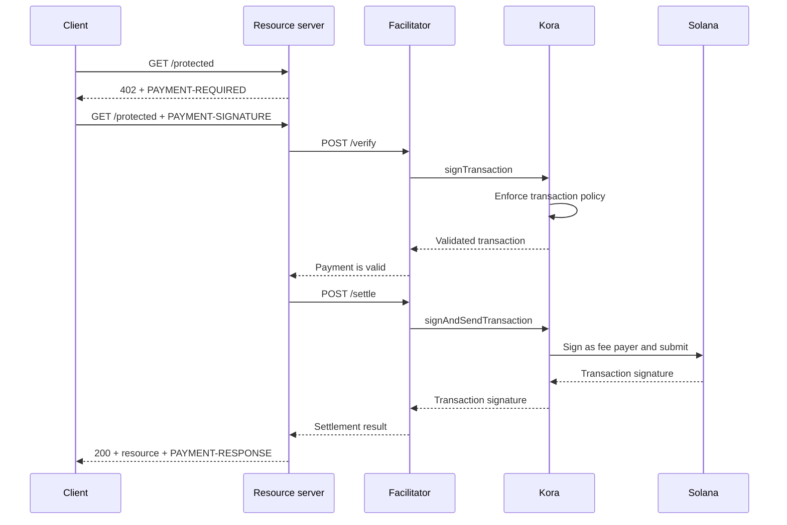

يمكن لـ Kora توفير طبقة التوقيع على سولانا وسياسة المعاملات ورعاية الرسوم خلف [مُيسِّر x402 V2](/docs/tools/x402-facilitator). يُنفِّذ المُيسِّر واجهة برمجية HTTP الخاصة بـ x402؛ بينما يتحقق Kora من صحة معاملات الدفع التي يقبلها ويوقِّعها ويُرسلها.

يبدأ هذا الدليل بتشغيل مُيسِّر Kora المرجعي على شبكة سولانا Devnet. وهي بيئة تطوير لاختبار التكامل، وليست نشرًا في بيئة الإنتاج.

## البنية المعمارية



تظل الأدوار الأربعة للتطبيق منفصلة:

- يختار **العميل** متطلبات الدفع ويوقِّع تفويض الدفع.
- يُحدِّد **خادم الموارد** سعر المسار ولا يُنفِّذه إلا بعد التحقق والتسوية الناجحَين.
- يعرض **المُيسِّر** نقاط النهاية `/supported` و`/verify` و`/settle` الخاصة بـ x402.
- لا يوقِّع **Kora** إلا المعاملات المسموح بها وفق سياسته، ويمكنه رعاية رسوم شبكة سولانا الخاصة بها.

لا يحلّ Kora محل بروتوكول x402، بل هو حدود التوقيع والسياسة التي يستخدمها هذا التنفيذ للمُيسِّر.

## تشغيل المُيسِّر المرجعي

تحتاج إلى Git و[Docker مع Compose](https://docs.docker.com/compose/). استنسخ أحدث إصدار مستقر من Kora وادخل إلى عرض x402 التجريبي:

```bash
git clone --branch v2.0.5 --depth 1 https://github.com/solana-foundation/kora.git
cd kora/examples/x402/demo
cp .env.example .env
```

عيِّن `KORA_PRIVATE_KEY` في ملف `.env` إلى keypair Devnet للاستخدام المؤقت. يقبل تكوين الموقِّع في العرض التجريبي سرًا بترميز base58، أو keypair على شكل مصفوفة بايت، أو مسارًا إلى ملف keypair بصيغة JSON. موِّل عنوانه العام بـ SOL على شبكة Devnet حتى يتمكن من رعاية رسوم المعاملات.

<Callout type="caution" title="استخدم موقِّع Devnet للاستخدام المؤقت">
  يحمِّل العرض التجريبي لـ Docker موقِّع Kora من متغير بيئة. لا تضع مفتاح توقيع بيئة الإنتاج في هذا العرض التجريبي ولا تُدرج ملف `.env` في نظام التحكم بالإصدار.
</Callout>

شغِّل Kora والمُيسِّر:

```bash
docker compose up --build
```

قد يستغرق أول بناء عدة دقائق. عندما تجتاز فحوصات الصحة كلتاهما، افحص القدرات المُعلَنة للمُيسِّر من طرفية أخرى:

```bash
curl http://127.0.0.1:3000/supported
```

ينبغي أن تُعلن الاستجابة عن إصدار x402 `2` ومخطط `exact` ومعرِّف شبكة CAIP-2 الخاص بـ Devnet:

```json
{
  "kinds": [
    {
      "x402Version": 2,
      "scheme": "exact",
      "network": "solana:EtWTRABZaYq6iMfeYKouRu166VU2xqa1",
      "extra": {
        "feePayer": "<KORA_SIGNER_ADDRESS>"
      }
    }
  ]
}
```

يستمع Kora على `127.0.0.1:8080` ويستمع المُيسِّر على `127.0.0.1:3000` افتراضيًا. أوقف العرض التجريبي بالضغط على `Ctrl+C`.

## توصيل خادم موارد

هيِّئ خادم موارد x402 لاستخدام المُيسِّر المحلي والعنوان العام لموقِّع Kora كمستلِم:

```bash
FACILITATOR_URL=http://127.0.0.1:3000
SOLANA_PAY_TO=<KORA_SIGNER_ADDRESS>
```

ثم اتبع [x402 على سولانا](/docs/payments/agentic-payments/x402) لإضافة وسيط x402 V2 إلى مسار Express. تتلقى الطلبات غير المدفوعة `PAYMENT-REQUIRED`، وتحمل إعادة المحاولة `PAYMENT-SIGNATURE`، وتحمل الاستجابة الناجحة `PAYMENT-RESPONSE`.

لا تنسخ الأمثلة التي تستخدم `X-PAYMENT` أو `X-PAYMENT-RESPONSE` أو اسم الشبكة `solana-devnet`. تنتمي هذه الحقول إلى x402 V1.

يتضمن مستودع Kora أيضًا واجهة برمجية محمية وعميلًا يدرك عمليات الدفع في نفس دليل `examples/x402/demo`. استخدم هذه التطبيقات عندما تحتاج إلى اختبار التدفق المحلي الكامل.

## تكوين سياسة Kora

تكوين `kora/kora.toml` المرجعي ضيق النطاق عمدًا. تتحكم سياسة التحقق فيه في:

- برامج سولانا التي يسمح بها الموقِّع؛
- مصادر عملات SPL التي يمكن استخدامها؛
- الحد الأقصى لـ lamports المرعيّة وعدد التوقيعات؛
- عمليات دافع الرسوم المحظورة؛ و
- امتدادات Token-2022 المرفوضة.

يُتيح العرض التجريبي فقط أساليب Kora RPC التي يحتاجها المُيسِّر:
`signTransaction` و`signAndSendTransaction` و`getBlockhash` و`getPayerSigner`
و`getConfig` و`getVersion`.

تعامل مع السياسة باعتبارها الحدود الأمنية لمفتاح دافع الرسوم. لخدمة الإنتاج:

1. ضع في القائمة البيضاء فقط البرامج ومصادر العملات وأشكال المعاملات التي ينتجها مخطط x402 الخاص بك.
2. ارفض عمليات النقل وتغييرات الصلاحية وإغلاق الحسابات والتعليمات الأخرى التي يمكنها نقل القيمة من موقِّع Kora.
3. حدِّد حدود المعاملات والاستخدام التي تُقيِّد الخسارة في حالة اختراق بيانات اعتماد المُيسِّر.
4. استخدم واجهة خلفية لموقِّع مُدار بدلًا من مفتاح خاص محفوظ في متغيرات البيئة.

## تأمين الاتصال بين المُيسِّر وKora

يُتيح العرض التجريبي مصادقة مفتاح API لـ Kora. يُرسل المُيسِّر قيمة `KORA_API_KEY` التي يجب أن تطابق `[kora.auth].api_key` في `kora.toml`.

للإنتاج، اتخذ أيضًا الإجراءات التالية:

- احتفظ بـ Kora على شبكة خاصة وأنهِ اتصال TLS عند حدود موثوقة؛
- خزِّن بيانات اعتماد API في مدير أسرار ودوِّرها بانتظام؛
- فكِّر في استخدام مصادقة طلبات HMAC الخاصة بـ Kora للحماية من التلاعب وإعادة التشغيل؛
- افصل بين مفاتح دافع الرسوم ومستلِم الدفع عند اقتضاء نموذج المحاسبة ذلك؛ و
- أعدَّ تنبيهات لرفض السياسات وإخفاقات التسوية واستهلاك الرسوم ورصيد الموقِّع.

## تعزيز أمان تسوية الدفع

يتحقق Kora من معاملة سولانا، غير أن المُيسِّر وخادم الموارد لا يزالان مسؤولَين عن صحة بروتوكول x402. قبل تقديم أي مورد، تحقق من:

- إصدار x402 المحدد والمخطط والشبكة والأصل والمبلغ والمستلِم؛
- مدة صلاحية التفويض وتخطيط تعليمات سولانا الدقيق؛
- الحماية الذرية من إعادة التشغيل والتسوية غير القابلة للضياع؛
- التأكيد عند مستوى الالتزام الذي يتطلبه المنتج؛ و
- تعيين دائم بين عملية الشراء ونتيجة التسوية والوفاء بالطلب.

لا تُعِد المحتوى المدفوع بمجرد قبول Kora المعاملة للتوقيع. نفِّذ الطلب فقط بعد أن يُعيد المُيسِّر نتيجة تسوية ناجحة.

## الموارد ذات الصلة

- [مستودع Kora وعرض x402 التجريبي](https://github.com/solana-foundation/kora/tree/main/examples/x402/demo)
- [تكوين مشغِّل Kora](/docs/tools/kora/operators/configuration)
- [واجهات خلفية لموقِّع Kora](/docs/tools/kora/operators/signers)
- [تدقيقات أمان Kora](/docs/tools/kora/security-audits)
- [مواصفات x402 V2](https://github.com/x402-foundation/x402/blob/main/specs/x402-specification-v2.md)
- [نظرة عامة على المدفوعات الذكية التلقائية](/docs/payments/agentic-payments)
