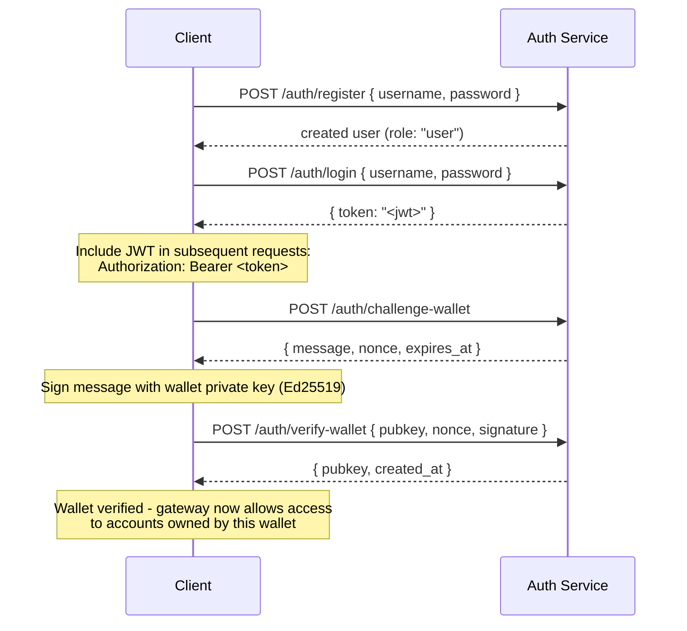

## نظرة عامة

تتضمن القنوات الخاصة خدمة مصادقة اختيارية تقيّد الوصول إلى البوابة
باستخدام مصادقة JWT والتحكم في الوصول المستند إلى الأدوار (RBAC). عندما
تكون المصادقة معطّلة، تقبل البوابة جميع الاتصالات. وعند تفعيلها،
يجب على العملاء تقديم JWT صالح في كل طلب.

تغطي هذه الصفحة كلا الجمهورين:

- **المطورون** - التسجيل، وتسجيل الدخول، والتحقق من المحفظة، وإرسال
  الطلبات المصادَق عليها
- **المشغّلون** - تفعيل خدمة المصادقة، وضبط `JWT_SECRET`، وتخصيص
  دور `operator`

## تفعيل المصادقة

يتم تفعيل المصادقة عن طريق تعيين `JWT_SECRET` (بقيمة غير فارغة) على كل من
البوابة وخدمة المصادقة. كما تتطلب خدمة المصادقة تعيين
`AUTH_DATABASE_URL`.

عندما لا يكون `JWT_SECRET` مُعيَّنًا، تعمل البوابة في الوضع المفتوح؛ ولا يُشترط
وجود أي رمز مميز.

> **Docker Compose:** خدمة المصادقة هي ملف تعريف Docker Compose و**لا
> تبدأ تلقائيًا**. لتضمينها، مرّر `--profile auth` إلى أمر
> `docker compose` الخاص بك، مع تضمين `--env-file .env` حتى تُحلَّل الأسرار مثل
> `JWT_SECRET` و`POSTGRES_PASSWORD` فعليًا (تعطّل Compose ميزة التحميل
> التلقائي لملف `.env` بمجرد تمرير أي علامة `--env-file`):
>
> ```bash
> docker compose -f docker-compose.devnet.yml --env-file versions.env --env-file .env.devnet --env-file .env --profile auth up -d
> ```

## واجهة برمجة تطبيقات خدمة المصادقة

جميع نقاط النهاية تندرج تحت `/auth`. تستمع خدمة المصادقة على المنفذ `AUTH_PORT`
(الافتراضي `8903`).

### `POST /auth/register`

إنشاء حساب جديد. يُسجَّل جميع المستخدمين بدور `user`.

```json
{ "username": "alice", "password": "hunter2" }
```

- اسم المستخدم: من 5 إلى 32 حرفًا، أحرف وأرقام مع `_` و`-`
- كلمة المرور: من 6 إلى 128 حرفًا
- يُعيد المستخدم الذي تم إنشاؤه؛ ولا تُعاد كلمة المرور أبدًا

### `POST /auth/login`

المصادقة واستلام JWT موقَّع صالح لمدة 24 ساعة.

```json
{ "username": "alice", "password": "hunter2" }
```

يُعيد `{ "token": "<jwt>" }`. يُعيد كلٌّ من اسم المستخدم الخاطئ وكلمة المرور الخاطئة
`401` لمنع تعداد أسماء المستخدمين.

### `POST /auth/challenge-wallet`

طلب تحدي توقيع لإثبات ملكية محفظة سولانا. يتطلب
JWT صالحًا.

يُعيد رسالةً ورمزًا عشوائيًا (nonce) وتاريخ انتهاء صلاحية. ينتهي التحدي خلال 10 دقائق.

```json
{
  "message": "PrivateChannel wallet verification\nuser: <uuid>\nnonce: <uuid>\nexpires: <unix>",
  "nonce": "<uuid>",
  "expires_at": "<iso8601>"
}
```

### `POST /auth/verify-wallet`

إرسال التحدي الموقَّع لتسجيل المحفظة كمحفظة موثَّقة. يتطلب JWT صالحًا.

```json
{
  "pubkey": "<base58 pubkey>",
  "nonce": "<uuid from challenge>",
  "signature": "<base58 Ed25519 signature>"
}
```

تُعيد الخدمة بناء رسالة التحدي، وتتحقق من توقيع Ed25519،
وتخزّن المحفظة. لا يمكن استخدام كل رمز عشوائي (nonce) إلا مرة واحدة؛ ويُرفض أي إعادة تشغيل.

يُعيد `{ "pubkey": "<base58>", "created_at": "<iso8601>" }`.

### `GET /auth/wallets`

عرض قائمة بجميع المحافظ الموثَّقة للمستخدم المصادَق عليه. يتطلب JWT صالحًا.

### `DELETE /auth/wallets/{pubkey}`

إزالة محفظة موثَّقة من حساب المستخدم المصادَق عليه. يتطلب JWT
صالحًا.

### `GET /health`

فحص الحيوية. يُعيد `200 ok`. لا تُشترط المصادقة.

## بنية JWT

تستخدم الرموز المميزة خوارزمية HS256 وتنتهي صلاحيتها بعد 24 ساعة من الإصدار.

| المطالبة  | القيمة                           |
| ------ | ------------------------------- |
| `sub`  | UUID المستخدم                       |
| `role` | `"user"` أو `"operator"`        |
| `iss`  | `"private-channel-auth"`        |
| `aud`  | `"private-channel-gateway"`     |
| `exp`  | طابع زمني Unix (24 ساعة من الإصدار) |

> `iss` و`aud` موجودان في حمولة JWT لكنهما يُتحقَّق منهما عبر
> إعداد JWT الخاص بالبوابة، وليس عبر إلغاء تسلسلهما في بنية مطالبات التطبيق.
> يمكن لكود طبقة التطبيق الوصول إلى `sub` و`role` و`exp` فقط.

مرّر الرمز المميز في ترويسة `Authorization`:

```
Authorization: Bearer <JWT_TOKEN>
```

## الأدوار

### user

الدور الافتراضي عند التسجيل.

- الوصول مقيّد بمحافظ المستخدم الموثَّقة فقط
- محظور من: `getBlock`، و`getTransaction`، و`simulateTransaction`
- مسموح له بـ: استدعاء `Deposit` على برنامج الضمان (Escrow Program)، وبدء عمليات السحب عبر
  `WithdrawFunds`

### operator

دور مرتفع الصلاحيات. يجب تخصيصه مباشرةً؛ لا توجد مسار ذاتي للترقية
من `user` إلى `operator`.

**منح الدور**، إما عبر أداة CLI للمدير (`private-channel-auth-admin`):

```bash
private-channel-auth-admin set-role --username alice --role operator
```

أو عبر SQL مباشرة:

<Callout type="warning">
  هذه عملية قاعدة بيانات ذات صلاحيات مرتفعة. قيّد الوصول إلى قاعدة بيانات خدمة المصادقة
  وفقًا لذلك، وراجع أي تغييرات في الأدوار.
</Callout>

```sql
UPDATE private_channel_auth.users SET role = 'operator' WHERE username = 'alice';
```

**تسجيل محفظة دون المرور بتدفق التحقق الذاتي (أداة CLI للمدير،
`private-channel-auth-admin`):**

```bash
private-channel-auth-admin attach-wallet --username alice --pubkey <base58-pubkey>
```

يُدرج هذا الأمر محفظةً موثَّقة مباشرةً في جدول `verified_wallets`،
متجاوزًا تدفق التحدي/التحقق. يُطبّق قيدًا فريدًا على
`(user_id, pubkey)`. **لا** يمنح دور `operator` بحد ذاته؛ استخدم
`set-role` أو تحديث SQL أعلاه لذلك. هذا الأمر مخصص لربط محفظة بحساب (مثل حساب خدمة) دون الحاجة إلى
تدفق التحدي/التحقق التفاعلي.

**الصلاحيات:**

- يتجاوز جميع فحوصات ملكية المحفظة
- وصول كامل إلى جميع طرق RPC للبوابة، بما في ذلك `getBlock`،
  و`getTransaction`، و`simulateTransaction`
- مطلوب لـ: `ReleaseFunds`، و`ResetSmtRoot`

## تدفق المصادقة الكامل



## إرسال الطلبات المصادَق عليها

```typescript
const response = await fetch("http://localhost:8899/", {
  method: "POST",
  headers: {
    "Content-Type": "application/json",
    Authorization: `Bearer ${jwtToken}`
  },
  body: JSON.stringify({
    jsonrpc: "2.0",
    id: 1,
    method: "getBalance",
    params: [walletAddress]
  })
});
const data = await response.json();
```

## نقاط نهاية البوابة

لا تتطلب نقاط النهاية التالية مصادقة:

| نقطة النهاية  | الطريقة | الوصف                               | النجاح                  | الفشل                     |
| --------- | ------ | ----------------------------------------- | ------------------------ | --------------------------- |
| `/health` | GET    | فحص الحيوية                            | `200 {"status":"ok"}`    | -                           |
| `/ready`  | GET    | فحص الجاهزية المعمّقة؛ يختبر عُقد الكتابة والقراءة | `200 {"status":"ready"}` | `503 {"status":"degraded"}` |

للاطلاع على مرجع متغيرات بيئة `JWT_SECRET` والبوابة، راجع
[مرجع الإعداد](/docs/tools/private-channels/operators/configuration).

## مصفوفة وصول طرق RPC

الطرق التالية معترف بها من قِبَل البوابة. عندما يكون `JWT_SECRET` مُعيَّنًا،
yعتمد الوصول على دور JWT:

| الطريقة                        | المسار      | بدون JWT | `user`           | `operator` |
| ----------------------------- | ---------- | ------ | ---------------- | ---------- |
| `sendTransaction`             | عقدة الكتابة | ✓      | ✓                | ✓          |
| `getLatestBlockhash`          | عقدة القراءة  | ✓      | ✓                | ✓          |
| `getSlot`                     | عقدة القراءة  | ✓      | ✓                | ✓          |
| `getRecentBlockhash`          | عقدة القراءة  | ✓      | ✓                | ✓          |
| `getSignatureStatuses`        | عقدة القراءة  | ✓      | ✓                | ✓          |
| `getTransactionCount`         | عقدة القراءة  | ✓      | ✓                | ✓          |
| `getFirstAvailableBlock`      | عقدة القراءة  | ✓      | ✓                | ✓          |
| `getBlocks`                   | عقدة القراءة  | ✓      | ✓                | ✓          |
| `getEpochInfo`                | عقدة القراءة  | ✓      | ✓                | ✓          |
| `getEpochSchedule`            | عقدة القراءة  | ✓      | ✓                | ✓          |
| `getRecentPerformanceSamples` | عقدة القراءة  | ✓      | ✓                | ✓          |
| `getBlockTime`                | عقدة القراءة  | ✓      | ✓                | ✓          |
| `getVoteAccounts`             | عقدة القراءة  | ✓      | ✓                | ✓          |
| `getSupply`                   | عقدة القراءة  | ✓      | ✓                | ✓          |
| `getSlotLeaders`              | عقدة القراءة  | ✓      | ✓                | ✓          |
| `isBlockhashValid`            | عقدة القراءة  | ✓      | ✓                | ✓          |
| `getAccountInfo`              | عقدة القراءة  | 401    | مقيّد بالملكية¹ | ✓          |
| `getTokenAccountBalance`      | عقدة القراءة  | 401    | مقيّد بالملكية¹ | ✓          |
| `getSignaturesForAddress`     | عقدة القراءة  | 401    | مقيّد بالملكية¹ | ✓          |
| `getBlock`                    | عقدة القراءة  | 401    | 403              | ✓          |
| `getTransaction`              | عقدة القراءة  | 401    | 403              | ✓          |
| `simulateTransaction`         | عقدة القراءة  | 401    | 403              | ✓          |

¹ **مقيّد بالملكية**: بالنسبة لحساب رمز SPL (حيث يكون حقل المالك `TokenkegQ...`
أو `TokenzQ...`، وحجم البيانات 165 بايت على الأقل)، تتحقق البوابة من أن حقل
`owner` أو `delegate` يطابق إحدى المحافظ الموثَّقة للمستخدم المصادَق عليه. أما بالنسبة لأي نوع حساب آخر (محفظة System Program، أو PDA غير معروف)، فتتحقق بدلاً من ذلك مما إذا كان pubkey المُستعلَم عنه نفسه يُعدّ إحدى محافظ المستخدم الموثَّقة، إذ لا يوجد حقل مالك/مفوَّض لفحصه في مثل هذه الحسابات.
يؤدي فشل أي من الفحصين إلى إعادة 403.
