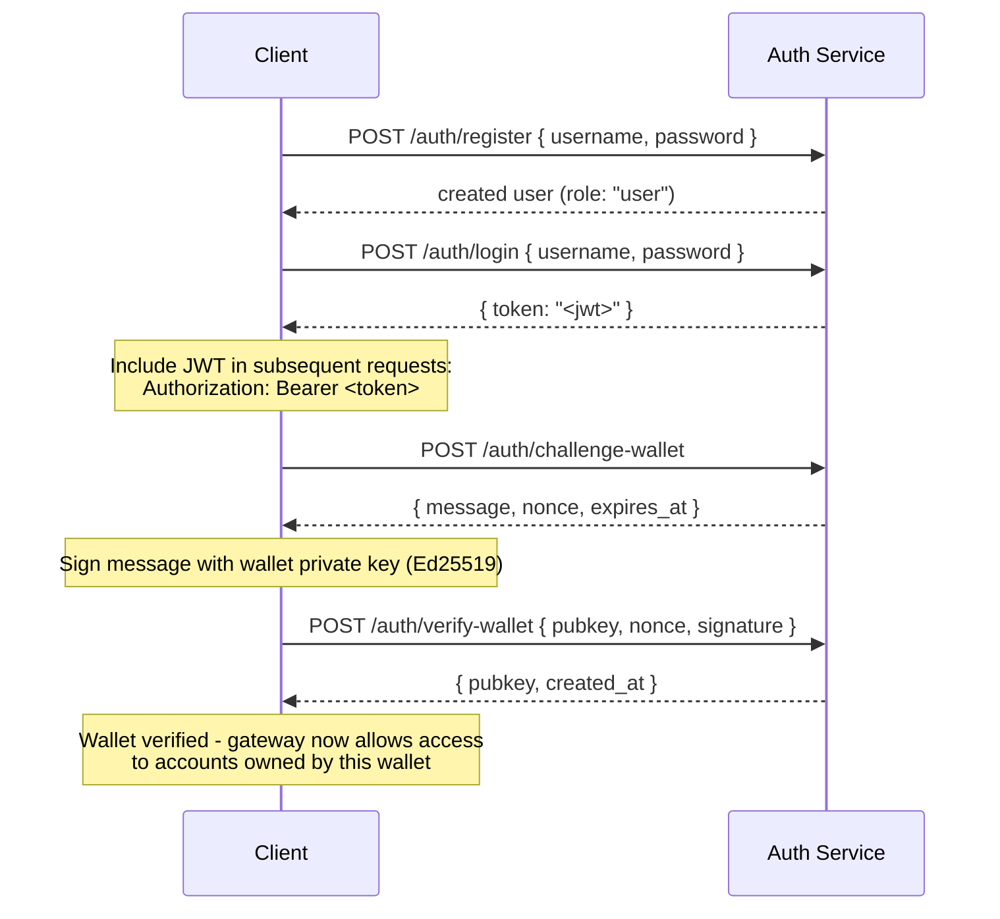

## نظرة عامة

تتضمن القنوات الخاصة خدمة مصادقة اختيارية تُقيّد الوصول إلى البوابة
باستخدام مصادقة JWT والتحكم في الوصول المستند إلى الأدوار (RBAC). عند
تعطيل المصادقة، تقبل البوابة جميع الاتصالات. وعند تفعيلها،
يجب على العملاء تقديم JWT صالح في كل طلب.

تغطي هذه الصفحة كلا الفئتين:

- **المطورون** - التسجيل وتسجيل الدخول والتحقق من المحفظة وإرسال
  الطلبات المُصادق عليها
- **المشغلون** - تفعيل خدمة المصادقة وضبط `JWT_SECRET` و
  تخصيص دور `operator`

## تفعيل المصادقة

تُفعَّل المصادقة بتعيين `JWT_SECRET` (بقيمة غير فارغة) على كل من
البوابة وخدمة المصادقة. كما تتطلب خدمة المصادقة
`AUTH_DATABASE_URL`.

عندما لا يكون `JWT_SECRET` مضبوطاً، تعمل البوابة في الوضع المفتوح؛ ولا يُطلب أي رمز مميز.

> **Docker Compose:** خدمة المصادقة هي ملف تعريف Docker Compose ولا يتم
> تشغيلها افتراضياً**. لتضمينها، مرر `--profile auth` إلى أمر
> `docker compose` الخاص بك، بما في ذلك `--env-file .env` حتى تُحلَّل الأسرار مثل
> `JWT_SECRET` و`POSTGRES_PASSWORD` فعلياً (يُعطّل Compose التحميل
> التلقائي لملف `.env` بمجرد تمرير أي علامة `--env-file`):
>
> ```bash
> docker compose -f docker-compose.devnet.yml --env-file versions.env --env-file .env.devnet --env-file .env --profile auth up -d
> ```

## واجهة برمجة تطبيقات خدمة المصادقة

جميع نقاط النهاية تقع تحت `/auth`. تستمع خدمة المصادقة على `AUTH_PORT`
(الافتراضي `8903`).

### `POST /auth/register`

إنشاء حساب جديد. يُسجَّل جميع المستخدمين بدور `user`.

```json
{ "username": "alice", "password": "hunter2" }
```

- اسم المستخدم: من 5 إلى 32 حرفاً، أحرف وأرقام مع `_` و`-`
- كلمة المرور: من 6 إلى 128 حرفاً
- تُعيد المستخدم الذي تم إنشاؤه؛ لا تُعاد كلمة المرور مطلقاً

### `POST /auth/login`

المصادقة واستلام JWT موقّع صالح لمدة 24 ساعة.

```json
{ "username": "alice", "password": "hunter2" }
```

تُعيد `{ "token": "<jwt>" }`. يُعيد كل من اسم المستخدم الخاطئ وكلمة المرور الخاطئة
`401` لمنع تعداد أسماء المستخدمين.

### `POST /auth/challenge-wallet`

طلب تحدي توقيع لإثبات ملكية محفظة سولانا. يتطلب
JWT صالحاً.

تُعيد رسالة ونونس وتاريخ انتهاء. ينتهي صلاحية التحدي خلال 10 دقائق.

```json
{
  "message": "PrivateChannel wallet verification\nuser: <uuid>\nnonce: <uuid>\nexpires: <unix>",
  "nonce": "<uuid>",
  "expires_at": "<iso8601>"
}
```

### `POST /auth/verify-wallet`

إرسال التحدي الموقّع لتسجيل محفظة كمُتحقَّق منها. يتطلب JWT صالحاً.

```json
{
  "pubkey": "<base58 pubkey>",
  "nonce": "<uuid from challenge>",
  "signature": "<base58 Ed25519 signature>"
}
```

تُعيد الخدمة بناء رسالة التحدي، وتتحقق من توقيع Ed25519،
وتخزّن المحفظة. لا يمكن استهلاك كل نونس إلا مرة واحدة؛ تُرفض عمليات الإعادة.

تُعيد `{ "pubkey": "<base58>", "created_at": "<iso8601>" }`.

### `GET /auth/wallets`

سرد جميع المحافظ المُتحقَّق منها للمستخدم المُصادق عليه. يتطلب JWT صالحاً.

### `DELETE /auth/wallets/{pubkey}`

إزالة محفظة مُتحقَّق منها من حساب المستخدم المُصادق عليه. يتطلب JWT صالحاً.

### `GET /health`

فحص الحيوية. تُعيد `200 ok`. لا تتطلب مصادقة.

## بنية JWT

تستخدم الرموز المميزة خوارزمية HS256 وتنتهي صلاحيتها بعد 24 ساعة من الإصدار.

| الادعاء  | القيمة                           |
| ------ | ------------------------------- |
| `sub`  | UUID المستخدم                       |
| `role` | `"user"` أو `"operator"`        |
| `iss`  | `"private-channel-auth"`        |
| `aud`  | `"private-channel-gateway"`     |
| `exp`  | طابع Unix الزمني (24 ساعة من الإصدار) |

> `iss` و`aud` موجودان في حمولة JWT لكنهما يُتحقَّق منهما عبر
> إعداد JWT الخاص بالبوابة، لا من خلال إلغاء تسلسلهما في بنية ادعاءات التطبيق.
> كود طبقة التطبيق لديه وصول فقط إلى `sub` و`role` و`exp`.

مرر الرمز المميز في رأس `Authorization`:

```
Authorization: Bearer <JWT_TOKEN>
```

## الأدوار

### user

الدور الافتراضي عند التسجيل.

- الوصول مقيّد بالمحافظ المُتحقَّق منها الخاصة بالمستخدم
- محظور من: `getBlock` و`getTransaction` و`simulateTransaction`
- يمكنه: استدعاء `Deposit` على برنامج الضمان (Escrow Program)، وبدء عمليات السحب عبر
  `WithdrawFunds`

### operator

دور مرفّع الصلاحيات. يجب تخصيصه مباشرةً؛ لا توجد مسار ذاتي الخدمة
للترقية من `user` إلى `operator`.

**منح الدور**، إما عبر واجهة سطر أوامر المسؤول (`private-channel-auth-admin`):

```bash
private-channel-auth-admin set-role --username alice --role operator
```

أو عبر SQL مباشرةً:

<Callout type="warning">
  هذه عملية قاعدة بيانات ذات صلاحيات مرتفعة. قيّد الوصول إلى قاعدة بيانات خدمة المصادقة
  وفقاً لذلك، وراجع أي تغييرات في الأدوار.
</Callout>

```sql
UPDATE private_channel_auth.users SET role = 'operator' WHERE username = 'alice';
```

**تسجيل محفظة دون تدفق التحقق الذاتي (واجهة سطر أوامر المسؤول،
`private-channel-auth-admin`):**

```bash
private-channel-auth-admin attach-wallet --username alice --pubkey <base58-pubkey>
```

يُدرج هذا الأمر محفظة مُتحقَّق منها مباشرةً في جدول `verified_wallets`،
متجاوزاً تدفق التحدي/التحقق. يفرض قيداً فريداً على
`(user_id, pubkey)`. **لا** يمنح دور `operator` بحد ذاته؛ استخدم
`set-role` أو تحديث SQL أعلاه لذلك. هذا الأمر مخصص لإرفاق
محفظة بحساب (مثل حساب خدمة) دون الحاجة إلى تدفق التحدي/التحقق التفاعلي.

**الإمكانيات:**

- يتجاوز جميع فحوصات ملكية المحافظ
- وصول كامل إلى جميع طرق RPC للبوابة، بما في ذلك `getBlock` و
  `getTransaction` و`simulateTransaction`
- مطلوب لـ: `ReleaseFunds` و`ResetSmtRoot`

## تدفق المصادقة الكامل



## إرسال الطلبات المُصادق عليها

```typescript
const response = await fetch("http://localhost:8899/", {
  method: "POST",
  headers: {
    "Content-Type": "application/json",
    Authorization: `Bearer ${jwtToken}`
  },
  body: JSON.stringify({
    jsonrpc: "2.0",
    id: 1,
    method: "getBalance",
    params: [walletAddress]
  })
});
const data = await response.json();
```

## نقاط نهاية البوابة

لا تتطلب نقاط النهاية التالية مصادقة:

| نقطة النهاية  | الطريقة | الوصف                               | نجاح                  | فشل                     |
| --------- | ------ | ----------------------------------------- | ------------------------ | --------------------------- |
| `/health` | GET    | فحص الحيوية                            | `200 {"status":"ok"}`    | -                           |
| `/ready`  | GET    | فحص الجاهزية المعمّق؛ يختبر عقد الكتابة والقراءة | `200 {"status":"ready"}` | `503 {"status":"degraded"}` |

للاطلاع على `JWT_SECRET` ومرجع متغيرات بيئة البوابة، راجع
[مرجع الإعدادات](/docs/tools/private-channels/operators/configuration).

## مصفوفة وصول طرق RPC

الطرق التالية معترف بها من قِبل البوابة. عند تعيين `JWT_SECRET`،
yعتمد الوصول على دور JWT:

| الطريقة                        | المسار      | بدون JWT | `user`           | `operator` |
| ----------------------------- | ---------- | ------ | ---------------- | ---------- |
| `sendTransaction`             | عقدة الكتابة | ✓      | ✓                | ✓          |
| `getLatestBlockhash`          | عقدة القراءة  | ✓      | ✓                | ✓          |
| `getSlot`                     | عقدة القراءة  | ✓      | ✓                | ✓          |
| `getRecentBlockhash`          | عقدة القراءة  | ✓      | ✓                | ✓          |
| `getSignatureStatuses`        | عقدة القراءة  | ✓      | ✓                | ✓          |
| `getTransactionCount`         | عقدة القراءة  | ✓      | ✓                | ✓          |
| `getFirstAvailableBlock`      | عقدة القراءة  | ✓      | ✓                | ✓          |
| `getBlocks`                   | عقدة القراءة  | ✓      | ✓                | ✓          |
| `getEpochInfo`                | عقدة القراءة  | ✓      | ✓                | ✓          |
| `getEpochSchedule`            | عقدة القراءة  | ✓      | ✓                | ✓          |
| `getRecentPerformanceSamples` | عقدة القراءة  | ✓      | ✓                | ✓          |
| `getBlockTime`                | عقدة القراءة  | ✓      | ✓                | ✓          |
| `getVoteAccounts`             | عقدة القراءة  | ✓      | ✓                | ✓          |
| `getSupply`                   | عقدة القراءة  | ✓      | ✓                | ✓          |
| `getSlotLeaders`              | عقدة القراءة  | ✓      | ✓                | ✓          |
| `isBlockhashValid`            | عقدة القراءة  | ✓      | ✓                | ✓          |
| `getAccountInfo`              | عقدة القراءة  | 401    | مقيّد بالملكية¹ | ✓          |
| `getTokenAccountBalance`      | عقدة القراءة  | 401    | مقيّد بالملكية¹ | ✓          |
| `getSignaturesForAddress`     | عقدة القراءة  | 401    | مقيّد بالملكية¹ | ✓          |
| `getBlock`                    | عقدة القراءة  | 401    | 403              | ✓          |
| `getTransaction`              | عقدة القراءة  | 401    | 403              | ✓          |
| `simulateTransaction`         | عقدة القراءة  | 401    | 403              | ✓          |

¹ **مقيّد بالملكية**: بالنسبة لحساب رمز SPL (حقل المالك هو `TokenkegQ...`
أو `TokenzQ...`، والبيانات لا تقل عن 165 بايت)، تتحقق البوابة من أن حقل
`owner` أو `delegate` يطابق إحدى المحافظ المُتحقَّق منها للمستخدم المُصادق عليه. بالنسبة لأي نوع حساب آخر (محفظة System Program، أو PDA غير معروف)، تتحقق بدلاً من ذلك مما إذا كان pubkey المُستعلَم عنه نفسه هو إحدى المحافظ المُتحقَّق منها للمستخدم، إذ لا يوجد حقل owner/delegate لفحصه في مثل هذه الحسابات.
يؤدي فشل أي من الفحصين إلى إعادة 403.
