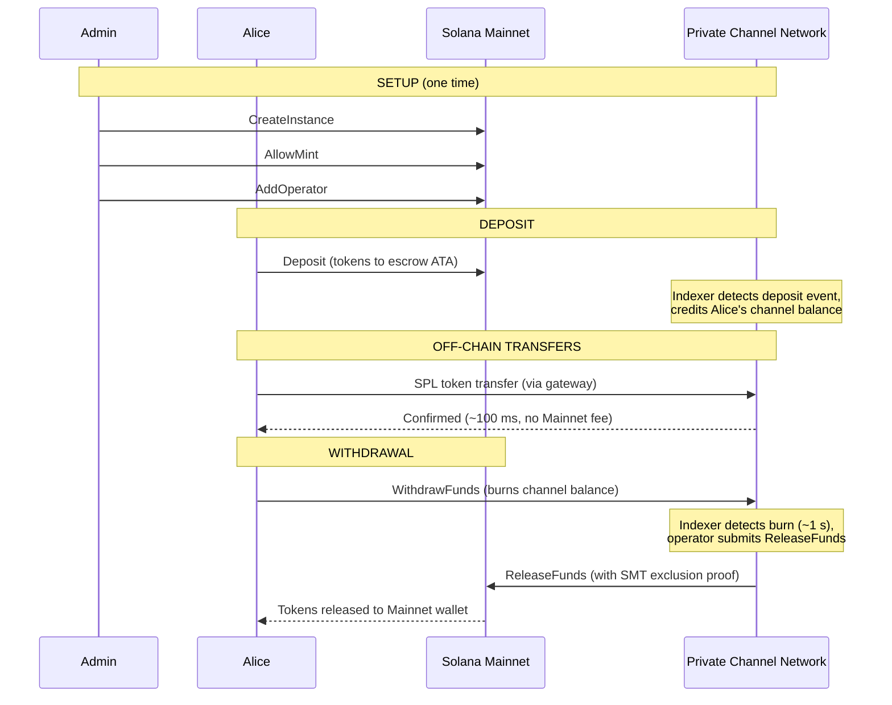
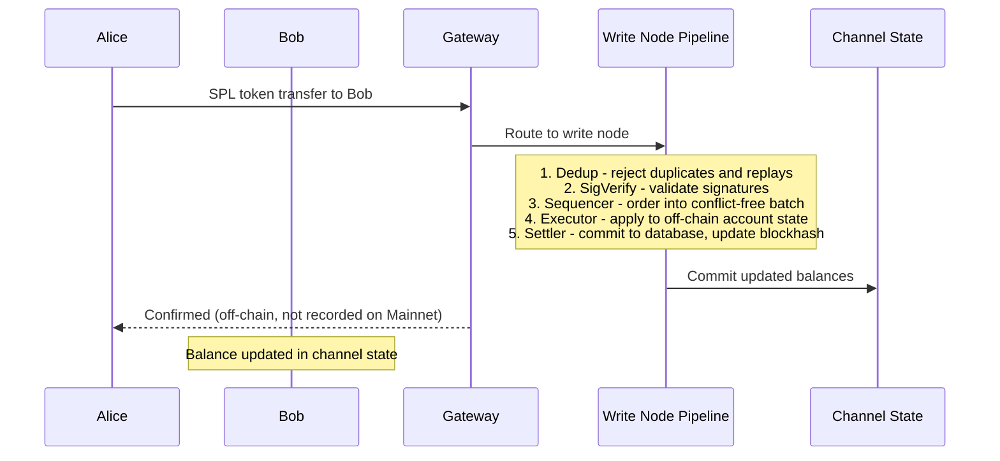
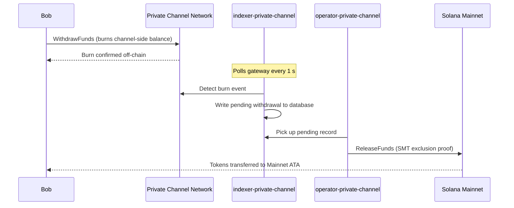

## ما هي القناة الخاصة؟

القناة الخاصة هي شبكة دفع خارج السلسلة مرتبطة بشبكة سولانا. يودع المستخدمون رموز SPL في برنامج ضمان على السلسلة، ثم يُجرون المعاملات خارج السلسلة عبر بوابة بسرعة عالية وبدون أي تكلفة لكل تحويل. يتم التسوية إلى الشبكة الرئيسية لسولانا عبر إثبات Sparse Merkle Tree، مما يضمن إمكانية استرداد الأموال دائمًا واستحالة الإنفاق المزدوج.

على عكس تدفق الدفع الأصلي في سولانا، لا تظهر التحويلات داخل القناة على السلسلة حتى يقوم المستخدم بالسحب. تعمل شبكة القناة بخط معالجة معاملات خاص بها (dedup -> sig verify -> sequencer -> executor -> settler) يعالج المعاملات بشكل مستقل عن وقت الكتلة في سولانا.

## المشاركون

### مدير النسخة

يقوم المدير بنشر `Instance` PDA عبر `CreateInstance` ويتحكم في رموز SPL المقبولة (`AllowMint` / `BlockMint`). يوفر المدير المشغلين ويلغي توفيرهم عبر `AddOperator` / `RemoveOperator`، ويمكنه نقل صلاحيات الإدارة عبر `SetNewAdmin`. يوجد مدير واحد لكل نسخة. نقل صلاحيات الإدارة لا رجعة فيه في خطوة واحدة: لا يمكن للمدير الحالي استرداد الدور دون تعاون المدير الجديد.

### المشغلون

يتم توفير المشغلين من قِبل المدير. يمتلكون `Operator` PDA وهم الحسابات الوحيدة المسموح لها باستدعاء `ReleaseFunds` (لتسوية عمليات السحب إلى الشبكة الرئيسية) و`ResetSmtRoot` (لتدوير Sparse Merkle Tree). يتجاوز المشغلون جميع فحوصات الملكية في البوابة ولديهم وصول إلى جميع أساليب JSON-RPC بما في ذلك `getBlock` و`getTransaction` و`simulateTransaction`. دور JWT: `"operator"`. يجب توفير المشغلين مباشرةً في قاعدة البيانات؛ ولا توجد آلية ترقية ذاتية. راجع
[دليل المشغلين](/docs/tools/private-channels/operators) للاطلاع على تفاصيل النشر والإعداد.

### المستخدمون

يسجّل المستخدمون أنفسهم عبر خدمة المصادقة. دور JWT: `"user"`. يمكن للمستخدمين استدعاء `Deposit` مباشرةً على برنامج الضمان وبدء عمليات السحب عبر تعليمة `WithdrawFunds` من جانب القناة على برنامج السحب. وصول البوابة مقيد بمحافظهم الموثقة الخاصة؛ ولا يمكنهم استدعاء `getBlock` أو `getTransaction` أو `simulateTransaction`.

## دورة حياة القناة

1. **إنشاء النسخة** - يستدعي المدير `CreateInstance`، مما ينشئ `Instance` PDA ويُهيئ الرموز المسموح بها.
2. **الإيداع** - يودع المستخدمون رموز SPL في الضمان عبر تعليمة `Deposit`. تنتقل الرموز إلى associated token account الخاص بالنسخة.
3. **التحويلات خارج السلسلة** - يُرسل المستخدمون التحويلات عبر البوابة. يتم ترتيب التحويلات وتنفيذها على شبكة القناة دون المساس بالشبكة الرئيسية.
4. **بدء السحب** - يستدعي المستخدم `WithdrawFunds` على برنامج السحب (من جانب القناة) لحرق رصيده والإشارة إلى طلب السحب.
5. **التسوية على الشبكة الرئيسية** - يقدّم المشغل إثبات استبعاد SMT صالحًا ويستدعي `ReleaseFunds` على برنامج الضمان (الشبكة الرئيسية)، مما يُطلق الرموز إلى محفظة المستخدم.
6. **تدوير الشجرة** - عندما يقترب SMT من الطاقة الاستيعابية القصوى (65,536 ورقة)، يستدعي المشغل `ResetSmtRoot` لتدوير الشجرة وبدء epoch جديدة.

### التحويل

### السحب

## متى تستخدم القنوات الخاصة

استخدم القنوات الخاصة عندما يحتاج تطبيقك إلى:

- **إنتاجية خارج السلسلة** - حجم التحويلات لديك قد يُشبع TPS في سولانا أو تحتاج إلى تأكيد أقل من ثانية
- **الخصوصية** - يجب ألا تظهر هويات الأطراف المقابلة ومبالغ التحويل على السلسلة
- **رسوم صفرية لكل تحويل** - التحويل المتكرر حيث تكون تكلفة SOL لكل معاملة باهظة

استخدم تحويلات SPL الأصلية بدلاً من ذلك عندما:

- **التركيب على السلسلة** مطلوب (DeFi، المبادلات، الإقراض؛ يجب أن تتمكن البرامج الأخرى من مراقبة التحويل أو التصرف بناءً عليه)
- **التسوية بتحويل واحد** مقبولة والخصوصية ليست مصدر قلق
- **لا تتوفر بنية تحتية للبوابة** أو أنها غير ممكنة تشغيليًا
