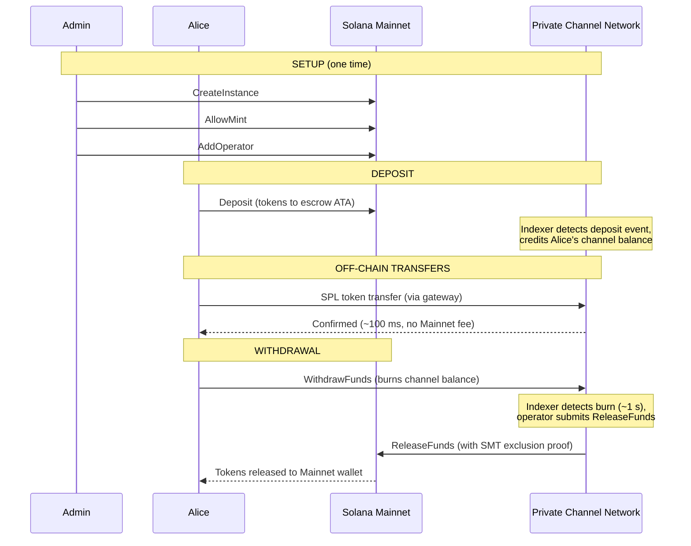
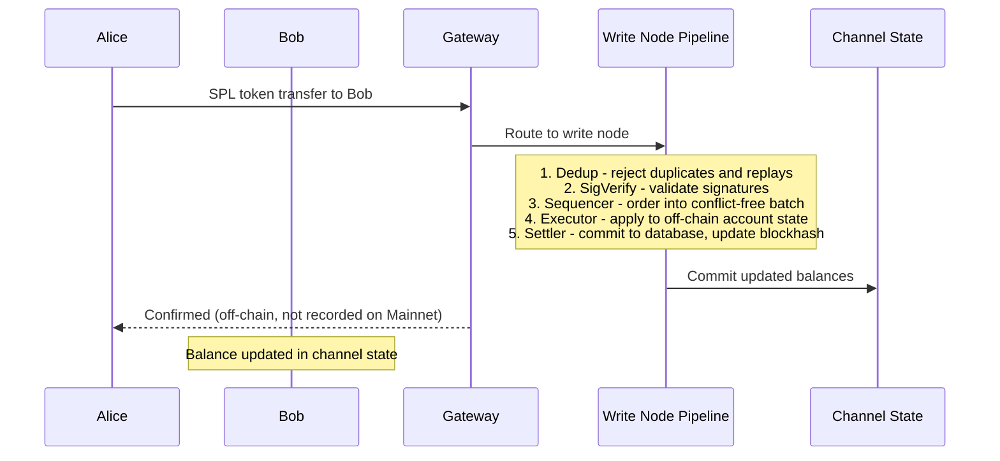
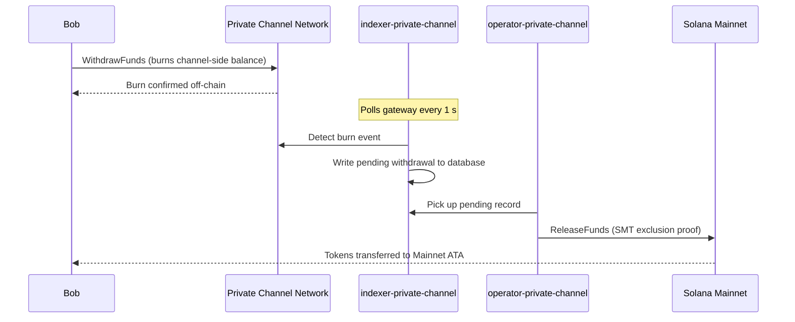

## ما هي القناة الخاصة؟

القناة الخاصة هي شبكة دفع خارج السلسلة (off-chain) مرتبطة بسولانا. يودع المستخدمون رموز SPL في برنامج ضمان (escrow) على السلسلة، ثم يُجرون معاملاتهم خارج السلسلة عبر بوابة (gateway) بسرعة عالية ودون أي تكلفة لكل عملية تحويل. تتم تسوية المعاملات إلى سولانا Mainnet عبر إثبات Sparse Merkle Tree، مما يضمن إمكانية استرداد الأموال في جميع الأوقات واستحالة الإنفاق المزدوج.

على خلاف تدفق الدفع الأصلي في سولانا، لا تظهر التحويلات داخل القناة على السلسلة حتى يقوم المستخدم بالسحب. تُشغّل شبكة القناة خط معالجة معاملاتها الخاص (dedup -> sig verify -> sequencer -> executor -> settler) الذي يعالج المعاملات باستقلالية عن وقت الكتلة في سولانا.

## المشاركون

### مسؤول النسخة (Instance Admin)

ينشر المسؤول PDA الخاص بـ `Instance` عبر `CreateInstance` ويتحكم في قبول رموز SPL المُصدَرة (`AllowMint` / `BlockMint`). يقوم المسؤول بتوفير المشغلين وإلغاء توفيرهم عبر `AddOperator` / `RemoveOperator`، ويمكنه نقل صلاحيات المسؤول عبر `SetNewAdmin`. يوجد مسؤول واحد لكل نسخة. نقل صلاحيات المسؤول لا رجعة فيه في خطوة واحدة: لا يستطيع المسؤول الحالي استعادة الدور دون تعاون المسؤول الجديد.

### المشغلون

يتم توفير المشغلين من قِبل المسؤول. يمتلكون PDA من نوع `Operator` وهم الحسابات الوحيدة المُخوَّلة باستدعاء `ReleaseFunds` (لتسوية عمليات السحب إلى Mainnet) و`ResetSmtRoot` (لتدوير Sparse Merkle Tree). يتجاوز المشغلون جميع فحوصات الملكية في البوابة ولديهم حق الوصول إلى جميع أساليب JSON-RPC بما فيها `getBlock` و`getTransaction` و`simulateTransaction`. دور JWT: `"operator"`. يجب توفير المشغلين مباشرةً في قاعدة البيانات؛ ولا توجد آلية للترقية الذاتية. راجع
[دليل المشغلين](/docs/tools/private-channels/operators) للاطلاع على تفاصيل النشر والإعداد.

### المستخدمون

يسجّل المستخدمون أنفسهم عبر خدمة المصادقة (Auth Service). دور JWT: `"user"`. يمكن للمستخدمين استدعاء `Deposit` مباشرةً على برنامج الضمان (Escrow Program) وبدء عمليات السحب عبر تعليمة `WithdrawFunds` على جانب القناة في برنامج السحب (Withdraw Program). الوصول إلى البوابة مقيّد بمحافظهم الموثّقة فقط؛ ولا يمكنهم استدعاء `getBlock` أو `getTransaction` أو `simulateTransaction`.

## دورة حياة القناة

1. **إنشاء النسخة** - يستدعي المسؤول `CreateInstance`، مما يؤدي إلى إنشاء PDA الخاص بـ `Instance` وضبط الرموز المقبولة (allowed mints).
2. **الإيداع** - يودع المستخدمون رموز SPL في الضمان عبر تعليمة `Deposit`. تنتقل الرموز إلى associated token account الخاص بالنسخة.
3. **التحويلات خارج السلسلة** - يرسل المستخدمون التحويلات عبر البوابة. يتم تسلسل التحويلات وتنفيذها على شبكة القناة دون المساس بـ Mainnet.
4. **بدء السحب** - يستدعي المستخدم `WithdrawFunds` على برنامج السحب (Withdraw Program) من جانب القناة لحرق رصيده والإشارة إلى رغبته في السحب.
5. **التسوية على Mainnet** - يُقدّم المشغّل إثبات استبعاد SMT صالحاً ويستدعي `ReleaseFunds` على برنامج الضمان (Escrow Program) في Mainnet، مما يُفضي إلى إطلاق الرموز إلى محفظة المستخدم.
6. **تدوير الشجرة** - عندما تقترب شجرة SMT من طاقتها الاستيعابية القصوى (65,536 ورقة)، يستدعي المشغّل `ResetSmtRoot` لتدوير الشجرة والبدء في epoch جديدة.

### التحويل

### السحب

## متى تستخدم القنوات الخاصة

استخدم القنوات الخاصة عندما يحتاج تطبيقك إلى:

- **إنتاجية عالية خارج السلسلة** - عندما يكون حجم التحويلات لديك كفيلاً بإشباع TPS الخاص بسولانا أو تحتاج إلى تأكيد في أقل من ثانية
- **الخصوصية** - يجب ألا تظهر هويات الأطراف المقابلة ومبالغ التحويل على السلسلة
- **صفر رسوم لكل تحويل** - التحويل المتكرر حيث تكون تكلفة SOL لكل معاملة مُرهِقة

استخدم تحويلات SPL الأصلية عوضاً عن ذلك في الحالات التالية:

- **قابلية التركيب على السلسلة** مطلوبة (DeFi، المبادلات، الإقراض؛ يجب أن تتمكن البرامج الأخرى من رصد التحويل أو التصرف بناءً عليه)
- **التسوية بتحويل واحد** مقبولة والخصوصية ليست مصدر قلق
- **لا توجد بنية تحتية للبوابة** متاحة أو قابلة للتشغيل من الناحية التشغيلية
