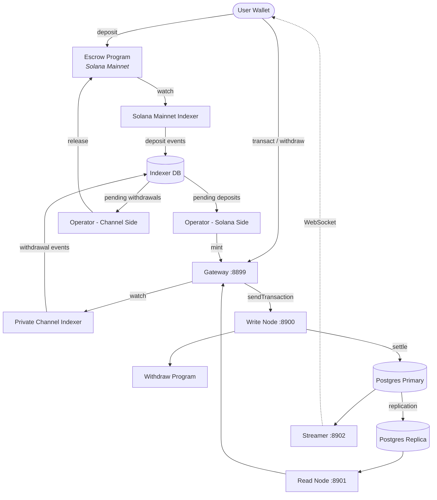

<Callout type="warning">
  لم يخضع بروتوكول القنوات الخاصة لأي تدقيق أمني، ولا يُنصح باستخدامه في بيئة الإنتاج مع أموال حقيقية دون إجراء مراجعة أمنية شاملة.
</Callout>

<Callout type="info">
  **هل تريد نشر نسخة؟** توجّه إلى [دليل المشغّلين](/docs/tools/private-channels/operators). **هل تريد التكامل مع نسخة قائمة؟** توجّه إلى [البدء السريع](/docs/tools/private-channels/quickstart/installation). هذه الصفحة هي مرجع المعمارية لكلا الجمهورين.
</Callout>

## المعمارية

يتألف بروتوكول القنوات الخاصة من أربعة مكوّنات: برنامجان على السلسلة في سولانا (Escrow وWithdraw) وخدمتان خارج السلسلة (Gateway وAuth Service). تشكّل هذه المكوّنات معاً بروتوكول قناة حالة، تبقى فيه الأموال على Mainnet بينما تتم تسوية التحويلات خارج السلسلة.

### برنامج Escrow

برنامج Escrow هو برنامج على السلسلة في سولانا يحتفظ برموز SPL المودَعة. وهو مرساة الثقة في النظام: تبقى جميع الأموال في الضمان حتى يقدّم المشغّل دليل استبعاد Sparse Merkle Tree صالحاً لتحريرها.

- معرّف البرنامج: `9tgHa1DcnaSSUtmMsst8ovKTe1Gfxzezn27KnH9xXYeU`
- يُدمج هذا المعرّف في ملف البرنامج الثنائي عبر `declare_id!()`. تقرأ الخدمات الخارجية المعرّف ذاته في وقت التصريف من crate العميل المولَّد، لا من متغيّر بيئة.
- يدير PDAs الخاصة بـ `Instance` و`AllowedMint` و`Operator`
- التعليمات: `CreateInstance`، `AllowMint`، `BlockMint`، `AddOperator`،
  `RemoveOperator`، `SetNewAdmin`، `Deposit`، `ReleaseFunds`، `ResetSmtRoot`

### برنامج Withdraw

يعمل برنامج Withdraw على شبكة القناة الخاصة، لا على سولانا Mainnet. يستدعي المستخدمون `WithdrawFunds` لحرق رصيد الرمز على جانب القناة. لا يُحرّر هذا الحرق الأموال تلقائياً؛ بل يُشير إلى المشغّل بوجود سحب معلَّق. يستدعي المشغّل بعد ذلك `ReleaseFunds` على برنامج Escrow مع دليل SMT صالح لإتمام التسوية.

- معرّف البرنامج: `J231K9UEpS4y4KAPwGc4gsMNCjKFRMYcQBcjVW7vBhVi`
- يُدمج هذا المعرّف في ملف البرنامج الثنائي. تقرأ الخدمات الخارجية المعرّف ذاته في وقت التصريف من crate العميل المولَّد، لا من متغيّر بيئة.

### Gateway

Gateway هو وكيل متوافق مع سولانا JSON-RPC يوجّه طلبات العملاء إلى عقدة الكتابة في شبكة القناة (لإرسال المعاملات) وعقدة القراءة (للاستعلامات). يُهيَّأ عبر متغيّرات البيئة: `GATEWAY_PORT` و`GATEWAY_WRITE_URL` و`GATEWAY_READ_URL`.

نقاط نهاية الحالة الصحية (لا تتطلب مصادقة):

- `GET /health` - فحص الحياة؛ يُعيد `200 {"status":"ok"}`
- `GET /ready` - فحص الجاهزية العميق، يستطلع عقدتَي الكتابة والقراءة؛ يُعيد `200 {"status":"ready"}` أو `503 {"status":"degraded"}`

#### توجيه طرق RPC والوصول إليها

يوجّه Gateway طلبات `sendTransaction` إلى عقدة الكتابة وجميع الطرق الأخرى إلى عقدة القراءة. تُرفض الطلبات التي يتجاوز حجمها 64 كيلوبايت بخطأ HTTP 413. عند تفعيل المصادقة، يخضع الوصول إلى الطرق لدور JWT. راجع **[المصادقة والأدوار](/docs/tools/private-channels/concepts/auth)** للاطلاع على مصفوفة الطرق الكاملة.

### Auth Service

Auth Service هو مكوّن اختياري يُصدر رموز JWT بخوارزمية HS256 (صلاحية 24 ساعة) للتحكم في الوصول إلى Gateway. يُفعَّل عند تعيين متغيّر البيئة `JWT_SECRET`. بدونه، يقبل Gateway جميع الاتصالات.

مطالبات JWT: `sub` (UUID المستخدم)، `role` (`"user"` أو `"operator"`)، `iss` (`"private-channel-auth"`)، `aud` (`"private-channel-gateway"`)، `exp` (طابع زمني Unix). يتحقق Gateway من `iss` و`aud` عبر إعداد JWT الخاص به دون إزالة تسلسلها إلى بنية مطالبات التطبيق: لا يتوفر للكود على مستوى التطبيق سوى `sub` و`role` و`exp`.

الأدوار:

- `user` - يقتصر الوصول على المحافظ المُحقَّقة الخاصة بالمستخدم؛ لا يمكنه استدعاء `getBlock` أو `getTransaction` أو `simulateTransaction`
- `operator` - يتجاوز جميع فحوصات الملكية؛ وصول كامل لطرق RPC؛ يجب توفيره في قاعدة البيانات (لا ترقية ذاتية للصلاحيات)

### Streamer

Streamer هو خادم WebSocket يدفع تحديثات حالة القناة إلى العملاء المتصلين في الوقت الفعلي، مما يُلغي الحاجة إلى استطلاع RPC. يستطلع PostgreSQL للكشف عن تغييرات الحالة. وهو جزء من مجموعة Docker Compose الأساسية، لا من مجموعة devnet التي ينشرها هذا الدليل؛ راجع [مرجع الإعداد](/docs/tools/private-channels/operators/configuration#service-port-reference).

- المنفذ: `8902`، قابل للتهيئة عبر `STREAMER_PORT`
- الاتصال: `ws://localhost:8902`
- نقطة نهاية الحالة الصحية: `GET /health` - تُعيد `503` إذا توقفت أي حلقة استطلاع داخلية لأكثر من 30 ثانية

<Callout type="warning">
  لم يُوثَّق مخطط أحداث WebSocket بعد بشكل رسمي. راجع [`core/src/bin/streamer.rs`](https://github.com/solana-foundation/solana-private-channels/blob/main/core/src/bin/streamer.rs) للاطلاع على تفاصيل التنفيذ ريثما تتوفر الوثائق الرسمية.
</Callout>



## مسار المعاملات

```text
Transaction -> [1:Dedup] -> [2:SigVerify] -> [3:Sequencer] -> [4:Executor] -> [5:Settler] -> Database
```

تمر المعاملات المُرسَلة إلى Gateway عبر مسار من خمس مراحل قبل تثبيت حالتها:

1. **Dedup** - يُرشّح المعاملات المكررة قبل دخولها المسار
2. **SigVerify** - يتحقق من توقيعات المعاملات مقابل المفتاح العام للموقّع
3. **Sequencer** - يُرتّب المعاملات الصالحة بشكل حتمي لإنشاء سجل تاريخي قانوني
4. **Executor** - يُنفّذ المعاملات مقابل طبقة حسابات القناة (BOB Cache + AccountsDB)، محدّثاً الأرصدة خارج السلسلة
5. **Settler** - يُثبّت نتائج المعاملات المتراكمة في PostgreSQL ويُحدّث ذاكرة التخزين المؤقت Redis؛ يُولّد تجزئات كتل جديدة لدورة الكتل التالية. تُعالَج تسوية Mainnet (استدعاء `ReleaseFunds`) بشكل منفصل عبر خدمة `operator-private-channel`

## الميزات الرئيسية

### الخصوصية

لا تُسجَّل التحويلات بين مشاركي القناة على سولانا Mainnet. تظهر على السلسلة فقط الإيداعات (الدخول إلى القناة) وعمليات السحب النهائية (الخروج من القناة). لا تكون هويات الأطراف المقابلة ومبالغ التحويل مرئية للمراقبين الخارجيين أثناء تشغيل القناة.

### الأداء

يُزيل المسار الخارج عن السلسلة وقت إنشاء كتل سولانا من المسار الحرج. تُؤكَّد التحويلات عند معالجتها من قِبَل Sequencer، لا عند تأكيد كتلة سولانا. يُتيح ذلك إنهاءً نهائياً دون الثانية وإنتاجية تتجاوز TPS الأصلي لسولانا لتحويلات طبقة التطبيق.

### التسوية

تُحمى كل عملية سحب بدليل Sparse Merkle Tree على السلسلة. يُخزَّن جذر SMT في `Instance.withdrawal_transactions_root` على برنامج Escrow. عند استدعاء `ReleaseFunds`، يتحقق البرنامج أولاً من دليل استبعاد لـ nonce غير مرئي مقابل الجذر الحالي على السلسلة، ثم يتحقق من دليل إدراج منفصل لذلك الـ nonce مقابل الجذر الجديد الذي يوفره المستدعي. لا يُخزَّن الجذر الجديد إلا بعد اجتياز كلا الفحصين، مما يجعل الإنفاق المزدوج مستحيلاً حتى لو تعرّض مفتاح المشغّل للاختراق.

## نموذج الأمان

**مفتاح Admin** - يتحكم في إنشاء النسخ (`CreateInstance`) وتوفير المشغّلين (`AddOperator` / `RemoveOperator`). يُتيح اختراق مفتاح Admin توفير مشغّلين عشوائيين. ينقل `SetNewAdmin` صلاحية Admin بشكل لا رجعة فيه في خطوة واحدة؛ احرص على حماية مفتاح Admin وفقاً لذلك.

**مفاتيح Operator** - يمكنها استدعاء `ReleaseFunds` و`ResetSmtRoot`. لا يمكنها تحرير الأموال دون دليل استبعاد SMT صالح مقابل الجذر الحالي على السلسلة. يُعدّ فحص `verify_smt_exclusion_proof` على السلسلة خط الدفاع الأخير ضد السحوبات غير المصرّح بها: لا يكفي اختراق مفتاح Operator وحده لاستنزاف الضمان.

**جذر SMT** - مُخزَّن على السلسلة في `Instance.withdrawal_transactions_root`. يُحدَّث بشكل ذري مع كل استدعاء لـ `ReleaseFunds`. نظراً لأن كل دليل يجب أن يُشير إلى nonce غير مستخدم، يستحيل الإنفاق المزدوج لرصيد القناة ذاته حتى لو تعرّض مفتاح Operator للاختراق.

**تدوير الشجرة** - يتتبع `Instance.current_tree_index` epoch الشجرة. عند استدعاء `ResetSmtRoot`، يزيد مؤشر الشجرة ويُبطل جميع الـ nonces من epoch الشجرة السابقة، مما يوفر بداية نظيفة لدورات التسوية الجديدة.

## الأمان التشغيلي للمفاتيح

<Callout type="warning">
  تستخدم الخدمات الخارجية مفردات موقّع خاصة بها، لا علاقة لها بصلاحيات admin/operator على السلسلة الموضّحة في نموذج الأمان أعلاه. `ADMIN_PRIVATE_KEY` مطلوب لكل خدمة مشغّل ويدفع رسوم المعاملات؛ أما `OPERATOR_PRIVATE_KEY` الاختياري المنفصل فيوفر توقيع Operator على السلسلة لـ `ReleaseFunds` و`ResetSmtRoot`، ويرجع إلى قيمة `ADMIN_PRIVATE_KEY` عند عدم تعيينه. لا تضع مفتاح admin النسخة على مستوى البروتوكول (المستخدم لـ `CreateInstance` / `AddOperator` / `SetNewAdmin`) في أي من المتغيّرين ولا تعرّضه في وقت التشغيل؛ احتفظ بذلك المفتاح بلا اتصال وفي وضع بارد.
</Callout>

يتطلب `ReleaseFunds` و`ResetSmtRoot` توقيعَين على السلسلة: دافع الرسوم (من `ADMIN_PRIVATE_KEY`) وصلاحية Operator PDA (من `OPERATOR_PRIVATE_KEY`، أو `ADMIN_PRIVATE_KEY` إن لم يُعيَّن). يضع الدليل التجريبي لـ devnet في هذا الدليل keypair المشغّل المولَّد في `ADMIN_PRIVATE_KEY` ويترك `OPERATOR_PRIVATE_KEY` غير مُعيَّن، فيملأ keypair ذاته كلا دوري الموقّع. تعامل مع أي مفتاح ينتهي به المطاف في `ADMIN_PRIVATE_KEY` بنفس ضوابط المفتاح الخاص لمحفظة ساخنة:

- خزّنه فقط في ملف `.env` المُدرَج في gitignore، وليس في `.env.devnet` أو أي إعداد مُثبَّت
- للنشر في الإنتاج، فكّر في استخدام مدير أسرار (AWS Secrets Manager أو HashiCorp Vault) بدلاً من متغيّر بيئة نصي
- يجب الاحتفاظ بـ keypair admin النسخة على مستوى البروتوكول (المستخدم لاستدعاء `AddOperator` / `SetNewAdmin`) بلا اتصال؛ فهو مطلوب فقط أثناء إعداد النسخة وتوفير المشغّلين، لا أثناء التشغيل

`SetNewAdmin` ينقل صلاحيات Admin **بشكل لا رجعة فيه في معاملة واحدة**: ليس للمشرف الحالي مسار استرداد دون تعاون المشرف الجديد. لا تستدعِه دون التحقق من العنوان المستهدف.

## الخطوات التالية

<Cards>
  <Card
    title="البدء السريع"
    href="/docs/tools/private-channels/quickstart/installation"
  >
    قم بإعداد بيئتك وتوليد عملاء TypeScript.
  </Card>
  <Card title="القنوات" href="/docs/tools/private-channels/concepts/channels">
    تعرّف على المشاركين ودورة حياة القناة.
  </Card>
  <Card
    title="Sparse Merkle Tree"
    href="/docs/tools/private-channels/concepts/smt"
  >
    تعرّف على كيفية التحقق من أدلة السحب على السلسلة.
  </Card>
  <Card
    title="التعليمات"
    href="/docs/tools/private-channels/instructions/deposit"
  >
    مرجع التعليمات الكامل لجميع البرامج.
  </Card>
</Cards>
