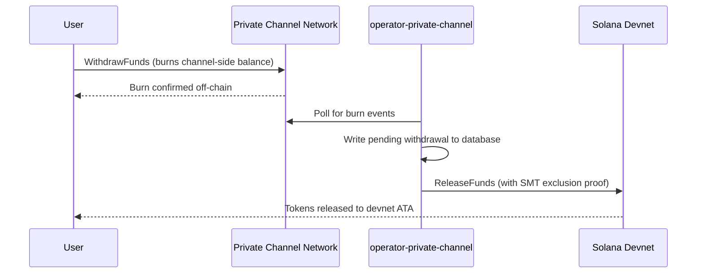

## نظرة عامة

يتكون السحب من القنوات الخاصة من خطوتين. أولاً، يقوم المستخدم بحرق رصيد الرموز المميزة على جانب القناة عن طريق استدعاء `WithdrawFunds` على برنامج السحب. ثانياً، يستدعي المشغّل `ReleaseFunds` على برنامج الضمان (devnet، في هذا الدليل التطبيقي) مع إثبات استبعاد Sparse Merkle Tree صالح لتحرير الأموال. يضمن إثبات SMT أن كل nonce سحب لا يمكن استخدامه إلا مرة واحدة، مما يمنع الإنفاق المزدوج.



## الخطوة 1: بدء عملية السحب على القناة

استدعِ `WithdrawFunds` على برنامج السحب لحرق رصيدك على جانب القناة.
استخدم المتغير `Async`، الذي يشتق تلقائياً PDA الخاص بـ `tokenAccount` وهو
الشكل الموصى به للاستخدام في بيئة الإنتاج:

```typescript
import { getWithdrawFundsInstructionAsync } from "../private-channel-withdraw-program/clients/typescript/src/generated";
import {
  createSolanaRpc,
  address,
  pipe,
  createTransactionMessage,
  setTransactionMessageFeePayerSigner,
  setTransactionMessageLifetimeUsingBlockhash,
  appendTransactionMessageInstruction,
  signAndSendTransactionMessageWithSigners,
  assertIsTransactionMessageWithSingleSendingSigner,
  getBase58Decoder
} from "@solana/kit";

// Point to the gateway, not a public Solana RPC
const privateChannelRpc = createSolanaRpc("http://localhost:8899");

const withdrawIx = await getWithdrawFundsInstructionAsync({
  user: userSigner,
  mint: address(mintAddress),
  amount: 1_000_000n, // 1 USDC (6 decimals)
  destination: null // null = release to signer's devnet wallet
});

const { value: latestBlockhash } = await privateChannelRpc
  .getLatestBlockhash({ commitment: "confirmed" })
  .send();

// Sent to the Private Channels gateway (not Solana RPC directly), which
// expects the legacy transaction format - do not switch this to version 0.
const transactionMessage = pipe(
  createTransactionMessage({ version: "legacy" }),
  (m) => setTransactionMessageFeePayerSigner(userSigner, m),
  (m) => setTransactionMessageLifetimeUsingBlockhash(latestBlockhash, m),
  (m) => appendTransactionMessageInstruction(withdrawIx, m)
);

assertIsTransactionMessageWithSingleSendingSigner(transactionMessage);

const signatureBytes =
  await signAndSendTransactionMessageWithSigners(transactionMessage);
const signature = getBase58Decoder().decode(signatureBytes);
console.log("Withdrawal initiated:", signature);
```

- معرّف برنامج السحب: `J231K9UEpS4y4KAPwGc4gsMNCjKFRMYcQBcjVW7vBhVi`
- أرسل هذه المعاملة إلى البوابة (`http://localhost:8899`)، وليس إلى
  نقطة اتصال RPC عامة بسولانا
- إذا تم توفير `destination`، فستذهب الأموال المحررة إلى تلك المحفظة بدلاً من
  محفظة الموقّع

## ما الذي يمكن توقعه

لا يلزم اتخاذ أي إجراء آخر بعد استدعاء `WithdrawFunds`. تتولى خدمات المشغّل
معالجة التسوية تلقائياً:

1. `indexer-private-channel` يستطلع القناة كل ثانية واحدة بحثاً عن أحداث الحرق
   ويكتب سجل سحب معلّق عند اكتشاف سحبك
2. `operator-private-channel` يستطلع قاعدة البيانات كل ثانية واحدة بحثاً عن
   السجلات المعلّقة ويرسل `ReleaseFunds` إلى برنامج الضمان على سولانا devnet
   مع إثبات استبعاد SMT المطلوب؛ ويستطلع تأكيد devnet حتى
   5 مرات بفواصل زمنية تبلغ 400 مللي ثانية قبل إعادة المحاولة

تظهر الأموال عادةً في محفظة devnet الخاصة بك في غضون ثوانٍ قليلة في الظروف الاعتيادية.

## كيفية تسوية المشغّل (مرجع)

بعد الحرق على جانب القناة، يجب على المشغّل المُزوَّد استدعاء `ReleaseFunds` على
برنامج الضمان مع إثبات استبعاد SMT صالح؛ لا يمكن للمشغّل تحرير
الأموال دون إثبات أن nonce السحب لم يُستخدم من قبل. تتم معالجة هذه الخطوة
تلقائياً بواسطة `operator-private-channel`؛ ولا تحتاج إلى استدعائها بنفسك.

يوفر المشغّل:

- `amount`: يجب أن يطابق المبلغ المحروق
- `user`: محفظة المستلم على devnet
- `new_withdrawal_root`: جذر SMT المحدَّث بعد هذا السحب
- `transaction_nonce`: nonce فريد لهذه الورقة
- `sibling_proofs`: 512 بايت (16 × تجزئة أشقاء بحجم 32 بايت لإثبات الشجرة)

## التحقق

بعد تأكيد استدعاء المشغّل، تحقق من رصيد رمزك المميز على devnet:

```bash
spl-token balance <MINT_ADDRESS> --owner <YOUR_WALLET>
```

أو عبر RPC:

```typescript
import { createSolanaRpc, address } from "@solana/kit";
import { findAssociatedTokenPda } from "@solana-program/token";

const TOKEN_PROGRAM_ADDRESS = address(
  "TokenkegQfeZyiNwAJbNbGKPFXCWuBvf9Ss623VQ5DA"
);

// Query devnet directly; ReleaseFunds settles here, not through the gateway
const rpc = createSolanaRpc("https://api.devnet.solana.com");

const [yourDevnetAta] = await findAssociatedTokenPda({
  mint: address(mintAddress),
  owner: address(userSigner.address),
  tokenProgram: TOKEN_PROGRAM_ADDRESS
});

const balance = await rpc.getTokenAccountBalance(yourDevnetAta).send();
console.log(balance.value.uiAmountString);
```

## لقد أتممت البدء السريع

لقد نفّذت دورة القنوات الخاصة الكاملة على devnet: أودعت رموز SPL في
الضمان، وأرسلت تحويلاً خارج السلسلة عبر البوابة، وسحبت الأموال
مرة أخرى إلى محفظة devnet الخاصة بك.

<Cards>
  <Card
    title="دورة حياة القناة"
    href="/docs/tools/private-channels/concepts/channels"
  >
    تعرّف على المشاركين وتدفق الإيداع حتى السحب بشكل معمّق.
  </Card>
  <Card
    title="المصادقة والأدوار"
    href="/docs/tools/private-channels/concepts/auth"
  >
    أضف مصادقة JWT إلى تكاملك.
  </Card>
  <Card
    title="مرجع تحرير الأموال"
    href="/docs/tools/private-channels/instructions/release-funds"
  >
    مرجع تعليمات ReleaseFunds الكاملة لأدوات المشغّل.
  </Card>
  <Card
    title="شجرة ميركل المتفرقة"
    href="/docs/tools/private-channels/concepts/smt"
  >
    تعرّف على كيفية منع إثباتات السحب للإنفاق المزدوج.
  </Card>
</Cards>
