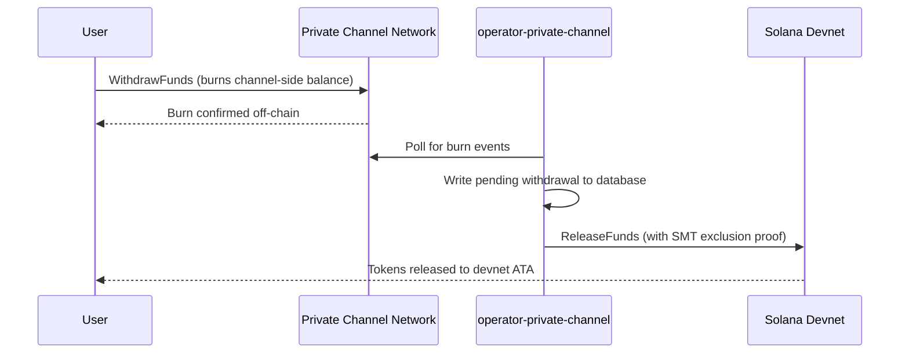

## نظرة عامة

عملية السحب من القنوات الخاصة تتكون من خطوتين. أولاً، يقوم المستخدم بحرق رصيد الرموز على جانب القناة عن طريق استدعاء `WithdrawFunds` على برنامج السحب. ثانياً، يستدعي المشغّل `ReleaseFunds` على برنامج الضمان (devnet، في هذا الشرح التفصيلي) مع دليل استثناء Sparse Merkle Tree صالح لتحرير الأموال. يضمن دليل SMT أن كل نونس سحب لا يمكن استخدامه إلا مرة واحدة، مما يمنع الإنفاق المزدوج.



## الخطوة 1: بدء السحب على القناة

استدعِ `WithdrawFunds` على برنامج السحب لحرق رصيدك على جانب القناة.
استخدم نوع `Async`، الذي يشتق تلقائياً عنوان `tokenAccount` PDA وهو
النموذج الموصى به للاستخدام في بيئة الإنتاج:

```typescript
import { getWithdrawFundsInstructionAsync } from "../private-channel-withdraw-program/clients/typescript/src/generated";
import {
  createSolanaRpc,
  address,
  pipe,
  createTransactionMessage,
  setTransactionMessageFeePayerSigner,
  setTransactionMessageLifetimeUsingBlockhash,
  appendTransactionMessageInstruction,
  signAndSendTransactionMessageWithSigners,
  assertIsTransactionMessageWithSingleSendingSigner,
  getBase58Decoder
} from "@solana/kit";

// Point to the gateway, not a public Solana RPC
const privateChannelRpc = createSolanaRpc("http://localhost:8899");

const withdrawIx = await getWithdrawFundsInstructionAsync({
  user: userSigner,
  mint: address(mintAddress),
  amount: 1_000_000n, // 1 USDC (6 decimals)
  destination: null // null = release to signer's devnet wallet
});

const { value: latestBlockhash } = await privateChannelRpc
  .getLatestBlockhash({ commitment: "confirmed" })
  .send();

// Sent to the Private Channels gateway (not Solana RPC directly), which
// expects the legacy transaction format - do not switch this to version 0.
const transactionMessage = pipe(
  createTransactionMessage({ version: "legacy" }),
  (m) => setTransactionMessageFeePayerSigner(userSigner, m),
  (m) => setTransactionMessageLifetimeUsingBlockhash(latestBlockhash, m),
  (m) => appendTransactionMessageInstruction(withdrawIx, m)
);

assertIsTransactionMessageWithSingleSendingSigner(transactionMessage);

const signatureBytes =
  await signAndSendTransactionMessageWithSigners(transactionMessage);
const signature = getBase58Decoder().decode(signatureBytes);
console.log("Withdrawal initiated:", signature);
```

- معرّف برنامج السحب: `J231K9UEpS4y4KAPwGc4gsMNCjKFRMYcQBcjVW7vBhVi`
- أرسل هذه المعاملة إلى البوابة (`http://localhost:8899`)، وليس إلى
  نقطة اتصال RPC عامة في سولانا
- إذا تم توفير `destination`، فستذهب الأموال المُحرَّرة إلى تلك المحفظة بدلاً من
  محفظة الموقّع

## ما الذي تتوقعه

لا يلزم اتخاذ أي إجراء إضافي بعد استدعاء `WithdrawFunds`. تتولى خدمات المشغّل
معالجة التسوية تلقائياً:

1. `indexer-private-channel` يستطلع القناة كل ثانية واحدة بحثاً عن أحداث الحرق
   ويكتب سجل سحب معلّق عند اكتشاف سحبك
2. `operator-private-channel` يستطلع قاعدة البيانات كل ثانية واحدة بحثاً عن السجلات
   المعلّقة ويرسل `ReleaseFunds` إلى برنامج الضمان على سولانا devnet
   مع دليل استثناء SMT المطلوب؛ ويستطلع تأكيد devnet حتى
   5 مرات بفاصل زمني 400 مللي ثانية قبل إعادة المحاولة

تظهر الأموال عادةً في محفظتك على devnet في غضون ثوانٍ قليلة في الظروف الاعتيادية.

## كيف يُسوِّي المشغّل (مرجع)

بعد حرق الرصيد على جانب القناة، يجب على مشغّل مُهيَّأ استدعاء `ReleaseFunds` على
برنامج الضمان مع دليل استثناء SMT صالح؛ لا يمكن للمشغّل تحرير
الأموال دون إثبات أن نونس السحب لم يُستخدم من قبل. تتم هذه الخطوة
تلقائياً بواسطة `operator-private-channel`؛ لا تحتاج إلى استدعائها بنفسك.

يوفر المشغّل:

- `amount`: يجب أن يتطابق مع المبلغ المحروق
- `user`: محفظة المستلم على devnet
- `new_withdrawal_root`: جذر SMT المحدَّث بعد هذا السحب
- `transaction_nonce`: نونس فريد لهذه الورقة
- `sibling_proofs`: 512 بايت (16 × 32 بايت من تجزئات الأشقاء لدليل الشجرة)

## التحقق

بعد تأكيد استدعاء المشغّل، تحقق من رصيد الرموز في devnet:

```bash
spl-token balance <MINT_ADDRESS> --owner <YOUR_WALLET>
```

أو عبر RPC:

```typescript
import { createSolanaRpc, address } from "@solana/kit";
import { findAssociatedTokenPda } from "@solana-program/token";

const TOKEN_PROGRAM_ADDRESS = address(
  "TokenkegQfeZyiNwAJbNbGKPFXCWuBvf9Ss623VQ5DA"
);

// Query devnet directly; ReleaseFunds settles here, not through the gateway
const rpc = createSolanaRpc("https://api.devnet.solana.com");

const [yourDevnetAta] = await findAssociatedTokenPda({
  mint: address(mintAddress),
  owner: address(userSigner.address),
  tokenProgram: TOKEN_PROGRAM_ADDRESS
});

const balance = await rpc.getTokenAccountBalance(yourDevnetAta).send();
console.log(balance.value.uiAmountString);
```

## لقد أكملت البداية السريعة

لقد نفّذت دورة القنوات الخاصة الكاملة على devnet: أودعت رموز SPL في
الضمان، وأرسلت تحويلاً خارج السلسلة عبر البوابة، وسحبت الأموال
مرة أخرى إلى محفظتك على devnet.

<Cards>
  <Card
    title="دورة حياة القناة"
    href="/docs/tools/private-channels/concepts/channels"
  >
    تعرّف على المشاركين وتدفق الإيداع حتى السحب بشكل معمّق.
  </Card>
  <Card
    title="المصادقة والأدوار"
    href="/docs/tools/private-channels/concepts/auth"
  >
    أضف مصادقة JWT إلى تكاملك.
  </Card>
  <Card
    title="مرجع تحرير الأموال"
    href="/docs/tools/private-channels/instructions/release-funds"
  >
    المرجع الكامل لتعليمة ReleaseFunds لأدوات المشغّل.
  </Card>
  <Card
    title="شجرة Merkle المتفرقة"
    href="/docs/tools/private-channels/concepts/smt"
  >
    تعرّف على كيفية منع أدلة السحب للإنفاق المزدوج.
  </Card>
</Cards>
