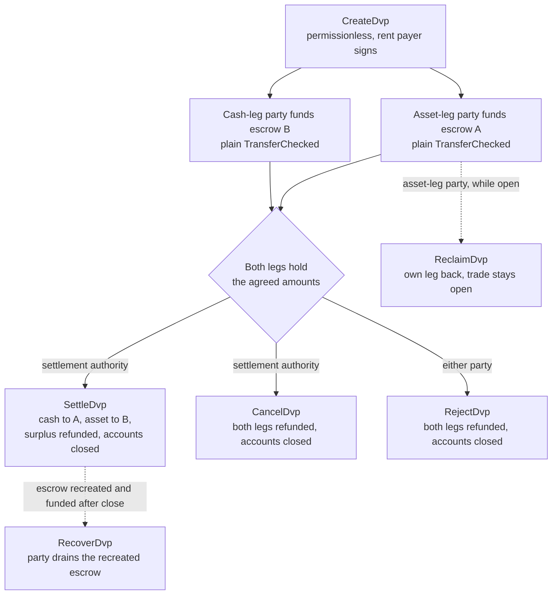
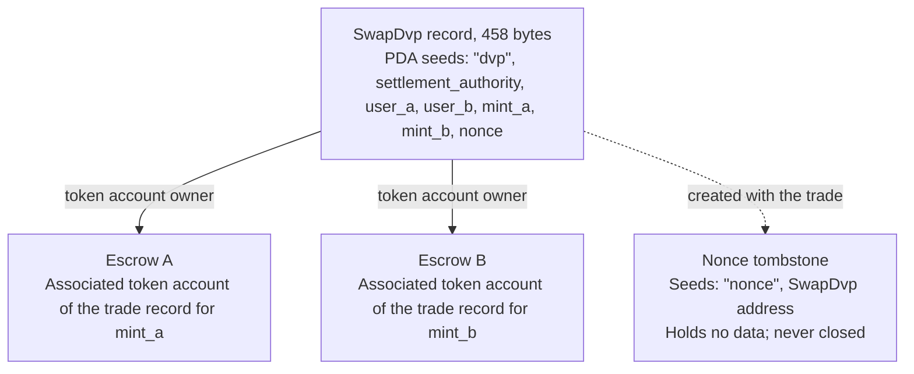

Das DvP-Programm ist das Standardprogramm für Delivery versus Payment (Lieferung gegen Zahlung) auf Solana,
gepflegt von der Solana Foundation und auditiert von Cantina. Zwei Parteien einigen sich auf
einen Trade, jede sendet ihr Leg per gewöhnlicher Token-Überweisung an ein Escrow-Konto,
und eine Settlement-Authority wickelt beide Legs in einer Transaktion ab, sodass
entweder beide bewegt werden oder keines. Die Settlement-Authority ist eine dritte Adresse,
die im Trade benannt wird, etwa die Handelsplattform oder der Agent, der ihn vermittelt hat. Keine der Parteien
schreibt oder deployt ein Programm, und eine Wallet oder ein Custodian, die bzw. der einen standardmäßigen
Token-Transfer (`TransferChecked`) senden kann, kann ein Leg ohne DvP-spezifische
Integration finanzieren. Bis zum Settlement kann jede Partei ihr eigenes Leg zurücknehmen oder den
Trade rückabwickeln.

<Callout type="warn" title="Den Record prüfen, bevor man darauf handelt">

Das Anlegen eines Trade-Records ist permissionless, daher ist ein Record kein Nachweis
einer Einigung. Vor dem Finanzieren liest jede Partei die gespeicherten Konditionen, und die Settlement-Authority
liest sie vor dem Settlement (siehe
[Verifizierung](#verification-before-funding-and-settlement)).

</Callout>

## So funktioniert es

Jeder Trade erhält einen programmeigenen Record und zwei Escrow-Konten, eines pro Leg. Die
Asset-Leg-Partei (`user_a`) und die Cash-Leg-Partei (`user_b`) finanzieren jeweils ein Leg, indem sie
Token auf das Escrow-Konto dieses Legs überweisen. Die Settlement-Authority ist der einzige Signer, der
das Settlement durchführen kann. Beim Settlement wird der vereinbarte Betrag jedes Legs an die
Gegenseite übertragen, ein etwaiger Überschuss geht an die Partei zurück, der das Leg gehört, und der Record
sowie beide Escrows werden geschlossen. Die Atomarität ergibt sich aus den
[Transaktionen](/docs/core/transactions) von Solana: Beide Transfers befinden sich in einer Transaktion,
sodass entweder beide wirksam werden oder keiner.

Jede Rückerstattung, Rücknahme und Rückgabe von Überschüssen geht an das eigene associated
token account der Partei: das Konto von `user_a` für `mint_a`, das von `user_b` für `mint_b`. Ein
Custodian oder Treasury-System kann ein Leg aus seinem eigenen Konto finanzieren, doch alles, was
zurückgegeben wird, landet im Konto der Partei, nicht beim Custodian. Jeder Trade
hinterlässt außerdem ein dauerhaftes Marker-Konto (siehe [Zustand](#state)).

## Anleitungen

Die Schrittseiten führen einen Trade von der Erstellung bis zum Settlement, mit TypeScript und
Rust für jede Anweisung.

<Cards>
  <Card title="Einen Trade erstellen" href="/docs/defi/dvp-program/create-a-trade">
    Die Clients installieren und die Konditionen des Trades mit CreateDvp erfassen
  </Card>
  <Card title="Die Legs finanzieren" href="/docs/defi/dvp-program/fund-the-legs">
    Die gespeicherten Konditionen prüfen, dann jedes Leg mit einem einfachen Transfer finanzieren
  </Card>
  <Card title="Den Trade abwickeln" href="/docs/defi/dvp-program/settle-the-trade">
    Beide Legs als Settlement-Authority in einer Transaktion abwickeln
  </Card>
  <Card title="Einen Trade rückabwickeln" href="/docs/defi/dvp-program/unwind-a-trade">
    Ein Leg zurückfordern, den Trade stornieren oder ablehnen und verspätete Einzahlungen zurückholen
  </Card>
</Cards>

Eine [Devnet-Demo](https://solana.com/delivery-vs-payment/demo) führt einen Trade von
Anfang bis Ende aus: Sie erstellt den Trade, finanziert beide Escrows mit standardmäßigen Token-Transfers und
wickelt beide Legs in einer Transaktion ab.

## Die Wahl zwischen Programm und Delegation

[Delivery vs Payment (DvP) mit Delegation](/docs/tokenization/dvp) wickelt
den gleichen Austausch ohne Programm ab: Jede Seite delegiert ihre Position an einen
Settlement-Agenten, der beide Legs in einer Transaktion bewegt.

- **Das Programm** benötigt keine Delegation, daher gilt die Begrenzung auf einen Delegate pro token
  account nicht, und die Settlement-Authority kann Erlöse nicht umleiten.
  Jeder Trade hängt von einem upgradefähigen Programm und dessen Upgrade-Authority ab.
- **Das Delegationsmuster** hat keine Programmabhängigkeit und funktioniert mit Mints, die
  Scaled UI Amount verwenden. Das Programm lehnt diese Mints ab, was jeden
  Mint ausschließt, der aus Mosaics `tokenized-security`-Template erstellt wurde (siehe
  [Einschränkungen der Mint-Konfiguration](#mint-configuration-constraints)).

## Rollen

Das Programm ist symmetrisch. In seiner Schnittstelle sind die beiden Parteien `user_a`, der
`mint_a` liefert, und `user_b`, der `mint_b` liefert. Die README und die
generierten Clients bezeichnen `mint_a` als Asset-Leg und `mint_b` als Cash-Leg, und
diese Seiten folgen dieser Konvention, aber nichts im Programm verlangt, dass das Cash-Leg
ein Cash-Instrument sein muss. Zwei Assets oder zwei Stablecoins werden auf dieselbe Weise
abgewickelt.

| Rolle                 | Wer                               | Signiert                                              | Hinweise                                                                                                                                                                                                     |
| -------------------- | --------------------------------- | -------------------------------------------------- | --------------------------------------------------------------------------------------------------------------------------------------------------------------------------------------------------------- |
| Asset-Leg-Partei      | `user_a`, liefert `mint_a`       | Die eigene Finanzierungsüberweisung; Reclaim, Reject, Recover | Eine keypair-Wallet oder eine PDA-basierte Smart Wallet wie ein Multisig-Vault. Ein SPL-Token-Multisig-Konto oder ein program account kann keine Partei sein: Create schlägt mit `PartyNotSignerCapable` fehl                   |
| Cash-Leg-Partei       | `user_b`, liefert `mint_b`       | Die eigene Finanzierungsüberweisung; Reclaim, Reject, Recover | Gleiche Anforderung                                                                                                                                                                                          |
| Settlement-Authority | Eine dritte Adresse, die bei der Erstellung benannt wird | Settle, Cancel                                     | Der einzige Signer, der das Settlement durchführen kann. Sie kann Erlöse nicht umleiten, da diese bei der Erstellung festgelegt werden. Sie erhält die rent der geschlossenen Konten, wenn sie das Settlement durchführt oder storniert                                         |
| Rent-Zahler           | Wer auch immer `CreateDvp` signiert         | Create                                             | Finanziert die rent (die SOL-Einlage, die ein Konto offen hält) für den Record, den Nonce-Tombstone und beide Escrows. Nicht als rent-Empfänger erfasst: Die rent geschlossener Konten geht an den, der den Trade schließt |

## Programm-ID

```text
dvp34bdbcEm4f4FCUjGV4mDAkDshaQR4LkK8fdcsyZq
```

| Cluster      | Programm                                       | Upgrade-Authority                              | Zuletzt bereitgestellter slot |
| ------------ | --------------------------------------------- | ---------------------------------------------- | ------------------ |
| mainnet-beta | `dvp34bdbcEm4f4FCUjGV4mDAkDshaQR4LkK8fdcsyZq` | `DXtFpbPjcn2hxPnw79x1Pfoj35vXh5AsWBkS37YnXMVv` | 452.058.374        |
| devnet       | `dvp34bdbcEm4f4FCUjGV4mDAkDshaQR4LkK8fdcsyZq` | `5EX1zFeJWj4rGYZv432WnYw8CbaSUeTdxPx4r573UgYU` | 479.376.863        |

Das Programm ist auf beiden Clustern upgradefähig. Die obigen Angaben entsprechen dem, was
`solana program show` am 2. Oktober 2026 gemeldet hat; für aktuelle Werte denselben Befehl
ausführen. Der Devnet-Build ist älter als der Commit, auf dem die Schrittseiten basieren
(siehe [Installation](/docs/defi/dvp-program/create-a-trade#install)),
mit demselben Satz an Anweisungen und Fehlern.

## Lebenszyklus



Ein Trade ist ab `CreateDvp` offen, bis Settle, Cancel oder Reject ihn
schließt. Das Finanzieren hat keine eigene Anweisung: Ein Leg gilt als finanziert, wenn sein Escrow-Konto
mindestens den vereinbarten Betrag enthält. Reclaim erfolgt pro Leg und lässt den
Trade offen, sodass ein Problem mit einem Leg die andere Partei nicht zwingt, den
gesamten Trade zu stornieren.

## Zustand

Jeder Trade hat ein `SwapDvp`-Konto mit 458 Bytes, das dem Programm gehört. Seine
Adresse wird aus der Settlement-Authority, den beiden Parteien, den beiden
Mints und einer Nonce abgeleitet (die Seeds
`["dvp", settlement_authority, user_a, user_b, mint_a, mint_b, nonce]`). Die
Beträge und Zeiten sind im Konto gespeichert und beeinflussen die Adresse nicht,
weshalb sie gelesen statt abgeleitet werden müssen. Ein kleines Marker-Konto,
der Nonce-Tombstone unter `["nonce", swap_dvp]`, wird mit dem Trade erstellt und
nie geschlossen, sodass jede Kombination aus Parteien, Mints, Authority und Nonce
nur für einen Trade verwendet werden kann.



| Feld                                  | Typ          | Bedeutung                                                                                                 |
| -------------------------------------- | ------------- | ------------------------------------------------------------------------------------------------------- |
| `bump`                                 | `u8`          | PDA-Bump                                                                                                |
| `user_a`, `user_b`                     | `Pubkey`      | Die beiden Parteien                                                                                         |
| `mint_a`, `mint_b`                     | `Pubkey`      | Die Mints des Asset-Legs und des Cash-Legs                                                                        |
| `settlement_authority`                 | `Pubkey`      | Der einzige Signer, der das Settlement durchführen oder stornieren kann                                                               |
| `token_program_a`, `token_program_b`   | `Pubkey`      | Das token program, dem jeder Mint gehört; ein Trade kann SPL-Token- und Token-2022-Legs mischen                    |
| `amount_a`, `amount_b`                 | `u64`         | Der vereinbarte Betrag jedes Legs in der kleinsten Einheit des Mints (Basiseinheiten)                                 |
| `expiry_timestamp`                     | `i64`         | Nach dieser Netzwerkzeit (der Onchain-Uhr) wird Settle abgelehnt. Reclaim, Cancel und Reject funktionieren weiterhin |
| `nonce`                                | `u64`         | Unterscheidet Trades, die die übrigen Seeds teilen. Einmalverwendung                                             |
| `ref_string`                           | `[u8; 64]`    | Eine opake Client-Referenz, mit Nullen aufgefüllt; das Programm liest sie nie                                     |
| `user_a_settlement_destination`        | `Pubkey`      | Erhält das Cash-Leg bei Settle; Standardwert ist `user_a`                                                   |
| `user_b_settlement_destination`        | `Pubkey`      | Erhält das Asset-Leg bei Settle; Standardwert ist `user_b`                                                  |
| `mint_a_authority`, `mint_b_authority` | `Pubkey`      | Die bei der Erstellung erfassten Mint-Authorities; Settle schlägt fehl, wenn sich eine davon geändert hat                           |
| `earliest_settlement_timestamp`        | `Option<i64>` | Falls gesetzt, wird Settle vor dieser Netzwerkzeit abgelehnt                                                     |

Die Feldliste stammt aus der IDL des Programms im Commit, der unter
[Einen Trade erstellen](/docs/defi/dvp-program/create-a-trade#install) genannt wird.

## Anweisungen

| Anweisung  | Signer               | Wirkung                                                                                                                                                              |
| ------------ | -------------------- | ------------------------------------------------------------------------------------------------------------------------------------------------------------------- |
| `CreateDvp`  | Beliebiger Payer            | Erstellt den `SwapDvp`-Record, seinen Nonce-Tombstone und beide Escrow-Konten. Bewegt keine Token                                                                        |
| `ReclaimDvp` | `user_a` oder `user_b` | Gibt das eigene Leg des Signers aus dem Escrow zurück. Der Trade bleibt offen und das Leg kann erneut finanziert werden                                                                      |
| `SettleDvp`  | Settlement-Authority | Überträgt `amount_a` an das Ziel von `user_b` und `amount_b` an das Ziel von `user_a`, gibt einen etwaigen Überschuss an die Partei des Legs zurück, schließt den Record und beide Escrows |
| `CancelDvp`  | Settlement-Authority | Erstattet, was Escrow A hält, an `user_a` und Escrow B an `user_b`, schließt den Record und beide Escrows                                                            |
| `RejectDvp`  | `user_a` oder `user_b` | Gleiche Wirkung wie Cancel, von einer Partei signiert                                                                                                                            |
| `RecoverDvp` | `user_a` oder `user_b` | Nach Schließung des Trades: Leert ein neu erstelltes Escrow auf das eigene token account des Signers und schließt es. Deckt eine Einzahlung ab, die nach Settle, Cancel oder Reject eingegangen ist  |

Jede Rückerstattung geht an das eigene associated token account der Partei für den Mint
dieses Legs, unabhängig davon, wer das Escrow finanziert hat.

Die Konten und Argumente jeder Anweisung stehen auf der Seite des jeweiligen Schritts.

## Fehler

| Code | Fehler                            | Wann                                                                                                   |
| ---- | -------------------------------- | ------------------------------------------------------------------------------------------------------ |
| 0    | `SignerNotParty`                 | Reclaim, Reject oder Recover, signiert von einer Adresse, die nicht `user_a` oder `user_b` ist                      |
| 1    | `DvpExpired`                     | Settle nach `expiry_timestamp`                                                                        |
| 2    | `SettlementAuthorityMismatch`    | Settle oder Cancel, signiert von einer anderen Adresse als der Settlement-Authority                              |
| 3    | `SettlementTooEarly`             | Settle vor `earliest_settlement_timestamp`                                                          |
| 4    | `LegNotFunded`                   | Settle, während ein Escrow weniger als den vereinbarten Betrag hält                                               |
| 5    | `ExpiryNotInFuture`              | Create mit einem Ablaufzeitpunkt, der der aktuellen Netzwerkzeit entspricht oder davor liegt                                            |
| 6    | `EarliestAfterExpiry`            | Create mit einem frühesten Settlement-Zeitpunkt nach dem Ablauf                                               |
| 7    | `SelfDvp`                        | Create mit `user_a` gleich `user_b`                                                                 |
| 8    | `SameMint`                       | Create mit `mint_a` gleich `mint_b`                                                                 |
| 9    | `ZeroAmount`                     | Create mit einem Betrag von null bei einem der Legs                                                                |
| 10   | `BlockedMintExtension`           | Create oder Settle mit einem Mint, der die Erweiterung TransferFee, InterestBearing, ScaledUiAmount oder NonTransferable aufweist |
| 11   | `SettlementAuthorityIsParty`     | Create, wobei die Settlement-Authority einer Partei entspricht                                                  |
| 12   | `SettlementAuthorityExecutable`  | Create mit einer ausführbaren Settlement-Authority                                                         |
| 13   | `NonceAlreadyUsed`               | Create mit Wiederverwendung eines `(seeds, nonce)`, für das bereits ein Tombstone existiert                                         |
| 14   | `ExpiryTooFarInFuture`           | Create mit einem Ablaufzeitpunkt, der mehr als ein Jahr in der Zukunft liegt                                                         |
| 15   | `RefStringTooLong`               | Create mit einer Referenz, die länger als 64 Bytes ist                                                           |
| 16   | `DvpStillOpen`                   | Recover, während der Trade noch offen ist; stattdessen Reclaim verwenden                                                     |
| 17   | `DvpNeverCreated`                | Mit Seeds wiederherstellen, für die kein Tombstone existiert                                                              |
| 18   | `EscrowPreloadedWithLamports`    | Create, wenn ein nicht-nativer Escrow lamports oberhalb seines rent-exempt-Minimums hält                           |
| 19   | `SettlementDestinationIsSwapDvp` | Create mit einem Settlement-Ziel, das dem Trade-Datensatz entspricht                                         |
| 20   | `SwapDvpPreloadedWithLamports`   | Create, wenn die Datensatzadresse lamports oberhalb ihrer rent-Reserve hält                                   |
| 21   | `RecipientAtaMismatch`           | Ein token account für Empfänger oder Rückerstattung gehört nicht mehr zur erwarteten Wallet und zum erwarteten Mint                  |
| 22   | `PartyNotSignerCapable`          | Create mit einer Partei, die kein systemeigenes, nicht ausführbares Konto ist                                 |
| 23   | `MintAuthorityChanged`           | Settle, wenn sich die Mint Authority eines Legs von dem bei der Erstellung erfassten Wert unterscheidet                         |

## Events und Indexierung

Das Programm gibt keine Onchain-Events aus. Ein Indexer oder Abgleichssystem liest
den Zustand des `SwapDvp`-Kontos und die Token-Guthaben der beiden Escrows und nutzt
`ref_string`, um einen Trade der zugehörigen Off-Chain-Order zuzuordnen. Da der Datensatz
bei der Settlement geschlossen wird, speichert ein System, das die Konditionen nachträglich
benötigt, diese beim Auslesen oder rekonstruiert sie aus der Transaktion, die den
Trade erstellt hat.

## Unterstützte Token

Ein Trade kann ein SPL-Token-Leg mit einem Token-2022-Leg kombinieren; jedes Leg bringt sein
eigenes Token Program mit. Wrapped-SOL-Legs werden unterstützt.

| Token-2022-Extension auf dem Mint eines Legs                                                     | Verhalten des Programms                                                  |
| ---------------------------------------------------------------------------------------- | ----------------------------------------------------------------- |
| TransferFee, InterestBearing, ScaledUiAmount, NonTransferable                            | Wird bei Create und Settle mit `BlockedMintExtension` abgelehnt         |
| PermanentDelegate, Pausable, DefaultAccountState, eine Freeze Authority, MintCloseAuthority | Akzeptiert; jede Authority kann auf die verwahrten Token einwirken           |
| ConfidentialTransfer                                                                     | Akzeptiert; Beträge auf diesem Leg sind öffentlich                          |
| TransferHook                                                                             | Unterstützt, bis zu 32 zusätzliche Konten pro Leg                        |
| MemoTransfer auf einem Ziel- oder Rückerstattungskonto                                          | Akzeptiert; das Programm gibt das erforderliche Memo vor der Übertragung aus |

Eine Transfergebühr würde dazu führen, dass die empfangende Seite weniger als den vereinbarten Betrag erhält.
Interest Bearing und Scaled UI Amount ändern die Rohbeträge nicht, aber ihr Zinssatz
bzw. Multiplikator kann sich zwischen Erstellung und Settlement eines Trades ändern, wodurch sich
die Anzeige der vereinbarten Beträge ändert. NonTransferable würde beide Legs blockieren.

Die akzeptierten Authorities können die verwahrten Token während der gesamten Laufzeit des Trades
bewegen, einfrieren oder anhalten (siehe unten). Der Escrow kann nicht für den Empfang
vertraulicher Übertragungen konfiguriert werden, daher sind die verwahrten und abgewickelten Beträge auf einem
vertraulichen Leg öffentlich.

Bei einem Mint mit Hook löst der Client die zusätzlichen Konten des Hooks auf und hängt
sie an Settle, Cancel, Reject, Reclaim und Recover an. Das Limit von 32 pro Leg
umfasst das Hook-Programm und sein Validierungskonto. Wenn die Hook Authority
die Kontoliste des Hooks über dieses Limit hinaus erweitert, schlägt jede Übertragung auf diesem Leg
fehl, einschließlich Reclaim, Cancel, Reject und Recover, bis die Authority
dies rückgängig macht. Das Kontolimit der Transaktion kann greifen, bevor das Limit pro Leg erreicht ist, wenn
beide Legs Hooks verwenden.

Wenn ein Ziel- oder Rückerstattungskonto Memos verlangt, ruft das Programm vor der Übertragung das Memo-
Programm auf. Deshalb benötigt jede Anweisung, die Token
aus dem Escrow bewegt, ein `memo_program`-Konto.

### Einschränkungen bei der Mint-Konfiguration

**Scaled UI Amount.** Die `tokenized-security`-Vorlage in
[Mosaic](https://github.com/solana-foundation/mosaic), dem Issuance-Toolkit der Solana Foundation,
fügt immer Scaled UI Amount hinzu, daher akzeptiert das Programm keinen
aus dieser Vorlage erstellten Mint als Leg. Ein Mint für dieses Programm kann
ohne die Extension erstellt werden (siehe
[Token Extensions](/docs/tokens/extensions));
[DvP mit Delegation](/docs/tokenization/dvp) wird über delegierte
Berechtigung abgewickelt und wendet diese Prüfung nicht an.

**Standardmäßig eingefrorene Mints.** Der Escrow jedes Trades ist ein associated token account,
der einer Program Derived Address gehört, die für diesen Trade neu ist. Bei einem Mint mit
Default Account State „frozen“ wird der Escrow eingefroren erstellt, und eine Finanzierungs-
übertragung dorthin schlägt fehl, bis er aufgetaut wird. Unter
[Token ACL](/docs/tokenization/token-acl) bedeutet das, dass der Emittent oder sein Transfer
Agent den Escrow des Trades vor der Finanzierung freigibt: entweder indem die Adresse des Trade-
Datensatzes (der Eigentümer des Escrows) zur Allowlist hinzugefügt wird, sodass jeder den
Escrow auftauen kann, sofern die Token-ACL-Konfiguration des Mints permissionless thaw aktiviert, oder indem
die Freeze Authority ihn direkt auftaut. Ein eingefrorener Escrow blockiert außerdem
Settle, Reclaim, Cancel, Reject und Recover auf diesem Leg, sodass die Freeze
Authority und bei einem Mint mit Hook die Hook Authority für die Laufzeit des
Trades eine vertrauenswürdige Partei ist. Der Pfad mit eingefrorenem Escrow wird hier beschrieben und in
den Devnet-Snippets nicht ausgeführt.

## Grenzen

- Kein Matching, keine Preisfindung und kein Orderbuch. Die Parteien vereinbaren die Konditionen außerhalb
  des Ledgers, und eine von ihnen erfasst sie.
- Kein Netting, nur bilateral: Ein Datensatz ist ein Trade zwischen zwei Parteien.
- Keine Teilausführungen. Settle bewegt genau den vereinbarten Betrag jedes Legs und
  gibt einen etwaigen Überschuss an die Partei des Legs zurück.
- Kein Off-Ledger-Leg. Beide Legs sind token accounts auf Solana; ein Cash-Leg über
  bestehende Rails wird separat abgewickelt und abgeglichen.
- Keine Berechtigungsprüfung, Allowlist oder KYC. Die eigenen Kontrollen des Mints setzen die
  Berechtigung der Inhaber durch.
- Keine automatische Settlement. Die Settlement Authority muss signieren.
- Keine Events und keine Protokoll-Fee über die Transaktions-Fee und rent hinaus.

Das Programm beseitigt das Principal Risk zwischen den beiden Parteien: Kein Leg wird bewegt,
es sei denn, beide werden bewegt. Es beseitigt weder das Emittenten-Kredit- oder Rückzahlungsrisiko bei einem der
Token, noch die Möglichkeit der Freeze-, Pause- oder Permanent-Delegate-Authority eines Mints,
auf verwahrte Token einzuwirken (siehe [unterstützte Token](#supported-tokens)), noch die
Abhängigkeit davon, dass die Settlement Authority zum Signieren verfügbar ist.

## Überprüfung vor Finanzierung und Settlement

`CreateDvp` ist permissionless: Nur der Payer signiert, die Parteien und die
Settlement Authority nicht. Daher kann jeder einen Datensatz mit beliebigen
Parteien und Konditionen erstellen. Lesen Sie vor der Finanzierung und erneut vor dem Settlement das
`SwapDvp`-Konto aus und bestätigen Sie:

1. Das Konto gehört dem DvP-Programm und ist genau 458 Bytes groß. Ein Konto,
   das nicht dem Programm gehört, kann mit Bytes gefüllt sein, die sich wie ein
   echter Datensatz dekodieren lassen.
2. `user_a`, `user_b`, `mint_a`, `mint_b` und `settlement_authority` stimmen mit dem
   vereinbarten Trade überein.
3. `amount_a`, `amount_b`, `expiry_timestamp` und
   `earliest_settlement_timestamp` stimmen mit den vereinbarten Konditionen überein.
4. Beide Settlement-Ziele sind die vereinbarten Adressen. Ein gefälschter Datensatz kann
   Erlöse umleiten.

[Die Legs finanzieren](/docs/defi/dvp-program/fund-the-legs#verify-the-terms) listet die
Geprüfte-Reader der generierten Clients auf und zeigt die Prüfung im Code.

Betrachten Sie einen Trade als abgewickelt, wenn die Settle-Transaktion
[`finalized`](/docs/rpc#configuring-state-commitment) erreicht. Das ist ein Commitment-Level
des Netzwerks; ob es auch die Settlement Finality im rechtlichen Sinne markiert,
hängt von den Vereinbarungen der Parteien und den geltenden Rechtsordnungen ab.

## Versionierung

Das `SwapDvp`-Konto enthält kein Versionsfeld. Sein Layout ist auf 458 Bytes festgelegt
(`SwapDvp::LEN`), und die geprüften Reader lehnen ein Konto mit jeder anderen Länge ab.
Das IDL trägt eine eigene Version, `0.1.0` (Stand 2. Oktober 2026).

Das Programm ist auf beiden Clustern upgradefähig (siehe [Program ID](#program-id)). Ein
Trade-Datensatz existiert nur, bis er abgewickelt, storniert oder abgelehnt wird. Prüfen Sie daher
im Repository, wie ein Upgrade offene Trades behandelt, und generieren Sie Clients
neu aus dem IDL des bereitgestellten Builds.

## Repository und Audit

Quellcode, IDL, generierte Clients und Tests befinden sich in
[`solana-foundation/dvp`](https://github.com/solana-foundation/dvp) unter der
MIT-Lizenz. Das Programm ist ein `no_std`-Pinocchio-Programm; die Clients werden
aus dem IDL mit Codama generiert. Meldungen zu Sicherheitslücken laufen über den Security-Advisory-Link
des Repositorys, gemäß dessen `SECURITY.md`.

Das Programm wurde von
[Cantina](https://cantina.xyz/portfolio/fe870bb4-d96d-4902-8aec-9dfcfa2d6a79) auditiert.

## Verwandte Themen

- [Delivery vs Payment (DvP) mit Delegation](/docs/tokenization/dvp): das
  Delegationsmuster ohne Programm
- [Token ACL](/docs/tokenization/token-acl): wie ein Gated Mint mit den
  Escrow-Konten interagiert
