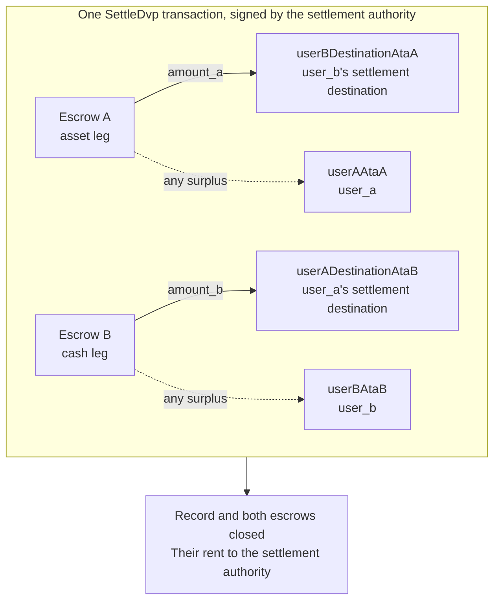

`SettleDvp` wird von der im Trade-Datensatz genannten Settlement-Authority signiert. In
einer Transaktion überträgt es `amount_a` des Asset-Legs an das Ziel der Partei des Cash-Legs
und `amount_b` des Cash-Legs an das Ziel der Partei des Asset-Legs,
gibt jeden Überschuss in einem der Escrows an die Partei des jeweiligen Legs zurück und schließt den Datensatz
sowie beide Escrows. Kann eine dieser Überweisungen nicht abgeschlossen werden, schlägt die Anweisung
fehl und es wird nichts bewegt.

Diese Seite setzt [Trade erstellen](/docs/defi/dvp-program/create-a-trade)
und [Legs finanzieren](/docs/defi/dvp-program/fund-the-legs) fort; Client, Signer,
`trade` und die token accounts der Parteien werden übernommen.

## Vor dem Signieren erneut validieren

Die Settlement-Authority signiert die Transaktion, die beide Legs bewegt, und
führt daher vor dem Signieren dieselbe Prüfung durch wie jede Partei: Owner, Größe, Parteien,
Mints, Beträge, Ablauf und beide Ziele (siehe
[Legs finanzieren](/docs/defi/dvp-program/fund-the-legs#verify-the-terms)). Das
Programm selbst prüft bei der Abwicklung erneut, dass jeder Mint weiterhin zu dem bei der Erstellung erfassten
token program gehört, keine gesperrte Extension trägt und dieselbe
Mint-Authority hat wie bei der Erstellung des Trades. Ein Mint, der mit einer gesperrten
Extension, einem anderen token program oder einer anderen Mint-Authority neu erstellt wurde, kann daher nicht
abgewickelt werden.

## Empfänger-Konten erstellen

Settle schreibt in vier token accounts, die das Programm nicht erstellt:

| Konten                | Empfängt                     | Owner                           |
| ---------------------- | ---------------------------- | ------------------------------- |
| `userADestinationAtaB` | Das Cash-Leg (`amount_b`)    | `user_a_settlement_destination` |
| `userBDestinationAtaA` | Das Asset-Leg (`amount_a`)   | `user_b_settlement_destination` |
| `userAAtaA`            | Jeder Überschuss im Asset-Leg | `user_a`                        |
| `userBAtaB`            | Jeder Überschuss im Cash-Leg  | `user_b`                        |

Die Überschuss-Konten werden nur verwendet, wenn ein Escrow mehr als den vereinbarten
Betrag enthält. Jeder, der Token dieses Mints besitzt, kann jedoch einen Überschuss erzeugen, indem er einige Basis-
einheiten in den Escrow sendet. Existiert das Rückerstattungskonto nicht, schlägt der gesamte
Settle fehl. Daher sollten alle vier idempotent in derselben Transaktion erstellt werden.

<Tabs items={["TypeScript", "Rust"]}>
  <Tab value="TypeScript">
    ```ts
    import {
      findAssociatedTokenPda,
      getCreateAssociatedTokenIdempotentInstruction,
    } from "@solana-program/token-2022";

    const destinationA = t.userASettlementDestination; // defaults to userA
    const destinationB = t.userBSettlementDestination; // defaults to userB

    const [userADestinationAtaB] = await findAssociatedTokenPda({
      mint: mintB,
      owner: destinationA,
      tokenProgram: tokenProgramB,
    });
    const [userBDestinationAtaA] = await findAssociatedTokenPda({
      mint: mintA,
      owner: destinationB,
      tokenProgram: tokenProgramA,
    });
    // userAAtaA and userBAtaB are from fund the legs.

    const createRecipientAccounts = [
      { ata: userADestinationAtaB, owner: destinationA, mint: mintB, tokenProgram: tokenProgramB },
      { ata: userBDestinationAtaA, owner: destinationB, mint: mintA, tokenProgram: tokenProgramA },
      { ata: userAAtaA, owner: userA, mint: mintA, tokenProgram: tokenProgramA },
      { ata: userBAtaB, owner: userB, mint: mintB, tokenProgram: tokenProgramB },
    ].map(({ ata, owner, mint, tokenProgram }) =>
      getCreateAssociatedTokenIdempotentInstruction({
        payer: authoritySigner,
        ata,
        owner,
        mint,
        tokenProgram,
      }),
    );
    ```

  </Tab>

  <Tab value="Rust">
    ```rust
    use spl_associated_token_account_client::address::get_associated_token_address_with_program_id;
    use spl_associated_token_account_client::instruction::create_associated_token_account_idempotent;

    let authority: Pubkey = pubkey!("SETTLEMENT_AUTHORITY_ADDRESS_HERE");
    let destination_a = trade.user_a_settlement_destination; // defaults to user_a
    let destination_b = trade.user_b_settlement_destination; // defaults to user_b

    let user_a_destination_ata_b =
        get_associated_token_address_with_program_id(&destination_a, &mint_b, &token_program_b);
    let user_b_destination_ata_a =
        get_associated_token_address_with_program_id(&destination_b, &mint_a, &token_program_a);
    let user_a_ata_a = get_associated_token_address_with_program_id(&user_a, &mint_a, &token_program_a);
    let user_b_ata_b = get_associated_token_address_with_program_id(&user_b, &mint_b, &token_program_b);

    let create_recipient_accounts = [
        create_associated_token_account_idempotent(&authority, &destination_a, &mint_b, &token_program_b),
        create_associated_token_account_idempotent(&authority, &destination_b, &mint_a, &token_program_a),
        create_associated_token_account_idempotent(&authority, &user_a, &mint_a, &token_program_a),
        create_associated_token_account_idempotent(&authority, &user_b, &mint_b, &token_program_b),
    ];
    ```

  </Tab>
</Tabs>

## Settle

`legAExtrasCount` teilt dem Programm mit, wie viele der nach der
festen Liste angehängten Konten zum Transfer Hook des Asset-Legs gehören; der Rest gehört zu dem
des Cash-Legs. Bei Mints ohne Transfer Hooks wird null übergeben und nichts angehängt. Das Memo
program account wird von der Anweisung benötigt und nur für Ziele verwendet,
die ein Memo erfordern.

<Tabs items={["TypeScript", "Rust"]}>
  <Tab value="TypeScript">
    ```ts
    import { MEMO_PROGRAM_ADDRESS } from "@solana-program/memo";
    import { getSettleDvpInstruction } from "./dvp";

    const settleInstruction = getSettleDvpInstruction({
      settlementAuthority: authoritySigner,
      swapDvp,
      mintA,
      mintB,
      dvpAtaA: escrowA,
      dvpAtaB: escrowB,
      userADestinationAtaB,
      userBDestinationAtaA,
      userAAtaA,
      userBAtaB,
      tokenProgramA,
      tokenProgramB,
      memoProgram: MEMO_PROGRAM_ADDRESS,
      legAExtrasCount: 0,
    });

    const { context: settleContext } = await client.sendTransaction([
      ...createRecipientAccounts,
      settleInstruction,
    ]);
    const settleSignature = settleContext.signature;
    console.log("Submitted:", settleSignature);

    // sendTransaction returns at the client's commitment (confirmed by default).
    // Wait for finalized before recording the trade as settled.
    let finalized = false;
    for (let attempt = 0; attempt < 30 && !finalized; attempt++) {
      const {
        value: [status],
      } = await client.rpc.getSignatureStatuses([settleSignature]).send();
      if (status?.err) {
        throw new Error("Settle transaction failed");
      }
      finalized = status?.confirmationStatus === "finalized";
      if (!finalized) {
        await new Promise((resolve) => setTimeout(resolve, 2_000));
      }
    }
    if (!finalized) {
      // A closed record means it settled; an open one is safe to settle again.
      throw new Error("Settle not finalized after 60s; read the trade record");
    }
    console.log("Settled:", settleSignature);
    ```

  </Tab>

  <Tab value="Rust">
    ```rust
    use dvp_swap_program_client::instructions::SettleDvpBuilder;

    const MEMO_PROGRAM_ID: Pubkey = pubkey!("MemoSq4gqABAXKb96qnH8TysNcWxMyWCqXgDLGmfcHr");

    let settle_ix = SettleDvpBuilder::new()
        .settlement_authority(authority)
        .swap_dvp(swap_dvp)
        .mint_a(mint_a)
        .mint_b(mint_b)
        .dvp_ata_a(escrow_a)
        .dvp_ata_b(escrow_b)
        .user_a_destination_ata_b(user_a_destination_ata_b)
        .user_b_destination_ata_a(user_b_destination_ata_a)
        .user_a_ata_a(user_a_ata_a)
        .user_b_ata_b(user_b_ata_b)
        .token_program_a(token_program_a)
        .token_program_b(token_program_b)
        .memo_program(MEMO_PROGRAM_ID)
        .leg_a_extras_count(0)
        .instruction();
    ```

  </Tab>
</Tabs>



### Transfer Hooks

Die generierte IDL listet nur die festen Konten auf, daher kennen die generierten Builder
die Hook-Konten nicht. Die zusätzlichen Konto-Metas jedes Hook-Mints werden auf
dieselbe Weise aufgelöst wie bei einem direkten Transfer dieses Tokens und anschließend an die
Anweisung angehängt: zuerst die Konten des Asset-Legs, dann die des Cash-Legs, wobei
`legAExtrasCount` auf die Anzahl der ersten Gruppe gesetzt wird. In TypeScript werden
die aufgelösten Metas in das `accounts`-Array der Anweisung gespreadet; in Rust wird
`add_remaining_accounts` am Builder verwendet. Das Limit liegt bei 32 Konten pro Leg,
einschließlich des Hook-Programms und des Validierungskontos; das Konten-Limit der Transaktion
kann zuerst greifen, wenn beide Legs Hooks tragen. Das Programm entfernt das Signer-Flag
von jedem weitergeleiteten Konto, sodass ein Hook über diesen Pfad nicht die
Signatur der Settlement-Authority erlangen kann.

## Ergebnis erfassen

Der Trade gilt als abgewickelt, sobald die Settle-Transaktion `finalized` erreicht. Der
Datensatz und beide Escrows existieren nach der Abwicklung nicht mehr; ein System, das
die Bedingungen später benötigt, speichert sie daher aus der Prüfung vor der Abwicklung oder aus der Erstellungs-
transaktion. Die rent der geschlossenen Konten ist an die Settlement-Authority
gegangen.

## Settle-Fehler

`LegNotFunded` bedeutet, dass ein Escrow weniger als den vereinbarten Betrag enthält; `DvpExpired`
und `SettlementTooEarly` bedeuten, dass das Zeitfenster verpasst wurde; `MintAuthorityChanged`
und `BlockedMintExtension` bedeuten, dass sich ein Mint nach der Erstellung geändert hat;
`RecipientAtaMismatch` bedeutet, dass ein Ziel- oder Rückerstattungs-token account fehlt oder
nicht mehr dem erwarteten Owner und Mint gehört, meist weil der oben beschriebene
Schritt zum Erstellen der Konten übersprungen wurde. In jedem Fall wurde nichts bewegt, und die
Parteien können rückabwickeln, vorbehaltlich der Authorities des Mints (siehe
[Trade rückabwickeln](/docs/defi/dvp-program/unwind-a-trade)).

## Nächste Schritte

- [Trade rückabwickeln](/docs/defi/dvp-program/unwind-a-trade): Wiederherstellung finanzierter
  Legs, wenn ein Trade nicht abgewickelt wird
