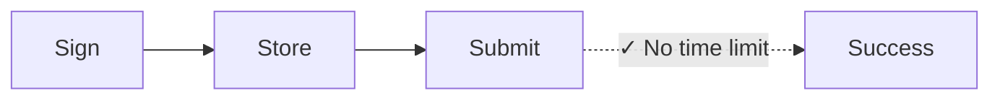
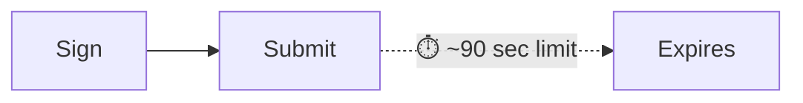

Jede Solana-Transaktion enthält einen aktuellen Blockhash – ein Verweis auf
einen aktuellen Netzwerkstatus, der beweist, dass die Transaktion "jetzt"
erstellt wurde. Das Netzwerk lehnt jede Transaktion mit einem Blockhash ab, der
älter als ca. 150 Blöcke (etwa 60–90 Sekunden) ist, um Replay-Angriffe und
veraltete Einreichungen zu verhindern. Das funktioniert perfekt für
Echtzeitzahlungen. Aber es scheitert bei Workflows, die eine Lücke zwischen
Signatur und Einreichung benötigen, wie zum Beispiel:

| Szenario                   | Warum Standard-Transaktionen scheitern                                         |
| -------------------------- | ------------------------------------------------------------------------------ |
| **Treasury-Operationen**   | CFO in Tokio signiert, Controller in NYC genehmigt – 90 Sekunden reichen nicht |
| **Compliance-Workflows**   | Transaktionen müssen vor der Ausführung rechtlich/compliance-geprüft werden    |
| **Cold Storage Signing**   | Air-gapped Maschinen erfordern manuellen Transfer signierter Transaktionen     |
| **Batch-Vorbereitung**     | Lohn- oder Auszahlungslisten tagsüber vorbereiten, nachts ausführen            |
| **Multi-Sig-Koordination** | Mehrere Genehmiger über verschiedene Zeitzonen hinweg                          |
| **Geplante Zahlungen**     | Zahlungen zur Ausführung an einem zukünftigen Datum terminieren                |

Im traditionellen Finanzwesen verfällt ein unterschriebener Scheck nicht nach 90
Sekunden. Bestimmte Blockchain-Operationen sollten das auch nicht. **Dauerhafte
Nonces** lösen dieses Problem, indem sie den aktuellen Blockhash durch einen
gespeicherten, persistenten Wert ersetzen, der sich nur beim Verwenden
weiterentwickelt – so bleiben Transaktionen gültig, bis Sie sie einreichen
möchten.

## Funktionsweise

Anstelle eines aktuellen Blockhash (gültig für ~150 Blöcke) verwenden Sie ein
**Nonce-Konto**, ein spezielles Konto, das einen _eindeutigen_ Wert speichert,
der anstelle eines Blockhash verwendet werden kann. Jede Transaktion, die diesen
Nonce verwendet, muss ihn als erste Anweisung "fortschreiten" lassen. Jeder
Nonce-Wert kann nur für eine Transaktion verwendet werden.





<Callout type="info">
  Das Nonce-Konto kostet ~0,0015 SOL für die Mietbefreiung. Ein Nonce-Konto =
  eine ausstehende Transaktion gleichzeitig. Für parallele Workflows erstellen
  Sie mehrere Nonce-Konten.
</Callout>

### Ein Nonce-Konto erstellen

Das Erstellen eines Nonce-Kontos erfordert zwei Anweisungen in einer einzigen
Transaktion:

1. **Erstellen Sie das Konto** mit `getCreateAccountInstruction` aus dem System
   Program
2. **Initialisieren Sie es als Nonce** mit
   `getInitializeNonceAccountInstruction`

<ScrollyCoding>

## !!steps Keypair generieren

Generieren Sie ein neues Keypair, das als Nonce-Kontoadresse verwendet wird, und
berechnen Sie den erforderlichen Speicherplatz und die Miete.

<CodePlaceholder title="Create Nonce Account" />

```ts !! title="Create Nonce Account"
const nonceKeypair = await generateKeyPairSigner();
const nonceSpace = BigInt(getNonceSize());
const nonceRent = await rpc
  .getMinimumBalanceForRentExemption(nonceSpace)
  .send();
```

## !!steps Konto-Anweisung erstellen

Erstellen Sie das Konto im Besitz des System Program mit ausreichend Lamports
für die Mietbefreiung.

<CodePlaceholder title="Create Nonce Account" />

```ts !! title="Create Nonce Account"
const nonceKeypair = await generateKeyPairSigner();
const nonceSpace = BigInt(getNonceSize());
const nonceRent = await rpc
  .getMinimumBalanceForRentExemption(nonceSpace)
  .send();

// !focus(1:7)
const createNonceAccountIx = getCreateAccountInstruction({
  payer: sender,
  newAccount: nonceKeypair,
  lamports: nonceRent,
  space: nonceSpace,
  programAddress: SYSTEM_PROGRAM_ADDRESS
});
```

## !!steps Nonce-Anweisung initialisieren

Initialisieren Sie das Konto als Nonce-Konto und legen Sie die Autorität fest,
die es fortschreiten lassen kann.

<CodePlaceholder title="Create Nonce Account" />

```ts !! title="Create Nonce Account"
const nonceKeypair = await generateKeyPairSigner();
const nonceSpace = BigInt(getNonceSize());
const nonceRent = await rpc
  .getMinimumBalanceForRentExemption(nonceSpace)
  .send();

const createNonceAccountIx = getCreateAccountInstruction({
  payer: sender,
  newAccount: nonceKeypair,
  lamports: nonceRent,
  space: nonceSpace,
  programAddress: SYSTEM_PROGRAM_ADDRESS
});

// !focus(1:4)
const initNonceIx = getInitializeNonceAccountInstruction({
  nonceAccount: nonceKeypair.address,
  nonceAuthority: sender.address
});
```

## !!steps Transaktion erstellen

Erstellen Sie eine Transaktion mit beiden Anweisungen.

<CodePlaceholder title="Create Nonce Account" />

```ts !! title="Create Nonce Account"
const nonceKeypair = await generateKeyPairSigner();
const nonceSpace = BigInt(getNonceSize());
const nonceRent = await rpc
  .getMinimumBalanceForRentExemption(nonceSpace)
  .send();

const createNonceAccountIx = getCreateAccountInstruction({
  payer: sender,
  newAccount: nonceKeypair,
  lamports: nonceRent,
  space: nonceSpace,
  programAddress: SYSTEM_PROGRAM_ADDRESS
});

const initNonceIx = getInitializeNonceAccountInstruction({
  nonceAccount: nonceKeypair.address,
  nonceAuthority: sender.address
});

// !focus(1:7)
const { value: blockhash } = await rpc.getLatestBlockhash().send();
const createNonceTx = pipe(
  createTransactionMessage({ version: 0 }),
  (tx) => setTransactionMessageFeePayerSigner(sender, tx),
  (tx) => setTransactionMessageLifetimeUsingBlockhash(blockhash, tx),
  (tx) =>
    appendTransactionMessageInstructions(
      [createNonceAccountIx, initNonceIx],
      tx
    )
);
```

## !!steps Signieren und senden

Signieren und senden Sie die Transaktion, um das Nonce-Konto zu erstellen und zu
initialisieren.

<CodePlaceholder title="Nonce-Konto erstellen" />

```ts !! title="Create Nonce Account"
const nonceKeypair = await generateKeyPairSigner();
const nonceSpace = BigInt(getNonceSize());
const nonceRent = await rpc
  .getMinimumBalanceForRentExemption(nonceSpace)
  .send();

const createNonceAccountIx = getCreateAccountInstruction({
  payer: sender,
  newAccount: nonceKeypair,
  lamports: nonceRent,
  space: nonceSpace,
  programAddress: SYSTEM_PROGRAM_ADDRESS
});

const initNonceIx = getInitializeNonceAccountInstruction({
  nonceAccount: nonceKeypair.address,
  nonceAuthority: sender.address
});

const { value: blockhash } = await rpc.getLatestBlockhash().send();
const createNonceTx = pipe(
  createTransactionMessage({ version: 0 }),
  (tx) => setTransactionMessageFeePayerSigner(sender, tx),
  (tx) => setTransactionMessageLifetimeUsingBlockhash(blockhash, tx),
  (tx) =>
    appendTransactionMessageInstructions(
      [createNonceAccountIx, initNonceIx],
      tx
    )
);

// !focus(1:6)
const signedCreateNonceTx =
  await signTransactionMessageWithSigners(createNonceTx);

await sendAndConfirmTransactionFactory({ rpc, rpcSubscriptions })(
  signedCreateNonceTx,
  { commitment: "confirmed" }
);
```

</ScrollyCoding>

### Eine verzögerte Transaktion erstellen

Anstelle eines aktuellen Blockhashs verwenden Sie den `blockhash` des
Nonce-Kontos als Lebensdauer der Transaktion.

<ScrollyCoding>

## !!steps Nonce abrufen

Rufen Sie die Daten vom Nonce-Konto ab. Verwenden Sie den `blockhash` vom
Nonce-Konto als Lebensdauer der Transaktion.

```sh title="Example Nonce Account Data"
{
  version: 1,
  state: 1,
  authority: 'HgjaL8artMtmntaQDVM2UBk3gppsYYERS4PkUhiaLZD1',
  # !mark
  blockhash: '5U7seXqfgZx1uh5DFhdH1vyBhr7XGRrKxBAnJJTbbUa',
  lamportsPerSignature: 5000n
}
```

<CodePlaceholder title="Verzögerte Transaktion erstellen" />

```ts !! title="Build Deferred Transaction"
// !focus(1:1)
const { data: nonceData } = await fetchNonce(rpc, nonceKeypair.address);
```

## !!steps Transfer-Anweisung erstellen

Erstellen Sie die Anweisung für Ihre Zahlung. Dieses Beispiel zeigt einen
Token-Transfer.

<CodePlaceholder title="Verzögerte Transaktion erstellen" />

```ts !! title="Build Deferred Transaction"
const { data: nonceData } = await fetchNonce(rpc, nonceKeypair.address);

// !focus(1:6)
const transferInstruction = getTransferInstruction({
  source: senderAta,
  destination: recipientAta,
  authority: sender.address,
  amount: 250_000n
});
```

## !!steps Transaktion mit dauerhaftem Nonce erstellen

Verwenden Sie `setTransactionMessageLifetimeUsingDurableNonce`, das den Nonce
als Blockhash festlegt und automatisch die Advance-Nonce-Anweisung voranstellt.

<CodePlaceholder title="Verzögerte Transaktion erstellen" />

```ts !! title="Build Deferred Transaction"
const { data: nonceData } = await fetchNonce(rpc, nonceKeypair.address);

const transferInstruction = getTransferInstruction({
  source: senderAta,
  destination: recipientAta,
  authority: sender.address,
  amount: 250_000n
});

// !focus(1:14)
const transactionMessage = pipe(
  createTransactionMessage({ version: 0 }),
  (tx) => setTransactionMessageFeePayerSigner(sender, tx),
  (tx) =>
    // !mark(1:8)
    setTransactionMessageLifetimeUsingDurableNonce(
      {
        nonce: nonceData.blockhash as Nonce,
        nonceAccountAddress: nonceKeypair.address,
        nonceAuthorityAddress: nonceData.authority
      },
      tx
    ),
  (tx) => appendTransactionMessageInstructions([transferInstruction], tx)
);
```

## !!steps Transaktion signieren

Signieren Sie die Transaktion. Sie verwendet jetzt den dauerhaften Nonce
anstelle eines Standard-Blockhashs.

<CodePlaceholder title="Verzögerte Transaktion erstellen" />

```ts !! title="Build Deferred Transaction"
const { data: nonceData } = await fetchNonce(rpc, nonceKeypair.address);

const transferInstruction = getTransferInstruction({
  source: senderAta,
  destination: recipientAta,
  authority: sender.address,
  amount: 250_000n
});

const transactionMessage = pipe(
  createTransactionMessage({ version: 0 }),
  (tx) => setTransactionMessageFeePayerSigner(sender, tx),
  (tx) =>
    setTransactionMessageLifetimeUsingDurableNonce(
      {
        nonce: nonceData.blockhash as Nonce,
        nonceAccountAddress: nonceKeypair.address,
        nonceAuthorityAddress: nonceData.authority
      },
      tx
    ),
  (tx) => appendTransactionMessageInstructions([transferInstruction], tx)
);

// !focus(1:2)
const signedTransaction =
  await signTransactionMessageWithSigners(transactionMessage);
```

</ScrollyCoding>

### Transaktion speichern oder senden

Nach dem Signieren kodieren Sie die Transaktion zur Speicherung. Wenn bereit,
senden Sie sie an das Netzwerk.

<ScrollyCoding>

## !!steps Für Speicherung kodieren

Kodieren Sie die signierte Transaktion in Base64. Speichern Sie diesen Wert in
Ihrer Datenbank.

<CodePlaceholder title="Speichern und Ausführen" />

```ts !! title="Store and Execute"
const signedTransaction =
  await signTransactionMessageWithSigners(transactionMessage);

// !focus(1:2)
const base64EncodedTransaction =
  getBase64EncodedWireTransaction(signedTransaction);

// Store base64EncodedTransaction in your database
```

## !!steps Transaktion senden

Senden Sie die signierte Transaktion, wenn bereit. Die Transaktion bleibt
gültig, bis der Nonce fortgeschritten wird.

<CodePlaceholder title="Speichern und Ausführen" />

```ts !! title="Store and Execute"
const signedTransaction =
  await signTransactionMessageWithSigners(transactionMessage);

const base64EncodedTransaction =
  getBase64EncodedWireTransaction(signedTransaction);

// When ready to execute (could be days later):
// !focus(1:3)
await rpc
  .sendTransaction(base64EncodedTransaction, { encoding: "base64" })
  .send();
```

</ScrollyCoding>

### Demo

<CodeTabs flags="r">

```ts !! title="Demo"
// !collapse(1:39) collapsed
// Click ">" icon on left to expand demo imports
import {
  airdropFactory,
  appendTransactionMessageInstructions,
  assertIsTransactionWithBlockhashLifetime,
  assertIsTransactionWithDurableNonceLifetime,
  createSolanaRpc,
  createSolanaRpcSubscriptions,
  createTransactionMessage,
  generateKeyPairSigner,
  getSignatureFromTransaction,
  lamports,
  type Nonce,
  pipe,
  sendAndConfirmTransactionFactory,
  setTransactionMessageFeePayerSigner,
  setTransactionMessageLifetimeUsingBlockhash,
  setTransactionMessageLifetimeUsingDurableNonce,
  signTransactionMessageWithSigners,
  type KeyPairSigner,
  getBase64EncodedWireTransaction
} from "@solana/kit";
import {
  fetchNonce,
  getCreateAccountInstruction,
  getInitializeNonceAccountInstruction,
  getNonceSize,
  SYSTEM_PROGRAM_ADDRESS
} from "@solana-program/system";
import {
  getCreateAssociatedTokenInstructionAsync,
  getInitializeMintInstruction,
  getMintSize,
  TOKEN_2022_PROGRAM_ADDRESS,
  findAssociatedTokenPda,
  getMintToInstruction,
  getTransferInstruction
} from "@solana-program/token-2022";

// Generate keypairs for sender and recipient
const sender = await generateKeyPairSigner();
const recipient = await generateKeyPairSigner();

console.log("Sender Address:", sender.address);
console.log("Recipient Address:", recipient.address);

// Demo Setup: Create RPC connection, mint, and token accounts
const { rpc, rpcSubscriptions, mint } = await demoSetup(sender, recipient);

// =============================================================================
// Step 1: Create a Nonce Account
// =============================================================================

// !mark
const nonceKeypair = await generateKeyPairSigner();
console.log("\nNonce Account Address:", nonceKeypair.address);

// !mark(1:4)
const nonceSpace = BigInt(getNonceSize());
const nonceRent = await rpc
  .getMinimumBalanceForRentExemption(nonceSpace)
  .send();

// Instruction to create new account for the nonce
// !mark(1:7)
const createNonceAccountIx = getCreateAccountInstruction({
  payer: sender,
  newAccount: nonceKeypair,
  lamports: nonceRent,
  space: nonceSpace,
  programAddress: SYSTEM_PROGRAM_ADDRESS
});

// Instruction to initialize the nonce account
// !mark(1:4)
const initNonceIx = getInitializeNonceAccountInstruction({
  nonceAccount: nonceKeypair.address,
  nonceAuthority: sender.address
});

// Build and send nonce account creation transaction
const { value: blockhash } = await rpc.getLatestBlockhash().send();
const createNonceTx = pipe(
  createTransactionMessage({ version: 0 }),
  (tx) => setTransactionMessageFeePayerSigner(sender, tx),
  (tx) => setTransactionMessageLifetimeUsingBlockhash(blockhash, tx),
  (tx) =>
    appendTransactionMessageInstructions(
      [createNonceAccountIx, initNonceIx],
      tx
    )
);

const signedCreateNonceTx =
  await signTransactionMessageWithSigners(createNonceTx);
assertIsTransactionWithBlockhashLifetime(signedCreateNonceTx);

await sendAndConfirmTransactionFactory({ rpc, rpcSubscriptions })(
  signedCreateNonceTx,
  { commitment: "confirmed" }
);

console.log("Nonce Account created.");

// =============================================================================
// Step 2: Token Payment with Durable Nonce
// =============================================================================

// Fetch current nonce value from the nonce account
// !mark
const { data: nonceData } = await fetchNonce(rpc, nonceKeypair.address);
console.log("Nonce Account data:", nonceData);

const [senderAta] = await findAssociatedTokenPda({
  mint: mint.address,
  owner: sender.address,
  tokenProgram: TOKEN_2022_PROGRAM_ADDRESS
});

const [recipientAta] = await findAssociatedTokenPda({
  mint: mint.address,
  owner: recipient.address,
  tokenProgram: TOKEN_2022_PROGRAM_ADDRESS
});

console.log("\nMint Address:", mint.address);
console.log("Sender Token Account:", senderAta);
console.log("Recipient Token Account:", recipientAta);

const transferInstruction = getTransferInstruction({
  source: senderAta,
  destination: recipientAta,
  authority: sender.address,
  amount: 250_000n // 0.25 tokens
});

// Create transaction message using durable nonce lifetime
// setTransactionMessageLifetimeUsingDurableNonce automatically prepends
// the AdvanceNonceAccount instruction
const transactionMessage = pipe(
  createTransactionMessage({ version: 0 }),
  (tx) => setTransactionMessageFeePayerSigner(sender, tx),
  (tx) =>
    // !mark(1:8)
    setTransactionMessageLifetimeUsingDurableNonce(
      {
        nonce: nonceData.blockhash as string as Nonce,
        nonceAccountAddress: nonceKeypair.address,
        nonceAuthorityAddress: nonceData.authority
      },
      tx
    ),
  (tx) => appendTransactionMessageInstructions([transferInstruction], tx)
);

const signedTransaction =
  await signTransactionMessageWithSigners(transactionMessage);
assertIsTransactionWithDurableNonceLifetime(signedTransaction);
const transactionSignature = getSignatureFromTransaction(signedTransaction);

// Encode the transaction to base64, optionally save and send at a later time
// !mark(1:2)
const base64EncodedTransaction =
  getBase64EncodedWireTransaction(signedTransaction);
console.log("\nBase64 Encoded Transaction:", base64EncodedTransaction);

// Send the encoded transaction, blockhash does not expire
// !mark(1:6)
await rpc
  .sendTransaction(base64EncodedTransaction, {
    encoding: "base64",
    skipPreflight: true
  })
  .send();

console.log("\n=== Token Payment with Durable Nonce Complete ===");
console.log("Transaction Signature:", transactionSignature);

// =============================================================================
// Demo Setup Helper Function
// =============================================================================
// !collapse(1:1000) collapsed

/**
 * Sets up for a token transfer demo:
 * - Creates RPC connection
 * - Airdrops SOL to sender for transaction fees
 * - Generates mint keypair and creates/initializes mint account
 * - Creates associated token accounts for sender and recipient
 * - Mints initial tokens to sender
 *
 * @param sender - The sender's keypair (will be funded and used as mint authority)
 * @param recipient - The recipient's keypair
 * @returns RPC connection and mint address
 */
async function demoSetup(sender: KeyPairSigner, recipient: KeyPairSigner) {
  const rpc = createSolanaRpc("http://localhost:8899");
  const rpcSubscriptions = createSolanaRpcSubscriptions("ws://localhost:8900");

  // Fund sender with SOL for transaction fees
  await airdropFactory({ rpc, rpcSubscriptions })({
    recipientAddress: sender.address,
    lamports: lamports(1_000_000_000n),
    commitment: "confirmed"
  });

  // Create Mint and Token Accounts
  const mint = await generateKeyPairSigner();

  const mintSpace = BigInt(getMintSize());
  const mintRent = await rpc
    .getMinimumBalanceForRentExemption(mintSpace)
    .send();

  const createMintAccountIx = getCreateAccountInstruction({
    payer: sender,
    newAccount: mint,
    lamports: mintRent,
    space: mintSpace,
    programAddress: TOKEN_2022_PROGRAM_ADDRESS
  });

  const initializeMintIx = getInitializeMintInstruction({
    mint: mint.address,
    decimals: 6,
    mintAuthority: sender.address
  });

  const [senderAta] = await findAssociatedTokenPda({
    mint: mint.address,
    owner: sender.address,
    tokenProgram: TOKEN_2022_PROGRAM_ADDRESS
  });

  const createSenderAtaIx = await getCreateAssociatedTokenInstructionAsync({
    payer: sender,
    mint: mint.address,
    owner: sender.address
  });

  const createRecipientAtaIx = await getCreateAssociatedTokenInstructionAsync({
    payer: sender,
    mint: mint.address,
    owner: recipient.address
  });

  const mintToIx = getMintToInstruction({
    mint: mint.address,
    token: senderAta,
    mintAuthority: sender.address,
    amount: 1_000_000n // Mint 1.00 tokens (1,000,000 base units with 6 decimals)
  });

  const { value: latestBlockhash } = await rpc.getLatestBlockhash().send();

  const instructions = [
    createMintAccountIx,
    initializeMintIx,
    createSenderAtaIx,
    createRecipientAtaIx,
    mintToIx
  ];

  const transactionMessage = pipe(
    createTransactionMessage({ version: 0 }),
    (tx) => setTransactionMessageFeePayerSigner(sender, tx),
    (tx) => setTransactionMessageLifetimeUsingBlockhash(latestBlockhash, tx),
    (tx) => appendTransactionMessageInstructions(instructions, tx)
  );

  const signedTransaction =
    await signTransactionMessageWithSigners(transactionMessage);

  assertIsTransactionWithBlockhashLifetime(signedTransaction);

  await sendAndConfirmTransactionFactory({ rpc, rpcSubscriptions })(
    signedTransaction,
    { commitment: "confirmed" }
  );

  return { rpc, rpcSubscriptions, mint };
}
```

</CodeTabs>

## Ausstehende Transaktion ungültig machen

Jedes Nonce-Konto `blockhash` kann nur einmal verwendet werden. Um eine
ausstehende Transaktion ungültig zu machen oder das Nonce-Konto für die
Wiederverwendung vorzubereiten, schreiten Sie es manuell fort:

```ts
import { getAdvanceNonceAccountInstruction } from "@solana-program/system";

// Submit this instruction (with a regular blockhash) to invalidate any pending transaction
getAdvanceNonceAccountInstruction({
  nonceAccount: nonceAddress,
  nonceAuthority
});
```

Dies erzeugt einen neuen Nonce-Wert und macht jede mit dem alten Wert signierte
Transaktion dauerhaft ungültig.

## Workflow für mehrseitige Genehmigung

Deserialisieren Sie die Transaktion, um zusätzliche Signaturen hinzuzufügen, und
serialisieren Sie sie dann erneut zur Speicherung oder Übermittlung:

```ts
import {
  getBase64Decoder,
  getTransactionDecoder,
  getBase64EncodedWireTransaction,
  partiallySignTransaction
} from "@solana/kit";

// Deserialize the stored transaction
const txBytes = getBase64Decoder().decode(serializedString);
const partiallySignedTx = getTransactionDecoder().decode(txBytes);

// Each approver adds their signature
const fullySignedTx = await partiallySignTransaction(
  [newSigner],
  partiallySignedTx
);

// Serialize again for storage or submission
const serialized = getBase64EncodedWireTransaction(fullySignedTx);
```

Die Transaktion kann serialisiert, gespeichert und zwischen Genehmigern
weitergegeben werden. Sobald alle erforderlichen Signaturen gesammelt wurden,
übermitteln Sie sie an das Netzwerk.

## Überlegungen für den Produktivbetrieb

**Nonce-Kontenverwaltung:**

- Erstellen Sie einen Pool von Nonce-Konten für die parallele
  Transaktionsvorbereitung
- Verfolgen Sie, welche Nonces „in Verwendung" sind (ausstehende signierte
  Transaktionen haben)
- Implementieren Sie Nonce-Recycling, nachdem Transaktionen übermittelt oder
  abgebrochen wurden

**Sicherheit:**

- Die Nonce-Autorität kontrolliert, ob Transaktionen ungültig gemacht werden
  können. Erwägen Sie, die Nonce-Autorität von den Transaktionsunterzeichnern zu
  trennen, um zusätzliche Kontrolle und Aufgabentrennung zu erreichen
- _Jeder_ mit den serialisierten Transaktionsbytes kann diese an das Netzwerk
  übermitteln

## Verwandte Ressourcen

- [Einführung in Durable Nonces](https://solana.com/developers/guides/advanced/introduction-to-durable-nonces)
