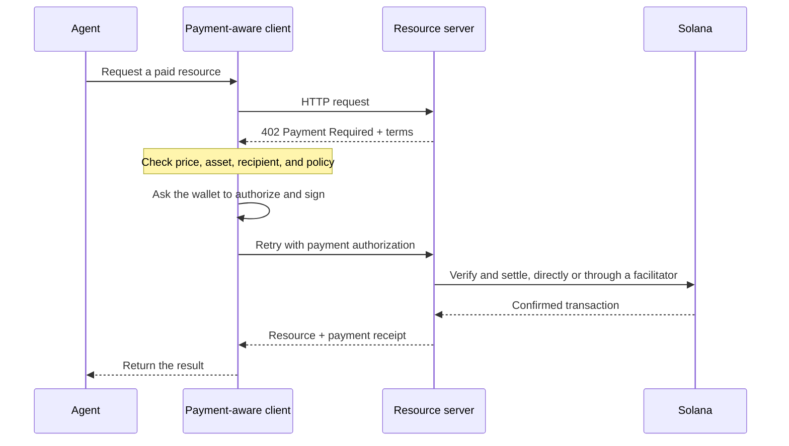

Agentische Zahlungen ermöglichen es Software, einen Preis zu ermitteln, eine Zahlung zu autorisieren und eine
Ressource im selben HTTP-Workflow zu erhalten. Ein Agent kann für eine Datenabfrage, eine Modellinferenz
oder einen Tool-Aufruf bezahlen, ohne zuvor Konten für die Abrechnung anzulegen oder einen
API-Schlüssel zu kopieren.

<Cards>
  <Card title="MPP" href="/docs/payments/agentic-payments/mpp">
    Verwenden Sie die HTTP-Authentifizierung für einmalige Abbuchungen und nutzungsbasierte Zahlungssitzungen.
  </Card>
  <Card title="x402" href="/docs/payments/agentic-payments/x402">
    Fügen Sie einer HTTP-Ressource x402-V2-Zahlungsanforderungen, Signaturen und die Abwicklung hinzu.
  </Card>
</Cards>

## Der allgemeine Zahlungsablauf

MPP und x402 verwenden unterschiedliche Header und Datenmodelle, doch ihr grundlegender HTTP-Ablauf ist
ähnlich:

## MPP und x402

Beide Protokolle können Stablecoin-Zahlungen auf Solana abwickeln. Wählen Sie anhand des
Zahlungsmodells und der Interoperabilität, die Ihr Dienst benötigt – nicht nur anhand des gemeinsamen `402`-
Statuscodes.

|                         | MPP                                                               | x402                                                                     |
| ----------------------- | ----------------------------------------------------------------- | ------------------------------------------------------------------------ |
| Challenge               | `WWW-Authenticate: Payment`                                       | `PAYMENT-REQUIRED`                                                       |
| Client-Autorisierung    | `Authorization: Payment`                                          | `PAYMENT-SIGNATURE`                                                      |
| Beleg                 | `Payment-Receipt`                                                 | `PAYMENT-RESPONSE`                                                       |
| Zahlungsmodelle auf Solana   | Einmalige `charge`-Intents und limitierte, nutzungsbasierte `session`-Intents           | Schemata wie `exact` und `upto`; die Unterstützung variiert je nach Netzwerk und Client |
| Abwicklungsarchitektur | Serverseitige Validierung oder optional ein Relay bzw. Gateway                | Ressourcenserver mit lokaler Verifizierung oder ein Facilitator                 |
| Guter Ausgangspunkt     | APIs, die HTTP-Authentifizierungssemantik oder wiederholte nutzungsbasierte Abrechnung benötigen | Pay-per-Request-Ressourcen und bestehende x402-Clients                      |

MPP steht für **Machine Payments Protocol**. Verwechseln Sie es nicht mit dem **Model
Context Protocol (MCP)**. MCP stellt Agenten Tools und Ressourcen bereit; MPP oder x402
können eine Zahlung verlangen, wenn ein Agent eines dieser Tools aufruft.

<Callout type="info">
  Ein Dienst kann mehr als ein Protokoll anbieten. Der Client wählt eine von ihm unterstützte
  Zahlungsoption aus und verwendet dann für den gesamten Austausch die passenden Challenge-, Autorisierungs- und
  Beleg-Header.
</Callout>
