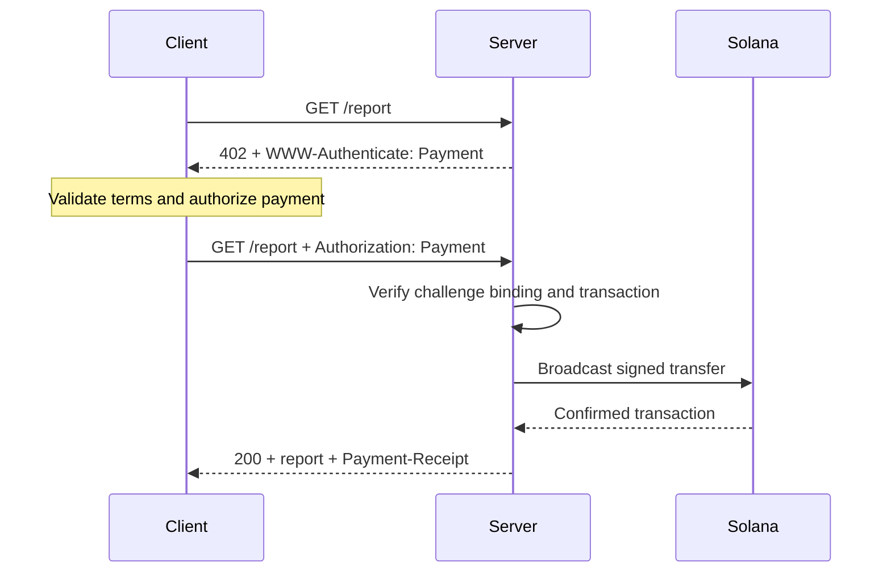
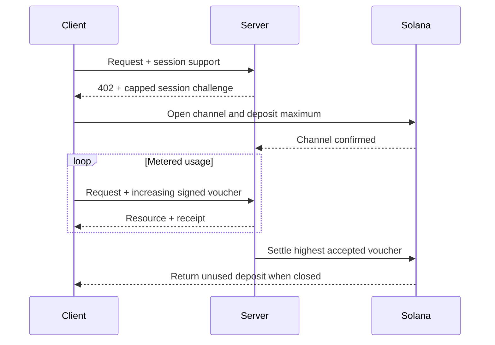

Das [Machine Payments Protocol (MPP)](https://mpp.dev/) überträgt die Semantik der HTTP-
Authentifizierung auf Zahlungen. Ein Server fordert bei einer unbezahlten Anfrage eine Zahlung an (Challenge), ein
Client sendet einen Zahlungsnachweis (Credential) zurück, und der Server liefert eine Quittung, nachdem er
die Zahlung akzeptiert hat.

MPP trennt drei Aspekte:

- Ein **Intent** beschreibt die kommerzielle Interaktion, etwa eine einmalige
  `charge` oder eine abgerechnete `session`.
- Eine **Zahlungsmethode** beschreibt, wie Werte übertragen werden. Die Solana-Methode unterstützt
  für Charges natives SOL und SPL-Token.
- Ein HTTP-**Transport** übermittelt Challenges, Credentials, Quittungen und Fehler.

MPP wird als Reihe von Internet-Drafts veröffentlicht. Betrachte die
[aktuellen Spezifikationen](https://paymentauth.org/) als maßgebliche Quelle und
rechne damit, dass sich Details weiterentwickeln, solange die Drafts in Arbeit sind.

## HTTP-Austausch

MPP verwendet standardmäßige HTTP-Authentifizierungsfelder statt protokollspezifischer
Zahlungs-Header:

| Nachricht                 | HTTP-Darstellung                                         |
| ----------------------- | ----------------------------------------------------------- |
| Zahlungs-Challenge       | `402 Payment Required` mit `WWW-Authenticate: Payment ...` |
| Zahlungs-Credential      | Erneute Anfrage mit `Authorization: Payment ...`           |
| Erfolgreiche Quittung      | Ressourcenantwort mit `Payment-Receipt: ...`               |
| Ungültige Zahlungsdetails | Problem-Details-Body mit `application/problem+json`       |



Eine Challenge enthält eine vom Server generierte ID, Realm, Methode, Intent, kodierte
Zahlungsanforderung und Ablaufzeit. Das Credential gibt die Challenge wieder und ergänzt den
methodenspezifischen Zahlungsnachweis. Der Server muss beides prüfen; eine gültige
Überweisung, die zu einer anderen Challenge gehört, darf die Ressource nicht freischalten.

## Einmalige Solana-Charges

Der Solana-Intent `charge` unterstützt zwei Credential-Typen:

- Der **Pull-Modus** verwendet eine signierte Transaktion. Der Client signiert die Überweisung und
  sendet die Transaktion an den Server. Der Server prüft sie, fügt optional eine
  Fee-Payer-Signatur hinzu, sendet sie ans Netzwerk, bestätigt sie und gibt die Transaktions-
  signatur in seiner Quittung zurück.
- Der **Push-Modus** verwendet eine Transaktionssignatur. Der Client sendet die Transaktion zuerst ans Netzwerk und
  übermittelt dann die bestätigte Signatur an den Server. Der Server ruft die Transaktion ab und prüft sie,
  bevor er die Ressource ausliefert.

Der Pull-Modus ermöglicht die Übernahme der Transaktions-Fee durch den Server sowie serverseitige Retry-Logik.
Der Push-Modus ist nützlich, wenn eine Wallet verlangt, dass der Client seine eigene
Transaktion einreicht, er kann jedoch kein Fee-Sponsoring durch den Server nutzen.

Die normativen Felder und Verifizierungsregeln findest du in der
[Solana-Charge-Spezifikation](https://paymentauth.org/draft-solana-charge-00.html).

## Eine MPP-Charge zu einer Express-API hinzufügen

Das Solana Pay Kit bietet eine aktuelle TypeScript-Integration für MPP und x402.
Installiere es zusammen mit Express:

```bash
pnpm add @solana/pay-kit @solana/kit@^6.9.0 express
pnpm add --save-dev @types/express tsx
```

Dieses minimale Beispiel verwendet die gehostete Surfpool-Sandbox und den öffentlichen
Demo-Empfänger des Pakets. Es ist ausschließlich für die lokale Entwicklung gedacht:

```ts filename=server.ts
import express from "express";
import { createPayKit, usd } from "@solana/pay-kit";

const pay = await createPayKit({
  accept: ["mpp"],
  rpcUrl: "https://402.surfnet.dev:8899"
});

const app = express();

app.get("/report", pay.express(usd("0.01")), (_req, res) => {
  res.json({ report: "Paid report" });
});

app.listen(4567, () => {
  console.log("Paid API listening on http://127.0.0.1:4567");
});
```

Führe es aus und vergleiche eine unbezahlte Anfrage mit einer zahlungsfähigen Anfrage:

```bash
pnpm tsx server.ts
curl -i http://127.0.0.1:4567/report
pay --sandbox curl http://127.0.0.1:4567/report
```

Der Route-Handler wird erst ausgeführt, nachdem die Middleware die Zahlung akzeptiert hat.

<Callout type="warn" title="Ersetze in der Produktion alle Sandbox-Standardwerte">
  Konfiguriere ein explizites Netzwerk, den Händler-Empfänger, einen dedizierten RPC, ein stabiles
  Secret zur Challenge-Bindung, einen Produktions-Signer und einen dauerhaften Replay-Speicher. Leite echte Zahlungen
  niemals an einen Demo-Signer des Pakets.
</Callout>

## Abgerechnete Sessions

Verwende eine Solana-MPP-`session`, wenn ein Client viele kleine, zusammenhängende Zahlungen vornimmt.
Eine Session öffnet einen Onchain-Zahlungskanal mit einer maximalen Einzahlung und verwendet dann
kumulative signierte Voucher, wenn die Nutzung steigt. Der Server kann Voucher
offchain prüfen und den höchsten akzeptierten Betrag später abrechnen.

Das ist nützlich für tokenbasiert abgerechnete Inferenz, bytebasiert abgerechnete Downloads, Live-Daten
und wiederholte Tool-Aufrufe. Es ist nicht dasselbe, wie für jedes Ereignis eine separate Onchain-
Zahlung zu senden.



Bezeichne eine Session als **Session-Zahlung**, **Zahlungskanal** oder **gedeckelte wiederholte
Autorisierung**. Nenne sie nur dann eine Streaming-Zahlung, wenn der Service und der Zahlungsvertrag
tatsächlich einen Nutzungs-Stream abrechnen.

## Verifizierung in der Produktion

Bei jeder Solana-Charge muss der Server mindestens Folgendes prüfen:

- Die Challenge ist authentisch, nicht abgelaufen, an diese Anfrage gebunden und für
  diesen Realm bestimmt.
- Die Transaktion verwendet das erwartete Netzwerk, Asset bzw. Mint, den Empfänger, den Betrag
  und das Token Program.
- Alle Anweisungen für Fee Payer oder associated token account sind ausdrücklich
  erlaubt und können den Server-Signer nicht leeren.
- Die Transaktion war auf dem erforderlichen Commitment-Level erfolgreich.
- Die Transaktionssignatur wurde noch nicht verbraucht.
- Die Replay-Prüfung und der Verbrauchsvorgang sind über alle Serverinstanzen hinweg atomar.

Bei Sessions solltest du außerdem den Kanalstatus, den akzeptierten kumulativen Betrag und den
Settlement-Watermark in einem gemeinsamen Speicher persistieren. Dokumentiere, wie Clients nicht genutzte
Mittel zurückerhalten, wenn der Server nicht mehr verfügbar ist.

## Weiterführende Ressourcen

- [MPP-Spezifikationen](https://paymentauth.org/)
- [MPP-Protokolldokumentation](https://mpp.dev/protocol)
- [Solana Pay Kit](https://github.com/solana-foundation/pay-kit)
- [Überblick über Agentic Payments](/docs/payments/agentic-payments)
- [Produktionsreife](/docs/tools/production-readiness)
