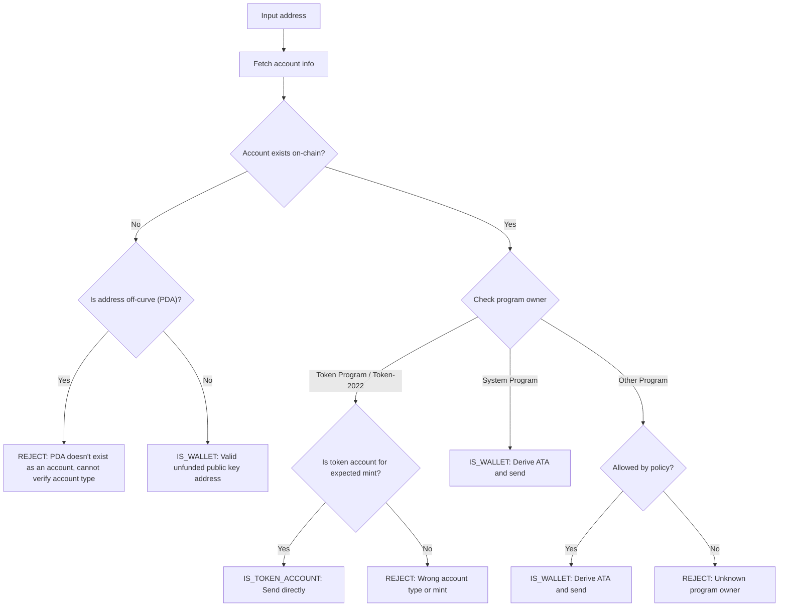

Das Senden von Token an die falsche Adresse kann zu einem dauerhaften Verlust
von Geldern führen. Die Adressverifizierung stellt sicher, dass Sie Token nur an
Adressen senden, die diese ordnungsgemäß empfangen und darauf zugreifen können.

<Callout>
  Siehe [Wie Zahlungen auf Solana
  funktionieren](/docs/payments/how-payments-work) für grundlegende
  Zahlungskonzepte.
</Callout>

## Solana-Adressen verstehen

Solana-Konten haben zwei Arten von Adressen: on-curve und off-curve.

### On-Curve-Adressen

Standardadressen sind die öffentlichen Schlüssel von Ed25519-Schlüsselpaaren.
Diese Adressen:

- Haben einen entsprechenden privaten Schlüssel, der Transaktionen signieren
  kann
- Werden als Wallet-Adressen verwendet

### Off-Curve-Adressen (PDAs)

[Program Derived Addresses](/docs/core/pda) werden deterministisch aus einer
Programm-ID und Seeds abgeleitet. Diese Adressen:

- Haben **keinen** entsprechenden privaten Schlüssel
- Können nur vom Programm signiert werden, von dem die Adresse abgeleitet wurde

## Kontentypen bei Zahlungen

Verwenden Sie die Adresse, um ein [Konten](/docs/core/accounts) aus dem Netzwerk
abzurufen, prüfen Sie dessen Programmeigentümer und Kontotyp, um zu bestimmen,
wie die Adresse zu handhaben ist.

<Callout>
  Zu wissen, ob eine Adresse on-curve oder off-curve ist, sagt Ihnen nicht,
  welcher Kontotyp es ist, welches Programm es besitzt oder ob ein Konten unter
  dieser Adresse existiert. Sie müssen das Konten aus dem Netzwerk abrufen, um
  diese Details zu ermitteln.
</Callout>

### System Program-Konten (Wallets)

Konten, die dem System Program gehören, sind Standard-Wallets. Um SPL-Token an
ein Wallet zu senden, leiten Sie dessen
[Associated Token Account (ATA)](/docs/tokens/basics/create-token-account#whats-an-associated-token-account)
ab und verwenden es.

Nachdem Sie die ATA-Adresse abgeleitet haben, prüfen Sie, ob das token account
on-chain existiert. Wenn das ATA nicht existiert, können Sie eine Anweisung zum
Erstellen des token account des Empfängers in derselben Transaktion wie die
Übertragung einschließen. Dies erfordert jedoch die Zahlung von rent für das
neue token account. Da der Empfänger das ATA besitzt, kann das für die rent
gezahlte SOL nicht vom Absender zurückgefordert werden.

<Callout type="warn">
  Ohne Schutzmaßnahmen kann die Subventionierung der ATA-Erstellung ausgenutzt
  werden. Ein böswilliger Benutzer könnte eine Überweisung anfordern, sein ATA
  auf Ihre Kosten erstellen lassen, das ATA schließen, um die Miete in SOL
  zurückzuerhalten, und dies wiederholen.
</Callout>

### Token-Konten

[Token-Konten](/docs/tokens/basics/create-token-account) gehören dem Token
Program oder Token-2022 Program und halten Token-Guthaben. Wenn die Adresse, die
Sie erhalten, einem Token-Programm gehört, sollten Sie überprüfen, dass das
Konto ein Token-Konto ist (kein Mint-Konto) und mit dem erwarteten
Token-Mint-Konto übereinstimmt, bevor Sie senden.

<Callout type="info">
  Die Token Programs validieren automatisch, dass beide Token-Konten in einer
  Überweisung Token derselben Mint halten. Wenn die Validierung fehlschlägt,
  wird die Transaktion abgelehnt und es gehen keine Mittel verloren.
</Callout>

### Mint-Konten

[Mint-Konten](/docs/tokens/basics/create-mint) verfolgen das Token-Angebot und
die Metadaten eines bestimmten Tokens. Mint-Konten gehören ebenfalls Token
Programs, sind aber **keine** gültigen Empfänger für Token-Überweisungen. Der
Versuch, Token an eine Mint-Adresse zu senden, führt zu einer fehlgeschlagenen
Transaktion, aber es gehen keine Mittel verloren.

### Andere Konten

Konten, die anderen Programmen gehören, erfordern eine Grundsatzentscheidung.
Einige Konten (z. B. Multisig-Wallets) können gültige Token-Konto-Eigentümer
sein, während andere abgelehnt werden sollten.

## Verifizierungsablauf

Das folgende Diagramm zeigt einen Referenz-Entscheidungsbaum zur Validierung
einer Adresse:



<Steps>
<Step>

### Konto abrufen

Verwenden Sie die Adresse, um die Kontodetails aus dem Netzwerk abzurufen.

</Step>
<Step>

### Konto existiert nicht

Wenn unter dieser Adresse kein Konto existiert, prüfen Sie, ob die Adresse
on-curve oder off-curve ist:

- **Off-curve (PDA)**: Lehnen Sie die Adresse vorsichtshalber ab, um das Senden
  an ein ATA zu vermeiden, das möglicherweise nicht zugänglich ist. Ohne ein
  bestehendes Konto können Sie allein anhand der Adresse nicht feststellen,
  welches Programm diese PDA abgeleitet hat oder ob die Adresse für ein ATA
  bestimmt ist. Das Ableiten eines ATA für diese Adresse zum Senden von Token
  könnte dazu führen, dass Guthaben in einem nicht zugänglichen Token-Konto
  gesperrt werden.

- **On-curve**: Dies ist eine gültige Wallet-Adresse (öffentlicher Schlüssel),
  die noch nicht finanziert wurde. Leiten Sie das ATA ab, prüfen Sie, ob es
  existiert, und senden Sie Token dorthin. Sie müssen eine Grundsatzentscheidung
  treffen, ob Sie die Erstellung des ATA finanzieren, falls es nicht existiert.

</Step>
<Step>

### Konto existiert

Wenn ein Konto existiert, prüfen Sie, welches Programm es besitzt:

- **System Program**: Dies ist eine Standard-Wallet. Leiten Sie das ATA ab,
  prüfen Sie, ob es existiert, und senden Sie Token dorthin. Sie müssen eine
  Grundsatzentscheidung treffen, ob Sie die Erstellung des ATA finanzieren,
  falls es nicht existiert.

- **Token Program / Token-2022**: Überprüfen Sie, dass das Konto ein Token-Konto
  ist (kein Mint-Konto) und dass es den Token (Mint) hält, den Sie senden
  möchten. Wenn gültig, senden Sie Token direkt an diese Adresse. Wenn es ein
  Mint-Konto oder ein Token-Konto für einen anderen Mint ist, lehnen Sie die
  Adresse ab.

- **Other Program**: Dies erfordert eine Grundsatzentscheidung. Einige Programme
  wie Multisig-Wallets können akzeptable Besitzer von Token-Konten sein. Wenn
  Ihre Richtlinie dies zulässt, leiten Sie das ATA ab und senden Sie.
  Andernfalls lehnen Sie die Adresse ab.

</Step>
</Steps>

## Demo

Das folgende Beispiel zeigt nur die Adressvalidierungslogik. Dies ist
Referenzcode zu Illustrationszwecken.

<Callout>
  Die Demo zeigt nicht, wie man ein ATA ableitet oder eine Transaktion zum
  Senden von Token erstellt. Siehe die Dokumentation zu
  [Token-Konten](/docs/tokens/basics/create-token-account#how-to-create-an-associated-token-account)
  und [Token-Übertragungen](/docs/tokens/basics/transfer-tokens) für
  Beispielcode.
</Callout>

Die folgende Demo verwendet drei mögliche Ergebnisse:

| Ergebnis           | Bedeutung              | Aktion                                               |
| ------------------ | ---------------------- | ---------------------------------------------------- |
| `IS_WALLET`        | Gültige Wallet-Adresse | Associated token account ableiten und dorthin senden |
| `IS_TOKEN_ACCOUNT` | Gültiges Token-Konto   | Token direkt an diese Adresse senden                 |
| `REJECT`           | Ungültige Adresse      | Nicht senden                                         |

<CodeTabs flags="r">

```ts !! title="Demo"
// !collapse(1:35) collapsed

import {
  type Address,
  type Rpc,
  type GetAccountInfoApi,
  createSolanaRpc,
  fetchJsonParsedAccount,
  isOffCurveAddress,
  generateKeyPairSigner,
  getProgramDerivedAddress
} from "@solana/kit";

// =============================================================================
// Constants
// =============================================================================

const defaultRpc = createSolanaRpc("https://api.mainnet-beta.solana.com");

const SYSTEM_PROGRAM = "11111111111111111111111111111111" as Address;
const TOKEN_PROGRAM = "TokenkegQfeZyiNwAJbNbGKPFXCWuBvf9Ss623VQ5DA" as Address;
const TOKEN_2022_PROGRAM =
  "TokenzQdBNbLqP5VEhdkAS6EPFLC1PHnBqCXEpPxuEb" as Address;

// =============================================================================
// Validation Function
// =============================================================================

/**
 * Possible validation results for an input address.
 */
export type ValidationResult =
  | { type: "IS_TOKEN_ACCOUNT" }
  | { type: "IS_WALLET" }
  | { type: "REJECT"; reason: string };

/**
 * Validates an input address and classifies it as a wallet, token account, or invalid.
 *
 * @param inputAddress - The address to validate
 * @param rpc - Optional RPC client (defaults to mainnet)
 * @returns Classification result:
 *   - IS_WALLET: Valid wallet address
 *   - IS_TOKEN_ACCOUNT: Valid token account
 *   - REJECT: Invalid address for transfers
 */
export async function validateAddress(
  inputAddress: Address,
  rpc: Rpc<GetAccountInfoApi> = defaultRpc
): Promise<ValidationResult> {
  const account = await fetchJsonParsedAccount(rpc, inputAddress);
  // Log the account data for demo
  console.log("\nAccount:", account);

  // Account doesn't exist on-chain
  if (!account.exists) {
    // Off-curve = PDA that doesn't exist as an account
    // Reject conservatively to avoid sending to an address that may be inaccessible.
    if (isOffCurveAddress(inputAddress)) {
      return { type: "REJECT", reason: "PDA doesn't exist as an account" };
    }
    // On-curve = valid keypair address, treat as unfunded wallet
    return { type: "IS_WALLET" };
  }

  // Account exists, check program owner
  const owner = account.programAddress;

  // System Program = wallet
  if (owner === SYSTEM_PROGRAM) {
    return { type: "IS_WALLET" };
  }

  // Token Program or Token-2022, check if token account
  if (owner === TOKEN_PROGRAM || owner === TOKEN_2022_PROGRAM) {
    const accountType = (
      account.data as { parsedAccountMeta?: { type?: string } }
    ).parsedAccountMeta?.type;

    if (accountType === "account") {
      return { type: "IS_TOKEN_ACCOUNT" };
    }
    // Reject if not a token account (mint account)
    return {
      type: "REJECT",
      reason: "Not a token account"
    };
  }

  // Unknown program owner
  return { type: "REJECT", reason: "Unknown program owner" };
}

// =============================================================================
// Examples
// =============================================================================
// !collapse(1:1000) collapsed

// Wallets
const EXISTING_WALLET =
  "H8sMJSCQxfKiFTCfDR3DUMLPwcRbM61LGFJ8N4dK3WjS" as Address;
const NEW_WALLET = (await generateKeyPairSigner()).address;

// Token accounts
const USDC_TOKEN_ACCOUNT =
  "3emsAVdmGKERbHjmGfQ6oZ1e35dkf5iYcS6U4CPKFVaa" as Address;
const PYUSD_TOKEN_ACCOUNT =
  "47od2TPRvqJipfPVWZdyenLEngPw8hC36nDxiLyvGsEP" as Address;

// Token mints (should be rejected)
const USDC_MINT = "EPjFWdd5AufqSSqeM2qN1xzybapC8G4wEGGkZwyTDt1v" as Address;
const PYUSD_MINT = "2b1kV6DkPAnxd5ixfnxCpjxmKwqjjaYmCZfHsFu24GXo" as Address;

// PDA that doesn't exist (should be rejected)
const [NON_EXISTENT_PDA] = await getProgramDerivedAddress({
  programAddress: (await generateKeyPairSigner()).address,
  seeds: ["seed"]
});

// Program account (should be rejected)
const PROGRAM_ACCOUNT =
  "p1exdMJcjVao65QdewkaZRUnU6VPSXhus9n2GzWfh98" as Address;

async function runExample(label: string, address: Address) {
  console.log(`\n${"─".repeat(60)}`);
  console.log(`Example: ${label}`);
  console.log(`Input: ${address}`);
  console.log(`${"─".repeat(60)}`);

  const result = await validateAddress(address);
  console.log("\nResult:", result);
}

console.log("\n" + "═".repeat(60));
console.log("  IS_WALLET Examples");
console.log("═".repeat(60));

await runExample("Existing funded wallet", EXISTING_WALLET);
await runExample("New wallet (unfunded)", NEW_WALLET);

console.log("\n" + "═".repeat(60));
console.log("  IS_TOKEN_ACCOUNT Examples");
console.log("═".repeat(60));

await runExample("USDC token account (Token Program)", USDC_TOKEN_ACCOUNT);
await runExample("PYUSD token account (Token-2022)", PYUSD_TOKEN_ACCOUNT);

console.log("\n" + "═".repeat(60));
console.log("  REJECT Examples");
console.log("═".repeat(60));

await runExample("USDC mint address", USDC_MINT);
await runExample("PYUSD mint address", PYUSD_MINT);
await runExample("Non-existent PDA", NON_EXISTENT_PDA);
await runExample("Program account", PROGRAM_ACCOUNT);

console.log("\n" + "═".repeat(60));
console.log("  Done!");
console.log("═".repeat(60) + "\n");
```

</CodeTabs>
