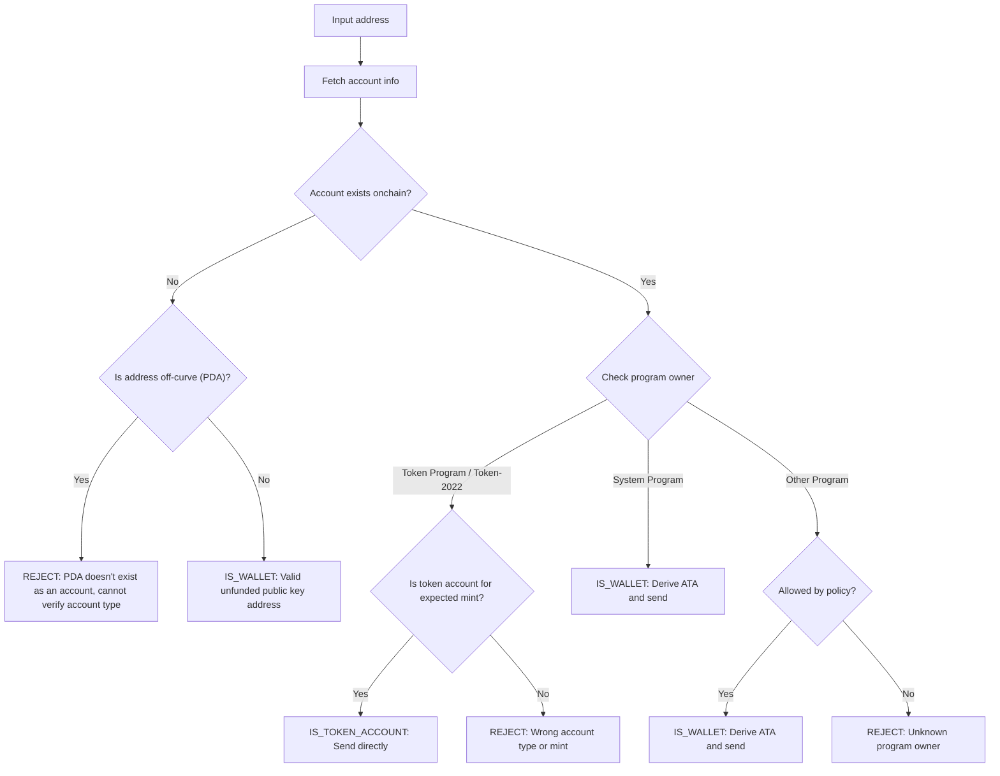

Das Senden von Geldern an eine falsche Adresse kann zu einem dauerhaften Verlust
führen. Die Adressverifizierung stellt sicher, dass Sie nur an Adressen senden,
die die Gelder ordnungsgemäß empfangen und darauf zugreifen können.

Die Validierung hängt davon ab, was Sie senden:

- **SPL-Token** sind teilweise selbstschützend. Das Token Program lehnt eine
  Überweisung ab, bei der die Konten nicht mit der erwarteten Mint
  übereinstimmen, sodass eine fehlgeleitete Token-Überweisung fehlschlägt, ohne
  dass Gelder verloren gehen. Der Großteil dieser Seite behandelt
  SPL-Token-Sendungen.
- **Natives SOL** verfügt über keinen solchen Schutz. Eine System
  Program-Überweisung gelingt in jedes Konto, sodass ein falscher Empfänger das
  SOL dauerhaft sperrt. Siehe [Natives SOL senden](#sending-native-sol).

<Callout>
  Siehe [Wie Zahlungen auf Solana
  funktionieren](/docs/payments/how-payments-work) für grundlegende
  Zahlungskonzepte.
</Callout>

## Solana-Adressen verstehen

Solana-Konten haben zwei Arten von Adressen: On-Curve und Off-Curve.

### On-Curve-Adressen

Standardadressen sind die öffentlichen Schlüssel aus Ed25519-keypairs. Diese
Adressen:

- Haben einen entsprechenden privaten Schlüssel, der Transaktionen signieren
  kann
- Werden als Wallet-Adressen verwendet

### Off-Curve-Adressen (PDAs)

[Program Derived Addresses](/docs/core/pda) werden deterministisch aus einer
Programm-ID und Seeds abgeleitet. Diese Adressen:

- Haben **keinen** entsprechenden privaten Schlüssel
- Können nur vom Programm signiert werden, aus dem die Adresse abgeleitet wurde

## Kontotypen bei Zahlungen

Verwenden Sie die Adresse, um ein [Konto](/docs/core/accounts) aus dem Netzwerk
abzurufen, und überprüfen Sie den Programmeigentümer sowie den Kontotyp, um zu
bestimmen, wie die Adresse zu behandeln ist.

<Callout>
  Ob eine Adresse On-Curve oder Off-Curve ist, sagt Ihnen nicht, welchen Typ das
  Konto hat, welches Programm es besitzt oder ob an dieser Adresse überhaupt ein
  Konto existiert. Sie müssen das Konto aus dem Netzwerk abrufen, um diese
  Details zu ermitteln.
</Callout>

### System Program Konten (Wallets)

Konten, die dem System Program gehören, sind Standard-Wallets. Um SPL-Token an
eine Wallet zu senden, leiten Sie die zugehörige
[Associated Token Account (ATA)](/docs/tokens/basics/create-token-account#what-is-an-associated-token-account)
ab und verwenden Sie diese.

Nach dem Ableiten der ATA-Adresse prüfen Sie, ob das token account bereits
onchain existiert. Falls die ATA nicht existiert, können Sie eine Anweisung zum
Erstellen des token account des Empfängers in dieselbe Transaktion wie die
Überweisung aufnehmen. Dies erfordert jedoch die Zahlung von rent für das neue
token account. Da der Empfänger die ATA besitzt, kann der für die rent gezahlte
SOL vom Sender nicht zurückgefordert werden.

<Callout type="warn">
  Ohne Schutzmaßnahmen kann die Subventionierung der ATA-Erstellung ausgenutzt
  werden. Ein böswilliger Nutzer könnte eine Überweisung anfordern, seine ATA
  auf Ihre Kosten erstellen lassen, die ATA schließen, um den rent SOL
  zurückzuerhalten, und diesen Vorgang wiederholen.
</Callout>

### Token Accounts

[Token accounts](/docs/tokens/basics/create-token-account) gehören dem Token
Program oder Token-2022 Program und speichern Token-Guthaben. Wenn die Adresse,
die Sie erhalten, einem Token-Programm gehört, sollten Sie überprüfen, ob das
Konto ein token account ist (kein mint account) und mit dem erwarteten token
mint account übereinstimmt, bevor Sie senden.

<Callout type="info">
  Die Token Programs validieren automatisch, dass beide token accounts in einer
  Überweisung Token desselben Mint halten. Schlägt die Validierung fehl, wird
  die Transaktion abgelehnt und es gehen keine Mittel verloren.
</Callout>

### Mint Accounts

[Mint accounts](/docs/tokens/basics/create-mint) verfolgen das Token-Angebot und
die Metadaten eines bestimmten Tokens. Mint accounts gehören ebenfalls Token
Programs, sind aber **keine** gültigen Empfänger für Token-Überweisungen. Der
Versuch, Token an eine Mint-Adresse zu senden, führt zu einer fehlgeschlagenen
Transaktion, es gehen jedoch keine Mittel verloren.

### Andere Konten

Konten, die anderen Programmen gehören, erfordern eine Grundsatzentscheidung.
Einige Konten (z. B. Multisig-Wallets) können gültige token account-Inhaber
sein, während andere abgelehnt werden sollten.

## Natives SOL senden

Die obige Klassifizierung bestimmt, wohin SPL-Token gesendet werden können.
Natives SOL ist strenger: Der einzige sichere Empfänger ist eine **System
Program-Wallet** (oder eine nicht finanzierte On-Curve-Adresse, die zu einer
wird).

Eine System Program-Überweisung fügt lamports zu jedem Konto hinzu,
einschließlich Mints, token accounts, Programmen und PDAs. Lamports können nur
vom eigenen Programm des Kontos abgebucht werden. Daher kann das Senden von SOL
an einen falschen Empfänger dazu führen, dass Gelder dauerhaft verloren gehen.

Im Gegensatz zu einer SPL-Token-Überweisung schlägt die Transaktion **nicht**
fehl, wenn der Empfänger eine unerwartete Adresse ist.

Beim Senden von nativem SOL ist nur ein `IS_WALLET`-Ergebnis akzeptabel.
`IS_TOKEN_ACCOUNT` ist es **nicht**: Ein token account enthält SPL-Token, und
dorthin gesendetes SOL liegt außerhalb der Kontrolle des Absenders.

<Callout type="warn">
  Dies ist eine häufige Ursache für den Verlust von SOL: Ein Benutzer fügt die
  Mint-Adresse eines Tokens (oder eine Programm-Adresse) in eine SOL-Auszahlung
  ein. Die Überweisung wird erfolgreich durchgeführt und das SOL ist nicht
  wiederherstellbar. Klassifizieren Sie den Empfänger immer, bevor Sie eine
  SOL-Überweisung unterzeichnen.
</Callout>

## Verifizierungsablauf

Das folgende Diagramm zeigt einen Referenz-Entscheidungsbaum zur Validierung
einer Adresse:


```mermaid title="Address Verification Flow"
flowchart TD
    A["Input address"]
    B["Fetch account info"]

    A --> B
    B --> C{"Account exists onchain?"}

    %% --- Non-existent account path ---
    C -- "No" --> D{"Is address off-curve (PDA)?"}
    D -- "Yes" --> R1["REJECT: PDA doesn't exist as an account, cannot verify account type"]
    D -- "No" --> W1["IS_WALLET: Valid unfunded public key address"]

    %% --- Existing account path ---
    C -- "Yes" --> F{"Check program owner"}

    F -- "Token Program / Token-2022" --> G{"Is token account for expected mint?"}
    G -- "Yes" --> T1["IS_TOKEN_ACCOUNT: Send directly"]
    G -- "No" --> R2["REJECT: Wrong account type or mint"]

    F -- "System Program" --> W2["IS_WALLET: Derive ATA and send"]

    F -- "Other Program" --> K{"Allowed by policy?"}
    K -- "Yes" --> W3["IS_WALLET: Derive ATA and send"]
    K -- "No" --> R3["REJECT: Unknown program owner"]
```

<Steps>
<Step>

### Konten abrufen

Verwenden Sie die Adresse, um die Kontendetails aus dem Netzwerk abzurufen.

</Step>
<Step>

### Konten existieren nicht

Wenn unter dieser Adresse kein Konto existiert, prüfen Sie, ob die Adresse
On-Curve oder Off-Curve ist:

- **Off-Curve (PDA)**: Lehnen Sie die Adresse vorsichtshalber ab, um das Senden
  an eine ATA zu vermeiden, die möglicherweise nicht zugänglich ist. Ohne ein
  bestehendes Konto können Sie anhand der Adresse allein nicht bestimmen,
  welches Programm diese PDA abgeleitet hat oder ob die Adresse für eine ATA
  ist. Das Ableiten einer ATA für diese Adresse zum Senden von Token könnte dazu
  führen, dass Gelder in einem nicht zugänglichen token account gesperrt werden.

- **On-curve**: Dies ist eine gültige Wallet-Adresse (öffentlicher Schlüssel),
  die noch nicht finanziert wurde. Leiten Sie den ATA ab, prüfen Sie, ob er
  existiert, und senden Sie Token daran. Sie müssen eine Grundsatzentscheidung
  treffen, ob Sie die Erstellung des ATA finanzieren möchten, falls er nicht
  existiert.

</Step>
<Step>

### Konto existiert

Wenn ein Konto existiert, prüfen Sie, welches Programm es besitzt:

- **System Program**: Dies ist ein Standard-Wallet. Leiten Sie den ATA ab,
  prüfen Sie, ob er existiert, und senden Sie Token daran. Sie müssen eine
  Grundsatzentscheidung treffen, ob Sie die Erstellung des ATA finanzieren
  möchten, falls er nicht existiert.

- **Token Program / Token-2022**: Überprüfen Sie, ob das Konto ein token account
  (kein mint account) ist und dass es den Token (Mint) enthält, den Sie senden
  möchten. Wenn gültig, senden Sie Token direkt an diese Adresse. Wenn es sich
  um ein mint account oder ein token account für einen anderen Mint handelt,
  lehnen Sie die Adresse ab.

- **Anderes Programm**: Dies erfordert eine Grundsatzentscheidung. Einige
  Programme wie Multisig-Wallets können akzeptable Eigentümer von token accounts
  sein. Wenn Ihre Richtlinie es erlaubt, leiten Sie den ATA ab und senden Sie.
  Andernfalls lehnen Sie die Adresse ab.

</Step>
</Steps>

## Demo

Das folgende Beispiel zeigt nur die Adressvalidierungslogik. Dies ist
Referenzcode zu Illustrationszwecken.

<Callout>
  Die Demo zeigt nicht, wie ein ATA abgeleitet oder eine Transaktion zum Senden
  von Token erstellt wird. Für Beispielcode verweisen Sie auf die Dokumentation
  zu [token
  account](/docs/tokens/basics/create-token-account#how-to-create-an-associated-token-account)
  und [token transfer](/docs/tokens/basics/transfer-tokens).
</Callout>

Die folgende Demo verwendet drei mögliche Ergebnisse:

| Ergebnis           | Bedeutung              | Aktion                               |
| ------------------ | ---------------------- | ------------------------------------ |
| `IS_WALLET`        | Gültige Wallet-Adresse | ATA ableiten und Token daran senden  |
| `IS_TOKEN_ACCOUNT` | Gültiger token account | Token direkt an diese Adresse senden |
| `REJECT`           | Ungültige Adresse      | Nicht senden                         |

Anschließend wird jedes Ergebnis mit `canReceiveNativeSol` (nur Wallets) und
`canReceiveSplToken` (Wallets oder token accounts) auf die Akzeptierbarkeit pro
Asset geprüft. Ein token account gibt `IS_TOKEN_ACCOUNT` zurück, sodass er
SPL-Token empfangen kann, aber **nicht** natives SOL — die Unterscheidung, die
verhindert, dass SOL gesperrt wird.

<CodeTabs flags="r">

```ts !! title="Demo"
// !collapse(1:35) collapsed

import {
  type Address,
  type Rpc,
  type GetAccountInfoApi,
  createSolanaRpc,
  fetchJsonParsedAccount,
  isOffCurveAddress,
  generateKeyPairSigner,
  getProgramDerivedAddress
} from "@solana/kit";

// =============================================================================
// Constants
// =============================================================================

const defaultRpc = createSolanaRpc("https://api.mainnet-beta.solana.com");

const SYSTEM_PROGRAM = "11111111111111111111111111111111" as Address;
const TOKEN_PROGRAM = "TokenkegQfeZyiNwAJbNbGKPFXCWuBvf9Ss623VQ5DA" as Address;
const TOKEN_2022_PROGRAM =
  "TokenzQdBNbLqP5VEhdkAS6EPFLC1PHnBqCXEpPxuEb" as Address;

// =============================================================================
// Validation Function
// =============================================================================

/**
 * Possible validation results for an input address.
 */
export type ValidationResult =
  | { type: "IS_TOKEN_ACCOUNT" }
  | { type: "IS_WALLET" }
  | { type: "REJECT"; reason: string };

/**
 * Validates an input address and classifies it as a wallet, token account, or invalid.
 *
 * @param inputAddress - The address to validate
 * @param rpc - Optional RPC client (defaults to mainnet)
 * @returns Classification result:
 *   - IS_WALLET: Valid wallet address
 *   - IS_TOKEN_ACCOUNT: Valid token account
 *   - REJECT: Invalid address for transfers
 */
export async function validateAddress(
  inputAddress: Address,
  rpc: Rpc<GetAccountInfoApi> = defaultRpc
): Promise<ValidationResult> {
  const account = await fetchJsonParsedAccount(rpc, inputAddress);
  // Log the account data for demo
  console.log("\nAccount:", account);

  // Account doesn't exist onchain
  if (!account.exists) {
    // Off-curve = PDA that doesn't exist as an account
    // Reject conservatively to avoid sending to an address that may be inaccessible.
    if (isOffCurveAddress(inputAddress)) {
      return { type: "REJECT", reason: "PDA doesn't exist as an account" };
    }
    // On-curve = valid keypair address, treat as unfunded wallet
    return { type: "IS_WALLET" };
  }

  // Account exists, check program owner
  const owner = account.programAddress;

  // System Program = wallet
  if (owner === SYSTEM_PROGRAM) {
    return { type: "IS_WALLET" };
  }

  // Token Program or Token-2022, check if token account
  if (owner === TOKEN_PROGRAM || owner === TOKEN_2022_PROGRAM) {
    const accountType = (
      account.data as { parsedAccountMeta?: { type?: string } }
    ).parsedAccountMeta?.type;

    if (accountType === "account") {
      return { type: "IS_TOKEN_ACCOUNT" };
    }
    // Reject if not a token account (mint account)
    return {
      type: "REJECT",
      reason: "Not a token account"
    };
  }

  // Unknown program owner
  return { type: "REJECT", reason: "Unknown program owner" };
}

/**
 * Native SOL is only safe to send to a wallet. Any other account locks it.
 */
function canReceiveNativeSol(result: ValidationResult): boolean {
  return result.type === "IS_WALLET";
}

/**
 * SPL tokens can go to a wallet (via its ATA) or directly to a token account.
 */
function canReceiveSplToken(result: ValidationResult): boolean {
  return result.type === "IS_WALLET" || result.type === "IS_TOKEN_ACCOUNT";
}

// =============================================================================
// Examples
// =============================================================================
// !collapse(1:1000) collapsed

// Wallets
const EXISTING_WALLET =
  "H8sMJSCQxfKiFTCfDR3DUMLPwcRbM61LGFJ8N4dK3WjS" as Address;
const NEW_WALLET = (await generateKeyPairSigner()).address;

// Token accounts
const USDC_TOKEN_ACCOUNT =
  "3emsAVdmGKERbHjmGfQ6oZ1e35dkf5iYcS6U4CPKFVaa" as Address;
const PYUSD_TOKEN_ACCOUNT =
  "47od2TPRvqJipfPVWZdyenLEngPw8hC36nDxiLyvGsEP" as Address;

// Token mints (should be rejected)
const USDC_MINT = "EPjFWdd5AufqSSqeM2qN1xzybapC8G4wEGGkZwyTDt1v" as Address;
const PYUSD_MINT = "2b1kV6DkPAnxd5ixfnxCpjxmKwqjjaYmCZfHsFu24GXo" as Address;

// PDA that doesn't exist (should be rejected)
const [NON_EXISTENT_PDA] = await getProgramDerivedAddress({
  programAddress: (await generateKeyPairSigner()).address,
  seeds: ["seed"]
});

// Program account (should be rejected)
const PROGRAM_ACCOUNT =
  "p1exdMJcjVao65QdewkaZRUnU6VPSXhus9n2GzWfh98" as Address;

async function runExample(label: string, address: Address) {
  console.log(`\n${"─".repeat(60)}`);
  console.log(`Example: ${label}`);
  console.log(`Input: ${address}`);
  console.log(`${"─".repeat(60)}`);

  const result = await validateAddress(address);
  console.log("\nResult:", result);
  console.log(
    `Can receive SOL?   ${canReceiveNativeSol(result) ? "YES" : "NO"}`
  );
  console.log(
    `Can receive token? ${canReceiveSplToken(result) ? "YES" : "NO"}`
  );
}

console.log("\n" + "═".repeat(60));
console.log("  IS_WALLET Examples");
console.log("═".repeat(60));

await runExample("Existing funded wallet", EXISTING_WALLET);
await runExample("New wallet (unfunded)", NEW_WALLET);

console.log("\n" + "═".repeat(60));
console.log("  IS_TOKEN_ACCOUNT Examples");
console.log("═".repeat(60));

await runExample("USDC token account (Token Program)", USDC_TOKEN_ACCOUNT);
await runExample("PYUSD token account (Token-2022)", PYUSD_TOKEN_ACCOUNT);

console.log("\n" + "═".repeat(60));
console.log("  REJECT Examples");
console.log("═".repeat(60));

await runExample("USDC mint address", USDC_MINT);
await runExample("PYUSD mint address", PYUSD_MINT);
await runExample("Non-existent PDA", NON_EXISTENT_PDA);
await runExample("Program account", PROGRAM_ACCOUNT);

console.log("\n" + "═".repeat(60));
console.log("  Done!");
console.log("═".repeat(60) + "\n");
```

</CodeTabs>
