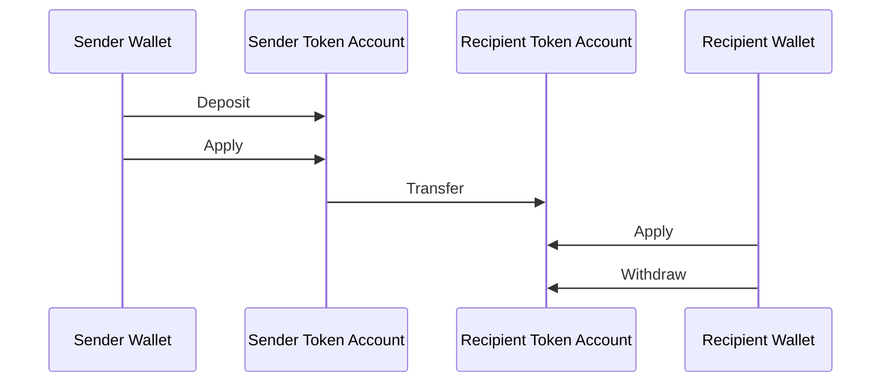
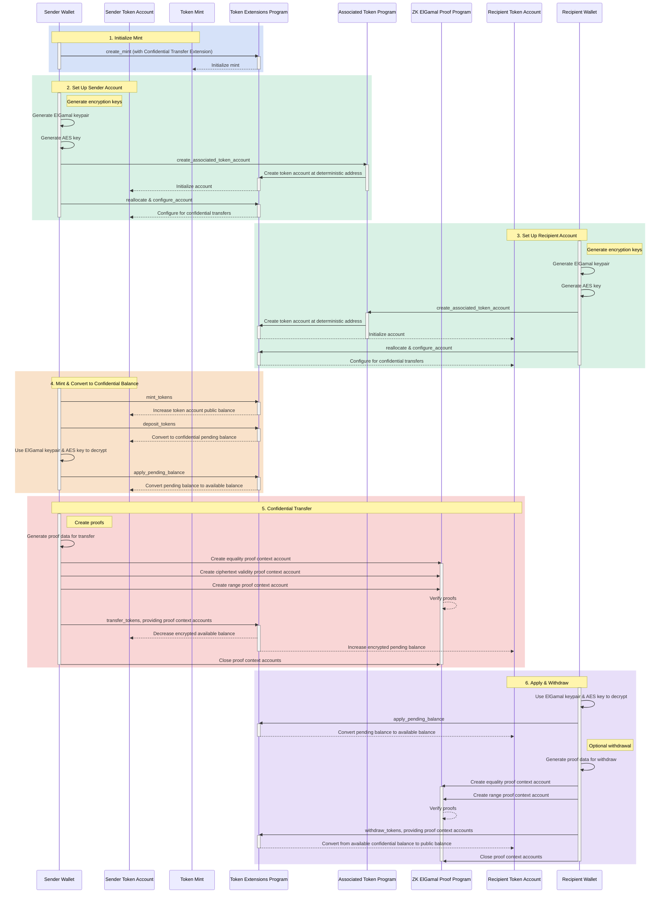

## Was sind vertrauliche Transfers?

Vertrauliche Transfers ermöglichen es Ihnen, Token zwischen token accounts zu
übertragen, ohne den Transferbetrag offenzulegen. Dies ist nützlich für
datenschutzwahrende Transaktionen. Nur die Transferbeträge und Token-Guthaben
sind privat. Die Adressen der token accounts bleiben öffentlich.

- [Protokollübersicht](https://www.solana-program.com/docs/confidential-balances/overview) -
  Details zum zugrunde liegenden kryptografischen Protokoll
- [Schnellstartanleitung](https://www.solana-program.com/docs/confidential-balances#setup) -
  Einrichtung und grundlegende CLI-Befehle
- [Confidential Balances Cookbook](https://github.com/solana-developers/Confidential-Balances-Sample) -
  Code-Beispiele zur Verwendung der Confidential Transfer-Erweiterung

### Wie funktioniert es?

Die Confidential Transfer-Erweiterung fügt dem Token Extension Program
[ Anweisungen](https://github.com/solana-program/token-2022/blob/efd0c957fefbd79882d77df5fb2dac88c001249c/program/src/extension/confidential_transfer/instruction.rs#L29)
hinzu, die es Ihnen ermöglichen, Token zwischen Konten zu übertragen, ohne den
Transferbetrag offenzulegen.

Der grundlegende Ablauf vertraulicher Token-Transfers ist wie folgt:

1. Erstellen Sie ein mint account mit der Confidential Transfer-Erweiterung.
2. Erstellen Sie token accounts mit der Confidential Transfer-Erweiterung für
   Sender und Empfänger.
3. Prägen Sie Token auf das Sender-Konten.
4. **Einzahlen** des öffentlichen Guthabens des Senders auf das **vertrauliche
   ausstehende Guthaben**.
5. **Anwenden** des ausstehenden Guthabens des Senders auf das **vertrauliche
   verfügbare Guthaben**.
6. Vertraulich **übertragen** von Token vom Sender-token account zum
   Empfänger-token account.
7. **Anwenden** des ausstehenden Guthabens des Empfängers auf das **vertrauliche
   verfügbare Guthaben**.
8. **Abheben** des vertraulichen verfügbaren Guthabens des Empfängers auf das
   **öffentliche Guthaben**.

Weitere Details zu den Schritten im vertraulichen Transfer-Ablauf finden Sie auf
den entsprechenden Seiten:

<Cards>
  <Card
    title="Mint Account erstellen"
    href="/docs/tokens/extensions/confidential-transfer/create-mint"
  >
    So erstellen Sie ein mint account mit der Confidential Transfer-Erweiterung
  </Card>
  <Card
    title="Token Account erstellen"
    href="/docs/tokens/extensions/confidential-transfer/create-token-account"
  >
    So konfigurieren Sie ein token account mit der Confidential
    Transfer-Erweiterung
  </Card>
  <Card
    title="Token einzahlen"
    href="/docs/tokens/extensions/confidential-transfer/deposit-tokens"
  >
    So zahlen Sie Token auf das vertrauliche ausstehende Guthaben ein
  </Card>
  <Card
    title="Ausstehendes Guthaben anwenden"
    href="/docs/tokens/extensions/confidential-transfer/apply-pending-balance"
  >
    So wenden Sie das ausstehende Guthaben auf das verfügbare vertrauliche
    Guthaben an
  </Card>
  <Card
    title="Token abheben"
    href="/docs/tokens/extensions/confidential-transfer/withdraw-tokens"
  >
    So heben Sie Token vom vertraulichen verfügbaren Guthaben ab
  </Card>
  <Card
    title="Token übertragen"
    href="/docs/tokens/extensions/confidential-transfer/transfer-tokens"
  >
    So übertragen Sie Token vertraulich zwischen token accounts
  </Card>
  <Card
    title="Integrationsleitfaden"
    href="/docs/tokens/extensions/confidential-transfer/integration-guide"
  >
    So können Wallets, Explorer und Börsen vertrauliche Transfer-Token
    unterstützen
  </Card>
  <Card
    title="Emittentenleitfaden"
    href="/docs/tokens/extensions/confidential-transfer/issuer-guide"
  >
    So emittieren und betreiben Sie einen vertraulichen Transfer-Token
    (Genehmigungsrichtlinie, Prüfer, Fee, Prägen und Verbrennen)
  </Card>
</Cards>

Das folgende Diagramm zeigt eine detaillierte Abfolge des grundlegenden Ablaufs
für vertrauliche Token-Transfers:

## Anweisungen für vertrauliche Transfers

Die vollständige Liste der Anweisungen der Confidential Transfer-Erweiterung
[Anweisungen](https://github.com/solana-program/token-2022/blob/efd0c957fefbd79882d77df5fb2dac88c001249c/program/src/extension/confidential_transfer/instruction.rs#L29)
lautet wie folgt:

| Anweisung                           | Beschreibung                                                                                                                                                                                |
| ----------------------------------- | ------------------------------------------------------------------------------------------------------------------------------------------------------------------------------------------- |
| _rs`InitializeMint`_                | Richtet das mint account für vertrauliche Transfers ein. Diese Anweisung muss in derselben Transaktion wie die _rs`TokenInstruction::InitializeMint`_-Anweisung enthalten sein.             |
| _rs`UpdateMint`_                    | Aktualisiert die Einstellungen für vertrauliche Transfers eines Mints.                                                                                                                      |
| _rs`ConfigureAccount`_              | Richtet ein token account für vertrauliche Transfers ein.                                                                                                                                   |
| _rs`ApproveAccount`_                | Genehmigt ein token account für vertrauliche Transfers, wenn der Mint eine Genehmigung für neue token accounts erfordert.                                                                   |
| _rs`EmptyAccount`_                  | Leert die ausstehenden und verfügbaren vertraulichen Salden, um das Schließen eines token accounts zu ermöglichen.                                                                          |
| _rs`Deposit`_                       | Konvertiert den öffentlichen Token-Saldo in einen ausstehenden vertraulichen Saldo.                                                                                                         |
| _rs`Withdraw`_                      | Konvertiert den verfügbaren vertraulichen Saldo zurück in den öffentlichen Saldo.                                                                                                           |
| _rs`Transfer`_                      | Überträgt Token vertraulich zwischen token accounts.                                                                                                                                        |
| _rs`ApplyPendingBalance`_           | Konvertiert den ausstehenden Saldo nach Einzahlungen oder Transfers in den verfügbaren Saldo.                                                                                               |
| _rs`EnableConfidentialCredits`_     | Ermöglicht einem token account, vertrauliche Token-Transfers zu empfangen.                                                                                                                  |
| _rs`DisableConfidentialCredits`_    | Blockiert eingehende vertrauliche Transfers und ermöglicht weiterhin öffentliche Transfers.                                                                                                 |
| _rs`EnableNonConfidentialCredits`_  | Ermöglicht einem token account, öffentliche Token-Transfers zu empfangen.                                                                                                                   |
| _rs`DisableNonConfidentialCredits`_ | Blockiert reguläre Transfers, damit das Konten nur vertrauliche Transfers empfängt.                                                                                                         |
| _rs`TransferWithFee`_               | Überträgt Token vertraulich zwischen token accounts mit einer Gebühr.                                                                                                                       |
| _rs`ConfigureAccountWithRegistry`_  | Alternative Methode zur Konfiguration von token accounts für vertrauliche Transfers unter Verwendung eines _rs`ElGamalRegistry`_-Konten anstelle des _rs`VerifyPubkeyValidity`_-Nachweises. |
