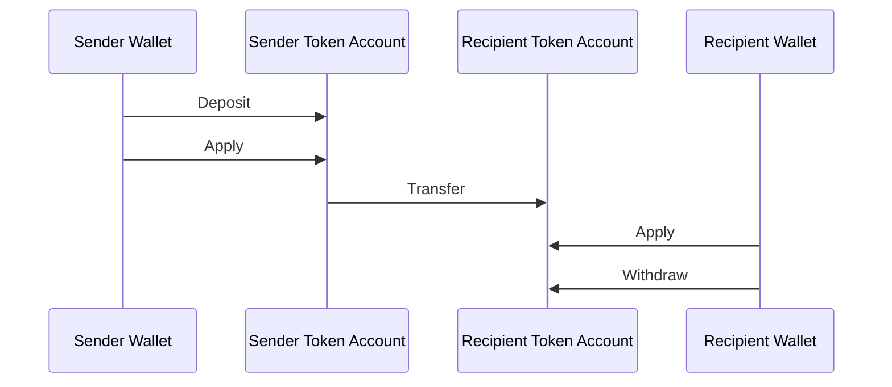
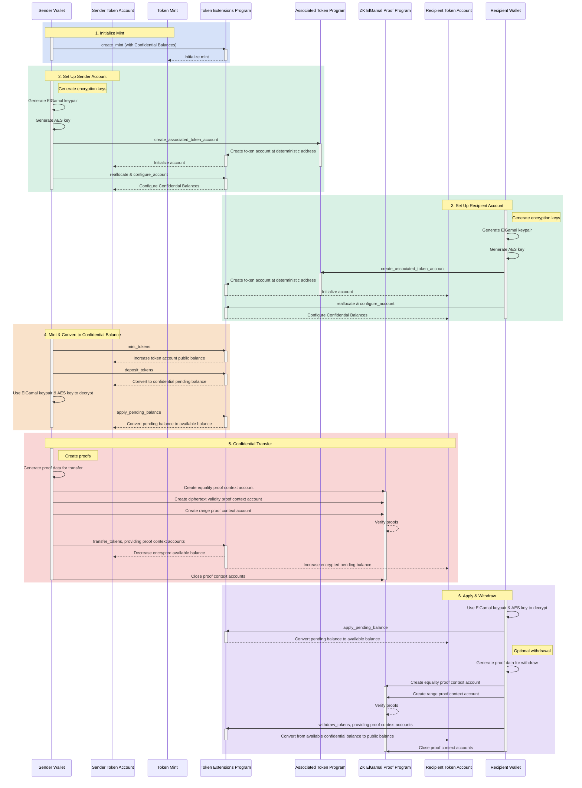

## Was sind Confidential Balances?

<Embed url="https://youtu.be/Bqs95tFcRIU" />

Confidential Balances ist eine Token-2022-Erweiterung, mit der Sie Token zwischen token accounts übertragen können, ohne den Transferbetrag offenzulegen. Dies ist nützlich für datenschutzwahrende Transaktionen. Nur Transferbeträge und Token-Guthaben sind privat. Die Adressen der token accounts bleiben öffentlich.

- [Protokollübersicht](https://www.solana-program.com/docs/confidential-balances/overview) -
  Details zum zugrunde liegenden kryptografischen Protokoll
- [Schnellstartanleitung](https://www.solana-program.com/docs/confidential-balances#setup) -
  Einrichtung und grundlegende CLI-Befehle
- [Confidential Balances Cookbook](https://github.com/solana-developers/Confidential-Balances-Sample) -
  Code-Snippets, die zeigen, wie Confidential Balances verwendet werden

### Wie funktioniert es?

Die Confidential Balances-Erweiterung fügt dem Token Extension Program
[ Anweisungen](https://github.com/solana-program/token-2022/blob/efd0c957fefbd79882d77df5fb2dac88c001249c/program/src/extension/confidential_transfer/instruction.rs#L29)
hinzu, mit denen Sie Token zwischen Konten übertragen können, ohne den Transferbetrag offenzulegen.

```mermaid title="Confidential Balances Basic Overview"
    sequenceDiagram

    participant A as Sender Wallet
    participant AA as Sender Token Account
    participant BB as Recipient Token Account
    participant B as Recipient Wallet

    A->>AA: Deposit
    A->>AA: Apply

    AA->>BB: Transfer
    B->>BB: Apply

    B->>BB: Withdraw

```

Der grundlegende Ablauf vertraulicher Token-Transfers ist wie folgt:

1. Erstellen Sie einen mint account mit aktivierten Confidential Balances.
2. Erstellen Sie token accounts mit aktivierten Confidential Balances für den Sender und
   den Empfänger.
3. Prägen Sie Token auf das Sender-Konten.
4. **Einzahlen** des öffentlichen Guthabens des Senders auf das **vertrauliche
   ausstehende Guthaben**.
5. **Anwenden** des ausstehenden Guthabens des Senders auf das **vertrauliche
   verfügbare Guthaben**.
6. Vertrauliches **Übertragen** von Token vom sender token account zum recipient
   token account.
7. **Anwenden** des ausstehenden Guthabens des Empfängers auf das **vertrauliche
   verfügbare Guthaben**.
8. **Abheben** des vertraulichen verfügbaren Guthabens des Empfängers auf das
   **öffentliche Guthaben**.

### Prüferschlüssel

Ein Confidential Balances-Mint kann einen optionalen globalen ElGamal-Public-Key für Prüfer speichern. Wenn einer konfiguriert ist, enthält jede vertrauliche Übertragung den für Sender, Empfänger und Prüfer verschlüsselten Betrag. Der Übertragungsnachweis verifiziert, dass alle drei Chiffretexte denselben Betrag enthalten. Die Öffentlichkeit kann den Betrag weiterhin nicht lesen, aber der Inhaber des geheimen Prüferschlüssels kann Transferbeträge für diesen Mint entschlüsseln.

Die Confidential Balances-Autorität legt den Prüferschlüssel bei der Initialisierung der Erweiterung fest oder ändert ihn später mit _rs`UpdateMint`_. Die Autorität kann den Schlüssel rotieren oder löschen. Eine Rotation gilt nur für zukünftige Übertragungen. Bewahren Sie daher frühere geheime Schlüssel auf, wenn ein historischer Prüfzugang erforderlich ist. Prüferschlüssel gewähren Lesezugriff; sie autorisieren keine Token-Übertragungen und geben nicht das vollständige vertrauliche Guthaben eines Kontos preis.

Beispiele zur Einrichtung und Rotation finden Sie unter
[Einen Prüfer konfigurieren](/docs/tokens/extensions/confidential-transfer/issuer-guide#configure-an-auditor).
Wallets, Explorer, Börsen und Compliance-Anbieter sollten außerdem die
[Integrationshinweise für Prüfer](/docs/tokens/extensions/confidential-transfer/integration-guide#auditors-and-compliance) lesen.

Weitere Details zu den Schritten im vertraulichen Transfer-Ablauf finden Sie auf
den entsprechenden Seiten:

<Cards>
  <Card
    title="Mint Account erstellen"
    href="/docs/tokens/extensions/confidential-transfer/create-mint"
  >
    So erstellen Sie einen mint account mit aktivierten Confidential Balances
  </Card>
  <Card
    title="Token Account erstellen"
    href="/docs/tokens/extensions/confidential-transfer/create-token-account"
  >
    So konfigurieren Sie ein token account mit aktivierten Confidential Balances
  </Card>
  <Card
    title="Token einzahlen"
    href="/docs/tokens/extensions/confidential-transfer/deposit-tokens"
  >
    So zahlen Sie Token auf das vertrauliche ausstehende Guthaben ein
  </Card>
  <Card
    title="Ausstehendes Guthaben anwenden"
    href="/docs/tokens/extensions/confidential-transfer/apply-pending-balance"
  >
    So wenden Sie ausstehendes Guthaben auf das verfügbare vertrauliche Guthaben
    an
  </Card>
  <Card
    title="Token abheben"
    href="/docs/tokens/extensions/confidential-transfer/withdraw-tokens"
  >
    So heben Sie Token vom vertraulichen verfügbaren Guthaben ab
  </Card>
  <Card
    title="Token übertragen"
    href="/docs/tokens/extensions/confidential-transfer/transfer-tokens"
  >
    So übertragen Sie Token vertraulich zwischen token accounts
  </Card>
  <Card
    title="Integrationsleitfaden"
    href="/docs/tokens/extensions/confidential-transfer/integration-guide"
  >
    Wie Wallets, Explorer und Börsen Confidential Balances-Token unterstützen können
  </Card>
  <Card
    title="Emittentenleitfaden"
    href="/docs/tokens/extensions/confidential-transfer/issuer-guide"
  >
    So geben Sie ein Confidential Balances-Token aus und verwalten es (Genehmigungsrichtlinie, Prüfer, Fee, Mint und Burn)
  </Card>
</Cards>

Das folgende Diagramm zeigt eine detaillierte Abfolge des grundlegenden Ablaufs
für vertrauliche Token-Transfers:

```mermaid title="Confidential Balances Detailed Overview"
sequenceDiagram
    participant Sender as Sender Wallet
    participant SenderAccount as Sender Token Account
    participant Mint as Token Mint
    participant Token22 as Token Extensions Program
    participant ATAProgram as Associated Token Program
    participant ElGamal as ZK ElGamal Proof Program
    participant RecipientAccount as Recipient Token Account
    participant Recipient as Recipient Wallet

    rect rgba(120, 160, 235, 0.3)
    Note over Sender,Mint: 1. Initialize Mint

    activate Sender
    Sender->>Token22: create_mint (with Confidential Balances)
    activate Token22
    Token22-->>Mint: Initialize mint
    deactivate Token22
    deactivate Sender
    end

    rect rgba(130, 210, 170, 0.3)
    Note over Sender,SenderAccount: 2. Set Up Sender Account

    activate Sender
    Note right of Sender: Generate encryption keys
    Sender->>Sender: Generate ElGamal keypair
    Sender->>Sender: Generate AES key

    Sender->>ATAProgram: create_associated_token_account
    activate ATAProgram
    ATAProgram->>Token22: Create token account at deterministic address
    activate Token22
    Token22-->>SenderAccount: Initialize account
    deactivate Token22
    deactivate ATAProgram

    Sender->>Token22: reallocate & configure_account
    activate Token22
    Token22-->>SenderAccount: Configure Confidential Balances
    deactivate Token22
    deactivate Sender
    end

    rect rgba(130, 210, 170, 0.3)
    Note over Recipient,RecipientAccount: 3. Set Up Recipient Account

    activate Recipient
    Note right of Recipient: Generate encryption keys
    Recipient->>Recipient: Generate ElGamal keypair
    Recipient->>Recipient: Generate AES key

    Recipient->>ATAProgram: create_associated_token_account
    activate ATAProgram
    ATAProgram->>Token22: Create token account at deterministic address
    activate Token22
    Token22-->>RecipientAccount: Initialize account
    deactivate Token22
    deactivate ATAProgram

    Recipient->>Token22: reallocate & configure_account
    activate Token22
    Token22-->>RecipientAccount: Configure Confidential Balances
    deactivate Token22
    deactivate Recipient
    end

    rect rgba(235, 160, 80, 0.3)
    Note over Sender,SenderAccount: 4. Mint & Convert to Confidential Balance

    activate Sender
    Sender->>Token22: mint_tokens
    activate Token22
    Token22-->>SenderAccount: Increase token account public balance
    deactivate Token22

    Sender->>Token22: deposit_tokens
    activate Token22
    Token22-->>SenderAccount: Convert to confidential pending balance
    deactivate Token22

    Sender->>Sender: Use ElGamal keypair & AES key to decrypt
    Sender->>Token22: apply_pending_balance
    activate Token22
    Token22-->>SenderAccount: Convert pending balance to available balance
    deactivate Token22
    deactivate Sender
    end

    rect rgba(235, 120, 120, 0.3)
    Note over Sender,RecipientAccount: 5. Confidential Transfer

    activate Sender
    Note right of Sender: Create proofs
    Sender->>Sender: Generate proof data for transfer

    Sender->>ElGamal: Create equality proof context account
    activate ElGamal
    Sender->>ElGamal: Create ciphertext validity proof context account
    Sender->>ElGamal: Create range proof context account
    ElGamal-->>ElGamal: Verify proofs

    Sender->>Token22: transfer_tokens, providing proof context accounts
    activate Token22
    Token22-->>SenderAccount: Decrease encrypted available balance
    Token22-->>RecipientAccount: Increase encrypted pending balance
    deactivate Token22

    Sender->>ElGamal: Close proof context accounts
    deactivate ElGamal
    deactivate Sender
    end

    rect rgba(180, 150, 235, 0.3)
    Note over Recipient,RecipientAccount: 6. Apply & Withdraw

    activate Recipient
    Recipient->>Recipient: Use ElGamal keypair & AES key to decrypt
    Recipient->>Token22: apply_pending_balance
    activate Token22
    Token22-->>RecipientAccount: Convert pending balance to available balance
    deactivate Token22

    Note right of Recipient: Optional withdrawal
    Recipient->>Recipient: Generate proof data for withdraw

    Recipient->>ElGamal: Create equality proof context account
    activate ElGamal
    Recipient->>ElGamal: Create range proof context account
    ElGamal-->>ElGamal: Verify proofs

    Recipient->>Token22: withdraw_tokens, providing proof context accounts
    activate Token22
    Token22-->>RecipientAccount: Convert from available confidential balance to public balance
    deactivate Token22

    Recipient->>ElGamal: Close proof context accounts
    deactivate ElGamal
    deactivate Recipient
    end
```

## Confidential Balances Anweisungen

Die vollständige Liste der Confidential Balances-Erweiterungs-
[ Anweisungen](https://github.com/solana-program/token-2022/blob/efd0c957fefbd79882d77df5fb2dac88c001249c/program/src/extension/confidential_transfer/instruction.rs#L29)
lautet wie folgt:

| Instruction                         | Beschreibung                                                                                                                                                       |
| ----------------------------------- | ----------------------------------------------------------------------------------------------------------------------------------------------------------------- |
| _rs`InitializeMint`_                | Aktiviert Confidential Balances auf einem mint account. Diese Anweisung muss in derselben Transaktion wie die _rs`TokenInstruction::InitializeMint`_-Anweisung enthalten sein. |
| _rs`UpdateMint`_                    | Aktualisiert die Kontogenehmigungsrichtlinie des Mints sowie den optionalen globalen ElGamal-Public-Key für Prüfer.                                                                        |
| _rs`ConfigureAccount`_              | Aktiviert Confidential Balances auf einem token account.                                                                                                                 |
| _rs`ApproveAccount`_                | Genehmigt ein token account für Confidential Balances, wenn der Mint eine Genehmigung für neue token accounts erfordert.                                                          |
| _rs`EmptyAccount`_                  | Leert die ausstehenden und verfügbaren vertraulichen Salden, um das Schließen eines token account zu ermöglichen.                                                                         |
| _rs`Deposit`_                       | Wandelt das öffentliche Token-Guthaben in ein ausstehendes vertrauliches Guthaben um.                                                                                                  |
| _rs`Withdraw`_                      | Wandelt verfügbares vertrauliches Guthaben zurück in öffentliches Guthaben um.                                                                                                   |
| _rs`Transfer`_                      | Überträgt Token vertraulich zwischen token accounts.                                                                                                           |
| _rs`ApplyPendingBalance`_           | Wandelt ausstehende Guthaben nach Einzahlungen oder Transfers in verfügbare Guthaben um.                                                                                      |
| _rs`EnableConfidentialCredits`_     | Ermöglicht einem token account, vertrauliche Token-Transfers zu empfangen.                                                                                                   |
| _rs`DisableConfidentialCredits`_    | Blockiert eingehende vertrauliche Transfers, erlaubt jedoch weiterhin öffentliche Transfers.                                                                                     |
| _rs`EnableNonConfidentialCredits`_  | Ermöglicht einem token account, öffentliche Token-Transfers zu empfangen.                                                                                                         |
| _rs`DisableNonConfidentialCredits`_ | Blockiert reguläre Transfers, sodass Konten nur vertrauliche Transfers empfangen können.                                                                                     |
| _rs`TransferWithFee`_               | Überträgt Token vertraulich zwischen token accounts mit einer Gebühr.                                                                                                |
| _rs`ConfigureAccountWithRegistry`_  | Alternative Methode zur Konfiguration von token accounts für Confidential Balances unter Verwendung eines _rs`ElGamalRegistry`_-Kontos anstelle eines _rs`VerifyPubkeyValidity`_-Nachweises.         |
