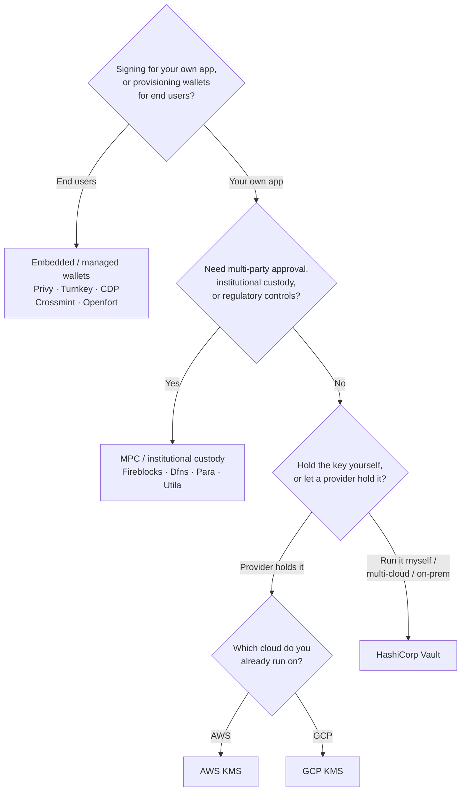

Keychain stellt eine einheitliche `SolanaSigner`-Schnittstelle für alle Backends
bereit, daher ist die Wahl operativer, nicht architektonischer Natur — Sie
können sie später durch Konfiguration ändern. Deshalb gilt: **Starten Sie von
Ihren Anforderungen, nicht von einem Produkt.** Zwei Fragen entscheiden das
meiste: _Wo liegt der private Schlüssel, und wer darf eine Signatur damit
autorisieren?_

Es gibt kein einziges bestes Backend. Jedes eignet sich besser für einen
bestimmten Satz von Einschränkungen — die Cloud, auf der Sie bereits arbeiten,
ob Sie Key-Infrastruktur betreiben möchten und welche Verwahrунgs- und
Genehmigungskontrollen Sie benötigen. Der nachfolgende Ablauf ordnet diese
Einschränkungen einem Backend zu.

<Callout type="info">
  Dieser Leitfaden behandelt das Backend-Signing (serverseitig). Wenn Ihre
  Endnutzer eigene Transaktionen in einem Browser signieren, verwenden Sie
  stattdessen eine Wallet über den Wallet Standard — siehe [Signing in
  Production](/docs/core/transactions/signing-in-production).
</Callout>

## Entscheidungsablauf

<Callout type="info">
  Lokale Entwicklung und Tests benötigen nichts davon — verwenden Sie das
  **Memory**-Backend für Prototypen und wechseln Sie dann über die Konfiguration
  zu einem der oben genannten Produktions-Backends.
</Callout>

## Die Fragen durchgehen

<Steps>

<Step>

### Signieren Sie für Ihre eigene Anwendung oder für Ihre Endnutzer?

Wenn Sie Wallets bereitstellen, die **Endnutzer** besitzen und betreiben
(Consumer-Apps, Onboarding-Flows), verwenden Sie ein **eingebettetes /
verwaltetes Wallet**-Backend — Privy, Turnkey, CDP, Crossmint oder Openfort.
Diese verwalten benutzerindividuelle Wallets und die Authentifizierung in Ihrem
Auftrag.

Wenn Sie als **Ihre eigene Anwendung** signieren — ein Gebührenzahler, eine
Schatzkammer, eine Backend-Automatisierung — fahren Sie unten fort.

</Step>

<Step>

### Benötigen Sie eine Mehrparteien-Genehmigung, institutionelle Verwahrung oder regulatorische Kontrollen?

Wenn Signaturen eine Genehmigungsrichtlinie, ein Ausgabenlimit oder einen
Compliance-Workflow durchlaufen müssen, bevor sie erzeugt werden — oder Sie
einen regulierten Verwahrer benötigen, der die Schlüssel verwahrt — verwenden
Sie ein **MPC / institutionelles Verwahrung**-Backend: Fireblocks, Dfns, Para
oder Utila. Diese teilen oder verwahren den Schlüssel und co-signieren gemäß
Ihrer Richtlinie.

Wenn Sie nur einen Schlüssel benötigen, der auf Anfrage signiert, fahren Sie
unten fort.

</Step>

<Step>

### Möchten Sie den Schlüssel selbst verwahren oder von einem Anbieter verwahren lassen?

Wenn ein Cloud-Anbieter den Schlüssel in hardwaregestützter Infrastruktur
verwahren soll und Ihre IAM-Richtlinie kontrolliert, wer signieren darf,
verwenden Sie den KMS dieses Cloud-Anbieters:

- **Betrieb auf AWS** → AWS KMS
- **Betrieb auf GCP** → GCP KMS

Wenn Sie die Schlüsselinfrastruktur selbst betreiben möchten — oder Sie eine
Multi-Cloud- oder On-Premises-Umgebung haben — verwenden Sie **HashiCorp
Vault**. Sie betreiben und prüfen es; der Schlüssel verbleibt in der
Transit-Engine und signiert auf Anfrage.

</Step>

</Steps>

## Verwahrungsmodelle

Die Backends lassen sich in fünf Verwahrungsmodelle einteilen. Der obige Ablauf
führt Sie zu einem davon.

- **Eigenverwaltung (In-Process)** — Ihre Anwendung hält den rohen privaten
  Schlüssel. Praktisch für die Entwicklung, jedoch ungeeignet für den
  Produktionsbetrieb. Backend: **Memory**.
- **Selbst gehostetes Schlüsselmanagement** — Sie betreiben die
  Schlüsselinfrastruktur; der Schlüssel verbleibt darin und signiert auf
  Anfrage. Backend: **HashiCorp Vault**.
- **Cloud KMS / HSM** — ein Cloud-Anbieter speichert den Schlüssel in
  hardwaregestützter Infrastruktur; der Schlüssel verlässt den Dienst nie und
  Ihre IAM-Richtlinie kontrolliert, wer signieren darf. Backends: **AWS KMS**,
  **GCP KMS**.
- **MPC & institutionelle Verwahrung** — der Schlüssel wird aufgeteilt oder über
  einen Anbieter verwahrt, der gemäß Ihrer Richtlinie co-signiert
  (Genehmigungen, Limits). Backends: **Fireblocks**, **Dfns**, **Para**,
  **Utila**.
- **Eingebettete & verwaltete Wallets** — ein Anbieter verwaltet Wallets in
  Ihrem Auftrag, häufig zur Onboardierung von Endnutzern. Backends: **Privy**,
  **Turnkey**, **CDP**, **Crossmint**, **Openfort**.

## Backend-Vergleich

| Backend         | Verwahrungsmodell                 | Am besten geeignet für                                | Hinweise                                                      |
| --------------- | --------------------------------- | ----------------------------------------------------- | ------------------------------------------------------------- |
| Memory          | Eigenverwaltung (In-Process)      | Lokale Entwicklung, Tests, CI                         | Rohschlüssel im Prozess – nicht in Produktion verwenden       |
| HashiCorp Vault | Self-Hosted Key Management        | Teams mit eigener Schlüsselinfrastruktur              | Transit Engine; Sie betreiben und prüfen es selbst            |
| AWS KMS         | Cloud KMS / HSM                   | Backends auf AWS                                      | Schlüssel verlässt KMS nie; IAM steuert das Signieren         |
| GCP KMS         | Cloud KMS / HSM                   | Backends auf GCP                                      | Schlüssel verlässt KMS nie; IAM steuert das Signieren         |
| Fireblocks      | MPC / institutionelle Verwahrung  | Treasuries, Börsen, regulierte Verwahrung             | Policy Engine und Genehmigungsworkflows                       |
| Dfns            | MPC-Wallet-Infrastruktur          | Programmgesteuerte Wallets mit Richtlinienkontrollen  | Ed25519-Signierung                                            |
| Para            | MPC-Wallets                       | Apps, die MPC-gestützte Wallets wünschen              | API-Schlüssel + Wallet-ID                                     |
| Utila           | MPC-Verwahrung + Co-Signer        | Bestehende Utila-verwaltete Solana-Wallets            | `signMessage` nicht unterstützt; Sie übertragen die Tx selbst |
| Privy           | Eingebettete Wallets              | Consumer-Apps zur Wallet-Einführung für Nutzer        | App-verwaltete eingebettete Wallets                           |
| Turnkey         | Nicht-verwahrendes Key Management | Programmgesteuertes, richtliniengesteuertes Signieren | Nicht-verwahrendes Key Management                             |
| CDP             | Verwaltete Wallet (Coinbase)      | Apps auf der Coinbase Developer Platform              | `signMessage` akzeptiert nur UTF-8-Payloads                   |
| Crossmint       | Verwaltete Wallets                | Marktplätze und Apps mit verwalteten Wallets          | `smart` und `mpc` Wallets; `signMessage` nicht unterstützt    |
| Openfort        | Eingebettete Backend-Wallets      | Serverseitige Wallets                                 | TEE-gespeicherte Schlüssel                                    |

## Enterprise-Szenarien

Eine einzelne Anwendung benötigt häufig mehrere dieser Optionen gleichzeitig. Da
die Schnittstelle identisch ist, können Sie pro Rolle ein anderes Backend
betreiben, ohne die Aufrufstellen ändern zu müssen.

- **Treasury-Operationen** — trennen Sie einen operativen "Hot"-Signer von einem
  "Cold"-Treasury-Signer. Sichern Sie den Treasury mit MPC-Verwahrung oder einem
  Cloud-HSM ab und verlangen Sie Genehmigungsrichtlinien vor hochwertigen
  Signaturen.
- **Genehmigungsworkflows** — MPC- und Verwahrungsbackends (z. B. Fireblocks)
  erzwingen eine mehrseitige Genehmigung, bevor eine Signatur erstellt wird.
- **Compliance und Audit** — Cloud-KMS (AWS/GCP) und Vault erstellen
  Signatur-Audit-Logs; institutionelle Verwahrer ergänzen
  Richtliniendurchsetzung und Berichterstattung.
- **Regulierte Umgebungen** — bewahren Sie Schlüsselmaterial in einem HSM, KMS
  oder bei einem institutionellen Verwahrer auf, sodass rohe Schlüssel Ihre
  Anwendung niemals berühren.

Siehe
[Best Practices für den Produktionsbetrieb](/docs/tools/keychain/production-best-practices)
für den sicheren Betrieb dieser Backends.

<Cards>
  <Card title="Rust-Leitfaden" href="/docs/tools/keychain/getting-started/rust">
    Konfigurieren Sie jedes Backend in Rust.
  </Card>
  <Card
    title="TypeScript-Leitfaden"
    href="/docs/tools/keychain/getting-started/typescript"
  >
    Konfigurieren Sie jedes Backend in TypeScript.
  </Card>
</Cards>
