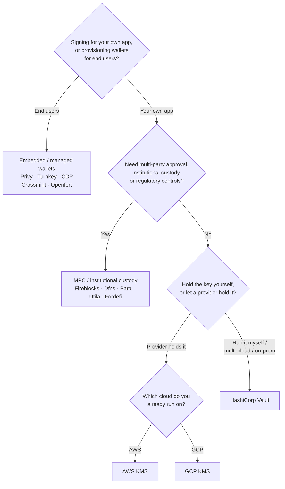

Keychain stellt über alle Backends hinweg ein gemeinsames `SolanaSigner`-Basisinterface
bereit. Bei den meisten Backends ist die Wahl daher eine betriebliche und keine
architektonische Entscheidung: Sie können sie später per Konfiguration ändern.
Ausgenommen ist die Transaktionsform. Crossmint und der native Auto-Modus von
Fordefi signieren und senden serverseitig, und der native manuelle Modus von Fordefi
schreibt die Transaktion vor dem Signieren um. Ein Wechsel zu oder von einem dieser
Modi ändert daher, wie Sie den Signer aufrufen. Deshalb gilt: **Gehen Sie von Ihren
Anforderungen aus, nicht von einem Produkt.** Zwei Fragen entscheiden das meiste:
_Wo liegt der private Schlüssel, und wer darf eine Signatur damit autorisieren?_

Jedes Backend außer Ledger ist in allen vier Sprachen verfügbar (Rust, TypeScript,
Python und Go). Ledger gibt es nur für Rust, hinter dem optionalen Feature `ledger`.

Es gibt kein universell bestes Backend. Jedes passt besser zu einer bestimmten
Kombination von Rahmenbedingungen: zur Cloud, die Sie bereits nutzen, zur Frage, ob
Sie Schlüsselinfrastruktur selbst betreiben möchten, und zu den Verwahrungs- und
Freigabekontrollen, die Sie erfüllen müssen. Der folgende Ablauf ordnet diese
Rahmenbedingungen einem Backend zu.

<Callout type="info">
  Dieser Leitfaden behandelt das Signieren über das Backend (serverseitig). Wenn Ihre
  Endnutzer ihre Transaktionen selbst in einem Browser signieren, verwenden Sie stattdessen
  eine Wallet über den Wallet Standard. Siehe [Signing in
  Production](/docs/core/transactions/signing-in-production).
</Callout>

## Entscheidungsablauf

```mermaid title="Choosing a Keychain backend"
flowchart TD
    Start{Signing for your own app,<br/>or provisioning wallets<br/>for end users?}
    Start -->|End users| Managed[Embedded / managed wallets<br/>Privy · Turnkey · CDP<br/>Crossmint · Openfort]
    Start -->|Your own app| Q2{Need multi-party approval,<br/>institutional custody,<br/>or regulatory controls?}
    Q2 -->|Yes| MPC[MPC / institutional custody<br/>Fireblocks · Dfns · Para · Utila · Fordefi]
    Q2 -->|No| Q3{Hold the key yourself,<br/>or let a provider hold it?}
    Q3 -->|Provider holds it| Q4{Which cloud do you<br/>already run on?}
    Q4 -->|AWS| AWS[AWS KMS]
    Q4 -->|GCP| GCP[GCP KMS]
    Q3 -->|Run it myself /<br/>multi-cloud / on-prem| Vault[HashiCorp Vault]
```

<Callout type="info">
  Für lokale Entwicklung und Tests brauchen Sie nichts davon: Verwenden Sie das
  **Memory**-Backend für Prototypen und wechseln Sie dann per Konfiguration zu einem
  der oben genannten Produktions-Backends.
</Callout>

## Die Fragen durchgehen

<Steps>

<Step>

### Signieren Sie für Ihre eigene Anwendung oder für Ihre Endnutzer?

Wenn Sie Wallets bereitstellen, die **Endnutzern** gehören und von ihnen verwendet
werden (Consumer-Apps, Onboarding-Flows), nutzen Sie ein Backend für **eingebettete /
verwaltete Wallets**: Privy, Turnkey, CDP, Crossmint oder Openfort. Diese verwalten
Wallets und Authentifizierung pro Nutzer in Ihrem Auftrag.

Wenn Sie als **Ihre eigene Anwendung** signieren (Fee Payer, Treasury,
Backend-Automatisierung), lesen Sie unten weiter.

</Step>

<Step>

### Benötigen Sie Mehrparteien-Freigaben, institutionelle Verwahrung oder regulatorische Kontrollen?

Wenn Signaturen vor ihrer Erstellung eine Freigaberichtlinie, ein Ausgabenlimit oder
einen Compliance-Workflow durchlaufen müssen oder wenn ein regulierter Verwahrer die
Schlüssel halten soll, nutzen Sie ein **MPC- / institutionelles Verwahrungs**-Backend:
Fireblocks, Dfns, Para, Utila oder Fordefi. Diese teilen den Schlüssel auf oder
verwahren ihn und signieren gemäß Ihrer Richtlinie mit.

Wenn Sie lediglich einen Schlüssel benötigen, der auf Anfrage signiert, lesen Sie
unten weiter.

</Step>

<Step>

### Möchten Sie den Schlüssel selbst halten oder von einem Anbieter halten lassen?

Wenn ein Cloud-Anbieter den Schlüssel in hardwaregestützter Infrastruktur halten soll
und Ihre IAM-Richtlinie steuert, wer signieren darf, nutzen Sie das KMS der jeweiligen
Cloud:

- **Betrieb auf AWS** → AWS KMS
- **Betrieb auf GCP** → GCP KMS

Wenn Sie die Schlüsselinfrastruktur selbst betreiben möchten oder Multi-Cloud bzw.
On-Premises arbeiten, nutzen Sie **HashiCorp Vault**. Sie betreiben und prüfen es
selbst; der Schlüssel verbleibt in der Transit-Engine und signiert auf Anfrage.

</Step>

</Steps>

## Verwahrungsmodelle

Die Backends gliedern sich in sechs Verwahrungsmodelle. Der obige Ablauf führt Sie zu
einem davon.

- **Selbstverwahrung (In-Process)**: Ihre Anwendung hält den rohen privaten Schlüssel.
  Praktisch für die Entwicklung, aber für die Produktion ungeeignet. Backend:
  **Memory**.
- **Selbstverwahrung (Hardware-Wallet)**: Der Schlüssel verlässt das Ledger-Gerät nie,
  und eine Person bestätigt jede Signatur auf dem Display. Geeignet für interaktives
  Signieren durch Operatoren, nicht für unbeaufsichtigte Dienste. Nur Rust, optional
  und nicht vom Audit abgedeckt. Backend: **Ledger**.
- **Selbst gehostetes Schlüsselmanagement**: Sie betreiben die Schlüsselinfrastruktur;
  der Schlüssel verbleibt darin und signiert auf Anfrage. Backend: **HashiCorp Vault**.
- **Cloud-KMS / HSM**: Ein Cloud-Anbieter speichert den Schlüssel in
  hardwaregestützter Infrastruktur; der Schlüssel verlässt den Dienst nie, und Ihre
  IAM-Richtlinie steuert, wer signieren darf. Backends: **AWS KMS**, **GCP KMS**.
- **MPC und institutionelle Verwahrung**: Der Schlüssel wird aufgeteilt oder bei einem
  Anbieter verwahrt, der gemäß Ihrer Richtlinie (Freigaben, Limits) mitsigniert.
  Backends: **Fireblocks**, **Dfns**, **Para**, **Utila**, **Fordefi**.
- **Eingebettete und verwaltete Wallets**: Ein Anbieter verwaltet Wallets in Ihrem
  Auftrag, oft zum Onboarding von Endnutzern. Backends: **Privy**, **Turnkey**, **CDP**,
  **Crossmint**, **Openfort**.

## Backend-Vergleich

| Backend         | Verwahrungsmodell                  | Am besten geeignet für                                     | Hinweise                                                                                                              |
| --------------- | ------------------------------ | -------------------------------------------- | ------------------------------------------------------------------------------------------------------------------ |
| Memory          | Eigenverwaltung (In-Process)      | Lokale Entwicklung, Tests, CI                 | Roher Schlüssel im Prozess; nicht in der Produktion verwenden                                                                       |
| Ledger          | Selbstverwahrung (Hardware-Wallet) | Interaktives Signieren durch Operatoren über Rust-Tools | Nur Rust, optionales Feature `ledger`, ungeprüft; jede Signatur wird auf dem Gerät bestätigt                                 |
| HashiCorp Vault | Self-Hosted Key Management     | Teams mit eigener Schlüsselinfrastruktur   | Transit Engine; Sie betreiben und prüfen es selbst                                                                           |
| AWS KMS         | Cloud KMS / HSM                | Backends auf AWS                      | Schlüssel verlässt KMS nie; IAM steuert das Signieren                                                                         |
| GCP KMS         | Cloud KMS / HSM                | Backends auf GCP                      | Schlüssel verlässt KMS nie; IAM steuert das Signieren                                                                         |
| Fireblocks      | MPC / institutionelle Verwahrung    | Treasuries, Börsen, regulierte Verwahrung     | Policy Engine und Genehmigungsworkflows                                                                               |
| Dfns            | MPC-Wallet-Infrastruktur      | Programmgesteuerte Wallets mit Richtlinienkontrollen    | Ed25519-Signierung                                                                                                    |
| Para            | MPC-Wallets                    | Apps, die MPC-gestützte Wallets wünschen            | API-Schlüssel + Wallet-ID                                                                                                |
| Utila           | MPC-Verwahrung + Co-Signer        | Bestehende Utila-verwaltete Solana-Wallets        | `signMessage` nicht unterstützt; Sie übertragen die Tx selbst                                                                    |
| Fordefi         | MPC / institutionelle Verwahrung    | Institutionelle Verwahrung mit Richtlinienkontrollen   | Black Box: Sie senden. Nativ automatisch: Fordefi schreibt um und sendet. Nativ manuell: Fordefi schreibt um, Sie senden das Ergebnis |
| Privy           | Eingebettete Wallets               | Consumer-Apps zur Wallet-Einführung für Nutzer    | App-verwaltete eingebettete Wallets                                                                                       |
| Turnkey         | Nicht-verwahrendes Key Management   | Programmgesteuertes, richtliniengesteuertes Signieren           | Nicht-verwahrendes Key Management                                                                                       |
| CDP             | Verwaltete Wallet (Coinbase)      | Apps auf der Coinbase Developer Platform      | `signMessage` akzeptiert nur UTF-8-Payloads                                                                          |
| Crossmint       | Verwaltete Wallets                | Marktplätze und Apps mit verwalteten Wallets         | Nur Senden: sendet serverseitig, kann für Gas-Sponsoring umschreiben; `signMessage` nicht unterstützt                   |
| Openfort        | Eingebettete Backend-Wallets       | Serverseitige Wallets                          | TEE-gespeicherte Schlüssel                                                                                                    |

## Funktionsumfang und Transaktionsform

Über die Verwahrung hinaus hat jedes Backend genau eine Transaktionsform, und sie
bestimmt, wie Sie den Signer aufrufen:

- **Signieren**: Der Anbieter signiert die von Ihnen erstellten Bytes, und Sie senden sie
  selbst. Die meisten Backends, einschließlich Ledger und Fordefi im Black-Box-Modus.
- **Umschreiben und signieren**: Der Anbieter schreibt die Transaktion um und signiert
  sie, ohne sie zu senden. Machen Sie mit der zurückgegebenen Transaktion weiter.
  Fordefi im nativen manuellen Modus.
- **Signieren und senden**: Der Anbieter signiert und sendet serverseitig, sodass ein
  Fehler nicht bedeutet, dass nichts angekommen ist. Crossmint und Fordefi im nativen
  Auto-Modus.

Die Tabelle der Signer-Fähigkeiten in der README jeder Sprache listet die Form jedes
Backends auf; das
[Sicherheitsmodell](https://github.com/solana-foundation/solana-keychain/blob/main/docs/SECURITY_MODEL.md)
erklärt, was jede Form garantiert.

## Enterprise-Szenarien

Eine einzelne Anwendung benötigt oft mehrere davon gleichzeitig. Da das Interface
gemeinsam genutzt wird, können Sie pro Rolle ein anderes Backend einsetzen, ohne die
Aufrufstellen zu ändern, solange die Backends dieselbe Transaktionsform haben.

- **Treasury-Operationen** — trennen Sie einen operativen "Hot"-Signer von einem
  "Cold"-Treasury-Signer. Sichern Sie den Treasury mit MPC-Verwahrung oder einem
  Cloud-HSM ab und verlangen Sie Genehmigungsrichtlinien vor hochwertigen
  Signaturen.
- **Genehmigungsworkflows** — MPC- und Verwahrungsbackends (z. B. Fireblocks)
  erzwingen eine mehrseitige Genehmigung, bevor eine Signatur erstellt wird.
- **Compliance und Audit** — Cloud-KMS (AWS/GCP) und Vault erstellen
  Signatur-Audit-Logs; institutionelle Verwahrer ergänzen
  Richtliniendurchsetzung und Berichterstattung.
- **Regulierte Umgebungen** — bewahren Sie Schlüsselmaterial in einem HSM, KMS
  oder bei einem institutionellen Verwahrer auf, sodass rohe Schlüssel Ihre
  Anwendung niemals berühren.

Siehe
[Best Practices für den Produktionsbetrieb](/docs/tools/keychain/production-best-practices)
für den sicheren Betrieb dieser Backends.

<Cards>
  <Card title="Rust-Leitfaden" href="/docs/tools/keychain/getting-started/rust">
    Konfigurieren Sie jedes Backend in Rust.
  </Card>
  <Card
    title="TypeScript-Leitfaden"
    href="/docs/tools/keychain/getting-started/typescript"
  >
    Konfigurieren Sie jedes Backend in TypeScript.
  </Card>
</Cards>
