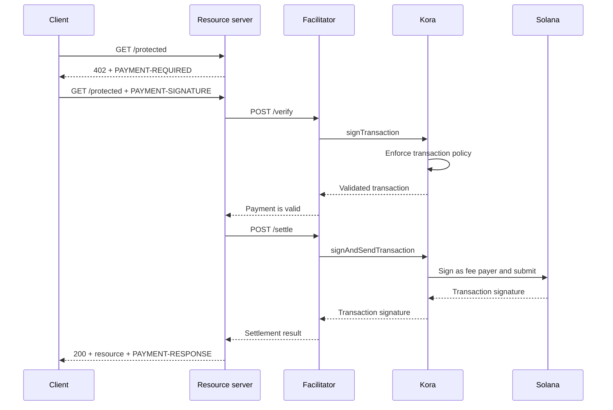

Kora stellt die Solana-Signing-, Transaktionsrichtlinien- und Fee-Sponsoring-Schicht hinter einem [x402-V2-Facilitator](/docs/tools/x402-facilitator) bereit. Der Facilitator implementiert die x402-HTTP-API; Kora validiert, signiert und sendet die akzeptierten Zahlungstransaktionen.

Diese Anleitung startet den Referenz-Kora-Facilitator auf dem Solana Devnet. Es handelt sich um eine Entwicklungsumgebung zum Testen der Integration, kein Produktions-Deployment.

## Architektur



Die vier Anwendungsrollen bleiben getrennt:

- Der **Client** wählt eine Zahlungsanforderung aus und signiert die Zahlungsautorisierung.
- Der **Ressourcenserver** bepreist eine Route und erfüllt sie erst nach erfolgreicher Verifizierung und Abrechnung.
- Der **Facilitator** stellt die x402-Endpunkte `/supported`, `/verify` und `/settle` bereit.
- **Kora** signiert nur Transaktionen, die durch seine Richtlinie erlaubt sind, und kann deren Solana-Netzwerk-Fee sponsern.

Kora ersetzt das x402-Protokoll nicht. Es ist die Signing- und Richtliniengrenze, die von dieser Facilitator-Implementierung verwendet wird.

## Referenz-Facilitator starten

Du benötigst Git und [Docker mit Compose](https://docs.docker.com/compose/). Klone das neueste stabile Kora-Release und wechsle in das x402-Demo-Verzeichnis:

```bash
git clone --branch v2.0.5 --depth 1 https://github.com/solana-foundation/kora.git
cd kora/examples/x402/demo
cp .env.example .env
```

Setze `KORA_PRIVATE_KEY` in `.env` auf ein wegwerfbares Devnet-keypair. Die Signer-Konfiguration des Demos akzeptiert ein Base58-Secret, ein Byte-Array-keypair oder den Pfad zu einer JSON-keypair-Datei. Lade die öffentliche Adresse mit Devnet-SOL auf, damit sie Transaktions-Fee sponsern kann.

<Callout type="caution" title="Wegwerfbaren Devnet-Signer verwenden">
  Das Docker-Demo lädt den Kora-Signer aus einer Umgebungsvariable. Lege keinen Produktions-Signing-Key in dieses Demo und committe die `.env`-Datei nicht.
</Callout>

Starte Kora und den Facilitator:

```bash
docker compose up --build
```

Der erste Build kann einige Minuten dauern. Sobald beide Health-Checks bestehen, prüfe die vom Facilitator beworbenen Fähigkeiten in einem anderen Terminal:

```bash
curl http://127.0.0.1:3000/supported
```

Die Antwort sollte x402-Version `2`, das `exact`-Schema und den Devnet-CAIP-2-Netzwerkbezeichner bewerben:

```json
{
  "kinds": [
    {
      "x402Version": 2,
      "scheme": "exact",
      "network": "solana:EtWTRABZaYq6iMfeYKouRu166VU2xqa1",
      "extra": {
        "feePayer": "<KORA_SIGNER_ADDRESS>"
      }
    }
  ]
}
```

Kora lauscht standardmäßig auf `127.0.0.1:8080` und der Facilitator auf `127.0.0.1:3000`. Stoppe das Demo mit `Ctrl+C`.

## Ressourcenserver verbinden

Konfiguriere den x402-Ressourcenserver so, dass er den lokalen Facilitator und die öffentliche Adresse des Kora-Signers als Empfänger verwendet:

```bash
FACILITATOR_URL=http://127.0.0.1:3000
SOLANA_PAY_TO=<KORA_SIGNER_ADDRESS>
```

Folge dann [x402 auf Solana](/docs/payments/agentic-payments/x402), um x402-V2-Middleware zu einer Express-Route hinzuzufügen. Eine unbezahlte Anfrage erhält `PAYMENT-REQUIRED`, der Wiederholungsversuch trägt `PAYMENT-SIGNATURE` und eine erfolgreiche Antwort trägt `PAYMENT-RESPONSE`.

Kopiere keine Beispiele, die `X-PAYMENT`, `X-PAYMENT-RESPONSE` oder den Netzwerknamen `solana-devnet` verwenden. Diese Felder gehören zu x402 V1.

Das Kora-Repository enthält außerdem eine geschützte API und einen zahlungsfähigen Client im gleichen Verzeichnis `examples/x402/demo`. Verwende diese Anwendungen, wenn du den vollständigen lokalen Ablauf testen möchtest.

## Kora-Richtlinie konfigurieren

Die Referenz-`kora/kora.toml` ist bewusst eng gefasst. Ihre Validierungsrichtlinie steuert:

- welche Solana-Programme der Signer erlaubt;
- welche SPL-Token-Mints verwendet werden dürfen;
- die maximalen gesponserten lamports und die Anzahl der Signaturen;
- welche Fee-Payer-Operationen verboten sind; und
- welche Token-2022-Erweiterungen abgelehnt werden.

Das Demo aktiviert nur die Kora-RPC-Methoden, die der Facilitator benötigt:
`signTransaction`, `signAndSendTransaction`, `getBlockhash`, `getPayerSigner`,
`getConfig` und `getVersion`.

Behandle die Richtlinie als Sicherheitsgrenze für den Fee-Payer-Schlüssel. Für einen Produktionsdienst:

1. Erlaube explizit nur die Programme, Token-Mints und Transaktionsformen, die dein x402-Schema erzeugt.
2. Verbiete Transfers, Berechtigungsänderungen, Konten-Schließung und andere Anweisungen, die Werte vom Kora-Signer verschieben können.
3. Setze Transaktions- und Nutzungslimits, die den Verlust durch kompromittierte Facilitator-Anmeldedaten begrenzen.
4. Verwende ein verwaltetes Signer-Backend anstelle eines in einer Umgebungsvariable gespeicherten privaten Schlüssels.

## Verbindung zwischen Facilitator und Kora absichern

Das Demo aktiviert die Kora-API-Key-Authentifizierung. Der Facilitator sendet den Wert von `KORA_API_KEY`, der mit `[kora.auth].api_key` in `kora.toml` übereinstimmen muss.

Für den Produktionseinsatz außerdem:

- Kora in einem privaten Netzwerk betreiben und TLS an einer vertrauenswürdigen Grenze terminieren;
- API-Anmeldedaten in einem Secret Manager speichern und regelmäßig rotieren;
- die HMAC-Anfrage-Authentifizierung von Kora für Manipulations- und Replay-Schutz in Betracht ziehen;
- Fee-Payer- und Zahlungsempfänger-Schlüssel trennen, wenn das Abrechnungsmodell dies erfordert; und
- Richtlinienablehnungen, Abrechnungsfehler, Fee-Verbrauch und Signer-Guthaben überwachen.

## Zahlungsabwicklung absichern

Kora validiert die Solana-Transaktion, aber Facilitator und Ressourcenserver sind weiterhin für die Korrektheit des x402-Protokolls verantwortlich. Bevor eine Ressource bereitgestellt wird, muss Folgendes durchgesetzt werden:

- die gewählte x402-Version, das Schema, das Netzwerk, den Asset, den Betrag und den Empfänger;
- die Autorisierungslaufzeit und das genaue Solana- Anweisungen-Layout;
- atomarer Replay-Schutz und idempotente Abrechnung;
- Bestätigung auf der vom Produkt geforderten Commitment-Ebene; und
- eine dauerhafte Zuordnung zwischen Kauf, Abrechnungsergebnis und Erfüllung.

Gib keine bezahlten Inhalte zurück, nur weil Kora eine Transaktion zum Signieren akzeptiert hat. Erfülle erst, nachdem der Facilitator ein erfolgreiches Abrechnungsergebnis zurückgibt.

## Verwandte Ressourcen

- [Kora-Repository und x402-Demo](https://github.com/solana-foundation/kora/tree/main/examples/x402/demo)
- [Kora-Operator-Konfiguration](/docs/tools/kora/operators/configuration)
- [Kora-Signer-Backends](/docs/tools/kora/operators/signers)
- [Kora-Sicherheitsaudits](/docs/tools/kora/security-audits)
- [x402-V2-Spezifikation](https://github.com/x402-foundation/x402/blob/main/specs/x402-specification-v2.md)
- [Übersicht über agentische Zahlungen](/docs/payments/agentic-payments)
