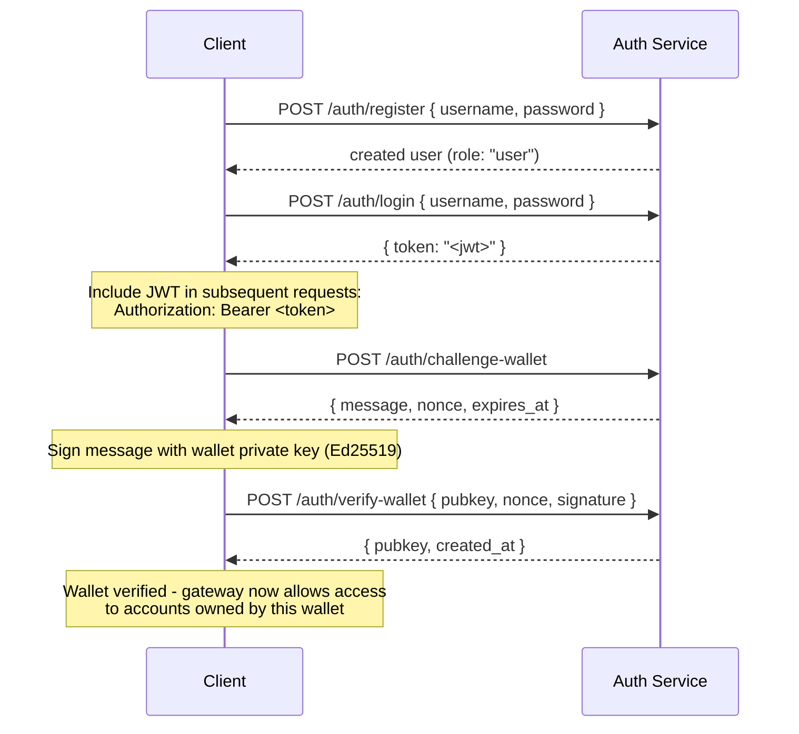

## Übersicht

Private Channels enthält einen optionalen Auth-Service, der den Gateway-Zugang
mit JWT-Authentifizierung und rollenbasierter Zugriffskontrolle (RBAC) absichert. Wenn
die Authentifizierung deaktiviert ist, akzeptiert das Gateway alle Verbindungen. Wenn sie aktiviert ist,
müssen Clients bei jeder Anfrage ein gültiges JWT vorweisen.

Diese Seite richtet sich an zwei Zielgruppen:

- **Entwickler** – Registrierung, Anmeldung, Wallet-Verifizierung und das Durchführen
  authentifizierter Anfragen
- **Operatoren** – Aktivierung des Auth-Service, Konfiguration von `JWT_SECRET` und
  Bereitstellung der `operator`-Rolle

## Authentifizierung aktivieren

Die Authentifizierung wird aktiviert, indem `JWT_SECRET` (nicht leer) sowohl auf dem
Gateway als auch auf dem Auth-Service gesetzt wird. Der Auth-Service benötigt außerdem
`AUTH_DATABASE_URL`.

Wenn `JWT_SECRET` nicht gesetzt ist, läuft das Gateway im offenen Modus; es wird kein Token
benötigt.

> **Docker Compose:** Der Auth-Service ist ein Docker-Compose-Profil und wird **standardmäßig
> nicht gestartet**. Um ihn einzuschließen, übergebe `--profile auth` an deinen
> `docker compose`-Befehl, einschließlich `--env-file .env`, damit Secrets wie
> `JWT_SECRET` und `POSTGRES_PASSWORD` tatsächlich aufgelöst werden (Compose deaktiviert das
> automatische Laden von `.env`, sobald ein `--env-file`-Flag übergeben wird):
>
> ```bash
> docker compose -f docker-compose.devnet.yml --env-file versions.env --env-file .env.devnet --env-file .env --profile auth up -d
> ```

## Auth-Service-API

Alle Endpunkte befinden sich unter `/auth`. Der Auth-Service lauscht auf `AUTH_PORT`
(Standard: `8903`).

### `POST /auth/register`

Erstellt ein neues Konten. Alle Benutzer werden mit der Rolle `user` registriert.

```json
{ "username": "alice", "password": "hunter2" }
```

- Benutzername: 5–32 Zeichen, alphanumerisch sowie `_` und `-`
- Passwort: 6–128 Zeichen
- Gibt den erstellten Benutzer zurück; das Passwort wird nie zurückgegeben

### `POST /auth/login`

Authentifizierung und Erhalt eines signierten JWT, das 24 Stunden gültig ist.

```json
{ "username": "alice", "password": "hunter2" }
```

Gibt `{ "token": "<jwt>" }` zurück. Sowohl ein falscher Benutzername als auch ein falsches Passwort geben
`401` zurück, um eine Benutzernamen-Enumeration zu verhindern.

### `POST /auth/challenge-wallet`

Fordert eine Signing-Challenge an, um den Besitz einer Solana-Wallet nachzuweisen. Erfordert ein
gültiges JWT.

Gibt eine Nachricht, eine Nonce und ein Ablaufdatum zurück. Die Challenge läuft nach 10 Minuten ab.

```json
{
  "message": "PrivateChannel wallet verification\nuser: <uuid>\nnonce: <uuid>\nexpires: <unix>",
  "nonce": "<uuid>",
  "expires_at": "<iso8601>"
}
```

### `POST /auth/verify-wallet`

Übermittelt die signierte Challenge, um eine Wallet als verifiziert zu registrieren. Erfordert ein gültiges
JWT.

```json
{
  "pubkey": "<base58 pubkey>",
  "nonce": "<uuid from challenge>",
  "signature": "<base58 Ed25519 signature>"
}
```

Der Service rekonstruiert die Challenge-Nachricht, verifiziert die Ed25519-Signatur
und speichert die Wallet. Jede Nonce kann nur einmal verwendet werden; Wiederholungen werden
abgelehnt.

Gibt `{ "pubkey": "<base58>", "created_at": "<iso8601>" }` zurück.

### `GET /auth/wallets`

Listet alle verifizierten Wallets des authentifizierten Benutzers auf. Erfordert ein gültiges JWT.

### `DELETE /auth/wallets/{pubkey}`

Entfernt eine verifizierte Wallet aus dem Konten des authentifizierten Benutzers. Erfordert ein gültiges
JWT.

### `GET /health`

Liveness-Prüfung. Gibt `200 ok` zurück. Keine Authentifizierung erforderlich.

## JWT-Struktur

Tokens verwenden den HS256-Algorithmus und laufen 24 Stunden nach Ausstellung ab.

| Claim  | Wert                           |
| ------ | ------------------------------- |
| `sub`  | Benutzer-UUID                       |
| `role` | `"user"` oder `"operator"`        |
| `iss`  | `"private-channel-auth"`        |
| `aud`  | `"private-channel-gateway"`     |
| `exp`  | Unix-Zeitstempel (24h nach Ausstellung) |

> `iss` und `aud` sind im JWT-Payload vorhanden, werden jedoch durch die
> JWT-Konfiguration des Gateways validiert und nicht in den Anwendungs-Claims-Struct
> deserialisiert. Der Anwendungsschicht-Code hat nur Zugriff auf `sub`, `role` und `exp`.

Übergib das Token im `Authorization`-Header:

```
Authorization: Bearer <JWT_TOKEN>
```

## Rollen

### user

Standardrolle bei der Registrierung.

- Der Zugriff ist auf die eigenen verifizierten Wallets des Benutzers beschränkt
- Gesperrt für: `getBlock`, `getTransaction`, `simulateTransaction`
- Kann: `Deposit` auf dem Escrow-Programm aufrufen, Auszahlungen über
  `WithdrawFunds` initiieren

### operator

Erhöhte Rolle. Muss direkt bereitgestellt werden; es gibt keinen Self-Service-Pfad,
um von `user` zu `operator` zu eskalieren.

**Rolle vergeben**, entweder über die Admin-CLI (`private-channel-auth-admin`):

```bash
private-channel-auth-admin set-role --username alice --role operator
```

oder per direktem SQL:

<Callout type="warning">
  Dies ist ein privilegierter Datenbankvorgang. Schränke den Zugriff auf die Auth-Service-
  Datenbank entsprechend ein und protokolliere alle Rollenänderungen.
</Callout>

```sql
UPDATE private_channel_auth.users SET role = 'operator' WHERE username = 'alice';
```

**Wallet ohne den Self-Verify-Ablauf registrieren (Admin-CLI,
`private-channel-auth-admin`):**

```bash
private-channel-auth-admin attach-wallet --username alice --pubkey <base58-pubkey>
```

Dieser Befehl fügt eine verifizierte Wallet direkt in die Tabelle `verified_wallets` ein
und umgeht dabei den Challenge/Verify-Ablauf. Es wird eine Unique-Constraint auf
`(user_id, pubkey)` erzwungen. Er vergibt **nicht** die Rolle `operator` von sich aus; verwende
dafür `set-role` oder das obige SQL-Update. Dieser Befehl dient dazu, eine
Wallet an ein Konten zu knüpfen (z. B. ein Service-Konten), ohne den
interaktiven Challenge/Verify-Ablauf zu erfordern.

**Berechtigungen:**

- Umgeht alle Wallet-Eigentümerprüfungen
- Vollständiger Zugriff auf alle Gateway-RPC-Methoden, einschließlich `getBlock`,
  `getTransaction`, `simulateTransaction`
- Erforderlich für: `ReleaseFunds`, `ResetSmtRoot`

## Vollständiger Authentifizierungsablauf



## Authentifizierte Anfragen stellen

```typescript
const response = await fetch("http://localhost:8899/", {
  method: "POST",
  headers: {
    "Content-Type": "application/json",
    Authorization: `Bearer ${jwtToken}`
  },
  body: JSON.stringify({
    jsonrpc: "2.0",
    id: 1,
    method: "getBalance",
    params: [walletAddress]
  })
});
const data = await response.json();
```

## Gateway-Endpunkte

Diese Endpunkte erfordern keine Authentifizierung:

| Endpunkt  | Methode | Beschreibung                               | Erfolg                  | Fehler                     |
| --------- | ------ | ----------------------------------------- | ------------------------ | --------------------------- |
| `/health` | GET    | Liveness-Prüfung                            | `200 {"status":"ok"}`    | -                           |
| `/ready`  | GET    | Tiefe Bereitschaftsprüfung; testet Schreib- und Leseknoten | `200 {"status":"ready"}` | `503 {"status":"degraded"}` |

Die Referenz für `JWT_SECRET` und Gateway-Umgebungsvariablen findest du in der
[Konfigurationsreferenz](/docs/tools/private-channels/operators/configuration).

## RPC-Methoden-Zugriffsmatrix

Die folgenden Methoden werden vom Gateway erkannt. Wenn `JWT_SECRET` gesetzt ist,
hängt der Zugriff von der JWT-Rolle ab:

| Methode                        | Route      | Kein JWT | `user`           | `operator` |
| ----------------------------- | ---------- | ------ | ---------------- | ---------- |
| `sendTransaction`             | Schreibknoten | ✓      | ✓                | ✓          |
| `getLatestBlockhash`          | Leseknoten  | ✓      | ✓                | ✓          |
| `getSlot`                     | Leseknoten  | ✓      | ✓                | ✓          |
| `getRecentBlockhash`          | Leseknoten  | ✓      | ✓                | ✓          |
| `getSignatureStatuses`        | Leseknoten  | ✓      | ✓                | ✓          |
| `getTransactionCount`         | Leseknoten  | ✓      | ✓                | ✓          |
| `getFirstAvailableBlock`      | Leseknoten  | ✓      | ✓                | ✓          |
| `getBlocks`                   | Leseknoten  | ✓      | ✓                | ✓          |
| `getEpochInfo`                | Leseknoten  | ✓      | ✓                | ✓          |
| `getEpochSchedule`            | Leseknoten  | ✓      | ✓                | ✓          |
| `getRecentPerformanceSamples` | Leseknoten  | ✓      | ✓                | ✓          |
| `getBlockTime`                | Leseknoten  | ✓      | ✓                | ✓          |
| `getVoteAccounts`             | Leseknoten  | ✓      | ✓                | ✓          |
| `getSupply`                   | Leseknoten  | ✓      | ✓                | ✓          |
| `getSlotLeaders`              | Leseknoten  | ✓      | ✓                | ✓          |
| `isBlockhashValid`            | Leseknoten  | ✓      | ✓                | ✓          |
| `getAccountInfo`              | Leseknoten  | 401    | eigentümergebunden¹ | ✓          |
| `getTokenAccountBalance`      | Leseknoten  | 401    | eigentümergebunden¹ | ✓          |
| `getSignaturesForAddress`     | Leseknoten  | 401    | eigentümergebunden¹ | ✓          |
| `getBlock`                    | Leseknoten  | 401    | 403              | ✓          |
| `getTransaction`              | Leseknoten  | 401    | 403              | ✓          |
| `simulateTransaction`         | Leseknoten  | 401    | 403              | ✓          |

¹ **Eigentümergebunden**: Bei einem SPL-token account (das `owner`-Feld ist `TokenkegQ...`
oder `TokenzQ...`, Datenmenge von mindestens 165 Bytes) prüft das Gateway, ob das
Feld `owner` oder `delegate` mit einer der verifizierten Wallets des authentifizierten Benutzers übereinstimmt. Bei jedem anderen Kontotyp (einem System Program-Wallet oder einem unbekannten
PDA) wird stattdessen geprüft, ob der abgefragte pubkey selbst zu den verifizierten Wallets des Benutzers gehört, da solche Konten kein `owner`- oder `delegate`-Feld zur Prüfung besitzen.
Schlägt eine der Prüfungen fehl, wird 403 zurückgegeben.
