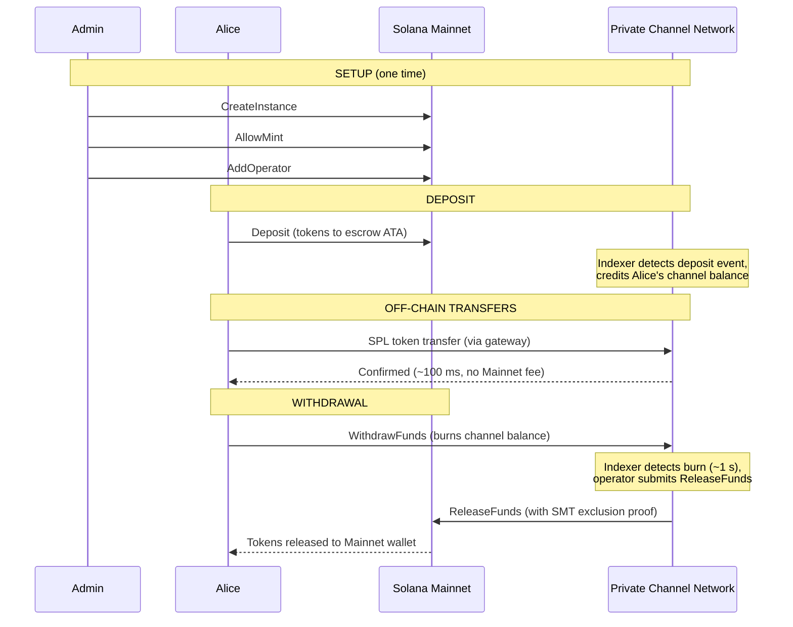
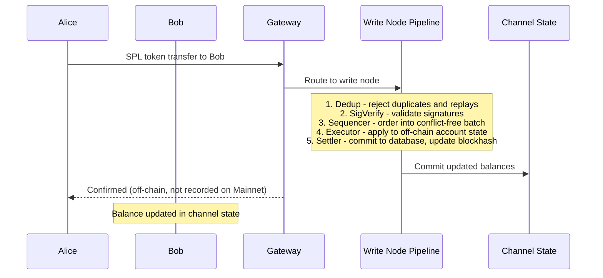
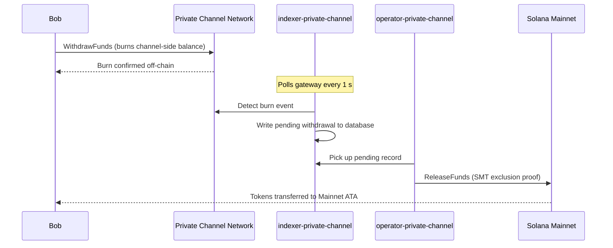

## Was ist ein privater Channel?

Ein privater Channel ist ein Off-Chain-Zahlungsnetzwerk, das auf Solana verankert ist. Nutzer hinterlegen SPL-Token in einem On-Chain-Escrow-Programm und führen dann Off-Chain-Transaktionen über ein Gateway mit hoher Geschwindigkeit und ohne Kosten pro Übertragung durch. Die Abrechnung zurück zum Solana Mainnet erfolgt über einen Sparse Merkle Tree-Beweis, der sicherstellt, dass Gelder jederzeit einlösbar sind und Double-Spending unmöglich ist.

Im Gegensatz zum nativen Zahlungsfluss von Solana erscheinen Überweisungen innerhalb eines Channels erst dann on-chain, wenn ein Nutzer eine Auszahlung vornimmt. Das Channel-Netzwerk betreibt eine eigene Transaktions-Pipeline (dedup -> sig verify -> sequencer -> executor -> settler), die Transaktionen unabhängig von Solanas Blockzeit verarbeitet.

## Teilnehmer

### Instanz-Admin

Der Admin stellt die `Instance`-PDA über `CreateInstance` bereit und kontrolliert, welche SPL-Token-Mints akzeptiert werden (`AllowMint` / `BlockMint`). Der Admin verwaltet Operatoren über `AddOperator` / `RemoveOperator` und kann Administratorrechte über `SetNewAdmin` übertragen. Es gibt einen Admin pro Instanz. Die Übertragung von Administratorrechten ist in einem einzigen Schritt unwiderruflich: Der aktuelle Admin kann die Rolle nicht ohne die Mitwirkung des neuen Admins zurückfordern.

### Operatoren

Operatoren werden vom Admin bereitgestellt. Sie besitzen eine `Operator`-PDA und sind die einzigen Konten, die berechtigt sind, `ReleaseFunds` (zur Abrechnung von Auszahlungen auf Mainnet) und `ResetSmtRoot` (zur Rotation des Sparse Merkle Tree) aufzurufen. Operatoren umgehen alle Eigentumsüberprüfungen im Gateway und haben Zugriff auf alle JSON-RPC-Methoden, einschließlich `getBlock`, `getTransaction` und `simulateTransaction`. JWT-Rolle: `"operator"`. Operatoren müssen direkt in der Datenbank bereitgestellt werden; es gibt keine Self-Service-Eskalation. Weitere Informationen zu Deployment und Konfiguration finden Sie im
[Operatoren-Leitfaden](/docs/tools/private-channels/operators).

### Nutzer

Nutzer registrieren sich selbst über den Auth-Service. JWT-Rolle: `"user"`. Nutzer können `Deposit` direkt im Escrow-Programm aufrufen und Auszahlungen über die channel-seitige `WithdrawFunds`- Anweisungen im Withdraw-Programm einleiten. Der Gateway-Zugriff ist auf ihre eigenen verifizierten Wallets beschränkt; sie können `getBlock`, `getTransaction` oder `simulateTransaction` nicht aufrufen.

## Channel-Lebenszyklus

1. **Instanzerstellung** – Der Admin ruft `CreateInstance` auf, wodurch die `Instance`-PDA erstellt und die zulässigen Mints konfiguriert werden.
2. **Einzahlung** – Nutzer zahlen SPL-Token über die `Deposit`- Anweisungen in das Escrow ein. Die Token werden auf das associated token account der Instanz übertragen.
3. **Off-Chain-Überweisungen** – Nutzer senden Überweisungen über das Gateway. Überweisungen werden sequenziert und im Channel-Netzwerk ausgeführt, ohne das Mainnet zu berühren.
4. **Einleitung der Auszahlung** – Ein Nutzer ruft `WithdrawFunds` im Withdraw-Programm (Channel-Seite) auf, um sein Guthaben zu verbrennen und eine Auszahlung zu signalisieren.
5. **Mainnet-Abrechnung** – Ein Operator stellt einen gültigen SMT-Ausschlussbeweis bereit und ruft `ReleaseFunds` im Escrow-Programm (Mainnet) auf, um Token an die Wallet des Nutzers freizugeben.
6. **Tree-Rotation** – Wenn sich der SMT der Kapazitätsgrenze nähert (65.536 Blätter), ruft der Operator `ResetSmtRoot` auf, um den Tree zu rotieren und ein neues epoch zu starten.

### Übertragung

### Auszahlung

## Wann private Channels verwendet werden sollten

Verwenden Sie private Channels, wenn Ihre Anwendung Folgendes benötigt:

- **Off-Chain-Durchsatz** – Ihr Übertragungsvolumen würde Solanas TPS sättigen, oder Sie benötigen eine Bestätigung unter einer Sekunde
- **Datenschutz** – Identitäten der Gegenparteien und Überweisungsbeträge dürfen nicht on-chain erscheinen
- **Keine Fee pro Übertragung** – häufige Überweisungen, bei denen die SOL-Kosten pro Transaktion zu hoch sind

Verwenden Sie stattdessen native SPL-Überweisungen, wenn:

- **On-Chain-Komposabilität** erforderlich ist (DeFi, Swaps, Lending; andere Programme müssen die Übertragung beobachten oder darauf reagieren können)
- **Einmalige Abrechnung** ausreicht und Datenschutz kein Anliegen ist
- **Keine Gateway-Infrastruktur** verfügbar oder operativ umsetzbar ist
