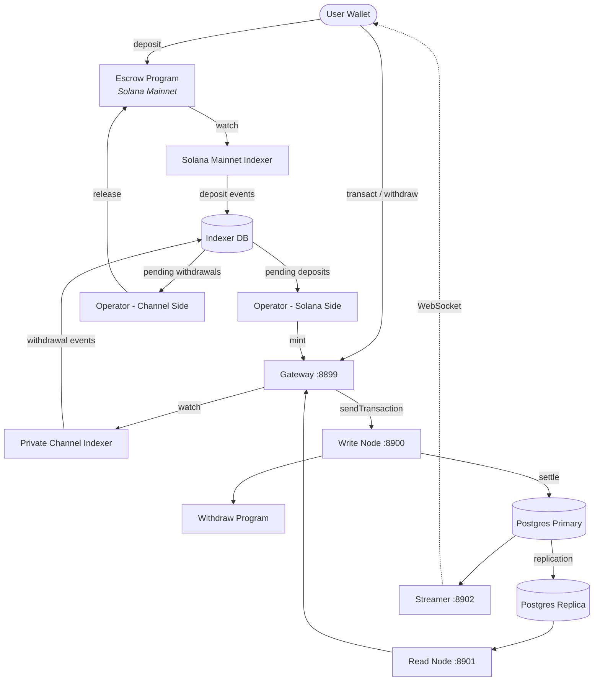

<Callout type="warning">
  Private Channels wurde keinem Sicherheitsaudit unterzogen und wird ohne eine gründliche Sicherheitsüberprüfung nicht für den Produktionseinsatz mit echten Geldern empfohlen.
</Callout>

<Callout type="info">
  **Eine Instanz deployen?** Wechseln Sie zum [Betreiber-Leitfaden](/docs/tools/private-channels/operators). **Integration gegen eine bestehende Instanz?** Gehen Sie zum [Quickstart](/docs/tools/private-channels/quickstart/installation). Diese Seite ist die Architektur-Referenz für beide Zielgruppen.
</Callout>

## Architektur

Private Channels besteht aus vier Komponenten: zwei On-Chain-Solana-Programmen (Escrow und Withdraw) und zwei Off-Chain-Diensten (Gateway und Auth Service). Zusammen bilden sie ein State-Channel-Protokoll, bei dem Gelder auf dem Mainnet liegen, Transfers jedoch Off-Chain abgewickelt werden.

### Escrow-Programm

Das Escrow-Programm ist ein On-Chain-Solana-Programm, das hinterlegte SPL-Token verwahrt. Es ist der Vertrauensanker des Systems: Alle Gelder liegen letztlich im Escrow, bis ein Betreiber einen gültigen Sparse-Merkle-Tree-Ausschlussnachweis vorlegt, um sie freizugeben.

- Programm-ID: `9tgHa1DcnaSSUtmMsst8ovKTe1Gfxzezn27KnH9xXYeU`
- Diese ID wird zur Kompilierzeit über `declare_id!()` in das Programm-Binary eingebunden. Off-Chain-Dienste lesen dieselbe ID zur Kompilierzeit aus dem generierten Client-Crate, nicht aus einer Umgebungsvariable.
- Verwaltet `Instance`-, `AllowedMint`- und `Operator`-PDAs
-  Anweisungen: `CreateInstance`, `AllowMint`, `BlockMint`, `AddOperator`,
  `RemoveOperator`, `SetNewAdmin`, `Deposit`, `ReleaseFunds`, `ResetSmtRoot`

### Withdraw-Programm

Das Withdraw-Programm läuft im privaten Kanal-Netzwerk, nicht auf dem Solana Mainnet. Nutzer rufen `WithdrawFunds` auf, um ihr kanalbasiertes Token-Guthaben zu verbrennen. Dieses Verbrennen gibt keine Gelder automatisch frei; es signalisiert dem Betreiber, dass eine Auszahlung aussteht. Der Betreiber ruft anschließend `ReleaseFunds` beim Escrow-Programm mit einem gültigen SMT-Nachweis auf, um die Abwicklung abzuschließen.

- Programm-ID: `J231K9UEpS4y4KAPwGc4gsMNCjKFRMYcQBcjVW7vBhVi`
- Diese ID wird in das Programm-Binary einkompiliert. Off-Chain-Dienste lesen dieselbe ID zur Kompilierzeit aus dem generierten Client-Crate, nicht aus einer Umgebungsvariable.

### Gateway

Das Gateway ist ein Solana-JSON-RPC-kompatibler Proxy, der Client-Anfragen an den Schreib-Knoten des Kanal-Netzwerks (für die Transaktionsübermittlung) und den Lese-Knoten (für Abfragen) weiterleitet. Es wird über Umgebungsvariablen konfiguriert: `GATEWAY_PORT`, `GATEWAY_WRITE_URL`, `GATEWAY_READ_URL`.

Health-Endpunkte (keine Authentifizierung erforderlich):

- `GET /health` - Liveness-Check; gibt `200 {"status":"ok"}` zurück
- `GET /ready` - Tiefgehende Bereitschaftsprüfung, testet Schreib- und Lese-Knoten; gibt `200 {"status":"ready"}` oder `503 {"status":"degraded"}` zurück

#### RPC-Methoden-Routing und Zugriff

Das Gateway leitet `sendTransaction` an den Schreib-Knoten und alle anderen Methoden an den Lese-Knoten weiter. Anfragen größer als 64 KB werden mit HTTP 413 abgelehnt. Wenn Authentifizierung aktiviert ist, wird der Methodenzugriff per JWT-Rolle gesteuert. Siehe **[Authentifizierung & Rollen](/docs/tools/private-channels/concepts/auth)** für die vollständige Methodenmatrix.

### Auth Service

Der Auth Service ist eine optionale Komponente, die HS256-JWTs (24-Stunden-Gültigkeit) für die Gateway-Zugriffskontrolle ausstellt. Er wird aktiviert, wenn die Umgebungsvariable `JWT_SECRET` gesetzt ist. Ohne diese akzeptiert das Gateway alle Verbindungen.

JWT-Claims: `sub` (Benutzer-UUID), `role` (`"user"` oder `"operator"`), `iss` (`"private-channel-auth"`), `aud` (`"private-channel-gateway"`), `exp` (Unix-Zeitstempel). `iss` und `aud` werden durch die JWT-Konfiguration des Gateways validiert und nicht in den Anwendungs-Claims-Struct deserialisiert: Nur `sub`, `role` und `exp` stehen dem Anwendungsschicht-Code zur Verfügung.

Rollen:

- `user` - Zugriff beschränkt auf eigene verifizierte Wallets; kann `getBlock`, `getTransaction` oder `simulateTransaction` nicht aufrufen
- `operator` - Umgeht alle Eigentumsüberprüfungen; vollständiger RPC-Methoden-Zugriff; muss in der Datenbank bereitgestellt werden (keine selbstständige Eskalation)

### Streamer

Der Streamer ist ein WebSocket-Server, der Kanal-Statusaktualisierungen in Echtzeit an verbundene Clients überträgt und damit das Polling des RPCs überflüssig macht. Er fragt PostgreSQL nach Statusänderungen ab. Er ist Teil des grundlegenden Docker-Compose-Stacks, nicht des Devnet-Stacks, den dieser Leitfaden deployt; siehe die [Konfigurationsreferenz](/docs/tools/private-channels/operators/configuration#service-port-reference).

- Port: `8902`, konfigurierbar über `STREAMER_PORT`
- Verbinden: `ws://localhost:8902`
- Health-Endpunkt: `GET /health` - gibt `503` zurück, wenn eine interne Poll-Schleife länger als 30 Sekunden stockt

<Callout type="warning">
  Das WebSocket-Ereignisschema ist noch nicht öffentlich dokumentiert. Weitere Implementierungsdetails finden Sie unter [`core/src/bin/streamer.rs`](https://github.com/solana-foundation/solana-private-channels/blob/main/core/src/bin/streamer.rs), bis eine formale Dokumentation verfügbar ist.
</Callout>



## Transaktionspipeline

```text
Transaction -> [1:Dedup] -> [2:SigVerify] -> [3:Sequencer] -> [4:Executor] -> [5:Settler] -> Database
```

Transaktionen, die an das Gateway übermittelt werden, durchlaufen eine fünfstufige Pipeline, bevor ihr Status festgeschrieben wird:

1. **Dedup** - Filtert doppelte Transaktionen heraus, bevor sie die Pipeline betreten
2. **SigVerify** - Validiert Transaktionssignaturen gegen den öffentlichen Schlüssel des Signer
3. **Sequencer** - Ordnet gültige Transaktionen deterministisch, um eine kanonische Historie zu etablieren
4. **Executor** - Führt Transaktionen gegen die Konten-Schicht des Kanals aus (BOB Cache + AccountsDB) und aktualisiert Guthaben Off-Chain
5. **Settler** - Schreibt akkumulierte Transaktionsergebnisse in PostgreSQL und aktualisiert den Redis-Cache; generiert neue Blockhashes für den nächsten Block-Zyklus. Die Mainnet-Abwicklung (Aufruf von `ReleaseFunds`) wird separat durch den `operator-private-channel`-Dienst gehandhabt

## Hauptmerkmale

### Datenschutz

Transfers zwischen Kanal-Teilnehmern werden nicht auf dem Solana Mainnet aufgezeichnet. Nur Einzahlungen (Eintritt in den Kanal) und endgültige Auszahlungen (Verlassen des Kanals) erscheinen On-Chain. Identitäten der Gegenparteien und Transferbeträge sind für externe Beobachter während des Kanalbetriebs nicht sichtbar.

### Leistung

Die Off-Chain-Pipeline entfernt Solanas Blockzeit aus dem kritischen Pfad. Transfers werden bestätigt, wenn der Sequencer sie verarbeitet, nicht wenn ein Solana-Block bestätigt wird. Dies ermöglicht Finalität im Sekundenbereich und einen Durchsatz, der Solanas nativen TPS für App-Layer-Transfers übertrifft.

### Abwicklung

Jede Auszahlung ist durch einen On-Chain-Sparse-Merkle-Tree-Nachweis geschützt. Der SMT-Root wird in `Instance.withdrawal_transactions_root` im Escrow-Programm gespeichert. Wenn `ReleaseFunds` aufgerufen wird, verifiziert das Programm zunächst einen Ausschlussnachweis für einen bisher ungesehenen Nonce gegen den aktuellen On-Chain-Root, dann verifiziert es einen separaten Einschlussnachweis für diesen Nonce gegen den vom Aufrufer bereitgestellten neuen Root. Erst nachdem beide Prüfungen bestanden sind, speichert es den neuen Root, wodurch Doppelausgaben unmöglich sind, selbst wenn ein Betreiberschlüssel kompromittiert wird.

## Sicherheitsmodell

**Admin-Schlüssel** - Steuert die Instanzerstellung (`CreateInstance`) und die Betreiber-Bereitstellung (`AddOperator` / `RemoveOperator`). Eine Kompromittierung des Admin-Schlüssels ermöglicht beliebige Betreiber-Bereitstellungen. `SetNewAdmin` überträgt die Admin-Berechtigung unwiderruflich in einem einzigen Schritt; schützen Sie den Admin-Schlüssel entsprechend.

**Betreiberschlüssel** - können `ReleaseFunds` und `ResetSmtRoot` aufrufen. Sie können keine Gelder ohne einen gültigen SMT-Ausschlussnachweis gegen den aktuellen On-Chain-Root freigeben. Die On-Chain-Prüfung `verify_smt_exclusion_proof` ist die letzte Verteidigungslinie gegen unbefugte Auszahlungen: Ein kompromittierter Betreiberschlüssel allein reicht nicht aus, um das Escrow zu leeren.

**SMT-Root** - On-Chain gespeichert in `Instance.withdrawal_transactions_root`. Wird atomisch mit jedem `ReleaseFunds`-Aufruf aktualisiert. Da jeder Nachweis einen bisher ungesehenen Nonce referenzieren muss, sind Doppelausgaben desselben Kanalguthabens unmöglich, selbst wenn ein Betreiberschlüssel kompromittiert wird.

**Baumrotation** - `Instance.current_tree_index` verfolgt Baum-Epochen. Wenn `ResetSmtRoot` aufgerufen wird, erhöht es den Baumindex und invalidiert alle Nonces aus der vorherigen Baum-Epoche, wodurch ein sauberer Ausgangspunkt für neue Abwicklungszyklen entsteht.

## Betriebliche Schlüsselsicherheit

<Callout type="warning">
  Die Off-Chain-Dienste verwenden ihr eigenes Signer-Vokabular, das nicht mit den On-Chain-Admin-/Betreiber-Berechtigungen aus dem oben beschriebenen Sicherheitsmodell zusammenhängt. `ADMIN_PRIVATE_KEY` ist für jeden Betreiberdienst erforderlich und bezahlt Transaktions-Fee; ein separater, optionaler `OPERATOR_PRIVATE_KEY` liefert die On-Chain-Operator-Signatur für `ReleaseFunds` und `ResetSmtRoot` und fällt auf den Wert von `ADMIN_PRIVATE_KEY` zurück, wenn er nicht gesetzt ist. Geben Sie niemals den protokollseitigen Instanz-Admin-Schlüssel (verwendet für `CreateInstance` / `AddOperator` / `SetNewAdmin`) in eine der beiden Variablen ein oder exponieren Sie ihn zur Laufzeit; halten Sie diesen Schlüssel kalt und offline.
</Callout>

`ReleaseFunds` und `ResetSmtRoot` erfordern zwei On-Chain-Signaturen: den Fee-Zahler (aus `ADMIN_PRIVATE_KEY`) und die Autorität des Operator-PDAs (aus `OPERATOR_PRIVATE_KEY` oder `ADMIN_PRIVATE_KEY`, falls dieser nicht gesetzt ist). Der Devnet-Walkthrough dieses Deployment-Leitfadens trägt das generierte Operator-keypair in `ADMIN_PRIVATE_KEY` ein und lässt `OPERATOR_PRIVATE_KEY` ungesetzt, sodass dasselbe keypair beide Signer-Rollen übernimmt. Behandeln Sie den Schlüssel, der in `ADMIN_PRIVATE_KEY` landet, mit denselben Kontrollen wie den privaten Schlüssel einer Hot Wallet:

- Speichern Sie ihn nur in der per .gitignore ausgeschlossenen `.env`-Datei, niemals in `.env.devnet` oder einer eingecheckten Konfiguration
- Erwägen Sie für Produktions-Deployments einen Secrets-Manager (AWS Secrets Manager, HashiCorp Vault) anstatt einer Klartext-Umgebungsvariable
- Das keypair des protokollseitigen Instanz-Admins (verwendet zum Aufrufen von `AddOperator` / `SetNewAdmin`) sollte kalt gehalten werden; es wird nur bei der Instanzeinrichtung und Betreiber-Bereitstellung benötigt, nicht während der Laufzeit

`SetNewAdmin` überträgt Admin-Rechte **unwiderruflich in einer einzigen Transaktion**: Der aktuelle Admin hat ohne die Mitwirkung des neuen Admins keinen Wiederherstellungspfad. Rufen Sie es nicht auf, ohne die Zieladresse zu verifizieren.

## Nächste Schritte

<Cards>
  <Card
    title="Quickstart"
    href="/docs/tools/private-channels/quickstart/installation"
  >
    Richten Sie Ihre Umgebung ein und generieren Sie TypeScript-Clients.
  </Card>
  <Card title="Kanäle" href="/docs/tools/private-channels/concepts/channels">
    Verstehen Sie die Teilnehmer und den Kanal-Lebenszyklus.
  </Card>
  <Card
    title="Sparse Merkle Tree"
    href="/docs/tools/private-channels/concepts/smt"
  >
    Verstehen Sie, wie Auszahlungsnachweise On-Chain verifiziert werden.
  </Card>
  <Card
    title=" Anweisungen"
    href="/docs/tools/private-channels/instructions/deposit"
  >
    Vollständige Anweisungsreferenz für alle Programme.
  </Card>
</Cards>
