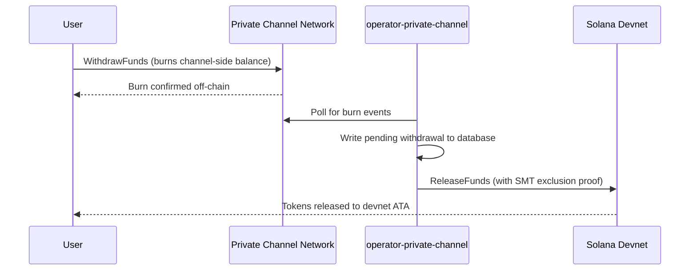

## Übersicht

Das Abheben aus Private Channels ist ein zweistufiger Prozess. Zuerst verbrennt der Nutzer sein kanalseitiges Token-Guthaben durch Aufruf von `WithdrawFunds` im Withdraw-Programm. Anschließend ruft ein Operator `ReleaseFunds` im Escrow-Programm (Devnet, in dieser Anleitung) mit einem gültigen Sparse-Merkle-Tree-Ausschlussbeweis auf, um die Gelder freizugeben. Der SMT-Beweis stellt sicher, dass jede Auszahlungs-Nonce nur einmal verwendet werden kann und verhindert so Double-Spend.



## Schritt 1: Auszahlung im Kanal einleiten

Rufen Sie `WithdrawFunds` im Withdraw-Programm auf, um Ihr kanalseitiges Guthaben zu verbrennen.
Verwenden Sie die `Async`-Variante, die das `tokenAccount`-PDA automatisch ableitet und die
empfohlene Form für den Produktionseinsatz ist:

```typescript
import { getWithdrawFundsInstructionAsync } from "../private-channel-withdraw-program/clients/typescript/src/generated";
import {
  createSolanaRpc,
  address,
  pipe,
  createTransactionMessage,
  setTransactionMessageFeePayerSigner,
  setTransactionMessageLifetimeUsingBlockhash,
  appendTransactionMessageInstruction,
  signAndSendTransactionMessageWithSigners,
  assertIsTransactionMessageWithSingleSendingSigner,
  getBase58Decoder
} from "@solana/kit";

// Point to the gateway, not a public Solana RPC
const privateChannelRpc = createSolanaRpc("http://localhost:8899");

const withdrawIx = await getWithdrawFundsInstructionAsync({
  user: userSigner,
  mint: address(mintAddress),
  amount: 1_000_000n, // 1 USDC (6 decimals)
  destination: null // null = release to signer's devnet wallet
});

const { value: latestBlockhash } = await privateChannelRpc
  .getLatestBlockhash({ commitment: "confirmed" })
  .send();

// Sent to the Private Channels gateway (not Solana RPC directly), which
// expects the legacy transaction format - do not switch this to version 0.
const transactionMessage = pipe(
  createTransactionMessage({ version: "legacy" }),
  (m) => setTransactionMessageFeePayerSigner(userSigner, m),
  (m) => setTransactionMessageLifetimeUsingBlockhash(latestBlockhash, m),
  (m) => appendTransactionMessageInstruction(withdrawIx, m)
);

assertIsTransactionMessageWithSingleSendingSigner(transactionMessage);

const signatureBytes =
  await signAndSendTransactionMessageWithSigners(transactionMessage);
const signature = getBase58Decoder().decode(signatureBytes);
console.log("Withdrawal initiated:", signature);
```

- Withdraw-Programm-ID: `J231K9UEpS4y4KAPwGc4gsMNCjKFRMYcQBcjVW7vBhVi`
- Übermitteln Sie diese Transaktion an das Gateway (`http://localhost:8899`), nicht an einen
  öffentlichen Solana-RPC
- Wenn `destination` angegeben ist, werden die freigegebenen Gelder an diese Wallet übertragen statt an die des
  Signer

## Was zu erwarten ist

Nach dem Aufruf von `WithdrawFunds` sind keine weiteren Aktionen erforderlich. Die Operator-Dienste wickeln die Abrechnung automatisch ab:

1. `indexer-private-channel` fragt den Kanal jede 1 Sekunde nach Burn-Ereignissen ab
   und schreibt einen ausstehenden Auszahlungsdatensatz, sobald Ihrer erkannt wird
2. `operator-private-channel` fragt die Datenbank jede 1 Sekunde nach ausstehenden
   Datensätzen ab und übermittelt `ReleaseFunds` an das Escrow-Programm auf Solana Devnet
   mit dem erforderlichen SMT-Ausschlussbeweis; er fragt bis zu
   5-mal in Abständen von 400 ms nach einer Devnet-Bestätigung, bevor er es erneut versucht

Gelder erscheinen unter normalen Bedingungen typischerweise innerhalb weniger Sekunden in Ihrer Devnet-Wallet.

## So rechnet der Operator ab (Referenz)

Nach dem kanalseitigen Burn muss ein bereitgestellter Operator `ReleaseFunds` im Escrow-Programm mit einem gültigen SMT-Ausschlussbeweis aufrufen; der Operator kann die Gelder nicht freigeben, ohne zu belegen, dass die Auszahlungs-Nonce zuvor nicht verwendet wurde. Dieser Schritt wird automatisch von `operator-private-channel` ausgeführt; Sie müssen ihn nicht selbst aufrufen.

Der Operator stellt Folgendes bereit:

- `amount`: muss dem verbrannten Betrag entsprechen
- `user`: Empfänger-Wallet auf Devnet
- `new_withdrawal_root`: aktualisierte SMT-Wurzel nach dieser Auszahlung
- `transaction_nonce`: eindeutige Nonce für dieses Blatt
- `sibling_proofs`: 512 Bytes (16 x 32-Byte-Geschwister-Hashes für den Tree-Beweis)

## Überprüfen

Nachdem der Operator-Aufruf bestätigt wurde, überprüfen Sie Ihr Devnet-Token-Guthaben:

```bash
spl-token balance <MINT_ADDRESS> --owner <YOUR_WALLET>
```

Oder per RPC:

```typescript
import { createSolanaRpc, address } from "@solana/kit";
import { findAssociatedTokenPda } from "@solana-program/token";

const TOKEN_PROGRAM_ADDRESS = address(
  "TokenkegQfeZyiNwAJbNbGKPFXCWuBvf9Ss623VQ5DA"
);

// Query devnet directly; ReleaseFunds settles here, not through the gateway
const rpc = createSolanaRpc("https://api.devnet.solana.com");

const [yourDevnetAta] = await findAssociatedTokenPda({
  mint: address(mintAddress),
  owner: address(userSigner.address),
  tokenProgram: TOKEN_PROGRAM_ADDRESS
});

const balance = await rpc.getTokenAccountBalance(yourDevnetAta).send();
console.log(balance.value.uiAmountString);
```

## Sie haben den Quickstart abgeschlossen

Sie haben den vollständigen Private-Channels-Zyklus auf Devnet durchlaufen: SPL-Token in das Escrow eingezahlt, eine Off-Chain-Übertragung über das Gateway gesendet und Gelder zurück in Ihre Devnet-Wallet abgehoben.

<Cards>
  <Card
    title="Kanal-Lebenszyklus"
    href="/docs/tools/private-channels/concepts/channels"
  >
    Verstehen Sie Teilnehmer und den vollständigen Ablauf von der Einzahlung bis zur Auszahlung im Detail.
  </Card>
  <Card
    title="Authentifizierung & Rollen"
    href="/docs/tools/private-channels/concepts/auth"
  >
    Fügen Sie Ihrer Integration JWT-Authentifizierung hinzu.
  </Card>
  <Card
    title="ReleaseFunds-Referenz"
    href="/docs/tools/private-channels/instructions/release-funds"
  >
    Vollständige ReleaseFunds- Anweisungen-Referenz für Operator-Tools.
  </Card>
  <Card
    title="Sparse Merkle Tree"
    href="/docs/tools/private-channels/concepts/smt"
  >
    Verstehen Sie, wie Auszahlungsbeweise Double-Spend verhindern.
  </Card>
</Cards>
