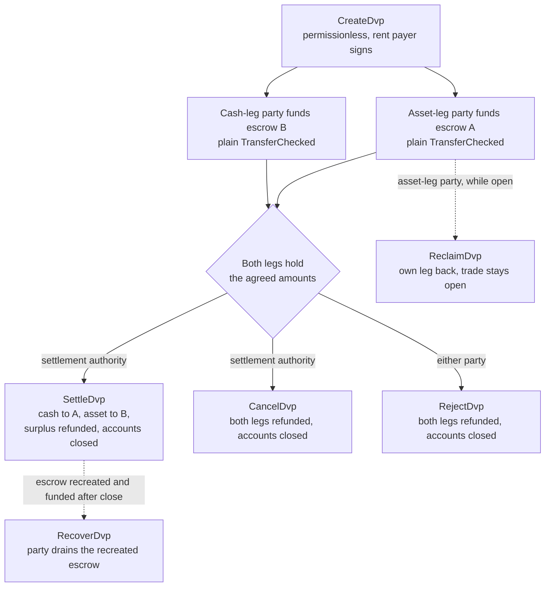
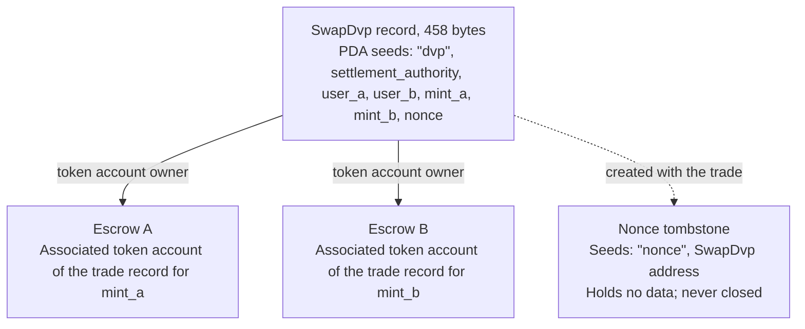

Το πρόγραμμα DvP είναι το τυπικό πρόγραμμα για παράδοση έναντι πληρωμής στο Solana, το οποίο συντηρείται από το Solana Foundation και έχει ελεγχθεί από την Cantina. Δύο μέρη συμφωνούν σε μια ανταλλαγή, το καθένα στέλνει το σκέλος του σε έναν λογαριασμό escrow με μια συνηθισμένη μεταφορά token, και μια αρχή διακανονισμού διακανονίζει και τα δύο σκέλη σε μία συναλλαγή, ώστε είτε να μετακινηθούν και τα δύο είτε κανένα. Η αρχή διακανονισμού είναι μια τρίτη διεύθυνση που ορίζεται στην ανταλλαγή, όπως η πλατφόρμα ή ο πράκτορας που την οργάνωσε. Κανένα από τα μέρη δεν γράφει ούτε αναπτύσσει πρόγραμμα, και ένα πορτοφόλι ή θεματοφύλακας που μπορεί να στείλει μια τυπική μεταφορά token (`TransferChecked`) μπορεί να χρηματοδοτήσει ένα σκέλος χωρίς καμία ενσωμάτωση ειδικά για το DvP. Μέχρι τον διακανονισμό, κάθε μέρος μπορεί να πάρει πίσω το δικό του σκέλος ή να αναιρέσει την ανταλλαγή.

<Callout type="warn" title="Διαβάστε την εγγραφή πριν ενεργήσετε βάσει αυτής">

Η δημιουργία εγγραφής ανταλλαγής δεν απαιτεί άδεια, επομένως μια εγγραφή δεν αποτελεί απόδειξη συμφωνίας. Κάθε μέρος διαβάζει τους αποθηκευμένους όρους πριν χρηματοδοτήσει, και η αρχή διακανονισμού πριν διακανονίσει (δείτε την [επαλήθευση](#verification-before-funding-and-settlement)).

</Callout>

## Πώς λειτουργεί

Κάθε ανταλλαγή αποκτά μια εγγραφή που ανήκει στο πρόγραμμα και δύο λογαριασμούς escrow, έναν για κάθε σκέλος. Το μέρος του σκέλους περιουσιακού στοιχείου (`user_a`) και το μέρος του σκέλους μετρητών (`user_b`) χρηματοδοτούν το καθένα ένα σκέλος μεταφέροντας token στον λογαριασμό escrow του σκέλους αυτού. Η αρχή διακανονισμού είναι ο μόνος υπογράφων που μπορεί να διακανονίσει. Ο διακανονισμός μεταφέρει το συμφωνημένο ποσό κάθε σκέλους στην άλλη πλευρά, επιστρέφει τυχόν πλεόνασμα στο μέρος στο οποίο ανήκει το σκέλος, και κλείνει την εγγραφή και τους δύο λογαριασμούς escrow. Η ατομικότητα προκύπτει από τις [συναλλαγές](/docs/core/transactions) του Solana: και οι δύο μεταφορές βρίσκονται σε μία συναλλαγή, επομένως είτε ισχύουν και οι δύο είτε καμία.

Κάθε επιστροφή χρημάτων, ανάκτηση και επιστροφή πλεονάσματος πηγαίνει στον δικό του associated token account του μέρους: στον λογαριασμό του `user_a` για το `mint_a` και του `user_b` για το `mint_b`. Ένας θεματοφύλακας ή ένα σύστημα διαχείρισης διαθεσίμων μπορεί να χρηματοδοτήσει ένα σκέλος από τον δικό του λογαριασμό, αλλά ό,τι επιστρέφεται καταλήγει στον λογαριασμό του μέρους, όχι πίσω στον θεματοφύλακα. Κάθε ανταλλαγή αφήνει επίσης έναν μόνιμο λογαριασμό-δείκτη (δείτε την ενότητα [Κατάσταση](#state)).

## Οδηγοί

Οι σελίδες βημάτων οδηγούν μια ανταλλαγή από τη δημιουργία έως τον διακανονισμό, με TypeScript και Rust για κάθε εντολή.

<Cards>
  <Card title="Δημιουργία ανταλλαγής" href="/docs/defi/dvp-program/create-a-trade">
    Εγκαταστήστε τους clients και καταγράψτε τους όρους της ανταλλαγής με το CreateDvp
  </Card>
  <Card title="Χρηματοδότηση των σκελών" href="/docs/defi/dvp-program/fund-the-legs">
    Επαληθεύστε τους αποθηκευμένους όρους και έπειτα χρηματοδοτήστε κάθε σκέλος με μια απλή μεταφορά
  </Card>
  <Card title="Διακανονισμός της ανταλλαγής" href="/docs/defi/dvp-program/settle-the-trade">
    Διακανονίστε και τα δύο σκέλη σε μία συναλλαγή ως αρχή διακανονισμού
  </Card>
  <Card title="Αναίρεση ανταλλαγής" href="/docs/defi/dvp-program/unwind-a-trade">
    Ανακτήστε ένα σκέλος, ακυρώστε ή απορρίψτε την ανταλλαγή και ανακτήστε καταθέσεις που έγιναν αργά
  </Card>
</Cards>

Μια [demo στο devnet](https://solana.com/delivery-vs-payment/demo) εκτελεί μια ανταλλαγή από άκρο σε άκρο: δημιουργεί την ανταλλαγή, χρηματοδοτεί και τους δύο λογαριασμούς escrow με τυπικές μεταφορές token και διακανονίζει και τα δύο σκέλη σε μία συναλλαγή.

## Επιλογή μεταξύ του προγράμματος και της εξουσιοδότησης

Η [Παράδοση έναντι Πληρωμής (DvP) με χρήση εξουσιοδότησης](/docs/tokenization/dvp) διακανονίζει την ίδια ανταλλαγή χωρίς πρόγραμμα: κάθε πλευρά εξουσιοδοτεί τη θέση της σε έναν πράκτορα διακανονισμού, ο οποίος μετακινεί και τα δύο σκέλη σε μία συναλλαγή.

- **Το πρόγραμμα** δεν απαιτεί εξουσιοδότηση, επομένως δεν ισχύει το όριο ενός εξουσιοδοτημένου ανά token account, και η αρχή διακανονισμού δεν μπορεί να ανακατευθύνει τα έσοδα. Κάθε ανταλλαγή εξαρτάται από ένα αναβαθμίσιμο πρόγραμμα και την αρχή αναβάθμισής του.
- **Το μοτίβο εξουσιοδότησης** δεν έχει εξάρτηση από πρόγραμμα και λειτουργεί με mints που φέρουν Scaled UI Amount. Το πρόγραμμα απορρίπτει αυτά τα mints, γεγονός που αποκλείει κάθε mint που δημιουργήθηκε από το πρότυπο `tokenized-security` του Mosaic (δείτε τους [περιορισμούς διαμόρφωσης του mint](#mint-configuration-constraints)).

## Ρόλοι

Το πρόγραμμα είναι συμμετρικό. Στη διεπαφή του τα δύο μέρη είναι ο `user_a`, που παραδίδει το `mint_a`, και ο `user_b`, που παραδίδει το `mint_b`. Το README και οι παραγόμενοι clients αποκαλούν το `mint_a` σκέλος περιουσιακού στοιχείου και το `mint_b` σκέλος μετρητών, και οι σελίδες αυτές ακολουθούν τη σύμβαση αυτή, αλλά τίποτα στο πρόγραμμα δεν απαιτεί το σκέλος μετρητών να είναι μέσο μετρητών. Δύο περιουσιακά στοιχεία ή δύο stablecoins διακανονίζονται με τον ίδιο τρόπο.

| Ρόλος                 | Ποιος                               | Υπογράφει                                              | Σημειώσεις                                                                                                                                                                                                     |
| -------------------- | --------------------------------- | -------------------------------------------------- | --------------------------------------------------------------------------------------------------------------------------------------------------------------------------------------------------------- |
| Μέρος του σκέλους περιουσιακού στοιχείου      | `user_a`, παραδίδει το `mint_a`       | Τη δική του μεταφορά χρηματοδότησης· Reclaim, Reject, Recover | Ένα πορτοφόλι keypair ή ένα έξυπνο πορτοφόλι βασισμένο σε PDA, όπως ένα multisig vault. Ένας λογαριασμός multisig του SPL Token ή ένας program account δεν μπορεί να είναι μέρος: το Create αποτυγχάνει με `PartyNotSignerCapable`                   |
| Μέρος του σκέλους μετρητών       | `user_b`, παραδίδει το `mint_b`       | Τη δική του μεταφορά χρηματοδότησης· Reclaim, Reject, Recover | Ίδια απαίτηση                                                                                                                                                                                          |
| Αρχή διακανονισμού | Μια τρίτη διεύθυνση που ορίζεται κατά τη δημιουργία | Settle, Cancel                                     | Ο μόνος υπογράφων που μπορεί να διακανονίσει. Δεν μπορεί να ανακατευθύνει τα έσοδα, τα οποία καθορίζονται κατά τη δημιουργία. Λαμβάνει το rent των κλεισμένων λογαριασμών όταν διακανονίζει ή ακυρώνει                                         |
| Πληρωτής του rent           | Όποιος υπογράφει το `CreateDvp`         | Create                                             | Χρηματοδοτεί το rent (την κατάθεση σε SOL που διατηρεί έναν λογαριασμό ανοιχτό) για την εγγραφή, το nonce tombstone και τους δύο λογαριασμούς escrow. Δεν καταγράφεται ως αποδέκτης rent: το rent των κλεισμένων λογαριασμών πηγαίνει σε όποιον κλείνει την ανταλλαγή |

## Αναγνωριστικό προγράμματος

```text
dvp34bdbcEm4f4FCUjGV4mDAkDshaQR4LkK8fdcsyZq
```

| Cluster      | Πρόγραμμα                                       | Αρχή αναβάθμισης                              | Τελευταίο slot ανάπτυξης |
| ------------ | --------------------------------------------- | ---------------------------------------------- | ------------------ |
| mainnet-beta | `dvp34bdbcEm4f4FCUjGV4mDAkDshaQR4LkK8fdcsyZq` | `DXtFpbPjcn2hxPnw79x1Pfoj35vXh5AsWBkS37YnXMVv` | 452.058.374        |
| devnet       | `dvp34bdbcEm4f4FCUjGV4mDAkDshaQR4LkK8fdcsyZq` | `5EX1zFeJWj4rGYZv432WnYw8CbaSUeTdxPx4r573UgYU` | 479.376.863        |

Το πρόγραμμα είναι αναβαθμίσιμο και στα δύο clusters. Οι τιμές παραπάνω είναι αυτές που ανέφερε το `solana program show` στις 2 Οκτωβρίου 2026· εκτελέστε την ίδια εντολή για τις τρέχουσες τιμές. Η έκδοση του devnet είναι παλαιότερη από το commit με βάση το οποίο γράφτηκαν οι σελίδες βημάτων (δείτε την [Εγκατάσταση](/docs/defi/dvp-program/create-a-trade#install)), με το ίδιο σύνολο εντολών και σφαλμάτων.

## Κύκλος ζωής



Μια ανταλλαγή είναι ανοιχτή από το `CreateDvp` μέχρι να την κλείσει ένα από τα Settle, Cancel ή Reject. Η χρηματοδότηση δεν έχει δική της εντολή: ένα σκέλος θεωρείται χρηματοδοτημένο όταν ο λογαριασμός escrow του κρατά τουλάχιστον το συμφωνημένο ποσό. Το Reclaim γίνεται ανά σκέλος και αφήνει την ανταλλαγή ανοιχτή, ώστε ένα πρόβλημα με το ένα σκέλος να μην αναγκάζει το άλλο μέρος να ακυρώσει ολόκληρη την ανταλλαγή.

## Κατάσταση

Κάθε ανταλλαγή έχει έναν λογαριασμό `SwapDvp` 458 byte, που ανήκει στο πρόγραμμα. Η διεύθυνσή του παράγεται από την αρχή διακανονισμού, τα δύο μέρη, τα δύο mints και ένα nonce (τα seeds `["dvp", settlement_authority, user_a, user_b, mint_a, mint_b, nonce]`). Τα ποσά και οι χρόνοι αποθηκεύονται μέσα στον λογαριασμό και δεν επηρεάζουν τη διεύθυνση, γι' αυτό πρέπει να διαβάζονται και όχι να συνάγονται. Ένας μικρός λογαριασμός-δείκτης, το nonce tombstone στο `["nonce", swap_dvp]`, δημιουργείται μαζί με την ανταλλαγή και δεν κλείνει ποτέ, ώστε κάθε συνδυασμός μερών, mints, αρχής και nonce να μπορεί να χρησιμοποιηθεί για μία μόνο ανταλλαγή.



| Πεδίο                                  | Τύπος          | Σημασία                                                                                                 |
| -------------------------------------- | ------------- | ------------------------------------------------------------------------------------------------------- |
| `bump`                                 | `u8`          | Το bump του PDA                                                                                                |
| `user_a`, `user_b`                     | `Pubkey`      | Τα δύο μέρη                                                                                         |
| `mint_a`, `mint_b`                     | `Pubkey`      | Τα mints του σκέλους περιουσιακού στοιχείου και του σκέλους μετρητών                                                                        |
| `settlement_authority`                 | `Pubkey`      | Ο μόνος υπογράφων που μπορεί να διακανονίσει ή να ακυρώσει                                                               |
| `token_program_a`, `token_program_b`   | `Pubkey`      | Το token program στο οποίο ανήκει κάθε mint· μια ανταλλαγή μπορεί να συνδυάζει σκέλη SPL Token και Token-2022                    |
| `amount_a`, `amount_b`                 | `u64`         | Το συμφωνημένο ποσό κάθε σκέλους, στη μικρότερη μονάδα του mint (βασικές μονάδες)                                 |
| `expiry_timestamp`                     | `i64`         | Μετά από αυτόν τον χρόνο δικτύου (το ρολόι onchain), το Settle απορρίπτεται. Τα Reclaim, Cancel και Reject εξακολουθούν να λειτουργούν |
| `nonce`                                | `u64`         | Διακρίνει ανταλλαγές που μοιράζονται τα υπόλοιπα seeds. Μίας χρήσης                                             |
| `ref_string`                           | `[u8; 64]`    | Μια αδιαφανής αναφορά του client, συμπληρωμένη με μηδενικά· το πρόγραμμα δεν την διαβάζει ποτέ                                     |
| `user_a_settlement_destination`        | `Pubkey`      | Λαμβάνει το σκέλος μετρητών κατά το Settle· από προεπιλογή είναι ο `user_a`                                                   |
| `user_b_settlement_destination`        | `Pubkey`      | Λαμβάνει το σκέλος περιουσιακού στοιχείου κατά το Settle· από προεπιλογή είναι ο `user_b`                                                  |
| `mint_a_authority`, `mint_b_authority` | `Pubkey`      | Οι αρχές των mints όπως καταγράφηκαν κατά τη δημιουργία· το Settle αποτυγχάνει αν κάποια έχει αλλάξει                           |
| `earliest_settlement_timestamp`        | `Option<i64>` | Αν οριστεί, το Settle απορρίπτεται πριν από αυτόν τον χρόνο δικτύου                                                     |

Η λίστα πεδίων προέρχεται από το IDL του προγράμματος στο commit που αναφέρεται στην ενότητα [Δημιουργία ανταλλαγής](/docs/defi/dvp-program/create-a-trade#install).

## Εντολές

| Εντολή  | Υπογράφων               | Αποτέλεσμα                                                                                                                                                              |
| ------------ | -------------------- | ------------------------------------------------------------------------------------------------------------------------------------------------------------------- |
| `CreateDvp`  | Οποιοσδήποτε πληρωτής            | Δημιουργεί την εγγραφή `SwapDvp`, το nonce tombstone και τους δύο λογαριασμούς escrow. Δεν μετακινεί token                                                                        |
| `ReclaimDvp` | `user_a` ή `user_b` | Επιστρέφει από το escrow το δικό του σκέλος του υπογράφοντος. Η ανταλλαγή παραμένει ανοιχτή και το σκέλος μπορεί να χρηματοδοτηθεί ξανά                                                                      |
| `SettleDvp`  | Αρχή διακανονισμού | Μεταφέρει το `amount_a` στον προορισμό του `user_b` και το `amount_b` στον προορισμό του `user_a`, επιστρέφει τυχόν πλεόνασμα στο μέρος του σκέλους, κλείνει την εγγραφή και τους δύο λογαριασμούς escrow |
| `CancelDvp`  | Αρχή διακανονισμού | Επιστρέφει ό,τι κρατά το escrow A στον `user_a` και το escrow B στον `user_b`, κλείνει την εγγραφή και τους δύο λογαριασμούς escrow                                                            |
| `RejectDvp`  | `user_a` ή `user_b` | Ίδιο αποτέλεσμα με το Cancel, υπογεγραμμένο από ένα μέρος                                                                                                                            |
| `RecoverDvp` | `user_a` ή `user_b` | Αφού κλείσει η ανταλλαγή: αδειάζει έναν εκ νέου δημιουργημένο λογαριασμό escrow στον δικό του token account του υπογράφοντος και τον κλείνει. Καλύπτει μια κατάθεση που έφτασε μετά από Settle, Cancel ή Reject  |

Κάθε επιστροφή χρημάτων πηγαίνει στον δικό του associated token account του μέρους για το mint του σκέλους, ανεξάρτητα από το ποιος χρηματοδότησε το escrow.

Οι λογαριασμοί και τα ορίσματα κάθε εντολής βρίσκονται στη σελίδα του αντίστοιχου βήματος.

## Σφάλματα

| Κωδικός | Σφάλμα                            | Πότε                                                                                                   |
| ---- | -------------------------------- | ------------------------------------------------------------------------------------------------------ |
| 0    | `SignerNotParty`                 | Reclaim, Reject ή Recover υπογεγραμμένο από διεύθυνση που δεν είναι ο `user_a` ή ο `user_b`                      |
| 1    | `DvpExpired`                     | Settle μετά το `expiry_timestamp`                                                                        |
| 2    | `SettlementAuthorityMismatch`    | Settle ή Cancel υπογεγραμμένο από διεύθυνση διαφορετική από την αρχή διακανονισμού                              |
| 3    | `SettlementTooEarly`             | Settle πριν από το `earliest_settlement_timestamp`                                                          |
| 4    | `LegNotFunded`                   | Settle ενώ ένα escrow κρατά λιγότερο από το συμφωνημένο ποσό του                                               |
| 5    | `ExpiryNotInFuture`              | Create με λήξη ίση ή προγενέστερη του τρέχοντος χρόνου δικτύου                                            |
| 6    | `EarliestAfterExpiry`            | Create με νωρίτερο χρόνο διακανονισμού μετά τη λήξη                                               |
| 7    | `SelfDvp`                        | Create με `user_a` ίσο με `user_b`                                                                 |
| 8    | `SameMint`                       | Create με `mint_a` ίσο με `mint_b`                                                                 |
| 9    | `ZeroAmount`                     | Create με μηδενικό ποσό σε οποιοδήποτε σκέλος                                                                |
| 10   | `BlockedMintExtension`           | Create ή Settle με mint που φέρει TransferFee, InterestBearing, ScaledUiAmount ή NonTransferable |
| 11   | `SettlementAuthorityIsParty`     | Create με την αρχή διακανονισμού ίση με ένα από τα μέρη                                                  |
| 12   | `SettlementAuthorityExecutable`  | Create με εκτελέσιμη αρχή διακανονισμού                                                         |
| 13   | `NonceAlreadyUsed`               | Create που επαναχρησιμοποιεί ένα `(seeds, nonce)` που έχει ήδη tombstone                                         |
| 14   | `ExpiryTooFarInFuture`           | Create με λήξη πάνω από ένα έτος μπροστά                                                         |
| 15   | `RefStringTooLong`               | Create με αναφορά μεγαλύτερη από 64 byte                                                           |
| 16   | `DvpStillOpen`                   | Recover ενώ η ανταλλαγή είναι ακόμη ανοιχτή· χρησιμοποιήστε το Reclaim                                                     |
| 17   | `DvpNeverCreated`                | Recover με seeds που δεν έχουν tombstone                                                              |
| 18   | `EscrowPreloadedWithLamports`    | Create όταν ένα μη εγγενές escrow διατηρεί lamports πάνω από το ελάχιστο όριο απαλλαγής από rent                           |
| 19   | `SettlementDestinationIsSwapDvp` | Create με προορισμό διακανονισμού ίδιο με την εγγραφή της ανταλλαγής                                         |
| 20   | `SwapDvpPreloadedWithLamports`   | Create όταν η διεύθυνση της εγγραφής διατηρεί lamports πάνω από το αποθεματικό rent της                                   |
| 21   | `RecipientAtaMismatch`           | Ένας token account παραλήπτη ή επιστροφής δεν ανήκει πλέον στο αναμενόμενο πορτοφόλι και mint                  |
| 22   | `PartyNotSignerCapable`          | Create με συμβαλλόμενο που δεν είναι μη εκτελέσιμος λογαριασμός ιδιοκτησίας του συστήματος                                 |
| 23   | `MintAuthorityChanged`           | Settle όταν η mint authority ενός σκέλους διαφέρει από την τιμή που καταγράφηκε κατά τη δημιουργία                         |

## Συμβάντα και indexing

Το πρόγραμμα δεν εκπέμπει συμβάντα on-chain. Ένα σύστημα indexer ή συμφωνίας (reconciliation) διαβάζει
την κατάσταση του λογαριασμού `SwapDvp` και τα υπόλοιπα token των δύο escrow, και χρησιμοποιεί
το `ref_string` για να αντιστοιχίσει μια ανταλλαγή με την εντολή της εκτός αλυσίδας. Επειδή η εγγραφή
κλείνει κατά τον διακανονισμό, ένα σύστημα που χρειάζεται τους όρους εκ των υστέρων
τους αποθηκεύει όταν τους διαβάζει ή τους ανακατασκευάζει από τη συναλλαγή που δημιούργησε
την ανταλλαγή.

## Υποστηριζόμενα tokens

Μια ανταλλαγή μπορεί να συνδυάσει ένα σκέλος SPL Token με ένα σκέλος Token-2022· κάθε σκέλος φέρει το
δικό του token program. Τα σκέλη wrapped SOL υποστηρίζονται.

| Επέκταση Token-2022 στο mint ενός σκέλους                                                     | Συμπεριφορά του προγράμματος                                                  |
| ---------------------------------------------------------------------------------------- | ----------------------------------------------------------------- |
| TransferFee, InterestBearing, ScaledUiAmount, NonTransferable                            | Απορρίπτεται στα Create και Settle με `BlockedMintExtension`         |
| PermanentDelegate, Pausable, DefaultAccountState, freeze authority, MintCloseAuthority | Γίνεται δεκτό· κάθε authority μπορεί να ενεργεί στα tokens που βρίσκονται σε escrow           |
| ConfidentialTransfer                                                                     | Γίνεται δεκτό· τα ποσά σε αυτό το σκέλος είναι δημόσια                          |
| TransferHook                                                                             | Υποστηρίζεται, έως 32 επιπλέον λογαριασμοί ανά σκέλος                        |
| MemoTransfer σε λογαριασμό προορισμού ή επιστροφής                                          | Γίνεται δεκτό· το πρόγραμμα εκπέμπει το απαιτούμενο memo πριν από τη μεταφορά |

Μια προμήθεια μεταφοράς θα άφηνε την πλευρά που λαμβάνει με λιγότερο από το συμφωνηθέν ποσό.
Τα Interest Bearing και Scaled UI Amount δεν αλλάζουν τα ακατέργαστα ποσά, αλλά το επιτόκιο
ή ο πολλαπλασιαστής τους μπορεί να αλλάξει μεταξύ της δημιουργίας και του διακανονισμού μιας ανταλλαγής, κάτι που αλλάζει
τον τρόπο εμφάνισης των συμφωνηθέντων ποσών. Το NonTransferable θα εγκλώβιζε και τα δύο σκέλη.

Οι αποδεκτές authorities μπορούν να μετακινήσουν, να παγώσουν ή να σταματήσουν τα tokens που βρίσκονται σε escrow καθ' όλη
τη διάρκεια της ανταλλαγής (βλ. παρακάτω). Το escrow δεν μπορεί να ρυθμιστεί ώστε να λαμβάνει
εμπιστευτικές μεταφορές, επομένως τα ποσά σε escrow και τα ποσά διακανονισμού σε ένα εμπιστευτικό
σκέλος είναι δημόσια.

Για ένα mint με hook, ο client επιλύει τους επιπλέον λογαριασμούς του hook και τους προσαρτά
στα Settle, Cancel, Reject, Reclaim και Recover. Το όριο των 32 ανά σκέλος
περιλαμβάνει το πρόγραμμα του hook και τον λογαριασμό επικύρωσής του. Αν η hook authority
επεκτείνει τη λίστα λογαριασμών του hook πέρα από αυτό το όριο, κάθε μεταφορά σε αυτό το σκέλος
αποτυγχάνει, συμπεριλαμβανομένων των Reclaim, Cancel, Reject και Recover, μέχρι η authority
να το αναστρέψει. Το όριο λογαριασμών της συναλλαγής μπορεί να ισχύσει πριν από το όριο ανά σκέλος όταν
και τα δύο σκέλη φέρουν hooks.

Όταν ένας λογαριασμός προορισμού ή επιστροφής απαιτεί memos, το πρόγραμμα καλεί το πρόγραμμα Memo
πριν από τη μεταφορά, γι' αυτό κάθε εντολή που μετακινεί tokens
εκτός escrow δέχεται έναν λογαριασμό `memo_program`.

### Περιορισμοί ρύθμισης του mint

**Scaled UI Amount.** Το πρότυπο `tokenized-security` στο
[Mosaic](https://github.com/solana-foundation/mosaic), το εργαλείο έκδοσης του
Solana Foundation, προσθέτει πάντα το Scaled UI Amount, επομένως το πρόγραμμα δεν δέχεται
mint που δημιουργήθηκε από αυτό το πρότυπο ως σκέλος. Ένα mint που προορίζεται για αυτό το πρόγραμμα μπορεί
να δημιουργηθεί χωρίς την επέκταση (βλ.
[Token Extensions](/docs/tokens/extensions))·
το [DvP με χρήση delegation](/docs/tokenization/dvp) διακανονίζεται μέσω εξουσιοδοτημένης
authority και δεν εφαρμόζει αυτόν τον έλεγχο.

**Mints παγωμένα από προεπιλογή.** Το escrow κάθε ανταλλαγής είναι ένας associated token account
που ανήκει σε μια program-derived address η οποία είναι νέα για αυτήν την ανταλλαγή. Σε ένα mint με
Default Account State ορισμένο σε frozen, το escrow δημιουργείται παγωμένο και μια μεταφορά χρηματοδότησης προς αυτό
αποτυγχάνει μέχρι να ξεπαγώσει. Υπό το
[Token ACL](/docs/tokenization/token-acl) αυτό σημαίνει ότι ο εκδότης ή ο transfer
agent του εγκρίνει το escrow της ανταλλαγής πριν από τη χρηματοδότηση: είτε προσθέτοντας τη διεύθυνση της
εγγραφής της ανταλλαγής (ο ιδιοκτήτης του escrow) στην allowlist, ώστε οποιοσδήποτε να μπορεί να ξεπαγώσει
το escrow όταν η ρύθμιση Token ACL του mint ενεργοποιεί το permissionless thaw, είτε
αφήνοντας τη freeze authority να το ξεπαγώσει απευθείας. Ένα παγωμένο escrow μπλοκάρει επίσης τα
Settle, Reclaim, Cancel, Reject και Recover σε αυτό το σκέλος, επομένως η freeze
authority, και σε ένα mint με hook η hook authority, είναι έμπιστο μέρος για τη
διάρκεια της ανταλλαγής. Η διαδρομή του παγωμένου escrow περιγράφεται εδώ και δεν
εκτελείται στα αποσπάσματα devnet.

## Περιορισμοί

- Χωρίς matching, ανακάλυψη τιμών ή order book. Τα μέρη συμφωνούν τους όρους εκτός
  του καταστίχου και ένα από αυτά τους καταχωρεί.
- Χωρίς netting και μόνο διμερώς: μία εγγραφή είναι μία ανταλλαγή μεταξύ δύο μερών.
- Χωρίς μερική εκτέλεση. Το Settle μετακινεί ακριβώς το συμφωνηθέν ποσό κάθε σκέλους και
  επιστρέφει οποιοδήποτε πλεόνασμα στο μέρος του σκέλους.
- Χωρίς σκέλος εκτός καταστίχου. Και τα δύο σκέλη είναι token accounts στο Solana· ένα σκέλος μετρητών
  σε υπάρχοντα δίκτυα διακανονίζεται ξεχωριστά και συμφωνείται (reconciliation).
- Χωρίς έλεγχο επιλεξιμότητας, allowlist ή KYC. Οι ίδιοι οι έλεγχοι του mint επιβάλλουν
  την επιλεξιμότητα των κατόχων.
- Χωρίς αυτόματο διακανονισμό. Η settlement authority πρέπει να υπογράψει.
- Χωρίς συμβάντα και χωρίς προμήθεια πρωτοκόλλου πέρα από τα τέλη συναλλαγών και το rent.

Το πρόγραμμα αφαιρεί τον κίνδυνο κεφαλαίου μεταξύ των δύο μερών: κανένα σκέλος δεν μετακινείται
εκτός αν μετακινηθούν και τα δύο. Δεν αφαιρεί τον πιστωτικό κίνδυνο του εκδότη ή τον κίνδυνο εξαγοράς σε κανένα
από τα tokens, τη δυνατότητα της freeze, pause ή permanent delegate authority ενός mint να
ενεργεί στα tokens σε escrow (βλ. [υποστηριζόμενα tokens](#supported-tokens)), ούτε την
εξάρτηση από τη διαθεσιμότητα της settlement authority να υπογράψει.

## Επαλήθευση πριν από τη χρηματοδότηση και τον διακανονισμό

Το `CreateDvp` είναι permissionless: υπογράφει μόνο ο payer, ενώ τα μέρη και η
settlement authority δεν υπογράφουν. Επομένως, οποιοσδήποτε μπορεί να δημιουργήσει μια εγγραφή με οποιαδήποτε
μέρη και όρους. Πριν από τη χρηματοδότηση, και ξανά πριν από τον διακανονισμό, διαβάστε τον
λογαριασμό `SwapDvp` και επιβεβαιώστε:

1. Ο λογαριασμός ανήκει στο πρόγραμμα DvP και έχει ακριβώς 458 bytes. Ένας λογαριασμός
   που δεν ανήκει στο πρόγραμμα μπορεί να γεμίσει με bytes που αποκωδικοποιούνται σαν
   πραγματική εγγραφή.
2. Τα `user_a`, `user_b`, `mint_a`, `mint_b` και `settlement_authority` ταιριάζουν με τη
   συμφωνημένη ανταλλαγή.
3. Τα `amount_a`, `amount_b`, `expiry_timestamp` και
   `earliest_settlement_timestamp` ταιριάζουν με τους συμφωνημένους όρους.
4. Και οι δύο προορισμοί διακανονισμού είναι οι συμφωνημένες διευθύνσεις. Μια πλαστή εγγραφή μπορεί να
   ανακατευθύνει τα έσοδα.

Η ενότητα [Χρηματοδότηση των σκελών](/docs/defi/dvp-program/fund-the-legs#verify-the-terms) παραθέτει τους
ελεγχόμενους readers των παραγόμενων clients και δείχνει τον έλεγχο σε κώδικα.

Θεωρήστε μια ανταλλαγή διακανονισμένη όταν η συναλλαγή Settle φτάσει στο
[`finalized`](/docs/rpc#configuring-state-commitment). Πρόκειται για επίπεδο
δέσμευσης του δικτύου· το αν σηματοδοτεί επίσης οριστικότητα του διακανονισμού για νομικούς σκοπούς
εξαρτάται από τις συμφωνίες των μερών και τα ισχύοντα νομικά καθεστώτα.

## Εκδόσεις

Ο λογαριασμός `SwapDvp` δεν φέρει πεδίο έκδοσης. Η διάταξή του είναι σταθερή στα 458 bytes
(`SwapDvp::LEN`) και οι ελεγχόμενοι readers απορρίπτουν λογαριασμό οποιουδήποτε άλλου μήκους.
Το IDL φέρει τη δική του έκδοση, `0.1.0` από τις 2 Οκτωβρίου 2026.

Το πρόγραμμα είναι αναβαθμίσιμο και στα δύο clusters (βλ. [Program ID](#program-id)). Μια
εγγραφή ανταλλαγής υπάρχει μόνο μέχρι να διακανονιστεί, ακυρωθεί ή απορριφθεί, γι' αυτό ελέγξτε
το repository για το πώς μια αναβάθμιση αντιμετωπίζει τις ανοιχτές ανταλλαγές και δημιουργήστε ξανά τους clients
από το IDL της έκδοσης που έχει αναπτυχθεί.

## Repository και έλεγχος ασφαλείας

Ο πηγαίος κώδικας, το IDL, οι παραγόμενοι clients και τα tests βρίσκονται στο
[`solana-foundation/dvp`](https://github.com/solana-foundation/dvp) με άδεια
MIT. Το πρόγραμμα είναι ένα πρόγραμμα Pinocchio `no_std`· οι clients
παράγονται από το IDL με το Codama. Οι αναφορές ευπαθειών υποβάλλονται μέσω του συνδέσμου security advisory
του repository, σύμφωνα με το `SECURITY.md` του.

Το πρόγραμμα έχει ελεγχθεί από την
[Cantina](https://cantina.xyz/portfolio/fe870bb4-d96d-4902-8aec-9dfcfa2d6a79).

## Σχετικά

- [Παράδοση έναντι πληρωμής (DvP) με χρήση delegation](/docs/tokenization/dvp): το
  μοτίβο delegation χωρίς πρόγραμμα
- [Token ACL](/docs/tokenization/token-acl): πώς αλληλεπιδρά ένα mint με περιορισμένη πρόσβαση με
  τους λογαριασμούς escrow
