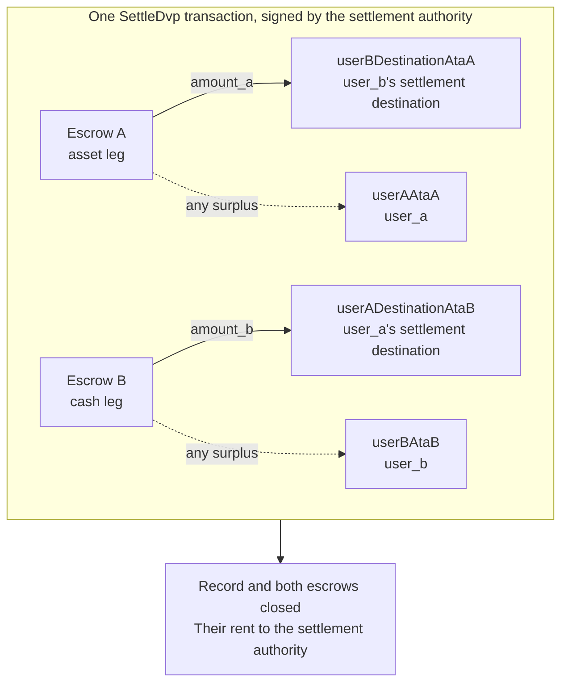

Η `SettleDvp` υπογράφεται από την αρχή διακανονισμού που αναφέρεται στην
εγγραφή της ανταλλαγής. Σε μία συναλλαγή μεταφέρει `amount_a` του σκέλους
περιουσιακού στοιχείου στον προορισμό του συμβαλλόμενου του σκέλους μετρητών και
`amount_b` του σκέλους μετρητών στον προορισμό του συμβαλλόμενου του σκέλους
περιουσιακού στοιχείου, επιστρέφει τυχόν πλεόνασμα σε οποιοδήποτε escrow στον
συμβαλλόμενο του σκέλους και κλείνει την εγγραφή και τα δύο escrow. Αν κάποια από
αυτές τις μεταφορές δεν μπορεί να ολοκληρωθεί, η εντολή αποτυγχάνει και τίποτα
δεν μετακινείται.

Αυτή η σελίδα συνεχίζει από τις ενότητες [δημιουργία ανταλλαγής](/docs/defi/dvp-program/create-a-trade)
και [χρηματοδότηση των σκελών](/docs/defi/dvp-program/fund-the-legs)· ο client, οι υπογράφοντες,
η `trade` και οι token accounts των συμβαλλομένων μεταφέρονται από εκεί.

## Επανεπαλήθευση πριν από την υπογραφή

Η αρχή διακανονισμού υπογράφει τη συναλλαγή που μετακινεί και τα δύο σκέλη, οπότε
εκτελεί την ίδια ανάγνωση με κάθε συμβαλλόμενο πριν υπογράψει: ιδιοκτήτης, μέγεθος,
συμβαλλόμενοι, mints, ποσά, λήξη και οι δύο προορισμοί (δείτε
[χρηματοδότηση των σκελών](/docs/defi/dvp-program/fund-the-legs#verify-the-terms)). Το
ίδιο το πρόγραμμα ελέγχει εκ νέου κατά τον διακανονισμό ότι κάθε mint ανήκει ακόμη
στο token program που καταγράφηκε κατά τη δημιουργία, δεν φέρει αποκλεισμένη
επέκταση και έχει την ίδια mint authority με τη στιγμή που δημιουργήθηκε η
ανταλλαγή· έτσι, ένα mint που δημιουργήθηκε εκ νέου με αποκλεισμένη επέκταση, με
διαφορετικό token program ή με διαφορετική mint authority δεν μπορεί να
διακανονιστεί.

## Δημιουργία των λογαριασμών παραληπτών

Το Settle γράφει σε τέσσερις token accounts που το πρόγραμμα δεν δημιουργεί:

| Λογαριασμός                | Λαμβάνει                     | Ιδιοκτήτης                           |
| ---------------------- | ---------------------------- | ------------------------------- |
| `userADestinationAtaB` | Το σκέλος μετρητών (`amount_b`)    | `user_a_settlement_destination` |
| `userBDestinationAtaA` | Το σκέλος περιουσιακού στοιχείου (`amount_a`)   | `user_b_settlement_destination` |
| `userAAtaA`            | Τυχόν πλεόνασμα στο σκέλος περιουσιακού στοιχείου | `user_a`                        |
| `userBAtaB`            | Τυχόν πλεόνασμα στο σκέλος μετρητών  | `user_b`                        |

Οι λογαριασμοί πλεονάσματος χρησιμοποιούνται μόνο όταν ένα escrow κατέχει περισσότερα
από το συμφωνημένο ποσό, αλλά οποιοσδήποτε κατέχει το mint μπορεί να δημιουργήσει
πλεόνασμα στέλνοντας λίγες βασικές μονάδες στο escrow. Αν ο λογαριασμός επιστροφής
δεν υπάρχει, ολόκληρο το Settle αποτυγχάνει, γι' αυτό δημιουργήστε και τους τέσσερις
με idempotent τρόπο στην ίδια συναλλαγή.

<Tabs items={["TypeScript", "Rust"]}>
  <Tab value="TypeScript">
    ```ts
    import {
      findAssociatedTokenPda,
      getCreateAssociatedTokenIdempotentInstruction,
    } from "@solana-program/token-2022";

    const destinationA = t.userASettlementDestination; // defaults to userA
    const destinationB = t.userBSettlementDestination; // defaults to userB

    const [userADestinationAtaB] = await findAssociatedTokenPda({
      mint: mintB,
      owner: destinationA,
      tokenProgram: tokenProgramB,
    });
    const [userBDestinationAtaA] = await findAssociatedTokenPda({
      mint: mintA,
      owner: destinationB,
      tokenProgram: tokenProgramA,
    });
    // userAAtaA and userBAtaB are from fund the legs.

    const createRecipientAccounts = [
      { ata: userADestinationAtaB, owner: destinationA, mint: mintB, tokenProgram: tokenProgramB },
      { ata: userBDestinationAtaA, owner: destinationB, mint: mintA, tokenProgram: tokenProgramA },
      { ata: userAAtaA, owner: userA, mint: mintA, tokenProgram: tokenProgramA },
      { ata: userBAtaB, owner: userB, mint: mintB, tokenProgram: tokenProgramB },
    ].map(({ ata, owner, mint, tokenProgram }) =>
      getCreateAssociatedTokenIdempotentInstruction({
        payer: authoritySigner,
        ata,
        owner,
        mint,
        tokenProgram,
      }),
    );
    ```

  </Tab>

  <Tab value="Rust">
    ```rust
    use spl_associated_token_account_client::address::get_associated_token_address_with_program_id;
    use spl_associated_token_account_client::instruction::create_associated_token_account_idempotent;

    let authority: Pubkey = pubkey!("SETTLEMENT_AUTHORITY_ADDRESS_HERE");
    let destination_a = trade.user_a_settlement_destination; // defaults to user_a
    let destination_b = trade.user_b_settlement_destination; // defaults to user_b

    let user_a_destination_ata_b =
        get_associated_token_address_with_program_id(&destination_a, &mint_b, &token_program_b);
    let user_b_destination_ata_a =
        get_associated_token_address_with_program_id(&destination_b, &mint_a, &token_program_a);
    let user_a_ata_a = get_associated_token_address_with_program_id(&user_a, &mint_a, &token_program_a);
    let user_b_ata_b = get_associated_token_address_with_program_id(&user_b, &mint_b, &token_program_b);

    let create_recipient_accounts = [
        create_associated_token_account_idempotent(&authority, &destination_a, &mint_b, &token_program_b),
        create_associated_token_account_idempotent(&authority, &destination_b, &mint_a, &token_program_a),
        create_associated_token_account_idempotent(&authority, &user_a, &mint_a, &token_program_a),
        create_associated_token_account_idempotent(&authority, &user_b, &mint_b, &token_program_b),
    ];
    ```

  </Tab>
</Tabs>

## Διακανονισμός

Το `legAExtrasCount` δηλώνει στο πρόγραμμα πόσοι από τους λογαριασμούς που προστίθενται
μετά τη σταθερή λίστα ανήκουν στο transfer hook της μεταφοράς του σκέλους
περιουσιακού στοιχείου· οι υπόλοιποι ανήκουν σε εκείνο του σκέλους μετρητών. Για mints
χωρίς transfer hooks, περάστε μηδέν και μην προσθέσετε τίποτα. Το memo
program account απαιτείται από την εντολή και χρησιμοποιείται μόνο για προορισμούς
που απαιτούν memo.

<Tabs items={["TypeScript", "Rust"]}>
  <Tab value="TypeScript">
    ```ts
    import { MEMO_PROGRAM_ADDRESS } from "@solana-program/memo";
    import { getSettleDvpInstruction } from "./dvp";

    const settleInstruction = getSettleDvpInstruction({
      settlementAuthority: authoritySigner,
      swapDvp,
      mintA,
      mintB,
      dvpAtaA: escrowA,
      dvpAtaB: escrowB,
      userADestinationAtaB,
      userBDestinationAtaA,
      userAAtaA,
      userBAtaB,
      tokenProgramA,
      tokenProgramB,
      memoProgram: MEMO_PROGRAM_ADDRESS,
      legAExtrasCount: 0,
    });

    const { context: settleContext } = await client.sendTransaction([
      ...createRecipientAccounts,
      settleInstruction,
    ]);
    const settleSignature = settleContext.signature;
    console.log("Submitted:", settleSignature);

    // sendTransaction returns at the client's commitment (confirmed by default).
    // Wait for finalized before recording the trade as settled.
    let finalized = false;
    for (let attempt = 0; attempt < 30 && !finalized; attempt++) {
      const {
        value: [status],
      } = await client.rpc.getSignatureStatuses([settleSignature]).send();
      if (status?.err) {
        throw new Error("Settle transaction failed");
      }
      finalized = status?.confirmationStatus === "finalized";
      if (!finalized) {
        await new Promise((resolve) => setTimeout(resolve, 2_000));
      }
    }
    if (!finalized) {
      // A closed record means it settled; an open one is safe to settle again.
      throw new Error("Settle not finalized after 60s; read the trade record");
    }
    console.log("Settled:", settleSignature);
    ```

  </Tab>

  <Tab value="Rust">
    ```rust
    use dvp_swap_program_client::instructions::SettleDvpBuilder;

    const MEMO_PROGRAM_ID: Pubkey = pubkey!("MemoSq4gqABAXKb96qnH8TysNcWxMyWCqXgDLGmfcHr");

    let settle_ix = SettleDvpBuilder::new()
        .settlement_authority(authority)
        .swap_dvp(swap_dvp)
        .mint_a(mint_a)
        .mint_b(mint_b)
        .dvp_ata_a(escrow_a)
        .dvp_ata_b(escrow_b)
        .user_a_destination_ata_b(user_a_destination_ata_b)
        .user_b_destination_ata_a(user_b_destination_ata_a)
        .user_a_ata_a(user_a_ata_a)
        .user_b_ata_b(user_b_ata_b)
        .token_program_a(token_program_a)
        .token_program_b(token_program_b)
        .memo_program(MEMO_PROGRAM_ID)
        .leg_a_extras_count(0)
        .instruction();
    ```

  </Tab>
</Tabs>



### Transfer hooks

Το παραγόμενο IDL απαριθμεί μόνο τους σταθερούς λογαριασμούς, επομένως οι παραγόμενοι
builders δεν γνωρίζουν τους λογαριασμούς των hooks. Επιλύστε τα extra account metas κάθε
mint με hook με τον ίδιο τρόπο που θα το κάνατε για μια άμεση μεταφορά αυτού του token και
στη συνέχεια προσθέστε τα στην εντολή: πρώτα οι λογαριασμοί του σκέλους περιουσιακού
στοιχείου και μετά του σκέλους μετρητών, με το
`legAExtrasCount` ορισμένο στον αριθμό της πρώτης ομάδας. Στην TypeScript, κάντε spread
τα επιλυμένα metas στον πίνακα `accounts` της εντολής· στη Rust, χρησιμοποιήστε
το `add_remaining_accounts` στον builder. Το όριο είναι 32 λογαριασμοί ανά σκέλος,
συμπεριλαμβανομένου του προγράμματος του hook και του λογαριασμού επικύρωσης· το όριο
λογαριασμών της συναλλαγής μπορεί να ισχύσει πρώτο όταν και τα δύο σκέλη φέρουν hooks.
Το πρόγραμμα αφαιρεί τη σημαία signer από κάθε λογαριασμό που προωθείται, ώστε ένα hook
να μην μπορεί να αποκτήσει την υπογραφή της αρχής διακανονισμού μέσω αυτής της διαδρομής.

## Καταγραφή του αποτελέσματος

Θεωρήστε την ανταλλαγή διακανονισμένη όταν η συναλλαγή Settle φτάσει στο `finalized`.
Η εγγραφή και τα δύο escrow δεν υπάρχουν πλέον μετά τον διακανονισμό, οπότε ένα σύστημα
που χρειάζεται τους όρους αργότερα τους αποθηκεύει από την ανάγνωση πριν τον
διακανονισμό ή από τη συναλλαγή δημιουργίας. Το rent των κλειστών λογαριασμών έχει
πάει στην αρχή διακανονισμού.

## Σφάλματα διακανονισμού

Το `LegNotFunded` σημαίνει ότι ένα escrow κατέχει λιγότερα από το συμφωνημένο ποσό·
τα `DvpExpired` και `SettlementTooEarly` σημαίνουν ότι χάθηκε το χρονικό παράθυρο·
τα `MintAuthorityChanged` και `BlockedMintExtension` σημαίνουν ότι ένα mint άλλαξε
μετά τη δημιουργία· το `RecipientAtaMismatch` σημαίνει ότι ένας token account
προορισμού ή επιστροφής λείπει ή δεν ανήκει πλέον στον αναμενόμενο ιδιοκτήτη και
mint, συνήθως επειδή παραλείφθηκε το παραπάνω βήμα δημιουργίας λογαριασμών. Σε κάθε
περίπτωση δεν έχει μετακινηθεί τίποτα και οι συμβαλλόμενοι μπορούν να αναιρέσουν την
ανταλλαγή, υπό τους περιορισμούς των authorities του mint (δείτε
[αναίρεση ανταλλαγής](/docs/defi/dvp-program/unwind-a-trade)).

## Επόμενα βήματα

- [Αναίρεση ανταλλαγής](/docs/defi/dvp-program/unwind-a-trade): ανάκτηση των χρηματοδοτημένων
  σκελών όταν μια ανταλλαγή δεν διακανονίζεται
