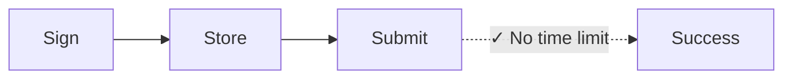
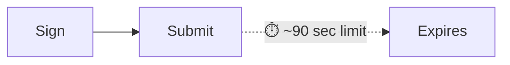

Κάθε συναλλαγή Solana περιλαμβάνει ένα πρόσφατο blockhash—μια αναφορά σε μια
πρόσφατη κατάσταση δικτύου που αποδεικνύει ότι η συναλλαγή δημιουργήθηκε "τώρα".
Το δίκτυο απορρίπτει οποιαδήποτε συναλλαγή με blockhash παλαιότερο από ~150
blocks (~60-90 δευτερόλεπτα), αποτρέποντας επιθέσεις επανάληψης και ξεπερασμένες
υποβολές. Αυτό λειτουργεί τέλεια για πληρωμές σε πραγματικό χρόνο. Αλλά
διακόπτει ροές εργασίας που χρειάζονται χρονικό διάστημα μεταξύ υπογραφής και
υποβολής, όπως:

| Σενάριο                        | Γιατί αποτυγχάνουν οι τυπικές συναλλαγές                                                  |
| ------------------------------ | ----------------------------------------------------------------------------------------- |
| **Λειτουργίες ταμείου**        | Ο CFO στο Τόκιο υπογράφει, ο Controller στη Νέα Υόρκη εγκρίνει—90 δευτερόλεπτα δεν αρκούν |
| **Ροές εργασίας συμμόρφωσης**  | Οι συναλλαγές χρειάζονται νομική/κανονιστική επανεξέταση πριν την εκτέλεση                |
| **Υπογραφή cold storage**      | Τα air-gapped μηχανήματα απαιτούν χειροκίνητη μεταφορά υπογεγραμμένων συναλλαγών          |
| **Προετοιμασία παρτίδας**      | Προετοιμάστε μισθοδοσία ή εκταμιεύσεις κατά τις εργάσιμες ώρες, εκτελέστε τη νύχτα        |
| **Συντονισμός multi-sig**      | Πολλαπλοί εγκρίνοντες σε διαφορετικές ζώνες ώρας                                          |
| **Προγραμματισμένες πληρωμές** | Προγραμματίστε πληρωμές για εκτέλεση σε μελλοντική ημερομηνία                             |

Στα παραδοσιακά χρηματοοικονομικά, μια υπογεγραμμένη επιταγή δεν λήγει σε 90
δευτερόλεπτα. Ορισμένες λειτουργίες blockchain δεν θα έπρεπε επίσης. Τα
**durable nonces** λύνουν αυτό αντικαθιστώντας το πρόσφατο blockhash με μια
αποθηκευμένη, μόνιμη τιμή που προχωρά μόνο όταν τη χρησιμοποιείτε—δίνοντάς σας
συναλλαγές που παραμένουν έγκυρες μέχρι να είστε έτοιμοι να τις υποβάλετε.

## Πώς λειτουργεί

Αντί για ένα πρόσφατο blockhash (έγκυρο ~150 blocks), χρησιμοποιείτε έναν
**λογαριασμό nonce**, έναν ειδικό λογαριασμό που αποθηκεύει μια _μοναδική_ τιμή
η οποία μπορεί να χρησιμοποιηθεί στη θέση ενός blockhash. Κάθε συναλλαγή που
χρησιμοποιεί αυτό το nonce πρέπει να το "προωθήσει" ως πρώτη εντολή. Κάθε τιμή
nonce μπορεί να χρησιμοποιηθεί μόνο για μία συναλλαγή.





<Callout type="info">
  Ο λογαριασμός nonce κοστίζει ~0.0015 SOL για απαλλαγή από rent. Ένας
  λογαριασμός nonce = μία εκκρεμής συναλλαγή τη φορά. Για παράλληλες ροές
  εργασίας, δημιουργήστε πολλαπλούς λογαριασμούς nonce.
</Callout>

### Δημιουργία λογαριασμού nonce

Η δημιουργία ενός λογαριασμού nonce απαιτεί δύο εντολές σε μία μόνο συναλλαγή:

1. **Δημιουργήστε τον λογαριασμό** χρησιμοποιώντας `getCreateAccountInstruction`
   από το System Program
2. **Αρχικοποιήστε τον ως nonce** χρησιμοποιώντας
   `getInitializeNonceAccountInstruction`

<ScrollyCoding>

## !!steps Δημιουργία keypair

Δημιουργήστε ένα νέο keypair για χρήση ως διεύθυνση λογαριασμού nonce και
υπολογίστε τον απαιτούμενο χώρο και το rent.

<CodePlaceholder title="Create Nonce Account" />

```ts !! title="Create Nonce Account"
const nonceKeypair = await generateKeyPairSigner();
const nonceSpace = BigInt(getNonceSize());
const nonceRent = await rpc
  .getMinimumBalanceForRentExemption(nonceSpace)
  .send();
```

## !!steps Εντολή δημιουργίας λογαριασμού

Δημιουργήστε τον λογαριασμό που ανήκει στο System Program με αρκετά lamports για
απαλλαγή από rent.

<CodePlaceholder title="Create Nonce Account" />

```ts !! title="Create Nonce Account"
const nonceKeypair = await generateKeyPairSigner();
const nonceSpace = BigInt(getNonceSize());
const nonceRent = await rpc
  .getMinimumBalanceForRentExemption(nonceSpace)
  .send();

// !focus(1:7)
const createNonceAccountIx = getCreateAccountInstruction({
  payer: sender,
  newAccount: nonceKeypair,
  lamports: nonceRent,
  space: nonceSpace,
  programAddress: SYSTEM_PROGRAM_ADDRESS
});
```

## !!steps Εντολή αρχικοποίησης nonce

Αρχικοποιήστε τον λογαριασμό ως λογαριασμό nonce, ορίζοντας την εξουσία που
μπορεί να τον προωθήσει.

<CodePlaceholder title="Create Nonce Account" />

```ts !! title="Create Nonce Account"
const nonceKeypair = await generateKeyPairSigner();
const nonceSpace = BigInt(getNonceSize());
const nonceRent = await rpc
  .getMinimumBalanceForRentExemption(nonceSpace)
  .send();

const createNonceAccountIx = getCreateAccountInstruction({
  payer: sender,
  newAccount: nonceKeypair,
  lamports: nonceRent,
  space: nonceSpace,
  programAddress: SYSTEM_PROGRAM_ADDRESS
});

// !focus(1:4)
const initNonceIx = getInitializeNonceAccountInstruction({
  nonceAccount: nonceKeypair.address,
  nonceAuthority: sender.address
});
```

## !!steps Δημιουργία συναλλαγής

Δημιουργήστε μια συναλλαγή με και τις δύο εντολές.

<CodePlaceholder title="Create Nonce Account" />

```ts !! title="Create Nonce Account"
const nonceKeypair = await generateKeyPairSigner();
const nonceSpace = BigInt(getNonceSize());
const nonceRent = await rpc
  .getMinimumBalanceForRentExemption(nonceSpace)
  .send();

const createNonceAccountIx = getCreateAccountInstruction({
  payer: sender,
  newAccount: nonceKeypair,
  lamports: nonceRent,
  space: nonceSpace,
  programAddress: SYSTEM_PROGRAM_ADDRESS
});

const initNonceIx = getInitializeNonceAccountInstruction({
  nonceAccount: nonceKeypair.address,
  nonceAuthority: sender.address
});

// !focus(1:7)
const { value: blockhash } = await rpc.getLatestBlockhash().send();
const createNonceTx = pipe(
  createTransactionMessage({ version: 0 }),
  (tx) => setTransactionMessageFeePayerSigner(sender, tx),
  (tx) => setTransactionMessageLifetimeUsingBlockhash(blockhash, tx),
  (tx) =>
    appendTransactionMessageInstructions(
      [createNonceAccountIx, initNonceIx],
      tx
    )
);
```

## !!steps Υπογραφή και αποστολή

Υπογράψτε και στείλτε τη συναλλαγή για να δημιουργήσετε και να αρχικοποιήσετε
τον λογαριασμό nonce.

<CodePlaceholder title="Δημιουργία λογαριασμού nonce" />

```ts !! title="Create Nonce Account"
const nonceKeypair = await generateKeyPairSigner();
const nonceSpace = BigInt(getNonceSize());
const nonceRent = await rpc
  .getMinimumBalanceForRentExemption(nonceSpace)
  .send();

const createNonceAccountIx = getCreateAccountInstruction({
  payer: sender,
  newAccount: nonceKeypair,
  lamports: nonceRent,
  space: nonceSpace,
  programAddress: SYSTEM_PROGRAM_ADDRESS
});

const initNonceIx = getInitializeNonceAccountInstruction({
  nonceAccount: nonceKeypair.address,
  nonceAuthority: sender.address
});

const { value: blockhash } = await rpc.getLatestBlockhash().send();
const createNonceTx = pipe(
  createTransactionMessage({ version: 0 }),
  (tx) => setTransactionMessageFeePayerSigner(sender, tx),
  (tx) => setTransactionMessageLifetimeUsingBlockhash(blockhash, tx),
  (tx) =>
    appendTransactionMessageInstructions(
      [createNonceAccountIx, initNonceIx],
      tx
    )
);

// !focus(1:6)
const signedCreateNonceTx =
  await signTransactionMessageWithSigners(createNonceTx);

await sendAndConfirmTransactionFactory({ rpc, rpcSubscriptions })(
  signedCreateNonceTx,
  { commitment: "confirmed" }
);
```

</ScrollyCoding>

### Δημιουργία αναβαλλόμενης συναλλαγής

Αντί για ένα πρόσφατο blockhash, χρησιμοποιήστε το `blockhash` του λογαριασμού
nonce ως διάρκεια ζωής της συναλλαγής.

<ScrollyCoding>

## !!steps Ανάκτηση του nonce

Ανακτήστε τα δεδομένα από τον λογαριασμό nonce. Χρησιμοποιήστε το `blockhash`
από τον λογαριασμό nonce ως διάρκεια ζωής της συναλλαγής.

```sh title="Example Nonce Account Data"
{
  version: 1,
  state: 1,
  authority: 'HgjaL8artMtmntaQDVM2UBk3gppsYYERS4PkUhiaLZD1',
  # !mark
  blockhash: '5U7seXqfgZx1uh5DFhdH1vyBhr7XGRrKxBAnJJTbbUa',
  lamportsPerSignature: 5000n
}
```

<CodePlaceholder title="Δημιουργία αναβαλλόμενης συναλλαγής" />

```ts !! title="Build Deferred Transaction"
// !focus(1:1)
const { data: nonceData } = await fetchNonce(rpc, nonceKeypair.address);
```

## !!steps Δημιουργία εντολής μεταφοράς

Δημιουργήστε την εντολή για την πληρωμή σας. Αυτό το παράδειγμα δείχνει μια
μεταφορά token.

<CodePlaceholder title="Δημιουργία αναβαλλόμενης συναλλαγής" />

```ts !! title="Build Deferred Transaction"
const { data: nonceData } = await fetchNonce(rpc, nonceKeypair.address);

// !focus(1:6)
const transferInstruction = getTransferInstruction({
  source: senderAta,
  destination: recipientAta,
  authority: sender.address,
  amount: 250_000n
});
```

## !!steps Δημιουργία συναλλαγής με durable nonce

Χρησιμοποιήστε το `setTransactionMessageLifetimeUsingDurableNonce` που ορίζει το
nonce ως blockhash και αυτόματα προσθέτει την εντολή προώθησης nonce στην αρχή.

<CodePlaceholder title="Δημιουργία αναβαλλόμενης συναλλαγής" />

```ts !! title="Build Deferred Transaction"
const { data: nonceData } = await fetchNonce(rpc, nonceKeypair.address);

const transferInstruction = getTransferInstruction({
  source: senderAta,
  destination: recipientAta,
  authority: sender.address,
  amount: 250_000n
});

// !focus(1:14)
const transactionMessage = pipe(
  createTransactionMessage({ version: 0 }),
  (tx) => setTransactionMessageFeePayerSigner(sender, tx),
  (tx) =>
    // !mark(1:8)
    setTransactionMessageLifetimeUsingDurableNonce(
      {
        nonce: nonceData.blockhash as Nonce,
        nonceAccountAddress: nonceKeypair.address,
        nonceAuthorityAddress: nonceData.authority
      },
      tx
    ),
  (tx) => appendTransactionMessageInstructions([transferInstruction], tx)
);
```

## !!steps Υπογραφή συναλλαγής

Υπογράψτε τη συναλλαγή. Τώρα χρησιμοποιεί το durable nonce αντί για ένα τυπικό
blockhash.

<CodePlaceholder title="Δημιουργία αναβαλλόμενης συναλλαγής" />

```ts !! title="Build Deferred Transaction"
const { data: nonceData } = await fetchNonce(rpc, nonceKeypair.address);

const transferInstruction = getTransferInstruction({
  source: senderAta,
  destination: recipientAta,
  authority: sender.address,
  amount: 250_000n
});

const transactionMessage = pipe(
  createTransactionMessage({ version: 0 }),
  (tx) => setTransactionMessageFeePayerSigner(sender, tx),
  (tx) =>
    setTransactionMessageLifetimeUsingDurableNonce(
      {
        nonce: nonceData.blockhash as Nonce,
        nonceAccountAddress: nonceKeypair.address,
        nonceAuthorityAddress: nonceData.authority
      },
      tx
    ),
  (tx) => appendTransactionMessageInstructions([transferInstruction], tx)
);

// !focus(1:2)
const signedTransaction =
  await signTransactionMessageWithSigners(transactionMessage);
```

</ScrollyCoding>

### Αποθήκευση ή αποστολή συναλλαγής

Μετά την υπογραφή, κωδικοποιήστε τη συναλλαγή για αποθήκευση. Όταν είστε
έτοιμοι, στείλτε την στο δίκτυο.

<ScrollyCoding>

## !!steps Κωδικοποίηση για αποθήκευση

Κωδικοποιήστε την υπογεγραμμένη συναλλαγή σε base64. Αποθηκεύστε αυτή την τιμή
στη βάση δεδομένων σας.

<CodePlaceholder title="Αποθήκευση και εκτέλεση" />

```ts !! title="Store and Execute"
const signedTransaction =
  await signTransactionMessageWithSigners(transactionMessage);

// !focus(1:2)
const base64EncodedTransaction =
  getBase64EncodedWireTransaction(signedTransaction);

// Store base64EncodedTransaction in your database
```

## !!steps Αποστολή συναλλαγής

Στείλτε την υπογεγραμμένη συναλλαγή όταν είστε έτοιμοι. Η συναλλαγή παραμένει
έγκυρη μέχρι να προχωρήσει το nonce.

<CodePlaceholder title="Αποθήκευση και εκτέλεση" />

```ts !! title="Store and Execute"
const signedTransaction =
  await signTransactionMessageWithSigners(transactionMessage);

const base64EncodedTransaction =
  getBase64EncodedWireTransaction(signedTransaction);

// When ready to execute (could be days later):
// !focus(1:3)
await rpc
  .sendTransaction(base64EncodedTransaction, { encoding: "base64" })
  .send();
```

</ScrollyCoding>

### Επίδειξη

<CodeTabs flags="r">

```ts !! title="Demo"
// !collapse(1:39) collapsed
// Click ">" icon on left to expand demo imports
import {
  airdropFactory,
  appendTransactionMessageInstructions,
  assertIsTransactionWithBlockhashLifetime,
  assertIsTransactionWithDurableNonceLifetime,
  createSolanaRpc,
  createSolanaRpcSubscriptions,
  createTransactionMessage,
  generateKeyPairSigner,
  getSignatureFromTransaction,
  lamports,
  type Nonce,
  pipe,
  sendAndConfirmTransactionFactory,
  setTransactionMessageFeePayerSigner,
  setTransactionMessageLifetimeUsingBlockhash,
  setTransactionMessageLifetimeUsingDurableNonce,
  signTransactionMessageWithSigners,
  type KeyPairSigner,
  getBase64EncodedWireTransaction
} from "@solana/kit";
import {
  fetchNonce,
  getCreateAccountInstruction,
  getInitializeNonceAccountInstruction,
  getNonceSize,
  SYSTEM_PROGRAM_ADDRESS
} from "@solana-program/system";
import {
  getCreateAssociatedTokenInstructionAsync,
  getInitializeMintInstruction,
  getMintSize,
  TOKEN_2022_PROGRAM_ADDRESS,
  findAssociatedTokenPda,
  getMintToInstruction,
  getTransferInstruction
} from "@solana-program/token-2022";

// Generate keypairs for sender and recipient
const sender = await generateKeyPairSigner();
const recipient = await generateKeyPairSigner();

console.log("Sender Address:", sender.address);
console.log("Recipient Address:", recipient.address);

// Demo Setup: Create RPC connection, mint, and token accounts
const { rpc, rpcSubscriptions, mint } = await demoSetup(sender, recipient);

// =============================================================================
// Step 1: Create a Nonce Account
// =============================================================================

// !mark
const nonceKeypair = await generateKeyPairSigner();
console.log("\nNonce Account Address:", nonceKeypair.address);

// !mark(1:4)
const nonceSpace = BigInt(getNonceSize());
const nonceRent = await rpc
  .getMinimumBalanceForRentExemption(nonceSpace)
  .send();

// Instruction to create new account for the nonce
// !mark(1:7)
const createNonceAccountIx = getCreateAccountInstruction({
  payer: sender,
  newAccount: nonceKeypair,
  lamports: nonceRent,
  space: nonceSpace,
  programAddress: SYSTEM_PROGRAM_ADDRESS
});

// Instruction to initialize the nonce account
// !mark(1:4)
const initNonceIx = getInitializeNonceAccountInstruction({
  nonceAccount: nonceKeypair.address,
  nonceAuthority: sender.address
});

// Build and send nonce account creation transaction
const { value: blockhash } = await rpc.getLatestBlockhash().send();
const createNonceTx = pipe(
  createTransactionMessage({ version: 0 }),
  (tx) => setTransactionMessageFeePayerSigner(sender, tx),
  (tx) => setTransactionMessageLifetimeUsingBlockhash(blockhash, tx),
  (tx) =>
    appendTransactionMessageInstructions(
      [createNonceAccountIx, initNonceIx],
      tx
    )
);

const signedCreateNonceTx =
  await signTransactionMessageWithSigners(createNonceTx);
assertIsTransactionWithBlockhashLifetime(signedCreateNonceTx);

await sendAndConfirmTransactionFactory({ rpc, rpcSubscriptions })(
  signedCreateNonceTx,
  { commitment: "confirmed" }
);

console.log("Nonce Account created.");

// =============================================================================
// Step 2: Token Payment with Durable Nonce
// =============================================================================

// Fetch current nonce value from the nonce account
// !mark
const { data: nonceData } = await fetchNonce(rpc, nonceKeypair.address);
console.log("Nonce Account data:", nonceData);

const [senderAta] = await findAssociatedTokenPda({
  mint: mint.address,
  owner: sender.address,
  tokenProgram: TOKEN_2022_PROGRAM_ADDRESS
});

const [recipientAta] = await findAssociatedTokenPda({
  mint: mint.address,
  owner: recipient.address,
  tokenProgram: TOKEN_2022_PROGRAM_ADDRESS
});

console.log("\nMint Address:", mint.address);
console.log("Sender Token Account:", senderAta);
console.log("Recipient Token Account:", recipientAta);

const transferInstruction = getTransferInstruction({
  source: senderAta,
  destination: recipientAta,
  authority: sender.address,
  amount: 250_000n // 0.25 tokens
});

// Create transaction message using durable nonce lifetime
// setTransactionMessageLifetimeUsingDurableNonce automatically prepends
// the AdvanceNonceAccount instruction
const transactionMessage = pipe(
  createTransactionMessage({ version: 0 }),
  (tx) => setTransactionMessageFeePayerSigner(sender, tx),
  (tx) =>
    // !mark(1:8)
    setTransactionMessageLifetimeUsingDurableNonce(
      {
        nonce: nonceData.blockhash as string as Nonce,
        nonceAccountAddress: nonceKeypair.address,
        nonceAuthorityAddress: nonceData.authority
      },
      tx
    ),
  (tx) => appendTransactionMessageInstructions([transferInstruction], tx)
);

const signedTransaction =
  await signTransactionMessageWithSigners(transactionMessage);
assertIsTransactionWithDurableNonceLifetime(signedTransaction);
const transactionSignature = getSignatureFromTransaction(signedTransaction);

// Encode the transaction to base64, optionally save and send at a later time
// !mark(1:2)
const base64EncodedTransaction =
  getBase64EncodedWireTransaction(signedTransaction);
console.log("\nBase64 Encoded Transaction:", base64EncodedTransaction);

// Send the encoded transaction, blockhash does not expire
// !mark(1:6)
await rpc
  .sendTransaction(base64EncodedTransaction, {
    encoding: "base64",
    skipPreflight: true
  })
  .send();

console.log("\n=== Token Payment with Durable Nonce Complete ===");
console.log("Transaction Signature:", transactionSignature);

// =============================================================================
// Demo Setup Helper Function
// =============================================================================
// !collapse(1:1000) collapsed

/**
 * Sets up for a token transfer demo:
 * - Creates RPC connection
 * - Airdrops SOL to sender for transaction fees
 * - Generates mint keypair and creates/initializes mint account
 * - Creates associated token accounts for sender and recipient
 * - Mints initial tokens to sender
 *
 * @param sender - The sender's keypair (will be funded and used as mint authority)
 * @param recipient - The recipient's keypair
 * @returns RPC connection and mint address
 */
async function demoSetup(sender: KeyPairSigner, recipient: KeyPairSigner) {
  const rpc = createSolanaRpc("http://localhost:8899");
  const rpcSubscriptions = createSolanaRpcSubscriptions("ws://localhost:8900");

  // Fund sender with SOL for transaction fees
  await airdropFactory({ rpc, rpcSubscriptions })({
    recipientAddress: sender.address,
    lamports: lamports(1_000_000_000n),
    commitment: "confirmed"
  });

  // Create Mint and Token Accounts
  const mint = await generateKeyPairSigner();

  const mintSpace = BigInt(getMintSize());
  const mintRent = await rpc
    .getMinimumBalanceForRentExemption(mintSpace)
    .send();

  const createMintAccountIx = getCreateAccountInstruction({
    payer: sender,
    newAccount: mint,
    lamports: mintRent,
    space: mintSpace,
    programAddress: TOKEN_2022_PROGRAM_ADDRESS
  });

  const initializeMintIx = getInitializeMintInstruction({
    mint: mint.address,
    decimals: 6,
    mintAuthority: sender.address
  });

  const [senderAta] = await findAssociatedTokenPda({
    mint: mint.address,
    owner: sender.address,
    tokenProgram: TOKEN_2022_PROGRAM_ADDRESS
  });

  const createSenderAtaIx = await getCreateAssociatedTokenInstructionAsync({
    payer: sender,
    mint: mint.address,
    owner: sender.address
  });

  const createRecipientAtaIx = await getCreateAssociatedTokenInstructionAsync({
    payer: sender,
    mint: mint.address,
    owner: recipient.address
  });

  const mintToIx = getMintToInstruction({
    mint: mint.address,
    token: senderAta,
    mintAuthority: sender.address,
    amount: 1_000_000n // Mint 1.00 tokens (1,000,000 base units with 6 decimals)
  });

  const { value: latestBlockhash } = await rpc.getLatestBlockhash().send();

  const instructions = [
    createMintAccountIx,
    initializeMintIx,
    createSenderAtaIx,
    createRecipientAtaIx,
    mintToIx
  ];

  const transactionMessage = pipe(
    createTransactionMessage({ version: 0 }),
    (tx) => setTransactionMessageFeePayerSigner(sender, tx),
    (tx) => setTransactionMessageLifetimeUsingBlockhash(latestBlockhash, tx),
    (tx) => appendTransactionMessageInstructions(instructions, tx)
  );

  const signedTransaction =
    await signTransactionMessageWithSigners(transactionMessage);

  assertIsTransactionWithBlockhashLifetime(signedTransaction);

  await sendAndConfirmTransactionFactory({ rpc, rpcSubscriptions })(
    signedTransaction,
    { commitment: "confirmed" }
  );

  return { rpc, rpcSubscriptions, mint };
}
```

</CodeTabs>

## Ακύρωση εκκρεμούς συναλλαγής

Κάθε λογαριασμός nonce `blockhash` μπορεί να χρησιμοποιηθεί μόνο μία φορά. Για
να ακυρώσετε μια εκκρεμή συναλλαγή ή να προετοιμάσετε τον λογαριασμό nonce για
επαναχρησιμοποίηση, προχωρήστε τον χειροκίνητα:

```ts
import { getAdvanceNonceAccountInstruction } from "@solana-program/system";

// Submit this instruction (with a regular blockhash) to invalidate any pending transaction
getAdvanceNonceAccountInstruction({
  nonceAccount: nonceAddress,
  nonceAuthority
});
```

Αυτό δημιουργεί μια νέα τιμή nonce, καθιστώντας οποιαδήποτε συναλλαγή
υπογεγραμμένη με την παλιά τιμή μόνιμα άκυρη.

## Ροή εργασίας έγκρισης πολλαπλών μερών

Αποσειριοποιήστε τη συναλλαγή για να προσθέσετε πρόσθετες υπογραφές, στη
συνέχεια σειριοποιήστε ξανά για αποθήκευση ή υποβολή:

```ts
import {
  getBase64Decoder,
  getTransactionDecoder,
  getBase64EncodedWireTransaction,
  partiallySignTransaction
} from "@solana/kit";

// Deserialize the stored transaction
const txBytes = getBase64Decoder().decode(serializedString);
const partiallySignedTx = getTransactionDecoder().decode(txBytes);

// Each approver adds their signature
const fullySignedTx = await partiallySignTransaction(
  [newSigner],
  partiallySignedTx
);

// Serialize again for storage or submission
const serialized = getBase64EncodedWireTransaction(fullySignedTx);
```

Η συναλλαγή μπορεί να σειριοποιηθεί, να αποθηκευτεί και να μεταβιβαστεί μεταξύ
των εγκριτών. Μόλις συλλεχθούν όλες οι απαιτούμενες υπογραφές, υποβάλετε στο
δίκτυο.

## Ζητήματα παραγωγής

**Διαχείριση λογαριασμών nonce:**

- Δημιουργήστε μια δεξαμενή λογαριασμών nonce για παράλληλη προετοιμασία
  συναλλαγών
- Παρακολουθήστε ποια nonces είναι "σε χρήση" (έχουν εκκρεμείς υπογεγραμμένες
  συναλλαγές)
- Υλοποιήστε ανακύκλωση nonce μετά την υποβολή ή την εγκατάλειψη των συναλλαγών

**Ασφάλεια:**

- Η εξουσία nonce ελέγχει εάν οι συναλλαγές μπορούν να ακυρωθούν. Εξετάστε το
  ενδεχόμενο διαχωρισμού της εξουσίας nonce από τους υπογράφοντες συναλλαγών για
  πρόσθετο έλεγχο και διαχωρισμό καθηκόντων
- _Οποιοσδήποτε_ με τα σειριοποιημένα bytes συναλλαγής μπορεί να την υποβάλει
  στο δίκτυο

## Σχετικοί πόροι

- [Εισαγωγή στα Durable Nonces](https://solana.com/developers/guides/advanced/introduction-to-durable-nonces)
