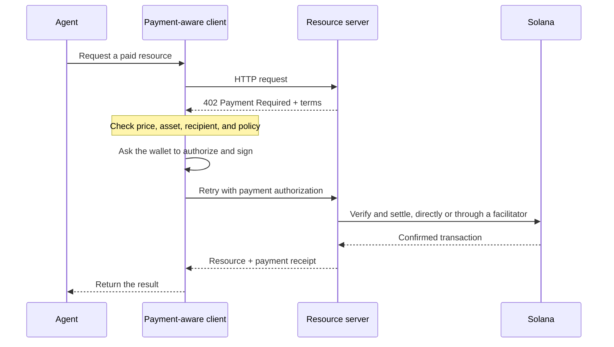

Οι πληρωμές από πράκτορες (agentic payments) επιτρέπουν στο λογισμικό να ανακαλύπτει μια τιμή, να εγκρίνει μια πληρωμή και να λαμβάνει
έναν πόρο στην ίδια ροή εργασίας HTTP. Ένας πράκτορας μπορεί να πληρώσει για ένα ερώτημα δεδομένων, μια εκτέλεση μοντέλου
(inference) ή μια κλήση εργαλείου χωρίς να δημιουργήσει πρώτα λογαριασμό χρέωσης ή να αντιγράψει ένα
κλειδί API.

<Cards>
  <Card title="MPP" href="/docs/payments/agentic-payments/mpp">
    Χρησιμοποιήστε έλεγχο ταυτότητας HTTP για εφάπαξ χρεώσεις και συνεδρίες πληρωμής με μέτρηση χρήσης.
  </Card>
  <Card title="x402" href="/docs/payments/agentic-payments/x402">
    Προσθέστε στον πόρο HTTP τις απαιτήσεις πληρωμής, τις υπογραφές και τον διακανονισμό του x402 V2.
  </Card>
</Cards>

## Η κοινή ροή πληρωμής

Το MPP και το x402 χρησιμοποιούν διαφορετικές κεφαλίδες και μοντέλα δεδομένων, αλλά η βασική ροή HTTP τους είναι
παρόμοια:

## MPP και x402

Και τα δύο πρωτόκολλα μπορούν να διακανονίσουν πληρωμές σε stablecoin στο Solana. Επιλέξτε με βάση το
μοντέλο πληρωμής και τη διαλειτουργικότητα που χρειάζεται η υπηρεσία σας, και όχι μόνο με βάση τον κοινό κωδικό κατάστασης
`402`.

|                         | MPP                                                               | x402                                                                     |
| ----------------------- | ----------------------------------------------------------------- | ------------------------------------------------------------------------ |
| Πρόκληση (Challenge)               | `WWW-Authenticate: Payment`                                       | `PAYMENT-REQUIRED`                                                       |
| Εξουσιοδότηση πελάτη    | `Authorization: Payment`                                          | `PAYMENT-SIGNATURE`                                                      |
| Απόδειξη                 | `Payment-Receipt`                                                 | `PAYMENT-RESPONSE`                                                       |
| Μοντέλα πληρωμής στο Solana   | Εφάπαξ `charge` και `session` intents με όριο και μέτρηση χρήσης           | Σχήματα όπως `exact` και `upto`· η υποστήριξη διαφέρει ανά δίκτυο και πελάτη |
| Αρχιτεκτονική διακανονισμού | Επικύρωση από τον διακομιστή ή προαιρετικά relay ή gateway                | Διακομιστής πόρου με τοπική επαλήθευση ή facilitator                 |
| Καλό σημείο εκκίνησης     | API που χρειάζονται σημασιολογία ελέγχου ταυτότητας HTTP ή επαναλαμβανόμενη μέτρηση χρήσης | Πόροι με πληρωμή ανά αίτημα και υπάρχοντες πελάτες x402                      |

Το MPP είναι το **Machine Payments Protocol**. Μην το συγχέετε με το **Model
Context Protocol (MCP)**. Το MCP εκθέτει εργαλεία και πόρους στους πράκτορες· το MPP ή το x402
μπορούν να απαιτήσουν πληρωμή όταν ένας πράκτορας καλεί ένα από αυτά τα εργαλεία.

<Callout type="info">
  Μια υπηρεσία μπορεί να διαφημίζει περισσότερα από ένα πρωτόκολλα. Ο πελάτης επιλέγει μια επιλογή πληρωμής που υποστηρίζει και στη συνέχεια χρησιμοποιεί τις αντίστοιχες κεφαλίδες πρόκλησης, εξουσιοδότησης και απόδειξης για ολόκληρη την ανταλλαγή.
</Callout>
