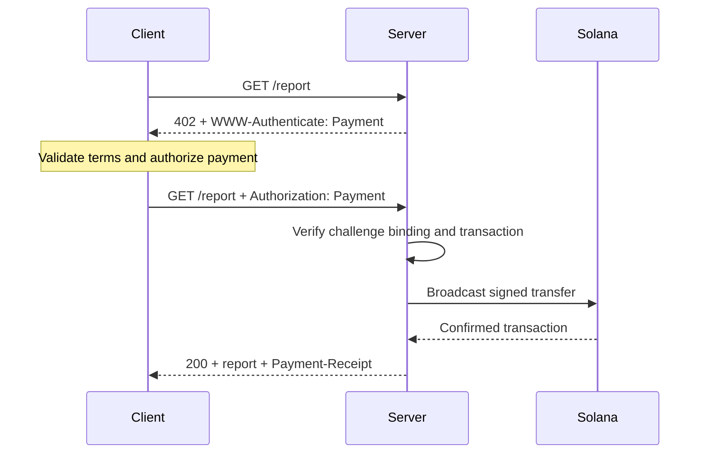
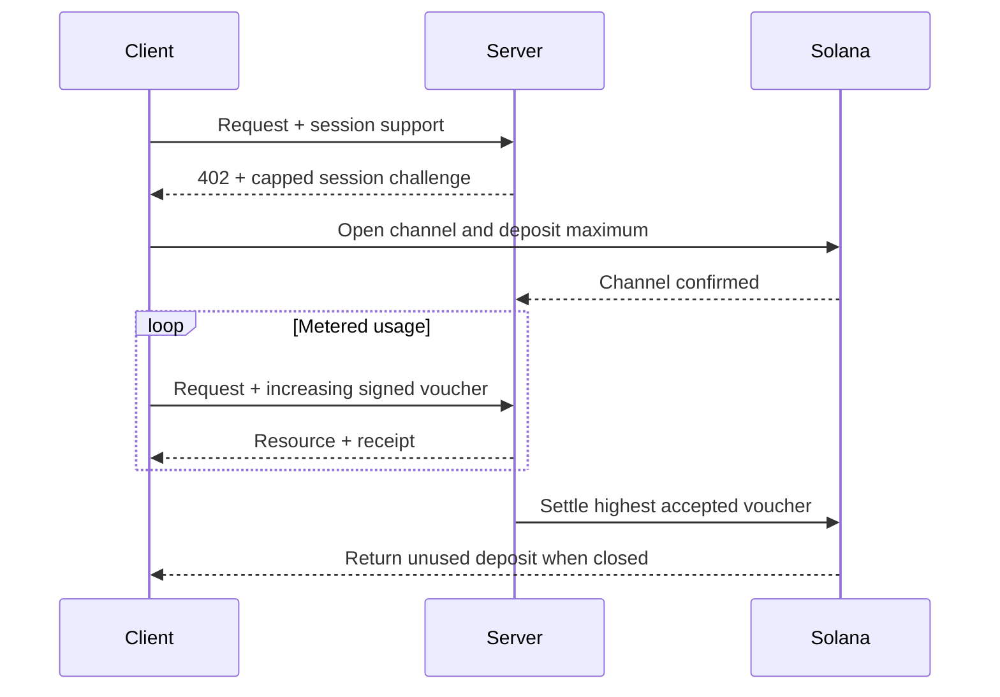

Το [Machine Payments Protocol (MPP)](https://mpp.dev/) εφαρμόζει τη σημασιολογία πιστοποίησης του HTTP στις πληρωμές. Ο διακομιστής αμφισβητεί (challenge) ένα απλήρωτο αίτημα, ο πελάτης επιστρέφει ένα διαπιστευτήριο πληρωμής και ο διακομιστής επιστρέφει μια απόδειξη αφού αποδεχτεί την πληρωμή.

Το MPP διαχωρίζει τρία ζητήματα:

- Μια **πρόθεση (intent)** περιγράφει την εμπορική αλληλεπίδραση, όπως μια εφάπαξ
  `charge` ή μια `session` με μέτρηση χρήσης.
- Μια **μέθοδος πληρωμής** περιγράφει τον τρόπο μετακίνησης της αξίας. Η μέθοδος του Solana υποστηρίζει
  το εγγενές SOL και τα SPL tokens για χρεώσεις.
- Μια **μεταφορά (transport)** HTTP μεταφέρει προκλήσεις, διαπιστευτήρια, αποδείξεις και σφάλματα.

Το MPP δημοσιεύεται ως σύνολο Internet-Drafts. Αντιμετωπίστε τις
[τρέχουσες προδιαγραφές](https://paymentauth.org/) ως πηγή αλήθειας και
προσδοκήστε ότι οι λεπτομέρειες θα εξελιχθούν όσο τα προσχέδια βρίσκονται υπό επεξεργασία.

## Ανταλλαγή HTTP

Το MPP χρησιμοποιεί τυπικά πεδία πιστοποίησης HTTP αντί για ειδικές κεφαλίδες
πληρωμής του πρωτοκόλλου:

| Μήνυμα                 | Αναπαράσταση HTTP                                         |
| ----------------------- | ----------------------------------------------------------- |
| Πρόκληση πληρωμής       | `402 Payment Required` με `WWW-Authenticate: Payment ...` |
| Διαπιστευτήριο πληρωμής      | Επανυποβληθέν αίτημα με `Authorization: Payment ...`           |
| Επιτυχής απόδειξη      | Απόκριση πόρου με `Payment-Receipt: ...`               |
| Μη έγκυρα στοιχεία πληρωμής | Σώμα Problem Details που χρησιμοποιεί `application/problem+json`       |



Μια πρόκληση περιλαμβάνει ένα ID που δημιουργείται από τον διακομιστή, realm, μέθοδο, πρόθεση, κωδικοποιημένο
αίτημα πληρωμής και λήξη ισχύος. Το διαπιστευτήριο επαναλαμβάνει την πρόκληση και προσθέτει την
απόδειξη πληρωμής που αφορά τη συγκεκριμένη μέθοδο. Ο διακομιστής πρέπει να επαληθεύσει και τα δύο στοιχεία· μια έγκυρη
μεταφορά που ανήκει σε διαφορετική πρόκληση δεν πρέπει να ξεκλειδώνει τον πόρο.

## Εφάπαξ χρεώσεις στο Solana

Η πρόθεση `charge` του Solana υποστηρίζει δύο τύπους διαπιστευτηρίων:

- Η **λειτουργία Pull** χρησιμοποιεί μια υπογεγραμμένη συναλλαγή. Ο πελάτης υπογράφει τη μεταφορά και
  στέλνει τη συναλλαγή στον διακομιστή. Ο διακομιστής επαληθεύει, προαιρετικά προσθέτει μια
  υπογραφή fee-payer, μεταδίδει, επιβεβαιώνει και επιστρέφει την υπογραφή της συναλλαγής
  στην απόδειξή του.
- Η **λειτουργία Push** χρησιμοποιεί μια υπογραφή συναλλαγής. Ο πελάτης μεταδίδει πρώτα και μετά
  στέλνει την επιβεβαιωμένη υπογραφή στον διακομιστή. Ο διακομιστής ανακτά και επαληθεύει
  τη συναλλαγή πριν επιστρέψει τον πόρο.

Η λειτουργία Pull επιτρέπει την κάλυψη των τελών συναλλαγής από τον διακομιστή και λογική επανάληψης από την πλευρά του διακομιστή.
Η λειτουργία Push είναι χρήσιμη όταν ένα πορτοφόλι απαιτεί από τον πελάτη να υποβάλει τη δική του
συναλλαγή, αλλά δεν μπορεί να χρησιμοποιήσει την κάλυψη τελών από τον διακομιστή.

Για τα κανονιστικά πεδία και τους κανόνες επαλήθευσης, δείτε την
[προδιαγραφή χρέωσης του Solana](https://paymentauth.org/draft-solana-charge-00.html).

## Προσθήκη χρέωσης MPP σε ένα Express API

Το Solana Pay Kit παρέχει μια τρέχουσα ενσωμάτωση TypeScript για το MPP και το x402.
Εγκαταστήστε το μαζί με το Express:

```bash
pnpm add @solana/pay-kit @solana/kit@^6.9.0 express
pnpm add --save-dev @types/express tsx
```

Αυτό το απλούστερο παράδειγμα χρησιμοποιεί το φιλοξενούμενο sandbox του Surfpool και τον δημόσιο
παραλήπτη επίδειξης του πακέτου. Προορίζεται μόνο για τοπική ανάπτυξη:

```ts filename=server.ts
import express from "express";
import { createPayKit, usd } from "@solana/pay-kit";

const pay = await createPayKit({
  accept: ["mpp"],
  rpcUrl: "https://402.surfnet.dev:8899"
});

const app = express();

app.get("/report", pay.express(usd("0.01")), (_req, res) => {
  res.json({ report: "Paid report" });
});

app.listen(4567, () => {
  console.log("Paid API listening on http://127.0.0.1:4567");
});
```

Εκτελέστε το και συγκρίνετε ένα απλήρωτο αίτημα με ένα αίτημα που υποστηρίζει πληρωμή:

```bash
pnpm tsx server.ts
curl -i http://127.0.0.1:4567/report
pay --sandbox curl http://127.0.0.1:4567/report
```

Ο χειριστής της διαδρομής εκτελείται μόνο αφού το middleware αποδεχτεί την πληρωμή.

<Callout type="warn" title="Αντικαταστήστε κάθε προεπιλογή του sandbox στην παραγωγή">
  Ρυθμίστε ρητά δίκτυο, παραλήπτη εμπόρου, αποκλειστικό RPC, σταθερό
  μυστικό δέσμευσης πρόκλησης, υπογράφοντα παραγωγής και ανθεκτικό αποθηκευτικό χώρο replay. Ποτέ μην
  δρομολογείτε πραγματικές πληρωμές σε υπογράφοντα επίδειξης ενός πακέτου.
</Callout>

## Συνεδρίες με μέτρηση χρήσης

Χρησιμοποιήστε μια `session` του Solana MPP όταν ένας πελάτης θα κάνει πολλές μικρές, σχετιζόμενες πληρωμές.
Μια συνεδρία ανοίγει ένα κανάλι πληρωμών στο onchain με μέγιστη κατάθεση και στη συνέχεια χρησιμοποιεί
σωρευτικά υπογεγραμμένα vouchers καθώς αυξάνεται η χρήση. Ο διακομιστής μπορεί να επαληθεύει τα vouchers
εκτός αλυσίδας (offchain) και να διακανονίσει αργότερα το υψηλότερο αποδεκτό ποσό.

Αυτό είναι χρήσιμο για συμπεράσματα (inference) με μέτρηση tokens, λήψεις με μέτρηση byte, ζωντανά δεδομένα
και επαναλαμβανόμενες κλήσεις εργαλείων. Δεν ισοδυναμεί με την αποστολή ξεχωριστής onchain
πληρωμής για κάθε συμβάν.



Αποκαλέστε μια συνεδρία **πληρωμή συνεδρίας**, **κανάλι πληρωμών** ή **επαναλαμβανόμενη εξουσιοδότηση με ανώτατο όριο**. Αποκαλέστε την πληρωμή ροής (streamed payment) μόνο όταν η υπηρεσία και το συμβόλαιο πληρωμής
μετρούν πράγματι μια ροή χρήσης.

## Επαλήθευση στην παραγωγή

Για κάθε χρέωση Solana, ο διακομιστής πρέπει να επαληθεύει τουλάχιστον:

- Ότι η πρόκληση είναι αυθεντική, δεν έχει λήξει, είναι δεσμευμένη σε αυτό το αίτημα και προορίζεται για
  αυτό το realm.
- Ότι η συναλλαγή χρησιμοποιεί το αναμενόμενο δίκτυο, περιουσιακό στοιχείο ή mint, παραλήπτη, ποσό
  και Token Program.
- Ότι οποιεσδήποτε εντολές fee-payer ή associated token account επιτρέπονται ρητά
  και δεν μπορούν να αδειάσουν τον υπογράφοντα του διακομιστή.
- Ότι η συναλλαγή ολοκληρώθηκε επιτυχώς στο απαιτούμενο επίπεδο commitment.
- Ότι η υπογραφή της συναλλαγής δεν έχει ήδη καταναλωθεί.
- Ότι ο έλεγχος replay και η λειτουργία κατανάλωσης είναι ατομικά σε όλες τις παρουσίες του διακομιστή.

Για τις συνεδρίες, αποθηκεύστε επίσης την κατάσταση του καναλιού, το αποδεκτό σωρευτικό ποσό και το
watermark διακανονισμού σε έναν κοινόχρηστο αποθηκευτικό χώρο. Τεκμηριώστε πώς οι πελάτες ανακτούν τα αχρησιμοποίητα
κεφάλαια αν ο διακομιστής καταστεί μη διαθέσιμος.

## Σχετικοί πόροι

- [Προδιαγραφές MPP](https://paymentauth.org/)
- [Τεκμηρίωση του πρωτοκόλλου MPP](https://mpp.dev/protocol)
- [Solana Pay Kit](https://github.com/solana-foundation/pay-kit)
- [Επισκόπηση των πληρωμών μέσω πρακτόρων](/docs/payments/agentic-payments)
- [Ετοιμότητα για παραγωγή](/docs/tools/production-readiness)
