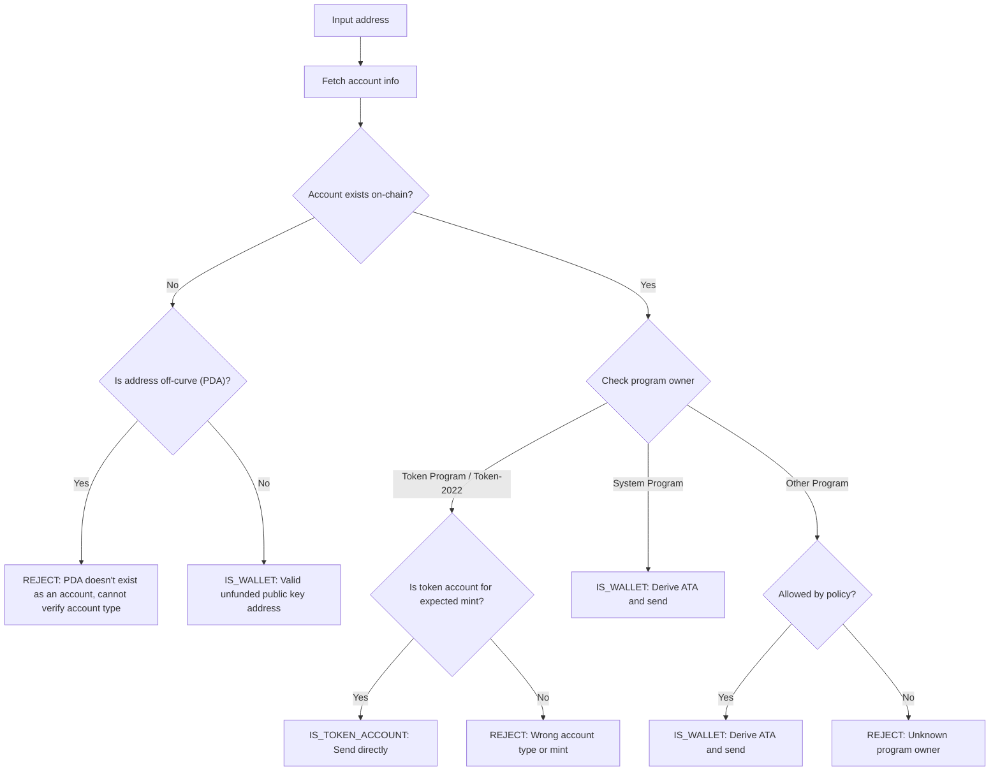

Η αποστολή tokens σε λάθος διεύθυνση μπορεί να οδηγήσει σε μόνιμη απώλεια
κεφαλαίων. Η επαλήθευση διεύθυνσης διασφαλίζει ότι στέλνετε tokens μόνο σε
διευθύνσεις που μπορούν να τα λάβουν και να έχουν πρόσβαση σε αυτά με τον
κατάλληλο τρόπο.

<Callout>
  Δείτε το [Πώς λειτουργούν οι πληρωμές στο
  Solana](/docs/payments/how-payments-work) για τις βασικές έννοιες πληρωμών.
</Callout>

## Κατανόηση των διευθύνσεων Solana

Οι λογαριασμοί Solana έχουν δύο τύπους διευθύνσεων, on-curve και off-curve.

### Διευθύνσεις on-curve

Οι τυπικές διευθύνσεις είναι τα δημόσια κλειδιά από ζεύγη κλειδιών Ed25519.
Αυτές οι διευθύνσεις:

- Έχουν ένα αντίστοιχο ιδιωτικό κλειδί που μπορεί να υπογράφει συναλλαγές
- Χρησιμοποιούνται ως διευθύνσεις πορτοφολιού

### Διευθύνσεις off-curve (PDAs)

Οι [διευθύνσεις που προκύπτουν από πρόγραμμα](/docs/core/pda) παράγονται
ντετερμινιστικά από ένα program ID και seeds. Αυτές οι διευθύνσεις:

- **Δεν** έχουν αντίστοιχο ιδιωτικό κλειδί
- Μπορούν να υπογραφούν μόνο από το πρόγραμμα από το οποίο προέκυψε η διεύθυνση

## Τύποι λογαριασμών στις πληρωμές

Χρησιμοποιήστε τη διεύθυνση για να ανακτήσετε έναν
[λογαριασμό](/docs/core/accounts) από το δίκτυο, ελέγξτε τον κάτοχο προγράμματος
και τον τύπο λογαριασμού για να προσδιορίσετε πώς να χειριστείτε τη διεύθυνση.

<Callout>
  Το να γνωρίζετε αν μια διεύθυνση είναι on-curve ή off-curve δεν σας λέει τι
  τύπου λογαριασμός είναι, ποιο πρόγραμμα τον κατέχει ή αν υπάρχει λογαριασμός
  σε αυτή τη διεύθυνση. Πρέπει να ανακτήσετε τον λογαριασμό από το δίκτυο για να
  προσδιορίσετε αυτές τις λεπτομέρειες.
</Callout>

### Λογαριασμοί System Program (πορτοφόλια)

Οι λογαριασμοί που ανήκουν στο System Program είναι τυπικά πορτοφόλια. Για να
στείλετε SPL tokens σε ένα πορτοφόλι, παράγετε και χρησιμοποιείτε τον
[συσχετισμένο λογαριασμό token (ATA)](/docs/tokens/basics/create-token-account#whats-an-associated-token-account)
του.

Αφού παράγετε τη διεύθυνση ATA, ελέγξτε αν ο λογαριασμός token υπάρχει on-chain.
Αν το ATA δεν υπάρχει, μπορείτε να συμπεριλάβετε μια εντολή για τη δημιουργία
του λογαριασμού token του παραλήπτη στην ίδια συναλλαγή με τη μεταφορά. Ωστόσο,
αυτό απαιτεί την πληρωμή rent για τον νέο λογαριασμό token. Δεδομένου ότι ο
παραλήπτης κατέχει το ATA, το SOL που καταβλήθηκε για το rent δεν μπορεί να
ανακτηθεί από τον αποστολέα.

<Callout type="warn">
  Χωρίς προστατευτικά μέτρα, η επιδότηση της δημιουργίας ATA μπορεί να
  εκμεταλλευτεί. Ένας κακόβουλος χρήστης θα μπορούσε να ζητήσει μεταφορά, να
  δημιουργήσει το ATA του με δικά σας έξοδα, να κλείσει το ATA για να ανακτήσει
  το rent SOL και να επαναλάβει τη διαδικασία.
</Callout>

### Token accounts

Τα [token accounts](/docs/tokens/basics/create-token-account) ανήκουν στο Token
Program ή στο Token-2022 Program και διατηρούν υπόλοιπα tokens. Εάν η διεύθυνση
που λαμβάνετε ανήκει σε ένα token program, θα πρέπει να επαληθεύσετε ότι ο
λογαριασμός είναι token account (όχι mint account) και ταιριάζει με τον
αναμενόμενο token mint account πριν από την αποστολή.

<Callout type="info">
  Τα Token Programs επικυρώνουν αυτόματα ότι και τα δύο token accounts σε μια
  μεταφορά διατηρούν tokens του ίδιου mint. Εάν η επικύρωση αποτύχει, η
  συναλλαγή απορρίπτεται και δεν χάνονται κεφάλαια.
</Callout>

### Mint accounts

Τα [mint accounts](/docs/tokens/basics/create-mint) παρακολουθούν την προσφορά
και τα μεταδεδομένα ενός συγκεκριμένου token. Τα mint accounts ανήκουν επίσης
στα Token Programs αλλά **δεν** είναι έγκυροι αποδέκτες για μεταφορές tokens. Η
προσπάθεια αποστολής tokens σε μια διεύθυνση mint οδηγεί σε αποτυχημένη
συναλλαγή, αλλά δεν χάνονται κεφάλαια.

### Άλλοι λογαριασμοί

Οι λογαριασμοί που ανήκουν σε άλλα προγράμματα απαιτούν απόφαση πολιτικής.
Ορισμένοι λογαριασμοί (π.χ. multisig wallets) μπορεί να είναι έγκυροι κάτοχοι
token accounts, ενώ άλλοι θα πρέπει να απορρίπτονται.

## Ροή επαλήθευσης

Το ακόλουθο διάγραμμα δείχνει ένα δέντρο αποφάσεων αναφοράς για την επικύρωση
μιας διεύθυνσης:



<Steps>
<Step>

### Ανάκτηση λογαριασμού

Χρησιμοποιήστε τη διεύθυνση για να ανακτήσετε τα στοιχεία του λογαριασμού από το
δίκτυο.

</Step>
<Step>

### Ο λογαριασμός δεν υπάρχει

Εάν δεν υπάρχει λογαριασμός σε αυτή τη διεύθυνση, ελέγξτε αν η διεύθυνση είναι
on-curve ή off-curve:

- **Εκτός καμπύλης (PDA)**: Απορρίψτε συντηρητικά τη διεύθυνση για να αποφύγετε
  την αποστολή σε ένα ATA που μπορεί να είναι απρόσιτο. Χωρίς υπάρχοντα
  λογαριασμό, δεν μπορείτε να προσδιορίσετε από τη διεύθυνση μόνο ποιο πρόγραμμα
  παρήγαγε αυτό το PDA ή αν η διεύθυνση είναι για ένα ATA. Η παραγωγή ενός ATA
  για αυτή τη διεύθυνση για αποστολή tokens θα μπορούσε να οδηγήσει σε κλείδωμα
  κεφαλαίων σε έναν απρόσιτο token account.

- **Επί της καμπύλης**: Αυτή είναι μια έγκυρη διεύθυνση πορτοφολιού (δημόσιο
  κλειδί) που δεν έχει χρηματοδοτηθεί ακόμα. Παραγάγετε το ATA, ελέγξτε αν
  υπάρχει και στείλτε tokens σε αυτό. Πρέπει να λάβετε μια απόφαση πολιτικής
  σχετικά με το αν θα χρηματοδοτήσετε τη δημιουργία του ATA αν δεν υπάρχει.

</Step>
<Step>

### Ο λογαριασμός υπάρχει

Αν υπάρχει λογαριασμός, ελέγξτε ποιο πρόγραμμα τον κατέχει:

- **System Program**: Αυτό είναι ένα τυπικό πορτοφόλι. Παραγάγετε το ATA,
  ελέγξτε αν υπάρχει και στείλτε tokens σε αυτό. Πρέπει να λάβετε μια απόφαση
  πολιτικής σχετικά με το αν θα χρηματοδοτήσετε τη δημιουργία του ATA αν δεν
  υπάρχει.

- **Token Program / Token-2022**: Επαληθεύστε ότι ο λογαριασμός είναι token
  account (όχι mint account) και ότι κατέχει το token (mint) που σκοπεύετε να
  στείλετε. Αν είναι έγκυρος, στείλτε tokens απευθείας σε αυτή τη διεύθυνση. Αν
  είναι mint account ή token account για διαφορετικό mint, απορρίψτε τη
  διεύθυνση.

- **Άλλο πρόγραμμα**: Αυτό απαιτεί απόφαση πολιτικής. Ορισμένα προγράμματα όπως
  τα πορτοφόλια πολλαπλών υπογραφών μπορεί να είναι αποδεκτοί κάτοχοι token
  accounts. Αν η πολιτική σας το επιτρέπει, παραγάγετε το ATA και στείλτε.
  Διαφορετικά, απορρίψτε τη διεύθυνση.

</Step>
</Steps>

## Demo

Το παρακάτω παράδειγμα δείχνει μόνο τη λογική επικύρωσης διεύθυνσης. Αυτός είναι
κώδικας αναφοράς για σκοπούς επεξήγησης.

<Callout>
  Η επίδειξη δεν δείχνει πώς να παράγετε ένα ATA ή να δημιουργήσετε μια
  συναλλαγή για αποστολή tokens. Ανατρέξτε στην τεκμηρίωση για το [token
  account](/docs/tokens/basics/create-token-account#how-to-create-an-associated-token-account)
  και τη [μεταφορά tokens](/docs/tokens/basics/transfer-tokens) για παραδείγματα
  κώδικα.
</Callout>

Η παρακάτω επίδειξη χρησιμοποιεί τρία πιθανά αποτελέσματα:

| Αποτέλεσμα         | Σημασία                      | Ενέργεια                                          |
| ------------------ | ---------------------------- | ------------------------------------------------- |
| `IS_WALLET`        | Έγκυρη διεύθυνση πορτοφολιού | Παραγωγή και αποστολή σε associated token account |
| `IS_TOKEN_ACCOUNT` | Έγκυρο token account         | Αποστολή tokens απευθείας σε αυτή τη διεύθυνση    |
| `REJECT`           | Μη έγκυρη διεύθυνση          | Να μην πραγματοποιηθεί αποστολή                   |

<CodeTabs flags="r">

```ts !! title="Demo"
// !collapse(1:35) collapsed

import {
  type Address,
  type Rpc,
  type GetAccountInfoApi,
  createSolanaRpc,
  fetchJsonParsedAccount,
  isOffCurveAddress,
  generateKeyPairSigner,
  getProgramDerivedAddress
} from "@solana/kit";

// =============================================================================
// Constants
// =============================================================================

const defaultRpc = createSolanaRpc("https://api.mainnet-beta.solana.com");

const SYSTEM_PROGRAM = "11111111111111111111111111111111" as Address;
const TOKEN_PROGRAM = "TokenkegQfeZyiNwAJbNbGKPFXCWuBvf9Ss623VQ5DA" as Address;
const TOKEN_2022_PROGRAM =
  "TokenzQdBNbLqP5VEhdkAS6EPFLC1PHnBqCXEpPxuEb" as Address;

// =============================================================================
// Validation Function
// =============================================================================

/**
 * Possible validation results for an input address.
 */
export type ValidationResult =
  | { type: "IS_TOKEN_ACCOUNT" }
  | { type: "IS_WALLET" }
  | { type: "REJECT"; reason: string };

/**
 * Validates an input address and classifies it as a wallet, token account, or invalid.
 *
 * @param inputAddress - The address to validate
 * @param rpc - Optional RPC client (defaults to mainnet)
 * @returns Classification result:
 *   - IS_WALLET: Valid wallet address
 *   - IS_TOKEN_ACCOUNT: Valid token account
 *   - REJECT: Invalid address for transfers
 */
export async function validateAddress(
  inputAddress: Address,
  rpc: Rpc<GetAccountInfoApi> = defaultRpc
): Promise<ValidationResult> {
  const account = await fetchJsonParsedAccount(rpc, inputAddress);
  // Log the account data for demo
  console.log("\nAccount:", account);

  // Account doesn't exist on-chain
  if (!account.exists) {
    // Off-curve = PDA that doesn't exist as an account
    // Reject conservatively to avoid sending to an address that may be inaccessible.
    if (isOffCurveAddress(inputAddress)) {
      return { type: "REJECT", reason: "PDA doesn't exist as an account" };
    }
    // On-curve = valid keypair address, treat as unfunded wallet
    return { type: "IS_WALLET" };
  }

  // Account exists, check program owner
  const owner = account.programAddress;

  // System Program = wallet
  if (owner === SYSTEM_PROGRAM) {
    return { type: "IS_WALLET" };
  }

  // Token Program or Token-2022, check if token account
  if (owner === TOKEN_PROGRAM || owner === TOKEN_2022_PROGRAM) {
    const accountType = (
      account.data as { parsedAccountMeta?: { type?: string } }
    ).parsedAccountMeta?.type;

    if (accountType === "account") {
      return { type: "IS_TOKEN_ACCOUNT" };
    }
    // Reject if not a token account (mint account)
    return {
      type: "REJECT",
      reason: "Not a token account"
    };
  }

  // Unknown program owner
  return { type: "REJECT", reason: "Unknown program owner" };
}

// =============================================================================
// Examples
// =============================================================================
// !collapse(1:1000) collapsed

// Wallets
const EXISTING_WALLET =
  "H8sMJSCQxfKiFTCfDR3DUMLPwcRbM61LGFJ8N4dK3WjS" as Address;
const NEW_WALLET = (await generateKeyPairSigner()).address;

// Token accounts
const USDC_TOKEN_ACCOUNT =
  "3emsAVdmGKERbHjmGfQ6oZ1e35dkf5iYcS6U4CPKFVaa" as Address;
const PYUSD_TOKEN_ACCOUNT =
  "47od2TPRvqJipfPVWZdyenLEngPw8hC36nDxiLyvGsEP" as Address;

// Token mints (should be rejected)
const USDC_MINT = "EPjFWdd5AufqSSqeM2qN1xzybapC8G4wEGGkZwyTDt1v" as Address;
const PYUSD_MINT = "2b1kV6DkPAnxd5ixfnxCpjxmKwqjjaYmCZfHsFu24GXo" as Address;

// PDA that doesn't exist (should be rejected)
const [NON_EXISTENT_PDA] = await getProgramDerivedAddress({
  programAddress: (await generateKeyPairSigner()).address,
  seeds: ["seed"]
});

// Program account (should be rejected)
const PROGRAM_ACCOUNT =
  "p1exdMJcjVao65QdewkaZRUnU6VPSXhus9n2GzWfh98" as Address;

async function runExample(label: string, address: Address) {
  console.log(`\n${"─".repeat(60)}`);
  console.log(`Example: ${label}`);
  console.log(`Input: ${address}`);
  console.log(`${"─".repeat(60)}`);

  const result = await validateAddress(address);
  console.log("\nResult:", result);
}

console.log("\n" + "═".repeat(60));
console.log("  IS_WALLET Examples");
console.log("═".repeat(60));

await runExample("Existing funded wallet", EXISTING_WALLET);
await runExample("New wallet (unfunded)", NEW_WALLET);

console.log("\n" + "═".repeat(60));
console.log("  IS_TOKEN_ACCOUNT Examples");
console.log("═".repeat(60));

await runExample("USDC token account (Token Program)", USDC_TOKEN_ACCOUNT);
await runExample("PYUSD token account (Token-2022)", PYUSD_TOKEN_ACCOUNT);

console.log("\n" + "═".repeat(60));
console.log("  REJECT Examples");
console.log("═".repeat(60));

await runExample("USDC mint address", USDC_MINT);
await runExample("PYUSD mint address", PYUSD_MINT);
await runExample("Non-existent PDA", NON_EXISTENT_PDA);
await runExample("Program account", PROGRAM_ACCOUNT);

console.log("\n" + "═".repeat(60));
console.log("  Done!");
console.log("═".repeat(60) + "\n");
```

</CodeTabs>
