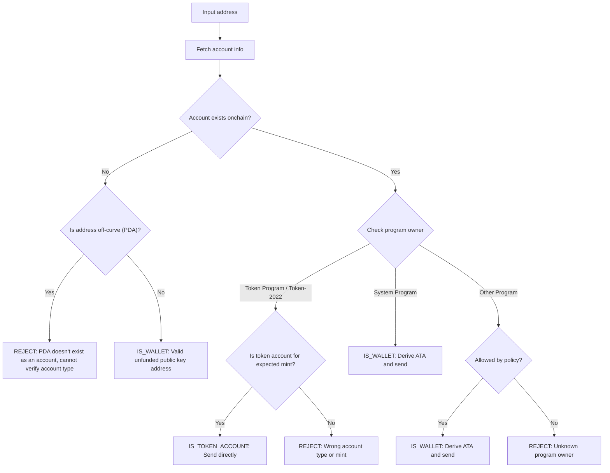

Η αποστολή κεφαλαίων σε λανθασμένη διεύθυνση μπορεί να οδηγήσει σε μόνιμη
απώλεια. Η επαλήθευση διεύθυνσης διασφαλίζει ότι στέλνετε μόνο σε διευθύνσεις
που μπορούν να λάβουν και να αποκτήσουν πρόσβαση στα κεφάλαια.

Η επικύρωση εξαρτάται από το τι στέλνετε:

- **Τα SPL tokens** προστατεύονται εν μέρει από μόνα τους. Το Token Program
  απορρίπτει μια μεταφορά της οποίας οι λογαριασμοί δεν αντιστοιχούν στο
  αναμενόμενο mint, οπότε μια λανθασμένα κατευθυνόμενη μεταφορά token
  αποτυγχάνει χωρίς απώλεια κεφαλαίων. Το μεγαλύτερο μέρος αυτής της σελίδας
  καλύπτει αποστολές SPL token.
- **Το εγγενές SOL** δεν έχει τέτοια προστασία. Μια μεταφορά System Program
  επιτυγχάνει σε οποιονδήποτε λογαριασμό, οπότε ένας λανθασμένος παραλήπτης
  κλειδώνει οριστικά το SOL. Δείτε [Αποστολή εγγενούς SOL](#sending-native-sol).

<Callout>
  Δείτε [Πώς Λειτουργούν οι Πληρωμές στο
  Solana](/docs/payments/how-payments-work) για βασικές έννοιες πληρωμών.
</Callout>

## Κατανόηση των Διευθύνσεων Solana

Οι λογαριασμοί Solana έχουν δύο τύπους διευθύνσεων: επί καμπύλης και εκτός
καμπύλης.

### Διευθύνσεις Επί Καμπύλης

Οι τυπικές διευθύνσεις είναι τα δημόσια κλειδιά από Ed25519 keypairs. Αυτές οι
διευθύνσεις:

- Διαθέτουν αντίστοιχο ιδιωτικό κλειδί που μπορεί να υπογράφει συναλλαγές
- Χρησιμοποιούνται ως διευθύνσεις πορτοφολιού

### Διευθύνσεις Εκτός Καμπύλης (PDAs)

Τα [Program Derived Addresses](/docs/core/pda) παράγονται ντετερμινιστικά από
ένα αναγνωριστικό προγράμματος και seeds. Αυτές οι διευθύνσεις:

- **Δεν** διαθέτουν αντίστοιχο ιδιωτικό κλειδί
- Μπορούν να υπογραφούν μόνο από το πρόγραμμα από το οποίο παράχθηκε η διεύθυνση

## Τύποι Λογαριασμών στις Πληρωμές

Χρησιμοποιήστε τη διεύθυνση για να ανακτήσετε έναν
[λογαριασμό](/docs/core/accounts) από το δίκτυο, ελέγξτε τον κάτοχο προγράμματος
και τον τύπο λογαριασμού για να προσδιορίσετε πώς να χειριστείτε τη διεύθυνση.

<Callout>
  Το να γνωρίζετε αν μια διεύθυνση είναι επί καμπύλης ή εκτός καμπύλης δεν σας
  λέει τι τύπο λογαριασμού είναι, ποιο πρόγραμμα τον κατέχει, ή αν υπάρχει
  λογαριασμός σε αυτή τη διεύθυνση. Πρέπει να ανακτήσετε τον λογαριασμό από το
  δίκτυο για να προσδιορίσετε αυτές τις λεπτομέρειες.
</Callout>

### Λογαριασμοί System Program (Πορτοφόλια)

Οι λογαριασμοί που ανήκουν στο System Program είναι τυπικά πορτοφόλια. Για να
στείλετε SPL tokens σε ένα πορτοφόλι, παράγετε και χρησιμοποιείτε το
[Associated Token Account (ATA)](/docs/tokens/basics/create-token-account#whats-an-associated-token-account)
του.

Αφού παράγετε τη διεύθυνση ATA, ελέγξτε αν το token account υπάρχει στο onchain.
Αν το ATA δεν υπάρχει, μπορείτε να συμπεριλάβετε μια εντολή για τη δημιουργία
του token account του παραλήπτη στην ίδια συναλλαγή με τη μεταφορά. Ωστόσο, αυτό
απαιτεί την πληρωμή rent για το νέο token account. Καθώς ο παραλήπτης κατέχει το
ATA, το SOL που καταβλήθηκε για το rent δεν μπορεί να ανακτηθεί από τον
αποστολέα.

<Callout type="warn">
  Χωρίς προστατευτικές δικλείδες, η επιδότηση δημιουργίας ATA μπορεί να
  εκμεταλλευτεί. Ένας κακόβουλος χρήστης θα μπορούσε να ζητήσει μια μεταφορά, να
  δημιουργήσει το ATA του με δικά σας έξοδα, να κλείσει το ATA για να ανακτήσει
  το rent SOL και να επαναλάβει τη διαδικασία.
</Callout>

### Token Accounts

Τα [token accounts](/docs/tokens/basics/create-token-account) ανήκουν στο Token
Program ή Token-2022 Program και αποθηκεύουν υπόλοιπα tokens. Αν η διεύθυνση που
λαμβάνετε ανήκει σε ένα token program, θα πρέπει να επαληθεύσετε ότι ο
λογαριασμός είναι ένα token account (όχι ένα mint account) και ότι αντιστοιχεί
στο αναμενόμενο token mint account πριν αποστείλετε.

<Callout type="info">
  Τα Token Programs επικυρώνουν αυτόματα ότι και τα δύο token accounts σε μια
  μεταφορά περιέχουν tokens του ίδιου mint. Αν η επικύρωση αποτύχει, η συναλλαγή
  απορρίπτεται και δεν χάνονται κεφάλαια.
</Callout>

### Mint Accounts

Τα [mint accounts](/docs/tokens/basics/create-mint) παρακολουθούν την προσφορά
tokens και τα μεταδεδομένα ενός συγκεκριμένου token. Τα mint accounts ανήκουν
επίσης στα Token Programs, αλλά **δεν** αποτελούν έγκυρους παραλήπτες για
μεταφορές tokens. Η προσπάθεια αποστολής tokens σε μια διεύθυνση mint οδηγεί σε
αποτυχημένη συναλλαγή, αλλά δεν χάνονται κεφάλαια.

### Άλλοι Λογαριασμοί

Οι λογαριασμοί που ανήκουν σε άλλα προγράμματα απαιτούν μια πολιτική απόφαση.
Ορισμένοι λογαριασμοί (π.χ. πορτοφόλια multisig) μπορεί να είναι έγκυροι κάτοχοι
token account, ενώ άλλοι θα πρέπει να απορρίπτονται.

## Αποστολή εγγενούς SOL

Η παραπάνω κατηγοριοποίηση καθορίζει πού μπορούν να μεταφερθούν τα SPL tokens.
Το εγγενές SOL είναι πιο αυστηρό: ο μόνος ασφαλής παραλήπτης είναι ένα
**πορτοφόλι System Program** (ή μια αχρησιμοποίητη διεύθυνση επί καμπύλης που
γίνεται τέτοια).

Μια μεταφορά System Program προσθέτει lamport σε οποιονδήποτε λογαριασμό,
συμπεριλαμβανομένων των mints, token accounts, προγραμμάτων και PDAs. Τα lamport
μπορούν να μετακινηθούν μόνο από το πρόγραμμα ιδιοκτησίας του λογαριασμού,
επομένως η αποστολή SOL σε λανθασμένο παραλήπτη μπορεί να οδηγήσει σε μόνιμη
απώλεια κεφαλαίων.

Σε αντίθεση με τη μεταφορά SPL token, η συναλλαγή **δεν** αποτυγχάνει όταν ο
παραλήπτης είναι μια μη αναμενόμενη διεύθυνση.

Κατά την αποστολή εγγενούς SOL, μόνο ένα αποτέλεσμα `IS_WALLET` είναι αποδεκτό.
Το `IS_TOKEN_ACCOUNT` **δεν** είναι: ένα token account διατηρεί SPL tokens, και
το SOL που αποστέλλεται εκεί βρίσκεται εκτός του ελέγχου του αποστολέα.

<Callout type="warn">
  Αυτός είναι ένας συνηθισμένος τρόπος με τον οποίο χάνεται SOL: ένας χρήστης
  επικολλά τη διεύθυνση mint ενός token (ή μια διεύθυνση προγράμματος) σε μια
  ανάληψη SOL. Η μεταφορά ολοκληρώνεται επιτυχώς και το SOL δεν ανακτάται. Να
  κατηγοριοποιείτε πάντα τον παραλήπτη πριν υπογράψετε μια μεταφορά SOL.
</Callout>

## Ροή Επαλήθευσης

Το παρακάτω διάγραμμα δείχνει ένα δέντρο αποφάσεων αναφοράς για την επικύρωση
μιας διεύθυνσης:


```mermaid title="Address Verification Flow"
flowchart TD
    A["Input address"]
    B["Fetch account info"]

    A --> B
    B --> C{"Account exists onchain?"}

    %% --- Non-existent account path ---
    C -- "No" --> D{"Is address off-curve (PDA)?"}
    D -- "Yes" --> R1["REJECT: PDA doesn't exist as an account, cannot verify account type"]
    D -- "No" --> W1["IS_WALLET: Valid unfunded public key address"]

    %% --- Existing account path ---
    C -- "Yes" --> F{"Check program owner"}

    F -- "Token Program / Token-2022" --> G{"Is token account for expected mint?"}
    G -- "Yes" --> T1["IS_TOKEN_ACCOUNT: Send directly"]
    G -- "No" --> R2["REJECT: Wrong account type or mint"]

    F -- "System Program" --> W2["IS_WALLET: Derive ATA and send"]

    F -- "Other Program" --> K{"Allowed by policy?"}
    K -- "Yes" --> W3["IS_WALLET: Derive ATA and send"]
    K -- "No" --> R3["REJECT: Unknown program owner"]
```

<Steps>
<Step>

### Ανάκτηση λογαριασμού

Χρησιμοποιήστε τη διεύθυνση για να ανακτήσετε τα στοιχεία του λογαριασμού από το
δίκτυο.

</Step>
<Step>

### Ο λογαριασμός δεν υπάρχει

Εάν δεν υπάρχει λογαριασμός σε αυτή τη διεύθυνση, ελέγξτε αν η διεύθυνση
βρίσκεται επί καμπύλης ή εκτός καμπύλης:

- **Εκτός καμπύλης (PDA)**: Απορρίψτε συντηρητικά τη διεύθυνση για να αποφύγετε
  την αποστολή σε ένα ATA που μπορεί να είναι μη προσβάσιμο. Χωρίς έναν
  υπάρχοντα λογαριασμό, δεν μπορείτε να προσδιορίσετε από τη διεύθυνση μόνη της
  ποιο πρόγραμμα παρήγαγε αυτό το PDA ή αν η διεύθυνση αφορά ένα ATA. Η παραγωγή
  ενός ATA για αυτή τη διεύθυνση για αποστολή tokens θα μπορούσε να οδηγήσει σε
  κλείδωμα κεφαλαίων σε μη προσβάσιμο token account.

- **Στην καμπύλη**: Αυτή είναι μια έγκυρη διεύθυνση πορτοφολιού (δημόσιο κλειδί)
  που δεν έχει χρηματοδοτηθεί ακόμα. Εξαγάγετε το ATA, ελέγξτε αν υπάρχει, και
  στείλτε tokens σε αυτό. Πρέπει να λάβετε μια απόφαση πολιτικής σχετικά με το
  αν θα χρηματοδοτήσετε τη δημιουργία του ATA αν δεν υπάρχει.

</Step>
<Step>

### Ο λογαριασμός υπάρχει

Αν ένας λογαριασμός υπάρχει, ελέγξτε ποιο πρόγραμμα τον κατέχει:

- **System Program**: Αυτό είναι ένα τυπικό πορτοφόλι. Εξαγάγετε το ATA, ελέγξτε
  αν υπάρχει, και στείλτε tokens σε αυτό. Πρέπει να λάβετε μια απόφαση πολιτικής
  σχετικά με το αν θα χρηματοδοτήσετε τη δημιουργία του ATA αν δεν υπάρχει.

- **Token Program / Token-2022**: Επαληθεύστε ότι ο λογαριασμός είναι token
  account (όχι mint account) και ότι διατηρεί το token (mint) που σκοπεύετε να
  στείλετε. Αν είναι έγκυρο, στείλτε tokens απευθείας σε αυτή τη διεύθυνση. Αν
  είναι mint account ή token account για διαφορετικό mint, απορρίψτε τη
  διεύθυνση.

- **Άλλο Πρόγραμμα**: Αυτό απαιτεί απόφαση πολιτικής. Ορισμένα προγράμματα όπως
  τα πορτοφόλια multisig μπορεί να είναι αποδεκτοί κάτοχοι token accounts. Αν η
  πολιτική σας το επιτρέπει, εξαγάγετε το ATA και στείλτε. Διαφορετικά,
  απορρίψτε τη διεύθυνση.

</Step>
</Steps>

## Demo

Το παρακάτω παράδειγμα εμφανίζει μόνο τη λογική επαλήθευσης διευθύνσεων. Αυτός
είναι κώδικας αναφοράς για λόγους επεξήγησης.

<Callout>
  Το demo δεν δείχνει πώς να εξαχθεί ένα ATA ή να δημιουργηθεί μια συναλλαγή για
  αποστολή tokens. Ανατρέξτε στην τεκμηρίωση για το [token
  account](/docs/tokens/basics/create-token-account#how-to-create-an-associated-token-account)
  και τη [μεταφορά token](/docs/tokens/basics/transfer-tokens) για παραδείγματα
  κώδικα.
</Callout>

Το demo παρακάτω χρησιμοποιεί τρία πιθανά αποτελέσματα:

| Αποτέλεσμα         | Σημασία                      | Ενέργεια                                          |
| ------------------ | ---------------------------- | ------------------------------------------------- |
| `IS_WALLET`        | Έγκυρη διεύθυνση πορτοφολιού | Εξαγωγή και αποστολή στο associated token account |
| `IS_TOKEN_ACCOUNT` | Έγκυρο token account         | Αποστολή tokens απευθείας σε αυτή τη διεύθυνση    |
| `REJECT`           | Μη έγκυρη διεύθυνση          | Μην αποστείλετε                                   |

Στη συνέχεια αντιστοιχεί κάθε αποτέλεσμα στην αποδεκτότητα ανά στοιχείο με
`canReceiveNativeSol` (μόνο πορτοφόλια) και `canReceiveSplToken` (πορτοφόλια ή
token accounts). Ένα token account επιστρέφει `IS_TOKEN_ACCOUNT`, άρα μπορεί να
λαμβάνει SPL tokens αλλά **όχι** εγγενές SOL — η διάκριση που αποτρέπει το
κλείδωμα του SOL.

<CodeTabs flags="r">

```ts !! title="Demo"
// !collapse(1:35) collapsed

import {
  type Address,
  type Rpc,
  type GetAccountInfoApi,
  createSolanaRpc,
  fetchJsonParsedAccount,
  isOffCurveAddress,
  generateKeyPairSigner,
  getProgramDerivedAddress
} from "@solana/kit";

// =============================================================================
// Constants
// =============================================================================

const defaultRpc = createSolanaRpc("https://api.mainnet-beta.solana.com");

const SYSTEM_PROGRAM = "11111111111111111111111111111111" as Address;
const TOKEN_PROGRAM = "TokenkegQfeZyiNwAJbNbGKPFXCWuBvf9Ss623VQ5DA" as Address;
const TOKEN_2022_PROGRAM =
  "TokenzQdBNbLqP5VEhdkAS6EPFLC1PHnBqCXEpPxuEb" as Address;

// =============================================================================
// Validation Function
// =============================================================================

/**
 * Possible validation results for an input address.
 */
export type ValidationResult =
  | { type: "IS_TOKEN_ACCOUNT" }
  | { type: "IS_WALLET" }
  | { type: "REJECT"; reason: string };

/**
 * Validates an input address and classifies it as a wallet, token account, or invalid.
 *
 * @param inputAddress - The address to validate
 * @param rpc - Optional RPC client (defaults to mainnet)
 * @returns Classification result:
 *   - IS_WALLET: Valid wallet address
 *   - IS_TOKEN_ACCOUNT: Valid token account
 *   - REJECT: Invalid address for transfers
 */
export async function validateAddress(
  inputAddress: Address,
  rpc: Rpc<GetAccountInfoApi> = defaultRpc
): Promise<ValidationResult> {
  const account = await fetchJsonParsedAccount(rpc, inputAddress);
  // Log the account data for demo
  console.log("\nAccount:", account);

  // Account doesn't exist onchain
  if (!account.exists) {
    // Off-curve = PDA that doesn't exist as an account
    // Reject conservatively to avoid sending to an address that may be inaccessible.
    if (isOffCurveAddress(inputAddress)) {
      return { type: "REJECT", reason: "PDA doesn't exist as an account" };
    }
    // On-curve = valid keypair address, treat as unfunded wallet
    return { type: "IS_WALLET" };
  }

  // Account exists, check program owner
  const owner = account.programAddress;

  // System Program = wallet
  if (owner === SYSTEM_PROGRAM) {
    return { type: "IS_WALLET" };
  }

  // Token Program or Token-2022, check if token account
  if (owner === TOKEN_PROGRAM || owner === TOKEN_2022_PROGRAM) {
    const accountType = (
      account.data as { parsedAccountMeta?: { type?: string } }
    ).parsedAccountMeta?.type;

    if (accountType === "account") {
      return { type: "IS_TOKEN_ACCOUNT" };
    }
    // Reject if not a token account (mint account)
    return {
      type: "REJECT",
      reason: "Not a token account"
    };
  }

  // Unknown program owner
  return { type: "REJECT", reason: "Unknown program owner" };
}

/**
 * Native SOL is only safe to send to a wallet. Any other account locks it.
 */
function canReceiveNativeSol(result: ValidationResult): boolean {
  return result.type === "IS_WALLET";
}

/**
 * SPL tokens can go to a wallet (via its ATA) or directly to a token account.
 */
function canReceiveSplToken(result: ValidationResult): boolean {
  return result.type === "IS_WALLET" || result.type === "IS_TOKEN_ACCOUNT";
}

// =============================================================================
// Examples
// =============================================================================
// !collapse(1:1000) collapsed

// Wallets
const EXISTING_WALLET =
  "H8sMJSCQxfKiFTCfDR3DUMLPwcRbM61LGFJ8N4dK3WjS" as Address;
const NEW_WALLET = (await generateKeyPairSigner()).address;

// Token accounts
const USDC_TOKEN_ACCOUNT =
  "3emsAVdmGKERbHjmGfQ6oZ1e35dkf5iYcS6U4CPKFVaa" as Address;
const PYUSD_TOKEN_ACCOUNT =
  "47od2TPRvqJipfPVWZdyenLEngPw8hC36nDxiLyvGsEP" as Address;

// Token mints (should be rejected)
const USDC_MINT = "EPjFWdd5AufqSSqeM2qN1xzybapC8G4wEGGkZwyTDt1v" as Address;
const PYUSD_MINT = "2b1kV6DkPAnxd5ixfnxCpjxmKwqjjaYmCZfHsFu24GXo" as Address;

// PDA that doesn't exist (should be rejected)
const [NON_EXISTENT_PDA] = await getProgramDerivedAddress({
  programAddress: (await generateKeyPairSigner()).address,
  seeds: ["seed"]
});

// Program account (should be rejected)
const PROGRAM_ACCOUNT =
  "p1exdMJcjVao65QdewkaZRUnU6VPSXhus9n2GzWfh98" as Address;

async function runExample(label: string, address: Address) {
  console.log(`\n${"─".repeat(60)}`);
  console.log(`Example: ${label}`);
  console.log(`Input: ${address}`);
  console.log(`${"─".repeat(60)}`);

  const result = await validateAddress(address);
  console.log("\nResult:", result);
  console.log(
    `Can receive SOL?   ${canReceiveNativeSol(result) ? "YES" : "NO"}`
  );
  console.log(
    `Can receive token? ${canReceiveSplToken(result) ? "YES" : "NO"}`
  );
}

console.log("\n" + "═".repeat(60));
console.log("  IS_WALLET Examples");
console.log("═".repeat(60));

await runExample("Existing funded wallet", EXISTING_WALLET);
await runExample("New wallet (unfunded)", NEW_WALLET);

console.log("\n" + "═".repeat(60));
console.log("  IS_TOKEN_ACCOUNT Examples");
console.log("═".repeat(60));

await runExample("USDC token account (Token Program)", USDC_TOKEN_ACCOUNT);
await runExample("PYUSD token account (Token-2022)", PYUSD_TOKEN_ACCOUNT);

console.log("\n" + "═".repeat(60));
console.log("  REJECT Examples");
console.log("═".repeat(60));

await runExample("USDC mint address", USDC_MINT);
await runExample("PYUSD mint address", PYUSD_MINT);
await runExample("Non-existent PDA", NON_EXISTENT_PDA);
await runExample("Program account", PROGRAM_ACCOUNT);

console.log("\n" + "═".repeat(60));
console.log("  Done!");
console.log("═".repeat(60) + "\n");
```

</CodeTabs>
