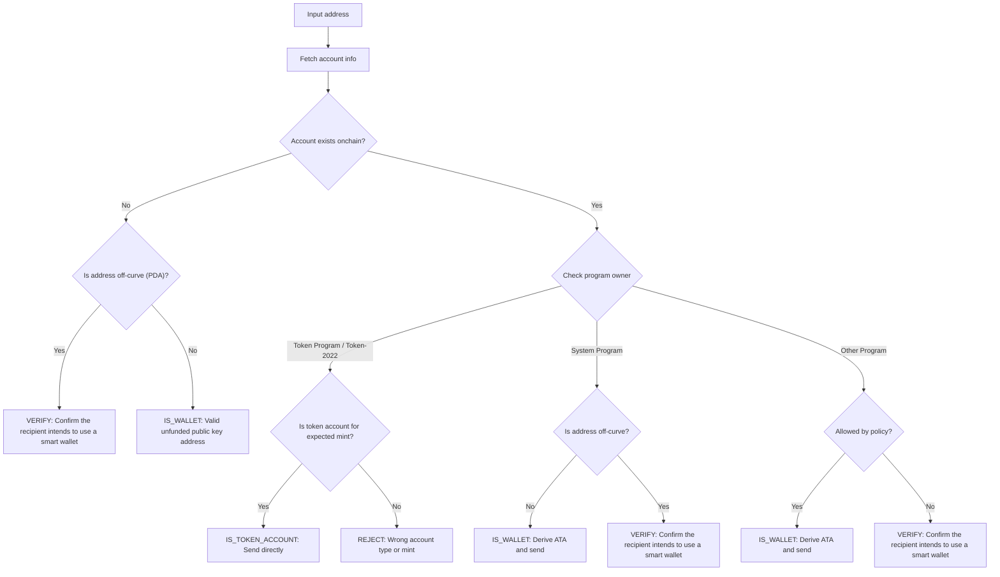

Η αποστολή κεφαλαίων σε λάθος διεύθυνση μπορεί να οδηγήσει σε μόνιμη απώλεια. Η επαλήθευση διεύθυνσης διασφαλίζει ότι εσείς και οι χρήστες σας στέλνετε μόνο σε διευθύνσεις που μπορούν να λάβουν και να αποκτήσουν πρόσβαση στα κεφάλαια. Εάν διαχειρίζεστε ένα ανταλλακτήριο, συνιστάται να εκτελείτε αυτούς τους ελέγχους και να ζητάτε από τον χρήστη να επαληθεύει τη διεύθυνση πριν την αποστολή.

Η επικύρωση εξαρτάται από το τι στέλνετε:

- **Τα SPL tokens** προστατεύονται εν μέρει από μόνα τους. Το Token Program
  απορρίπτει μια μεταφορά της οποίας οι λογαριασμοί δεν αντιστοιχούν στο
  αναμενόμενο mint, οπότε μια λανθασμένα κατευθυνόμενη μεταφορά token
  αποτυγχάνει χωρίς απώλεια κεφαλαίων. Το μεγαλύτερο μέρος αυτής της σελίδας
  καλύπτει αποστολές SPL token.
- **Το εγγενές SOL** δεν έχει τέτοια προστασία. Μια μεταφορά System Program
  επιτυγχάνει σε οποιονδήποτε λογαριασμό, οπότε ένας λανθασμένος παραλήπτης
  κλειδώνει οριστικά το SOL. Δείτε [Αποστολή εγγενούς SOL](#sending-native-sol).

<Callout>
  Δείτε [Πώς Λειτουργούν οι Πληρωμές στο
  Solana](/docs/payments/how-payments-work) για βασικές έννοιες πληρωμών.
</Callout>

## Κατανόηση των Διευθύνσεων Solana

Οι λογαριασμοί Solana έχουν δύο τύπους διευθύνσεων: επί καμπύλης και εκτός
καμπύλης.

### Διευθύνσεις Επί Καμπύλης

Οι τυπικές διευθύνσεις είναι τα δημόσια κλειδιά από Ed25519 keypairs. Αυτές οι
διευθύνσεις:

- Διαθέτουν αντίστοιχο ιδιωτικό κλειδί που μπορεί να υπογράφει συναλλαγές
- Χρησιμοποιούνται ως διευθύνσεις πορτοφολιού

### Διευθύνσεις Εκτός Καμπύλης (PDAs)

Τα [Program Derived Addresses](/docs/core/pda) παράγονται ντετερμινιστικά από
ένα αναγνωριστικό προγράμματος και seeds. Αυτές οι διευθύνσεις:

- **Δεν** διαθέτουν αντίστοιχο ιδιωτικό κλειδί
- Μπορούν να υπογραφούν μόνο από το πρόγραμμα από το οποίο παράχθηκε η διεύθυνση

Τα πορτοφόλια ελεγχόμενα από προγράμματα, γνωστά συνήθως ως smart wallets ή έξυπνοι λογαριασμοί, έχουν διευθύνσεις εκτός καμπύλης. Αυτός ο οδηγός χρησιμοποιεί τον όρο "smart wallet" σε όλο το κείμενο.

## Τύποι Λογαριασμών στις Πληρωμές

Χρησιμοποιήστε τη διεύθυνση για να ανακτήσετε έναν
[λογαριασμό](/docs/core/accounts) από το δίκτυο, ελέγξτε τον κάτοχο προγράμματος
και τον τύπο λογαριασμού για να προσδιορίσετε πώς να χειριστείτε τη διεύθυνση.

<Callout>
  Το να γνωρίζετε αν μια διεύθυνση είναι επί καμπύλης ή εκτός καμπύλης δεν σας
  λέει τι τύπο λογαριασμού είναι, ποιο πρόγραμμα τον κατέχει, ή αν υπάρχει
  λογαριασμός σε αυτή τη διεύθυνση. Πρέπει να ανακτήσετε τον λογαριασμό από το
  δίκτυο για να προσδιορίσετε αυτές τις λεπτομέρειες.
</Callout>

### Λογαριασμοί System Program (Πορτοφόλια)

Οι λογαριασμοί που ανήκουν στο System Program είναι τυπικά πορτοφόλια. Για να
στείλετε SPL tokens σε ένα πορτοφόλι, παράγετε και χρησιμοποιείτε το
[Associated Token Account (ATA)](/docs/tokens/basics/create-token-account#what-is-an-associated-token-account)
του.

Αφού παράγετε τη διεύθυνση ATA, ελέγξτε αν το token account υπάρχει στο onchain.
Αν το ATA δεν υπάρχει, μπορείτε να συμπεριλάβετε μια εντολή για τη δημιουργία
του token account του παραλήπτη στην ίδια συναλλαγή με τη μεταφορά. Ωστόσο, αυτό
απαιτεί την πληρωμή rent για το νέο token account. Καθώς ο παραλήπτης κατέχει το
ATA, το SOL που καταβλήθηκε για το rent δεν μπορεί να ανακτηθεί από τον
αποστολέα.

Οι λογαριασμοί συστήματος μπορούν να υπάρχουν εκτός καμπύλης. Εάν ο χρήστης σας θέλει να στείλει tokens σε μια διεύθυνση εκτός καμπύλης, συνιστάται να του ζητάτε να επαληθεύσει ότι σκοπεύει να στείλει κεφάλαια σε ένα smart wallet.

<Callout type="warn">
  Χωρίς προστατευτικές δικλείδες, η επιδότηση δημιουργίας ATA μπορεί να
  εκμεταλλευτεί. Ένας κακόβουλος χρήστης θα μπορούσε να ζητήσει μια μεταφορά, να
  δημιουργήσει το ATA του με δικά σας έξοδα, να κλείσει το ATA για να ανακτήσει
  το rent SOL και να επαναλάβει τη διαδικασία.
</Callout>

### Token Accounts

Τα [token accounts](/docs/tokens/basics/create-token-account) ανήκουν στο Token
Program ή Token-2022 Program και αποθηκεύουν υπόλοιπα tokens. Αν η διεύθυνση που
λαμβάνετε ανήκει σε ένα token program, θα πρέπει να επαληθεύσετε ότι ο
λογαριασμός είναι ένα token account (όχι ένα mint account) και ότι αντιστοιχεί
στο αναμενόμενο token mint account πριν αποστείλετε.

<Callout type="info">
  Τα Token Programs επικυρώνουν αυτόματα ότι και τα δύο token accounts σε μια
  μεταφορά περιέχουν tokens του ίδιου mint. Αν η επικύρωση αποτύχει, η συναλλαγή
  απορρίπτεται και δεν χάνονται κεφάλαια.
</Callout>

### Mint Accounts

Τα [mint accounts](/docs/tokens/basics/create-mint) παρακολουθούν την προσφορά
tokens και τα μεταδεδομένα ενός συγκεκριμένου token. Τα mint accounts ανήκουν
επίσης στα Token Programs, αλλά **δεν** αποτελούν έγκυρους παραλήπτες για
μεταφορές tokens. Η προσπάθεια αποστολής tokens σε μια διεύθυνση mint οδηγεί σε
αποτυχημένη συναλλαγή, αλλά δεν χάνονται κεφάλαια.

### Άλλοι Λογαριασμοί

Οι λογαριασμοί που ανήκουν σε άλλα προγράμματα είναι έγκυροι, αλλά διέπονται από τους κανόνες εξουσιοδότησης που ορίζει το αντίστοιχο πρόγραμμα-ιδιοκτήτης. Συνιστάται να ζητάτε από τον χρήστη να επαληθεύσει ότι σκοπεύει να στείλει κεφάλαια σε ένα smart wallet.

## Αποστολή εγγενούς SOL

Η παραπάνω κατηγοριοποίηση καθορίζει πού μπορούν να μεταφερθούν τα SPL tokens.
Το εγγενές SOL είναι πιο αυστηρό: ο μόνος ασφαλής παραλήπτης είναι ένα
**πορτοφόλι System Program** (ή μια αχρησιμοποίητη διεύθυνση επί καμπύλης που
γίνεται τέτοια).

Μια μεταφορά System Program προσθέτει lamport σε οποιονδήποτε λογαριασμό,
συμπεριλαμβανομένων των mints, token accounts, προγραμμάτων και PDAs. Τα lamport
μπορούν να μετακινηθούν μόνο από το πρόγραμμα ιδιοκτησίας του λογαριασμού,
επομένως η αποστολή SOL σε λανθασμένο παραλήπτη μπορεί να οδηγήσει σε μόνιμη
απώλεια κεφαλαίων.

Σε αντίθεση με τη μεταφορά SPL token, η συναλλαγή **δεν** αποτυγχάνει όταν ο
παραλήπτης είναι μια μη αναμενόμενη διεύθυνση.

Κατά την αποστολή εγγενούς SOL, μόνο ένα αποτέλεσμα `IS_WALLET` είναι αποδεκτό.
Το `IS_TOKEN_ACCOUNT` **δεν** είναι: ένα token account διατηρεί SPL tokens, και
το SOL που αποστέλλεται εκεί βρίσκεται εκτός του ελέγχου του αποστολέα.

<Callout type="warn">
  Αυτός είναι ένας συνηθισμένος τρόπος με τον οποίο χάνεται SOL: ένας χρήστης
  επικολλά τη διεύθυνση mint ενός token (ή μια διεύθυνση προγράμματος) σε μια
  ανάληψη SOL. Η μεταφορά ολοκληρώνεται επιτυχώς και το SOL δεν ανακτάται. Να
  κατηγοριοποιείτε πάντα τον παραλήπτη πριν υπογράψετε μια μεταφορά SOL.
</Callout>

## Ροή Επαλήθευσης

Το παρακάτω διάγραμμα δείχνει ένα δέντρο αποφάσεων αναφοράς για την επικύρωση
μιας διεύθυνσης:


```mermaid title="Address Verification Flow"
flowchart TD
    A["Input address"]
    B["Fetch account info"]

    A --> B
    B --> C{"Account exists onchain?"}

    %% --- Non-existent account path ---
    C -- "No" --> D{"Is address off-curve (PDA)?"}
    D -- "Yes" --> V1["VERIFY: Confirm the recipient intends to use a smart wallet"]
    D -- "No" --> W1["IS_WALLET: Valid unfunded public key address"]

    %% --- Existing account path ---
    C -- "Yes" --> F{"Check program owner"}

    F -- "Token Program / Token-2022" --> G{"Is token account for expected mint?"}
    G -- "Yes" --> T1["IS_TOKEN_ACCOUNT: Send directly"]
    G -- "No" --> R1["REJECT: Wrong account type or mint"]

    F -- "System Program" --> H{"Is address off-curve?"}
    H -- "No" --> W2["IS_WALLET: Derive ATA and send"]
    H -- "Yes" --> V3["VERIFY: Confirm the recipient intends to use a smart wallet"]

    F -- "Other Program" --> K{"Allowed by policy?"}
    K -- "Yes" --> W3["IS_WALLET: Derive ATA and send"]
    K -- "No" --> V2["VERIFY: Confirm the recipient intends to use a smart wallet"]
```

<Steps>
<Step>

### Ανάκτηση λογαριασμού

Χρησιμοποιήστε τη διεύθυνση για να ανακτήσετε τα στοιχεία του λογαριασμού από το
δίκτυο.

</Step>
<Step>

### Ο λογαριασμός δεν υπάρχει

Εάν δεν υπάρχει λογαριασμός σε αυτήν τη διεύθυνση, ελέγξτε αν η διεύθυνση είναι εντός ή εκτός καμπύλης:

- **Εκτός καμπύλης (PDA)**: Απαιτείται ρητή επαλήθευση παραλήπτη πριν από τη δημιουργία ενός ATA ή την αποστολή SPL tokens. Χωρίς υπάρχοντα λογαριασμό, δεν μπορείτε να προσδιορίσετε από τη διεύθυνση μόνο ποιο πρόγραμμα παρήγαγε αυτό το PDA ή αν το πρόγραμμα του παραλήπτη μπορεί να αποκτήσει πρόσβαση στο ATA του.

- **Εντός καμπύλης**: Πρόκειται για έγκυρη διεύθυνση πορτοφολιού (δημόσιο κλειδί) που δεν έχει χρηματοδοτηθεί ακόμα. Εξαγάγετε το ATA, ελέγξτε αν υπάρχει και στείλτε tokens σε αυτό. Πρέπει να λάβετε μια απόφαση πολιτικής για το αν θα χρηματοδοτήσετε τη δημιουργία του ATA εάν δεν υπάρχει.

</Step>
<Step>

### Ο λογαριασμός υπάρχει

Εάν υπάρχει λογαριασμός, ελέγξτε ποιο πρόγραμμα τον κατέχει:

- **System Program**: Πρόκειται για ένα τυπικό πορτοφόλι. Εξαγάγετε το ATA, ελέγξτε αν υπάρχει και στείλτε tokens σε αυτό. Πρέπει να λάβετε μια απόφαση πολιτικής για το αν θα χρηματοδοτήσετε τη δημιουργία του ATA εάν δεν υπάρχει.

- **Token Program / Token-2022**: Επαληθεύστε ότι ο λογαριασμός είναι token account (όχι mint account) και ότι διατηρεί το token (mint) που σκοπεύετε να στείλετε. Εάν είναι έγκυρος, στείλτε tokens απευθείας σε αυτήν τη διεύθυνση. Εάν είναι mint account ή token account για διαφορετικό mint, απορρίψτε τη διεύθυνση.

- **Άλλο Πρόγραμμα**: Προγράμματα όπως τα πορτοφόλια multisig είναι αποδεκτοί ιδιοκτήτες token accounts. Ζητήστε από τον χρήστη να επιβεβαιώσει ότι σκοπεύει να στείλει σε ένα smart wallet.

  Μερικά κοινά smart wallets:

| Πορτοφόλι                                              | Διεύθυνση Προγράμματος                                                                                                                |
| --------------------------------------------------- | ------------------------------------------------------------------------------------------------------------------------------ |
| [Squads](https://squads.xyz/)                       | [SQDS4ep65T869zMMBKyuUq6aD6EgTu8psMjkvj52pCf](https://explorer.solana.com/address/SQDS4ep65T869zMMBKyuUq6aD6EgTu8psMjkvj52pCf) |
| [Swig](https://github.com/anagrambuild/swig-wallet) | [swigypWHEksbC64pWKwah1WTeh9JXwx8H1rJHLdbQMB](https://explorer.solana.com/address/swigypWHEksbC64pWKwah1WTeh9JXwx8H1rJHLdbQMB) |

</Step>
</Steps>

## Demo

Το παρακάτω παράδειγμα εμφανίζει μόνο τη λογική επαλήθευσης διευθύνσεων. Αυτός
είναι κώδικας αναφοράς για λόγους επεξήγησης.

<Callout>
  Το demo δεν δείχνει πώς να εξαχθεί ένα ATA ή να δημιουργηθεί μια συναλλαγή για
  αποστολή tokens. Ανατρέξτε στην τεκμηρίωση για το [token
  account](/docs/tokens/basics/create-token-account#how-to-create-an-associated-token-account)
  και τη [μεταφορά token](/docs/tokens/basics/transfer-tokens) για παραδείγματα
  κώδικα.
</Callout>

Το demo παρακάτω χρησιμοποιεί τρία πιθανά αποτελέσματα:

| Αποτέλεσμα              | Σημασία                                 | Ενέργεια                                                              |
| ------------------- | --------------------------------------- | ------------------------------------------------------------------- |
| `IS_WALLET`         | Έγκυρη διεύθυνση πορτοφολιού                    | Εξαγωγή και αποστολή στο associated token account                         |
| `IS_TOKEN_ACCOUNT`  | Έγκυρο token account                     | Αποστολή tokens απευθείας σε αυτή τη διεύθυνση                                |
| `USER_VERIFICATION` | Η διεύθυνση απαιτεί επιβεβαίωση από τον παραλήπτη | Απαιτείται ρητή επισκόπηση πριν από την αποστολή SPL tokens ή τη χρηματοδότηση ενός ATA |
| `REJECT`            | Μη έγκυρη διεύθυνση                         | Μην αποστείλετε                                                         |

Στη συνέχεια αντιστοιχεί κάθε αποτέλεσμα στην αποδεκτότητα ανά περιουσιακό στοιχείο με `canReceiveNativeSol` (μόνο για πορτοφόλια) και `canReceiveSplToken` (πορτοφόλια ή token accounts). Ένα αποτέλεσμα `USER_VERIFICATION` δεν γίνεται αυτόματα αποδεκτό· η εφαρμογή σας θα πρέπει να ζητά από τον χρήστη να επιβεβαιώσει την πρόθεσή του πριν από την αποστολή SPL tokens. Ένα token account επιστρέφει `IS_TOKEN_ACCOUNT`, οπότε μπορεί να λάβει SPL tokens αλλά **όχι** native SOL — η διάκριση που αποτρέπει το κλείδωμα του SOL.

<CodeTabs flags="r">

```ts !! title="Demo"
// !collapse(1:35) collapsed

import {
  type Address,
  type Rpc,
  type GetAccountInfoApi,
  createSolanaRpc,
  fetchJsonParsedAccount,
  isOffCurveAddress,
  generateKeyPairSigner,
  getProgramDerivedAddress
} from "@solana/kit";

// =============================================================================
// Constants
// =============================================================================

const defaultRpc = createSolanaRpc("https://api.mainnet.solana.com");

const SYSTEM_PROGRAM = "11111111111111111111111111111111" as Address;
const TOKEN_PROGRAM = "TokenkegQfeZyiNwAJbNbGKPFXCWuBvf9Ss623VQ5DA" as Address;
const TOKEN_2022_PROGRAM =
  "TokenzQdBNbLqP5VEhdkAS6EPFLC1PHnBqCXEpPxuEb" as Address;

// =============================================================================
// Validation Function
// =============================================================================

/**
 * Possible validation results for an input address.
 */
export type ValidationResult =
  | { type: "IS_TOKEN_ACCOUNT" }
  | { type: "IS_WALLET" }
  | { type: "USER_VERIFICATION"; reason: string }
  | { type: "REJECT"; reason: string };

/**
 * Validates an input address and classifies it as a wallet, token account,
 * address requiring recipient verification, or invalid.
 *
 * @param inputAddress - The address to validate
 * @param rpc - Optional RPC client (defaults to mainnet)
 * @returns Classification result:
 *   - IS_WALLET: Valid wallet address
 *   - IS_TOKEN_ACCOUNT: Valid token account
 *   - USER_VERIFICATION: Require explicit review before sending SPL tokens
 *   - REJECT: Invalid address for transfers
 */
export async function validateAddress(
  inputAddress: Address,
  rpc: Rpc<GetAccountInfoApi> = defaultRpc
): Promise<ValidationResult> {
  const account = await fetchJsonParsedAccount(rpc, inputAddress);
  // Log the account data for demo
  console.log("\nAccount:", account);

  // Account doesn't exist onchain
  if (!account.exists) {
    // An unfunded PDA may belong to a smart wallet, but the address
    // alone cannot prove that its program can access a newly-created ATA.
    if (isOffCurveAddress(inputAddress)) {
      return {
        type: "USER_VERIFICATION",
        reason:
          "Unfunded PDA: confirm the recipient is using a smart wallet and controls this address"
      };
    }
    // On-curve = valid keypair address, treat as unfunded wallet
    return { type: "IS_WALLET" };
  }

  // Account exists, check program owner
  const owner = account.programAddress;

  // A System Program account can be a standard wallet or an off-curve smart
  // wallet. Require verification before automatically sending to the
  // latter.
  if (owner === SYSTEM_PROGRAM) {
    if (isOffCurveAddress(inputAddress)) {
      return {
        type: "USER_VERIFICATION",
        reason:
          "Off-curve System Program account: confirm recipient is using a smart wallet"
      };
    }
    return { type: "IS_WALLET" };
  }

  // Token Program or Token-2022, check if token account
  if (owner === TOKEN_PROGRAM || owner === TOKEN_2022_PROGRAM) {
    const accountType = (
      account.data as { parsedAccountMeta?: { type?: string } }
    ).parsedAccountMeta?.type;

    if (accountType === "account") {
      return { type: "IS_TOKEN_ACCOUNT" };
    }
    // Reject if not a token account (mint account)
    return {
      type: "REJECT",
      reason: "Not a token account"
    };
  }

  // An account owned by another program can be a smart wallet.
  return {
    type: "USER_VERIFICATION",
    reason:
      "Program-owned account: confirm the recipient is using a smart wallet"
  };
}

/**
 * Native SOL is only safe to send to a wallet. Any other account locks it.
 */
function canReceiveNativeSol(result: ValidationResult): boolean {
  return result.type === "IS_WALLET";
}

/**
 * SPL tokens can go to a wallet (via its ATA) or directly to a token account.
 */
function canReceiveSplToken(result: ValidationResult): boolean {
  return result.type === "IS_WALLET" || result.type === "IS_TOKEN_ACCOUNT";
}

// =============================================================================
// Examples
// =============================================================================
// !collapse(1:1000) collapsed

// Wallets
const EXISTING_WALLET =
  "H8sMJSCQxfKiFTCfDR3DUMLPwcRbM61LGFJ8N4dK3WjS" as Address;
const NEW_WALLET = (await generateKeyPairSigner()).address;

// Token accounts
const USDC_TOKEN_ACCOUNT =
  "3emsAVdmGKERbHjmGfQ6oZ1e35dkf5iYcS6U4CPKFVaa" as Address;
const PYUSD_TOKEN_ACCOUNT =
  "47od2TPRvqJipfPVWZdyenLEngPw8hC36nDxiLyvGsEP" as Address;

// Token mints (should be rejected)
const USDC_MINT = "EPjFWdd5AufqSSqeM2qN1xzybapC8G4wEGGkZwyTDt1v" as Address;
const PYUSD_MINT = "2b1kV6DkPAnxd5ixfnxCpjxmKwqjjaYmCZfHsFu24GXo" as Address;

// PDA that doesn't exist (requires recipient verification)
const [NON_EXISTENT_PDA] = await getProgramDerivedAddress({
  programAddress: (await generateKeyPairSigner()).address,
  seeds: ["seed"]
});

// Program account (requires recipient verification)
const PROGRAM_ACCOUNT =
  "p1exdMJcjVao65QdewkaZRUnU6VPSXhus9n2GzWfh98" as Address;

async function runExample(label: string, address: Address) {
  console.log(`\n${"─".repeat(60)}`);
  console.log(`Example: ${label}`);
  console.log(`Input: ${address}`);
  console.log(`${"─".repeat(60)}`);

  const result = await validateAddress(address);
  console.log("\nResult:", result);
  console.log(
    `Can receive SOL?   ${canReceiveNativeSol(result) ? "YES" : "NO"}`
  );
  console.log(
    `Can receive token? ${canReceiveSplToken(result) ? "YES" : "NO"}`
  );
}

console.log("\n" + "═".repeat(60));
console.log("  IS_WALLET Examples");
console.log("═".repeat(60));

await runExample("Existing funded wallet", EXISTING_WALLET);
await runExample("New wallet (unfunded)", NEW_WALLET);

console.log("\n" + "═".repeat(60));
console.log("  IS_TOKEN_ACCOUNT Examples");
console.log("═".repeat(60));

await runExample("USDC token account (Token Program)", USDC_TOKEN_ACCOUNT);
await runExample("PYUSD token account (Token-2022)", PYUSD_TOKEN_ACCOUNT);

console.log("\n" + "═".repeat(60));
console.log("  USER_VERIFICATION Examples");
console.log("═".repeat(60));

await runExample("Non-existent PDA", NON_EXISTENT_PDA);
await runExample("Program account", PROGRAM_ACCOUNT);

console.log("\n" + "═".repeat(60));
console.log("  REJECT Examples");
console.log("═".repeat(60));

await runExample("USDC mint address", USDC_MINT);
await runExample("PYUSD mint address", PYUSD_MINT);

console.log("\n" + "═".repeat(60));
console.log("  Done!");
console.log("═".repeat(60) + "\n");
```

</CodeTabs>
