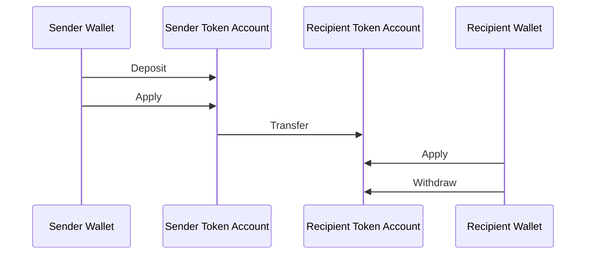
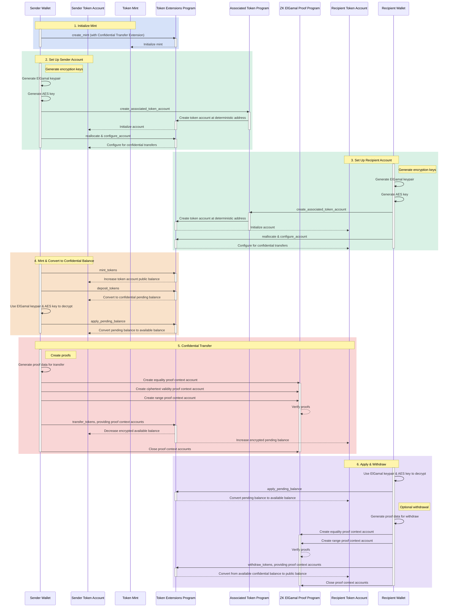

## Τι είναι οι Εμπιστευτικές Μεταφορές;

Οι εμπιστευτικές μεταφορές σάς επιτρέπουν να μεταφέρετε tokens μεταξύ token
accounts χωρίς να αποκαλύπτετε το ποσό της μεταφοράς. Αυτό είναι χρήσιμο για
συναλλαγές που διασφαλίζουν την ιδιωτικότητα. Μόνο τα ποσά μεταφοράς και τα
υπόλοιπα tokens είναι ιδιωτικά. Οι διευθύνσεις των token accounts παραμένουν
δημόσιες.

- [Επισκόπηση Πρωτοκόλλου](https://www.solana-program.com/docs/confidential-balances/overview) -
  Λεπτομέρειες για το υποκείμενο κρυπτογραφικό πρωτόκολλο
- [Οδηγός Γρήγορης Εκκίνησης](https://www.solana-program.com/docs/confidential-balances#setup) -
  Εγκατάσταση και βασικές εντολές CLI
- [Confidential Balances Cookbook](https://github.com/solana-developers/Confidential-Balances-Sample) -
  Αποσπάσματα κώδικα για τη χρήση της επέκτασης Confidential Transfer

### Πώς λειτουργεί;

Η επέκταση Confidential Transfer προσθέτει
[εντολές](https://github.com/solana-program/token-2022/blob/efd0c957fefbd79882d77df5fb2dac88c001249c/program/src/extension/confidential_transfer/instruction.rs#L29)
στο Token Extensions Program που σάς επιτρέπει να μεταφέρετε tokens μεταξύ
λογαριασμών χωρίς να αποκαλύπτετε το ποσό της μεταφοράς.

Η βασική ροή των εμπιστευτικών μεταφορών tokens έχει ως εξής:

1. Δημιουργήστε ένα mint account με την επέκταση εμπιστευτικής μεταφοράς.
2. Δημιουργήστε token accounts με την επέκταση εμπιστευτικής μεταφοράς για τον
   αποστολέα και τον παραλήπτη.
3. Εκδώστε tokens στον λογαριασμό του αποστολέα.
4. **Κατάθεση** του δημόσιου υπολοίπου του αποστολέα στο **εμπιστευτικό εκκρεμές
   υπόλοιπο**.
5. **Εφαρμογή** του εκκρεμούς υπολοίπου του αποστολέα στο **εμπιστευτικό
   διαθέσιμο υπόλοιπο**.
6. Εμπιστευτική **μεταφορά** tokens από το token account του αποστολέα στο token
   account του παραλήπτη.
7. **Εφαρμογή** του εκκρεμούς υπολοίπου του παραλήπτη στο **εμπιστευτικό
   διαθέσιμο υπόλοιπο**.
8. **Ανάληψη** του εμπιστευτικού διαθέσιμου υπολοίπου του παραλήπτη στο
   **δημόσιο υπόλοιπο**.

Για περισσότερες λεπτομέρειες σχετικά με τα βήματα της ροής εμπιστευτικής
μεταφοράς, ανατρέξτε στις αντίστοιχες σελίδες:

<Cards>
  <Card
    title="Δημιουργία Mint Account"
    href="/docs/tokens/extensions/confidential-transfer/create-mint"
  >
    Πώς να δημιουργήσετε ένα mint account με την επέκταση Confidential Transfer
  </Card>
  <Card
    title="Δημιουργία Token Account"
    href="/docs/tokens/extensions/confidential-transfer/create-token-account"
  >
    Πώς να ρυθμίσετε ένα token account με την επέκταση Confidential Transfer
  </Card>
  <Card
    title="Κατάθεση Tokens"
    href="/docs/tokens/extensions/confidential-transfer/deposit-tokens"
  >
    Πώς να καταθέσετε tokens στο εμπιστευτικό εκκρεμές υπόλοιπο
  </Card>
  <Card
    title="Εφαρμογή Εκκρεμούς Υπολοίπου"
    href="/docs/tokens/extensions/confidential-transfer/apply-pending-balance"
  >
    Πώς να εφαρμόσετε το εκκρεμές υπόλοιπο στο διαθέσιμο εμπιστευτικό υπόλοιπο
  </Card>
  <Card
    title="Ανάληψη Tokens"
    href="/docs/tokens/extensions/confidential-transfer/withdraw-tokens"
  >
    Πώς να αναλάβετε tokens από το εμπιστευτικό διαθέσιμο υπόλοιπο
  </Card>
  <Card
    title="Μεταφορά Tokens"
    href="/docs/tokens/extensions/confidential-transfer/transfer-tokens"
  >
    Πώς να μεταφέρετε εμπιστευτικά tokens μεταξύ token accounts
  </Card>
  <Card
    title="Οδηγός Ενσωμάτωσης"
    href="/docs/tokens/extensions/confidential-transfer/integration-guide"
  >
    Πώς τα πορτοφόλια, οι εξερευνητές και τα ανταλλακτήρια μπορούν να
    υποστηρίξουν tokens εμπιστευτικής μεταφοράς
  </Card>
  <Card
    title="Οδηγός Εκδότη"
    href="/docs/tokens/extensions/confidential-transfer/issuer-guide"
  >
    Πώς να εκδώσετε και να διαχειριστείτε ένα token εμπιστευτικής μεταφοράς
    (πολιτική έγκρισης, ελεγκτές, χρεώσεις, έκδοση και καταστροφή)
  </Card>
</Cards>

Το παρακάτω διάγραμμα δείχνει μια λεπτομερή ακολουθία της βασικής ροής για
εμπιστευτικές μεταφορές token:

## Οδηγίες Εμπιστευτικής Μεταφοράς

Η πλήρης λίστα των οδηγιών της επέκτασης Εμπιστευτικής Μεταφοράς
[instructions](https://github.com/solana-program/token-2022/blob/efd0c957fefbd79882d77df5fb2dac88c001249c/program/src/extension/confidential_transfer/instruction.rs#L29)
έχει ως εξής:

| Οδηγία                              | Περιγραφή                                                                                                                                                                   |
| ----------------------------------- | --------------------------------------------------------------------------------------------------------------------------------------------------------------------------- |
| _rs`InitializeMint`_                | Ρυθμίζει το mint account για εμπιστευτικές μεταφορές. Αυτή η οδηγία πρέπει να συμπεριληφθεί στην ίδια συναλλαγή με την οδηγία _rs`TokenInstruction::InitializeMint`_.       |
| _rs`UpdateMint`_                    | Ενημερώνει τις ρυθμίσεις εμπιστευτικής μεταφοράς για ένα mint.                                                                                                              |
| _rs`ConfigureAccount`_              | Ρυθμίζει ένα token account για εμπιστευτικές μεταφορές.                                                                                                                     |
| _rs`ApproveAccount`_                | Εγκρίνει ένα token account για εμπιστευτικές μεταφορές, εάν το mint απαιτεί έγκριση για νέα token accounts.                                                                 |
| _rs`EmptyAccount`_                  | Αδειάζει τα εκκρεμή και διαθέσιμα εμπιστευτικά υπόλοιπα ώστε να επιτραπεί το κλείσιμο ενός token account.                                                                   |
| _rs`Deposit`_                       | Μετατρέπει το δημόσιο υπόλοιπο token σε εκκρεμές εμπιστευτικό υπόλοιπο.                                                                                                     |
| _rs`Withdraw`_                      | Μετατρέπει το διαθέσιμο εμπιστευτικό υπόλοιπο πίσω σε δημόσιο υπόλοιπο.                                                                                                     |
| _rs`Transfer`_                      | Μεταφέρει tokens μεταξύ token accounts εμπιστευτικά.                                                                                                                        |
| _rs`ApplyPendingBalance`_           | Μετατρέπει το εκκρεμές υπόλοιπο σε διαθέσιμο υπόλοιπο μετά από καταθέσεις ή μεταφορές.                                                                                      |
| _rs`EnableConfidentialCredits`_     | Επιτρέπει σε ένα token account να λαμβάνει εμπιστευτικές μεταφορές token.                                                                                                   |
| _rs`DisableConfidentialCredits`_    | Αποκλείει τις εισερχόμενες εμπιστευτικές μεταφορές ενώ εξακολουθεί να επιτρέπει τις δημόσιες μεταφορές.                                                                     |
| _rs`EnableNonConfidentialCredits`_  | Επιτρέπει σε ένα token account να λαμβάνει δημόσιες μεταφορές token.                                                                                                        |
| _rs`DisableNonConfidentialCredits`_ | Αποκλείει τις κανονικές μεταφορές ώστε ο λογαριασμός να δέχεται μόνο εμπιστευτικές μεταφορές.                                                                               |
| _rs`TransferWithFee`_               | Μεταφέρει tokens μεταξύ token accounts εμπιστευτικά με χρέωση.                                                                                                              |
| _rs`ConfigureAccountWithRegistry`_  | Εναλλακτικός τρόπος ρύθμισης token accounts για εμπιστευτικές μεταφορές χρησιμοποιώντας έναν λογαριασμό _rs`ElGamalRegistry`_ αντί για απόδειξη _rs`VerifyPubkeyValidity`_. |
