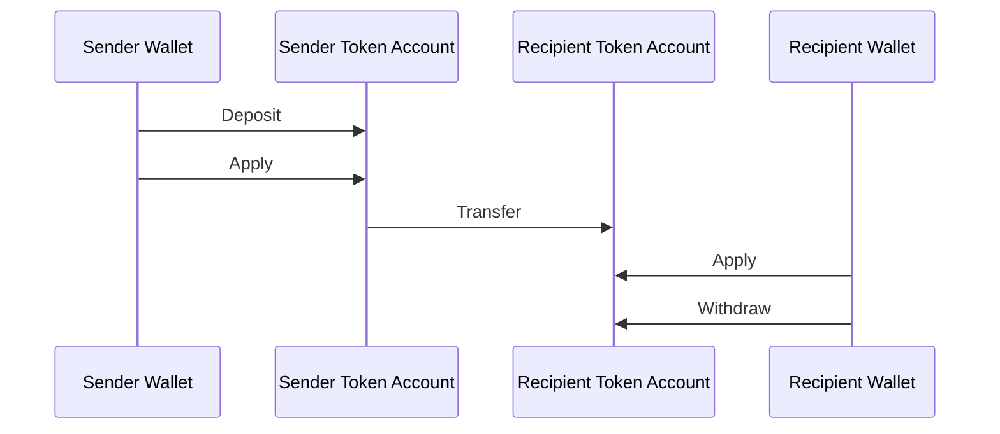
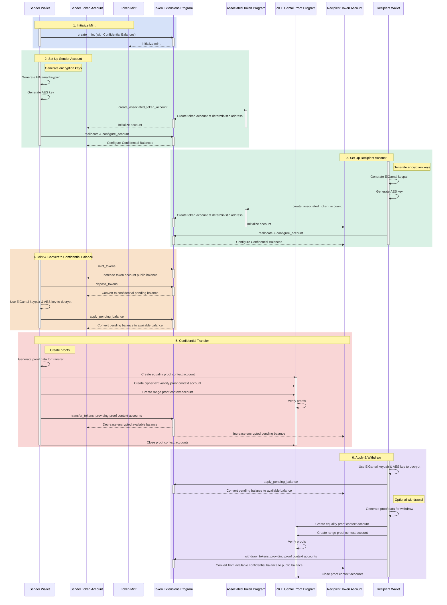

## Τι είναι τα Confidential Balances;

<Embed url="https://youtu.be/Bqs95tFcRIU" />

Το Confidential Balances είναι μια επέκταση Token-2022 που σας επιτρέπει να μεταφέρετε tokens μεταξύ token accounts χωρίς να αποκαλύπτετε το ποσό της μεταφοράς. Αυτό είναι χρήσιμο για συναλλαγές που διαφυλάσσουν το απόρρητο. Μόνο τα ποσά μεταφοράς και τα υπόλοιπα token παραμένουν ιδιωτικά. Οι διευθύνσεις των token accounts παραμένουν δημόσιες.

- [Επισκόπηση Πρωτοκόλλου](https://www.solana-program.com/docs/confidential-balances/overview) -
  Λεπτομέρειες για το υποκείμενο κρυπτογραφικό πρωτόκολλο
- [Οδηγός Γρήγορης Εκκίνησης](https://www.solana-program.com/docs/confidential-balances#setup) -
  Ρύθμιση και βασικές εντολές CLI
- [Confidential Balances Cookbook](https://github.com/solana-developers/Confidential-Balances-Sample) -
  Αποσπάσματα κώδικα που δείχνουν πώς να χρησιμοποιήσετε το Confidential Balances

### Πώς λειτουργεί;

Η επέκταση Confidential Balances προσθέτει
[εντολές](https://github.com/solana-program/token-2022/blob/efd0c957fefbd79882d77df5fb2dac88c001249c/program/src/extension/confidential_transfer/instruction.rs#L29)
στο Token Extension program που σας επιτρέπουν να μεταφέρετε tokens μεταξύ λογαριασμών χωρίς να αποκαλύπτετε το ποσό της μεταφοράς.

```mermaid title="Confidential Balances Basic Overview"
    sequenceDiagram

    participant A as Sender Wallet
    participant AA as Sender Token Account
    participant BB as Recipient Token Account
    participant B as Recipient Wallet

    A->>AA: Deposit
    A->>AA: Apply

    AA->>BB: Transfer
    B->>BB: Apply

    B->>BB: Withdraw

```

Η βασική ροή των εμπιστευτικών μεταφορών tokens είναι η εξής:

1. Δημιουργήστε ένα mint account με ενεργοποιημένο το Confidential Balances.
2. Δημιουργήστε token accounts με ενεργοποιημένο το Confidential Balances για τον αποστολέα και τον παραλήπτη.
3. Έκδοση tokens στον λογαριασμό του αποστολέα.
4. **Κατάθεση** του δημόσιου υπολοίπου του αποστολέα στο **εμπιστευτικό εκκρεμές
   υπόλοιπο**.
5. **Εφαρμογή** του εκκρεμούς υπολοίπου του αποστολέα στο **εμπιστευτικό
   διαθέσιμο υπόλοιπο**.
6. Εμπιστευτική **μεταφορά** tokens από το token account του αποστολέα στο token
   account του παραλήπτη.
7. **Εφαρμογή** του εκκρεμούς υπολοίπου του παραλήπτη στο **εμπιστευτικό
   διαθέσιμο υπόλοιπο**.
8. **Ανάληψη** του εμπιστευτικού διαθέσιμου υπολοίπου του παραλήπτη στο
   **δημόσιο υπόλοιπο**.

### Κλειδιά ελεγκτή

Ένα mint account Confidential Balances μπορεί να αποθηκεύει ένα προαιρετικό καθολικό δημόσιο κλειδί ElGamal ελεγκτή. Όταν αυτό είναι διαμορφωμένο, κάθε εμπιστευτική μεταφορά περιλαμβάνει το ποσό κρυπτογραφημένο για τον αποστολέα, τον παραλήπτη και τον ελεγκτή. Η απόδειξη μεταφοράς επαληθεύει ότι και τα τρία κρυπτοκείμενα περιέχουν το ίδιο ποσό. Το κοινό εξακολουθεί να μην μπορεί να διαβάσει το ποσό, αλλά ο κάτοχος του μυστικού κλειδιού ελεγκτή μπορεί να αποκρυπτογραφήσει τα ποσά μεταφοράς για αυτό το mint.

Η αρχή Confidential Balances ορίζει το κλειδί ελεγκτή κατά την αρχικοποίηση της επέκτασης ή το αλλάζει αργότερα με _rs`UpdateMint`_. Η αρχή μπορεί να εναλλάξει ή να διαγράψει το κλειδί. Μια εναλλαγή ισχύει μόνο για μελλοντικές μεταφορές, επομένως διατηρήστε τα προηγούμενα μυστικά κλειδιά όταν απαιτείται ιστορική πρόσβαση ελέγχου. Τα κλειδιά ελεγκτή παρέχουν πρόσβαση ανάγνωσης· δεν εξουσιοδοτούν μεταφορές token ούτε αποκαλύπτουν το πλήρες εμπιστευτικό υπόλοιπο ενός λογαριασμού.

Για παραδείγματα ρύθμισης και εναλλαγής, δείτε
[Διαμόρφωση ελεγκτή](/docs/tokens/extensions/confidential-transfer/issuer-guide#configure-an-auditor).
Τα πορτοφόλια, οι εξερευνητές, τα ανταλλακτήρια και οι πάροχοι συμμόρφωσης θα πρέπει επίσης να ανατρέξουν στις
[οδηγίες ενσωμάτωσης ελεγκτή](/docs/tokens/extensions/confidential-transfer/integration-guide#auditors-and-compliance).

Για περισσότερες λεπτομέρειες σχετικά με τα βήματα της ροής εμπιστευτικής
μεταφοράς, δείτε τις αντίστοιχες σελίδες:

<Cards>
  <Card
    title="Δημιουργία Mint Account"
    href="/docs/tokens/extensions/confidential-transfer/create-mint"
  >
    Πώς να δημιουργήσετε ένα mint account με ενεργοποιημένο το Confidential Balances
  </Card>
  <Card
    title="Δημιουργία Token Account"
    href="/docs/tokens/extensions/confidential-transfer/create-token-account"
  >
    Πώς να διαμορφώσετε ένα token account με ενεργοποιημένο το Confidential Balances
  </Card>
  <Card
    title="Κατάθεση Tokens"
    href="/docs/tokens/extensions/confidential-transfer/deposit-tokens"
  >
    Πώς να καταθέσετε tokens στο εμπιστευτικό εκκρεμές υπόλοιπο
  </Card>
  <Card
    title="Εφαρμογή Εκκρεμούς Υπολοίπου"
    href="/docs/tokens/extensions/confidential-transfer/apply-pending-balance"
  >
    Πώς να εφαρμόσετε το εκκρεμές υπόλοιπο στο διαθέσιμο εμπιστευτικό υπόλοιπο
  </Card>
  <Card
    title="Ανάληψη Tokens"
    href="/docs/tokens/extensions/confidential-transfer/withdraw-tokens"
  >
    Πώς να αναλάβετε tokens από το εμπιστευτικό διαθέσιμο υπόλοιπο
  </Card>
  <Card
    title="Μεταφορά Tokens"
    href="/docs/tokens/extensions/confidential-transfer/transfer-tokens"
  >
    Πώς να μεταφέρετε εμπιστευτικά tokens μεταξύ token accounts
  </Card>
  <Card
    title="Οδηγός Ενσωμάτωσης"
    href="/docs/tokens/extensions/confidential-transfer/integration-guide"
  >
    Πώς τα πορτοφόλια, οι εξερευνητές και τα ανταλλακτήρια μπορούν να υποστηρίζουν tokens Confidential Balances
  </Card>
  <Card
    title="Οδηγός Εκδότη"
    href="/docs/tokens/extensions/confidential-transfer/issuer-guide"
  >
    Πώς να εκδώσετε και να διαχειριστείτε ένα token Confidential Balances (πολιτική έγκρισης, ελεγκτές, προμήθειες, έκδοση και καύση)
  </Card>
</Cards>

Το παρακάτω διάγραμμα δείχνει μια λεπτομερή ακολουθία της βασικής ροής για
εμπιστευτικές μεταφορές token:

```mermaid title="Confidential Balances Detailed Overview"
sequenceDiagram
    participant Sender as Sender Wallet
    participant SenderAccount as Sender Token Account
    participant Mint as Token Mint
    participant Token22 as Token Extensions Program
    participant ATAProgram as Associated Token Program
    participant ElGamal as ZK ElGamal Proof Program
    participant RecipientAccount as Recipient Token Account
    participant Recipient as Recipient Wallet

    rect rgba(120, 160, 235, 0.3)
    Note over Sender,Mint: 1. Initialize Mint

    activate Sender
    Sender->>Token22: create_mint (with Confidential Balances)
    activate Token22
    Token22-->>Mint: Initialize mint
    deactivate Token22
    deactivate Sender
    end

    rect rgba(130, 210, 170, 0.3)
    Note over Sender,SenderAccount: 2. Set Up Sender Account

    activate Sender
    Note right of Sender: Generate encryption keys
    Sender->>Sender: Generate ElGamal keypair
    Sender->>Sender: Generate AES key

    Sender->>ATAProgram: create_associated_token_account
    activate ATAProgram
    ATAProgram->>Token22: Create token account at deterministic address
    activate Token22
    Token22-->>SenderAccount: Initialize account
    deactivate Token22
    deactivate ATAProgram

    Sender->>Token22: reallocate & configure_account
    activate Token22
    Token22-->>SenderAccount: Configure Confidential Balances
    deactivate Token22
    deactivate Sender
    end

    rect rgba(130, 210, 170, 0.3)
    Note over Recipient,RecipientAccount: 3. Set Up Recipient Account

    activate Recipient
    Note right of Recipient: Generate encryption keys
    Recipient->>Recipient: Generate ElGamal keypair
    Recipient->>Recipient: Generate AES key

    Recipient->>ATAProgram: create_associated_token_account
    activate ATAProgram
    ATAProgram->>Token22: Create token account at deterministic address
    activate Token22
    Token22-->>RecipientAccount: Initialize account
    deactivate Token22
    deactivate ATAProgram

    Recipient->>Token22: reallocate & configure_account
    activate Token22
    Token22-->>RecipientAccount: Configure Confidential Balances
    deactivate Token22
    deactivate Recipient
    end

    rect rgba(235, 160, 80, 0.3)
    Note over Sender,SenderAccount: 4. Mint & Convert to Confidential Balance

    activate Sender
    Sender->>Token22: mint_tokens
    activate Token22
    Token22-->>SenderAccount: Increase token account public balance
    deactivate Token22

    Sender->>Token22: deposit_tokens
    activate Token22
    Token22-->>SenderAccount: Convert to confidential pending balance
    deactivate Token22

    Sender->>Sender: Use ElGamal keypair & AES key to decrypt
    Sender->>Token22: apply_pending_balance
    activate Token22
    Token22-->>SenderAccount: Convert pending balance to available balance
    deactivate Token22
    deactivate Sender
    end

    rect rgba(235, 120, 120, 0.3)
    Note over Sender,RecipientAccount: 5. Confidential Transfer

    activate Sender
    Note right of Sender: Create proofs
    Sender->>Sender: Generate proof data for transfer

    Sender->>ElGamal: Create equality proof context account
    activate ElGamal
    Sender->>ElGamal: Create ciphertext validity proof context account
    Sender->>ElGamal: Create range proof context account
    ElGamal-->>ElGamal: Verify proofs

    Sender->>Token22: transfer_tokens, providing proof context accounts
    activate Token22
    Token22-->>SenderAccount: Decrease encrypted available balance
    Token22-->>RecipientAccount: Increase encrypted pending balance
    deactivate Token22

    Sender->>ElGamal: Close proof context accounts
    deactivate ElGamal
    deactivate Sender
    end

    rect rgba(180, 150, 235, 0.3)
    Note over Recipient,RecipientAccount: 6. Apply & Withdraw

    activate Recipient
    Recipient->>Recipient: Use ElGamal keypair & AES key to decrypt
    Recipient->>Token22: apply_pending_balance
    activate Token22
    Token22-->>RecipientAccount: Convert pending balance to available balance
    deactivate Token22

    Note right of Recipient: Optional withdrawal
    Recipient->>Recipient: Generate proof data for withdraw

    Recipient->>ElGamal: Create equality proof context account
    activate ElGamal
    Recipient->>ElGamal: Create range proof context account
    ElGamal-->>ElGamal: Verify proofs

    Recipient->>Token22: withdraw_tokens, providing proof context accounts
    activate Token22
    Token22-->>RecipientAccount: Convert from available confidential balance to public balance
    deactivate Token22

    Recipient->>ElGamal: Close proof context accounts
    deactivate ElGamal
    deactivate Recipient
    end
```

## Εντολές Confidential Balances

Η πλήρης λίστα των
[εντολών](https://github.com/solana-program/token-2022/blob/efd0c957fefbd79882d77df5fb2dac88c001249c/program/src/extension/confidential_transfer/instruction.rs#L29)
της επέκτασης Confidential Balances είναι η εξής:

| Εντολή                         | Περιγραφή                                                                                                                                                       |
| ----------------------------------- | ----------------------------------------------------------------------------------------------------------------------------------------------------------------- |
| _rs`InitializeMint`_                | Ενεργοποιεί το Confidential Balances σε ένα mint account. Αυτή η εντολή πρέπει να συμπεριληφθεί στην ίδια συναλλαγή με την εντολή _rs`TokenInstruction::InitializeMint`_. |
| _rs`UpdateMint`_                    | Ενημερώνει την πολιτική έγκρισης λογαριασμού του mint και το προαιρετικό καθολικό δημόσιο κλειδί ElGamal ελεγκτή.                                                                        |
| _rs`ConfigureAccount`_              | Ενεργοποιεί το Confidential Balances σε ένα token account.                                                                                                                 |
| _rs`ApproveAccount`_                | Εγκρίνει ένα token account για Confidential Balances εάν το mint απαιτεί έγκριση για νέα token accounts.                                                          |
| _rs`EmptyAccount`_                  | Αδειάζει τα εκκρεμή και διαθέσιμα εμπιστευτικά υπόλοιπα για να επιτρέψει το κλείσιμο ενός token account.                                                                         |
| _rs`Deposit`_                       | Μετατρέπει το δημόσιο υπόλοιπο token σε εκκρεμές εμπιστευτικό υπόλοιπο.                                                                                                  |
| _rs`Withdraw`_                      | Μετατρέπει το διαθέσιμο εμπιστευτικό υπόλοιπο πίσω σε δημόσιο υπόλοιπο.                                                                                                   |
| _rs`Transfer`_                      | Μεταφέρει token μεταξύ token accounts εμπιστευτικά.                                                                                                           |
| _rs`ApplyPendingBalance`_           | Μετατρέπει το εκκρεμές υπόλοιπο σε διαθέσιμο υπόλοιπο μετά από καταθέσεις ή μεταφορές.                                                                                      |
| _rs`EnableConfidentialCredits`_     | Επιτρέπει σε ένα token account να λαμβάνει εμπιστευτικές μεταφορές token.                                                                                                   |
| _rs`DisableConfidentialCredits`_    | Αποκλείει τις εισερχόμενες εμπιστευτικές μεταφορές, επιτρέποντας ωστόσο τις δημόσιες μεταφορές.                                                                                     |
| _rs`EnableNonConfidentialCredits`_  | Επιτρέπει σε ένα token account να λαμβάνει δημόσιες μεταφορές token.                                                                                                         |
| _rs`DisableNonConfidentialCredits`_ | Αποκλείει τις κανονικές μεταφορές ώστε ο λογαριασμός να δέχεται μόνο εμπιστευτικές μεταφορές.                                                                                     |
| _rs`TransferWithFee`_               | Μεταφέρει token μεταξύ token accounts εμπιστευτικά με χρέωση.                                                                                                |
| _rs`ConfigureAccountWithRegistry`_  | Εναλλακτικός τρόπος διαμόρφωσης token accounts για Confidential Balances χρησιμοποιώντας έναν λογαριασμό _rs`ElGamalRegistry`_ αντί για απόδειξη _rs`VerifyPubkeyValidity`_.         |
