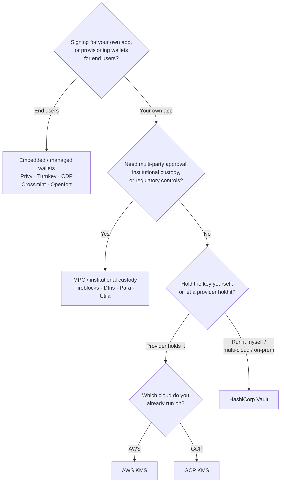

Το Keychain εκθέτει ένα ενιαίο `SolanaSigner` interface σε κάθε backend, οπότε η
επιλογή είναι λειτουργική, όχι αρχιτεκτονική — μπορείτε να την αλλάξετε αργότερα
μέσω διαμόρφωσης. Γι' αυτό, **ξεκινήστε από τις απαιτήσεις σας, όχι από ένα
προϊόν.** Δύο ερωτήσεις αποφασίζουν το μεγαλύτερο μέρος: _πού βρίσκεται το
ιδιωτικό κλειδί και ποιος επιτρέπεται να εξουσιοδοτήσει μια υπογραφή με αυτό;_

Δεν υπάρχει ένα μοναδικό βέλτιστο backend. Καθένα ταιριάζει καλύτερα σε ένα
συγκεκριμένο σύνολο περιορισμών — το cloud στο οποίο ήδη λειτουργείτε, αν θέλετε
να διαχειρίζεστε υποδομή κλειδιών, και ποιους ελέγχους θεματοφυλακής και
έγκρισης απαιτείται να έχετε. Η παρακάτω ροή αντιστοιχεί αυτούς τους
περιορισμούς σε ένα backend.

<Callout type="info">
  Αυτός ο οδηγός καλύπτει την υπογραφή στο backend (πλευρά διακομιστή). Όταν οι
  τελικοί χρήστες σας υπογράφουν τις δικές τους συναλλαγές σε ένα πρόγραμμα
  περιήγησης, χρησιμοποιήστε ένα πορτοφόλι μέσω του Wallet Standard — δείτε
  [Υπογραφή σε Παραγωγή](/docs/core/transactions/signing-in-production).
</Callout>

## Ροή απόφασης

<Callout type="info">
  Η τοπική ανάπτυξη και οι δοκιμές δεν χρειάζονται τίποτα από αυτά —
  χρησιμοποιήστε το backend **Memory** για πρωτοτυποποίηση, στη συνέχεια
  μεταβείτε σε ένα από τα παραπάνω backend παραγωγής μέσω διαμόρφωσης.
</Callout>

## Ακολουθήστε τις ερωτήσεις

<Steps>

<Step>

### Υπογράφετε για τη δική σας εφαρμογή ή για τους τελικούς χρήστες σας;

Αν παρέχετε πορτοφόλια που **οι τελικοί χρήστες** κατέχουν και διαχειρίζονται
(εφαρμογές για καταναλωτές, ροές ενσωμάτωσης), χρησιμοποιήστε ένα backend
**ενσωματωμένου / διαχειριζόμενου πορτοφολιού** — Privy, Turnkey, CDP, Crossmint
ή Openfort. Αυτά διαχειρίζονται πορτοφόλια ανά χρήστη και τον έλεγχο ταυτότητας
για λογαριασμό σας.

Αν υπογράφετε ως **δική σας εφαρμογή** — ένας πληρωτής τελών, ένα ταμείο,
αυτοματισμός backend — συνεχίστε παρακάτω.

</Step>

<Step>

### Χρειάζεστε έγκριση από πολλά μέρη, θεσμική φύλαξη ή κανονιστικούς ελέγχους;

Αν οι υπογραφές πρέπει να περάσουν από πολιτική έγκρισης, όριο δαπανών ή ροή
συμμόρφωσης πριν παραχθούν — ή χρειάζεστε ρυθμιζόμενο θεματοφύλακα που να
διατηρεί τα κλειδιά — χρησιμοποιήστε ένα backend **MPC / θεσμικής φύλαξης**:
Fireblocks, Dfns, Para ή Utila. Αυτά διαχωρίζουν ή φυλάσσουν το κλειδί και
συνυπογράφουν σύμφωνα με την πολιτική σας.

Αν χρειάζεστε μόνο ένα κλειδί που υπογράφει κατόπιν αιτήματος, συνεχίστε
παρακάτω.

</Step>

<Step>

### Θέλετε να διατηρείτε το κλειδί εσείς, ή να το διατηρεί ένας πάροχος;

Αν ένας πάροχος cloud πρέπει να διατηρεί το κλειδί σε υποδομή υποστηριζόμενη από
hardware και η πολιτική IAM σας ελέγχει ποιος μπορεί να υπογράφει,
χρησιμοποιήστε το KMS του αντίστοιχου cloud:

- **Εκτέλεση σε AWS** → AWS KMS
- **Εκτέλεση σε GCP** → GCP KMS

Αν θέλετε να λειτουργείτε μόνοι σας την υποδομή κλειδιών — ή χρησιμοποιείτε
πολλά cloud ή on-prem — χρησιμοποιήστε το **HashiCorp Vault**. Εσείς το
εκτελείτε και το ελέγχετε· το κλειδί παραμένει μέσα στον Transit engine και
υπογράφει κατόπιν αιτήματος.

</Step>

</Steps>

## Μοντέλα φύλαξης

Τα backends ομαδοποιούνται σε πέντε μοντέλα φύλαξης. Η παραπάνω ροή σας
τοποθετεί σε ένα από αυτά.

- **Αυτο-φύλαξη (εντός διεργασίας)** — η εφαρμογή σας διατηρεί το ακατέργαστο
  ιδιωτικό κλειδί. Βολικό για ανάπτυξη, αλλά ακατάλληλο για παραγωγή. Backend:
  **Memory**.
- **Αυτο-φιλοξενούμενη διαχείριση κλειδιών** — εσείς λειτουργείτε την υποδομή
  κλειδιών· το κλειδί παραμένει μέσα σε αυτήν και υπογράφει κατόπιν αιτήματος.
  Backend: **HashiCorp Vault**.
- **Cloud KMS / HSM** — ένας πάροχος cloud αποθηκεύει το κλειδί σε υποδομή
  υποστηριζόμενη από hardware· το κλειδί δεν εγκαταλείπει ποτέ την υπηρεσία και
  η πολιτική IAM σας ελέγχει ποιος μπορεί να υπογράφει. Backends: **AWS KMS**,
  **GCP KMS**.
- **MPC & θεσμική φύλαξη** — το κλειδί διαχωρίζεται ή φυλάσσεται μέσω ενός
  παρόχου, ο οποίος συνυπογράφει σύμφωνα με την πολιτική σας (εγκρίσεις, όρια).
  Backends: **Fireblocks**, **Dfns**, **Para**, **Utila**.
- **Ενσωματωμένα & διαχειριζόμενα πορτοφόλια** — ένας πάροχος διαχειρίζεται
  πορτοφόλια για λογαριασμό σας, συχνά για την ενσωμάτωση τελικών χρηστών.
  Backends: **Privy**, **Turnkey**, **CDP**, **Crossmint**, **Openfort**.

## Σύγκριση backend

| Backend         | Μοντέλο φύλαξης                        | Ιδανικό για                                               | Σημειώσεις                                                          |
| --------------- | -------------------------------------- | --------------------------------------------------------- | ------------------------------------------------------------------- |
| Memory          | Αυτο-φύλαξη (in-process)               | Τοπική ανάπτυξη, δοκιμές, CI                              | Ακατέργαστο κλειδί στη διεργασία — μη χρησιμοποιείτε σε παραγωγή    |
| HashiCorp Vault | Αυτο-φιλοξενούμενη διαχείριση κλειδιών | Ομάδες που διαχειρίζονται τη δική τους υποδομή κλειδιών   | Μηχανισμός Transit· εσείς το λειτουργείτε και το ελέγχετε           |
| AWS KMS         | Cloud KMS / HSM                        | Backends που εκτελούνται σε AWS                           | Το κλειδί δεν εγκαταλείπει ποτέ το KMS· το IAM ελέγχει την υπογραφή |
| GCP KMS         | Cloud KMS / HSM                        | Backends που εκτελούνται σε GCP                           | Το κλειδί δεν εγκαταλείπει ποτέ το KMS· το IAM ελέγχει την υπογραφή |
| Fireblocks      | MPC / θεσμική φύλαξη                   | Ταμεία, ανταλλακτήρια, ρυθμιζόμενη φύλαξη                 | Μηχανισμός πολιτικής και ροές έγκρισης                              |
| Dfns            | Υποδομή πορτοφολιών MPC                | Προγραμματικά πορτοφόλια με ελέγχους πολιτικής            | Υπογραφή Ed25519                                                    |
| Para            | Πορτοφόλια MPC                         | Εφαρμογές που επιθυμούν πορτοφόλια υποστηριζόμενα από MPC | Κλειδί API + αναγνωριστικό πορτοφολιού                              |
| Utila           | Φύλαξη MPC + συν-υπογράφων             | Υπάρχοντα πορτοφόλια Solana διαχειριζόμενα από Utila      | `signMessage` μη υποστηριζόμενο· εσείς μεταδίδετε τη συναλλαγή      |
| Privy           | Ενσωματωμένα πορτοφόλια                | Εφαρμογές καταναλωτών για εισαγωγή χρηστών σε πορτοφόλια  | Ενσωματωμένα πορτοφόλια διαχειριζόμενα από εφαρμογή                 |
| Turnkey         | Μη-θεματοφυλακική διαχείριση κλειδιών  | Προγραμματική, υπογραφή με έλεγχο πολιτικής               | Μη-θεματοφυλακική διαχείριση κλειδιών                               |
| CDP             | Διαχειριζόμενο πορτοφόλι (Coinbase)    | Εφαρμογές στην Πλατφόρμα Προγραμματιστών Coinbase         | `signMessage` δέχεται μόνο φορτία UTF-8                             |
| Crossmint       | Διαχειριζόμενα πορτοφόλια              | Αγορές και εφαρμογές διαχειριζόμενων πορτοφολιών          | Πορτοφόλια `smart` και `mpc`· `signMessage` μη υποστηριζόμενο       |
| Openfort        | Ενσωματωμένα πορτοφόλια backend        | Πορτοφόλια από πλευράς διακομιστή                         | Κλειδιά αποθηκευμένα σε TEE                                         |

## Σενάρια επιχειρήσεων

Μια εφαρμογή συχνά χρειάζεται περισσότερα από ένα από αυτά ταυτόχρονα. Επειδή η
διεπαφή είναι ταυτόσημη, μπορείτε να εκτελείτε διαφορετικό backend ανά ρόλο
χωρίς να αλλάζετε τα σημεία κλήσης.

- **Λειτουργίες ταμείου** — διαχωρισμός ενός λειτουργικού "hot" υπογράφοντα από
  έναν "cold" υπογράφοντα ταμείου. Υποστήριξη του ταμείου με MPC custody ή cloud
  HSM και απαίτηση πολιτικών έγκρισης πριν από υπογραφές υψηλής αξίας.
- **Ροές έγκρισης** — τα backends MPC και custody (π.χ. Fireblocks) επιβάλλουν
  έγκριση πολλαπλών μερών πριν παραχθεί μια υπογραφή.
- **Συμμόρφωση και έλεγχος** — τα cloud KMS (AWS/GCP) και Vault εκπέμπουν αρχεία
  καταγραφής ελέγχου υπογραφών· οι θεσμικοί θεματοφύλακες προσθέτουν επιβολή
  πολιτικής και αναφορές.
- **Ρυθμιζόμενα περιβάλλοντα** — διατήρηση του υλικού κλειδιών σε HSM, KMS ή
  θεσμικό θεματοφύλακα, ώστε τα ακατέργαστα κλειδιά να μην αγγίζουν ποτέ την
  εφαρμογή σας.

Δείτε
[Βέλτιστες πρακτικές παραγωγής](/docs/tools/keychain/production-best-practices)
για την ασφαλή λειτουργία αυτών των backends.

<Cards>
  <Card title="Οδηγός Rust" href="/docs/tools/keychain/getting-started/rust">
    Ρυθμίστε κάθε backend σε Rust.
  </Card>
  <Card
    title="Οδηγός TypeScript"
    href="/docs/tools/keychain/getting-started/typescript"
  >
    Ρυθμίστε κάθε backend σε TypeScript.
  </Card>
</Cards>
