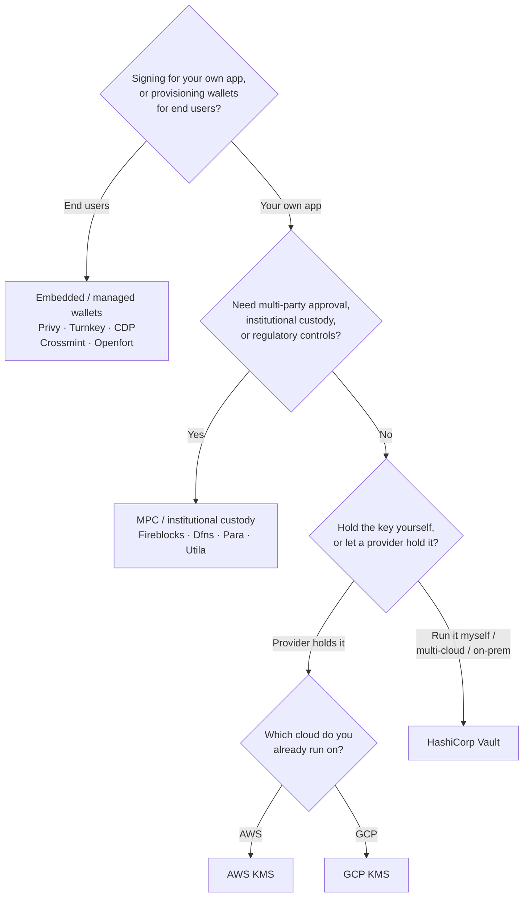

Το Keychain εκθέτει ένα ενιαίο περιβάλλον `SolanaSigner` σε κάθε backend, οπότε
η επιλογή είναι λειτουργική, όχι αρχιτεκτονική — μπορείτε να την αλλάξετε
αργότερα μέσω ρύθμισης παραμέτρων. Γι' αυτό, **ξεκινήστε από τις απαιτήσεις σας,
όχι από ένα προϊόν.** Δύο ερωτήματα αποφασίζουν το μεγαλύτερο μέρος: _πού
βρίσκεται το ιδιωτικό κλειδί και ποιος επιτρέπεται να εγκρίνει μια υπογραφή με
αυτό;_

Δεν υπάρχει ένα μοναδικό καλύτερο backend. Το καθένα ταιριάζει καλύτερα σε ένα
συγκεκριμένο σύνολο περιορισμών — το cloud στο οποίο ήδη εκτελείτε, αν θέλετε να
διαχειρίζεστε υποδομή κλειδιών και ποιους ελέγχους φύλαξης και έγκρισης
απαιτείται να έχετε. Η ροή παρακάτω αντιστοιχεί αυτούς τους περιορισμούς σε ένα
backend.

<Callout type="info">
  Αυτός ο οδηγός καλύπτει την υπογραφή στο backend (πλευρά διακομιστή). Όταν οι
  τελικοί χρήστες υπογράφουν τις δικές τους συναλλαγές σε ένα πρόγραμμα
  περιήγησης, χρησιμοποιήστε ένα πορτοφόλι μέσω του Wallet Standard — δείτε
  [Υπογραφή σε Παραγωγή](/docs/core/transactions/signing-in-production).
</Callout>

## Ροή απόφασης

<Callout type="info">
  Η τοπική ανάπτυξη και οι δοκιμές δεν χρειάζονται τίποτα από αυτά —
  χρησιμοποιήστε το backend **Memory** για πρωτοτυποποίηση και στη συνέχεια
  μεταβείτε σε ένα από τα παραπάνω backend παραγωγής μέσω ρύθμισης παραμέτρων.
</Callout>

## Εξέταση των ερωτημάτων

<Steps>

<Step>

### Υπογράφετε για τη δική σας εφαρμογή ή για τους τελικούς χρήστες σας;

Εάν παρέχετε πορτοφόλια που **οι τελικοί χρήστες** κατέχουν και διαχειρίζονται
(εφαρμογές καταναλωτών, ροές ενσωμάτωσης), χρησιμοποιήστε ένα backend
**ενσωματωμένου / διαχειριζόμενου πορτοφολιού** — Privy, Turnkey, CDP, Crossmint
ή Openfort. Αυτά διαχειρίζονται πορτοφόλια ανά χρήστη και τον έλεγχο ταυτότητας
εκ μέρους σας.

Αν υπογράφετε ως **δική σας εφαρμογή** — ένας πληρωτής τελών, ένα ταμείο,
αυτοματισμός backend — συνεχίστε παρακάτω.

</Step>

<Step>

### Χρειάζεστε έγκριση από πολλά μέρη, θεσμική φύλαξη ή κανονιστικούς ελέγχους;

Αν οι υπογραφές πρέπει να περάσουν από πολιτική έγκρισης, όριο δαπανών ή ροή
εργασίας συμμόρφωσης πριν παραχθούν — ή χρειάζεστε έναν ρυθμιζόμενο θεματοφύλακα
που κρατά τα κλειδιά — χρησιμοποιήστε ένα backend **MPC / θεσμικής φύλαξης**:
Fireblocks, Dfns, Para ή Utila. Αυτά διαχωρίζουν ή φυλάσσουν το κλειδί και
συνυπογράφουν σύμφωνα με την πολιτική σας.

Αν χρειάζεστε μόνο ένα κλειδί που υπογράφει κατόπιν αιτήματος, συνεχίστε
παρακάτω.

</Step>

<Step>

### Θέλετε να κρατάτε το κλειδί εσείς, ή να το κρατά ένας πάροχος;

Αν ένας πάροχος cloud πρέπει να κρατά το κλειδί σε υποδομή με υλικό υποστήριξης
και η πολιτική IAM σας ελέγχει ποιος μπορεί να υπογράφει, χρησιμοποιήστε το KMS
του αντίστοιχου cloud:

- **Εκτέλεση σε AWS** → AWS KMS
- **Εκτέλεση σε GCP** → GCP KMS

Αν θέλετε να λειτουργείτε την υποδομή κλειδιών εσείς — ή είστε multi-cloud ή
on-prem — χρησιμοποιήστε το **HashiCorp Vault**. Το εκτελείτε και το ελέγχετε
εσείς· το κλειδί παραμένει εντός του Transit engine και υπογράφει κατόπιν
αιτήματος.

</Step>

</Steps>

## Μοντέλα φύλαξης

Τα backends ομαδοποιούνται σε πέντε μοντέλα φύλαξης. Η παραπάνω ροή σας οδηγεί
σε ένα από αυτά.

- **Αυτο-φύλαξη (in-process)** — η εφαρμογή σας κρατά το ακατέργαστο ιδιωτικό
  κλειδί. Βολικό για ανάπτυξη, αλλά ακατάλληλο για παραγωγή. Backend:
  **Memory**.
- **Αυτο-διαχειριζόμενη διαχείριση κλειδιών** — λειτουργείτε εσείς την υποδομή
  κλειδιών· το κλειδί παραμένει εντός της και υπογράφει κατόπιν αιτήματος.
  Backend: **HashiCorp Vault**.
- **Cloud KMS / HSM** — ένας πάροχος cloud αποθηκεύει το κλειδί σε υποδομή με
  υλικό υποστήριξης· το κλειδί δεν φεύγει ποτέ από την υπηρεσία και η πολιτική
  IAM σας ελέγχει ποιος μπορεί να υπογράφει. Backends: **AWS KMS**, **GCP KMS**.
- **MPC & θεσμική φύλαξη** — το κλειδί διαχωρίζεται ή φυλάσσεται μέσω παρόχου, ο
  οποίος συνυπογράφει σύμφωνα με την πολιτική σας (εγκρίσεις, όρια). Backends:
  **Fireblocks**, **Dfns**, **Para**, **Utila**.
- **Ενσωματωμένα & διαχειριζόμενα πορτοφόλια** — ένας πάροχος διαχειρίζεται
  πορτοφόλια για λογαριασμό σας, συχνά για την ένταξη τελικών χρηστών. Backends:
  **Privy**, **Turnkey**, **CDP**, **Crossmint**, **Openfort**.

## Σύγκριση backend

| Backend         | Μοντέλο φύλαξης                        | Ιδανικό για                                               | Σημειώσεις                                                          |
| --------------- | -------------------------------------- | --------------------------------------------------------- | ------------------------------------------------------------------- |
| Memory          | Αυτο-φύλαξη (εντός διεργασίας)         | Τοπική ανάπτυξη, δοκιμές, CI                              | Ακατέργαστο κλειδί στη διεργασία — μη χρησιμοποιείτε σε παραγωγή    |
| HashiCorp Vault | Αυτο-φιλοξενούμενη διαχείριση κλειδιών | Ομάδες που διαχειρίζονται τη δική τους υποδομή κλειδιών   | Μηχανή Transit· εσείς τη λειτουργείτε και την ελέγχετε              |
| AWS KMS         | Cloud KMS / HSM                        | Backends που εκτελούνται στο AWS                          | Το κλειδί δεν εγκαταλείπει ποτέ το KMS· το IAM ελέγχει την υπογραφή |
| GCP KMS         | Cloud KMS / HSM                        | Backends που εκτελούνται στο GCP                          | Το κλειδί δεν εγκαταλείπει ποτέ το KMS· το IAM ελέγχει την υπογραφή |
| Fireblocks      | MPC / θεσμική φύλαξη                   | Ταμεία, ανταλλακτήρια, ρυθμιζόμενη φύλαξη                 | Μηχανή πολιτικών και ροές έγκρισης                                  |
| Dfns            | Υποδομή πορτοφολιών MPC                | Προγραμματικά πορτοφόλια με έλεγχο πολιτικών              | Υπογραφή Ed25519                                                    |
| Para            | Πορτοφόλια MPC                         | Εφαρμογές που επιθυμούν πορτοφόλια υποστηριγμένα από MPC  | API key + wallet ID                                                 |
| Utila           | MPC φύλαξη + συν-υπογράφων             | Υπάρχοντα πορτοφόλια Solana διαχειριζόμενα από Utila      | `signMessage` μη υποστηριζόμενο· εσείς μεταδίδετε την tx            |
| Privy           | Ενσωματωμένα πορτοφόλια                | Εφαρμογές καταναλωτών που εντάσσουν χρήστες σε πορτοφόλια | Ενσωματωμένα πορτοφόλια διαχειριζόμενα από την εφαρμογή             |
| Turnkey         | Μη-θεματοφυλακική διαχείριση κλειδιών  | Προγραμματική, υπογραφή με έλεγχο πολιτικών               | Μη-θεματοφυλακική διαχείριση κλειδιών                               |
| CDP             | Διαχειριζόμενο πορτοφόλι (Coinbase)    | Εφαρμογές στην Πλατφόρμα Coinbase Developer               | `signMessage` δέχεται μόνο payloads UTF-8                           |
| Crossmint       | Διαχειριζόμενα πορτοφόλια              | Αγορές και εφαρμογές με διαχειριζόμενα πορτοφόλια         | `smart` και `mpc` πορτοφόλια· `signMessage` μη υποστηριζόμενο       |
| Openfort        | Ενσωματωμένα backend πορτοφόλια        | Πορτοφόλια από την πλευρά του διακομιστή                  | Κλειδιά αποθηκευμένα σε TEE                                         |

## Σενάρια επιχειρηματικής κλίμακας

Μια εφαρμογή συχνά χρειάζεται περισσότερα από ένα από αυτά ταυτόχρονα. Επειδή το
interface είναι πανομοιότυπο, μπορείτε να εκτελείτε διαφορετικό backend ανά ρόλο
χωρίς να αλλάζετε τα σημεία κλήσης.

- **Λειτουργίες Treasury** — διαχωρισμός ενός λειτουργικού «hot» υπογράφοντος
  από έναν «cold» υπογράφοντα treasury. Υποστηρίξτε το treasury με MPC custody ή
  cloud HSM και απαιτήστε πολιτικές έγκρισης πριν από υπογραφές υψηλής αξίας.
- **Ροές εργασίας έγκρισης** — τα backends MPC και custody (π.χ. Fireblocks)
  επιβάλλουν έγκριση πολλαπλών μερών πριν παραχθεί μια υπογραφή.
- **Συμμόρφωση και έλεγχος** — τα cloud KMS (AWS/GCP) και Vault εκπέμπουν αρχεία
  καταγραφής ελέγχου υπογραφών· οι θεσμικοί θεματοφύλακες προσθέτουν επιβολή
  πολιτικής και αναφορές.
- **Ρυθμιζόμενα περιβάλλοντα** — διατηρήστε το υλικό κλειδιών σε HSM, KMS ή
  θεσμικό θεματοφύλακα, ώστε τα ακατέργαστα κλειδιά να μην αγγίζουν ποτέ την
  εφαρμογή σας.

Δείτε τις
[Βέλτιστες πρακτικές παραγωγής](/docs/tools/keychain/production-best-practices)
για την ασφαλή λειτουργία αυτών των backends.

<Cards>
  <Card title="Οδηγός Rust" href="/docs/tools/keychain/getting-started/rust">
    Ρυθμίστε κάθε backend σε Rust.
  </Card>
  <Card
    title="Οδηγός TypeScript"
    href="/docs/tools/keychain/getting-started/typescript"
  >
    Ρυθμίστε κάθε backend σε TypeScript.
  </Card>
</Cards>
