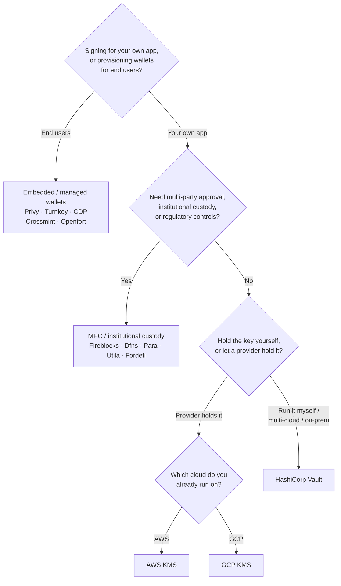

Το Keychain παρέχει μία βασική διεπαφή `SolanaSigner` για κάθε backend, επομένως για
τα περισσότερα backends η επιλογή είναι λειτουργική και όχι αρχιτεκτονική: μπορείτε να την αλλάξετε
αργότερα μέσω των ρυθμίσεων. Εξαίρεση αποτελεί η μορφή της συναλλαγής. Τα Crossmint
και Fordefi native auto mode υπογράφουν και μεταδίδουν από την πλευρά του διακομιστή, ενώ το Fordefi native
manual mode ξαναγράφει τη συναλλαγή πριν την υπογράψει, οπότε η μετάβαση προς ή από ένα
από αυτά αλλάζει τον τρόπο με τον οποίο καλείτε τον signer. Γι' αυτό, **ξεκινήστε από τις
απαιτήσεις σας και όχι από ένα προϊόν.** Δύο ερωτήματα καθορίζουν τα περισσότερα: _πού
βρίσκεται το ιδιωτικό κλειδί και ποιος έχει δικαίωμα να εγκρίνει μια υπογραφή με αυτό;_

Κάθε backend εκτός από το Ledger διατίθεται και στις τέσσερις γλώσσες (Rust, TypeScript,
Python και Go). Το Ledger υποστηρίζεται μόνο σε Rust, μέσω του προαιρετικού χαρακτηριστικού `ledger`.

Δεν υπάρχει ένα μοναδικό καλύτερο backend. Το καθένα ταιριάζει καλύτερα σε ένα συγκεκριμένο σύνολο
περιορισμών: το cloud στο οποίο ήδη εργάζεστε, αν θέλετε να διαχειρίζεστε υποδομή
κλειδιών και ποιους ελέγχους κηδεμονίας και έγκρισης απαιτείται να έχετε.
Η παρακάτω ροή αντιστοιχίζει αυτούς τους περιορισμούς σε ένα backend.

<Callout type="info">
  Αυτός ο οδηγός καλύπτει την υπογραφή από το backend (πλευρά διακομιστή). Όταν οι τελικοί χρήστες σας υπογράφουν
  τις δικές τους συναλλαγές σε πρόγραμμα περιήγησης, χρησιμοποιήστε αντίθετα ένα πορτοφόλι μέσω του Wallet Standard.
  Δείτε [Υπογραφή σε
  παραγωγικό περιβάλλον](/docs/core/transactions/signing-in-production).
</Callout>

## Ροή απόφασης

```mermaid title="Choosing a Keychain backend"
flowchart TD
    Start{Signing for your own app,<br/>or provisioning wallets<br/>for end users?}
    Start -->|End users| Managed[Embedded / managed wallets<br/>Privy · Turnkey · CDP<br/>Crossmint · Openfort]
    Start -->|Your own app| Q2{Need multi-party approval,<br/>institutional custody,<br/>or regulatory controls?}
    Q2 -->|Yes| MPC[MPC / institutional custody<br/>Fireblocks · Dfns · Para · Utila · Fordefi]
    Q2 -->|No| Q3{Hold the key yourself,<br/>or let a provider hold it?}
    Q3 -->|Provider holds it| Q4{Which cloud do you<br/>already run on?}
    Q4 -->|AWS| AWS[AWS KMS]
    Q4 -->|GCP| GCP[GCP KMS]
    Q3 -->|Run it myself /<br/>multi-cloud / on-prem| Vault[HashiCorp Vault]
```

<Callout type="info">
  Η τοπική ανάπτυξη και οι δοκιμές δεν χρειάζονται τίποτα από αυτά: χρησιμοποιήστε το backend **Memory**
  για πρωτότυπα και στη συνέχεια αλλάξτε σε ένα από τα παραπάνω παραγωγικά backends μέσω
  των ρυθμίσεων.
</Callout>

## Εξέταση των ερωτημάτων

<Steps>

<Step>

### Υπογράφετε για τη δική σας εφαρμογή ή για τους τελικούς χρήστες σας;

Αν παρέχετε πορτοφόλια που ανήκουν και λειτουργούν από **τελικούς χρήστες** (εφαρμογές καταναλωτών,
ροές onboarding), χρησιμοποιήστε ένα backend **ενσωματωμένου / διαχειριζόμενου πορτοφολιού**: Privy, Turnkey,
CDP, Crossmint ή Openfort. Αυτά διαχειρίζονται πορτοφόλια και ταυτοποίηση ανά χρήστη εκ μέρους
σας.

Αν υπογράφετε ως **η δική σας εφαρμογή** (πληρωτής τελών, ταμείο, αυτοματισμοί backend), συνεχίστε παρακάτω.

</Step>

<Step>

### Χρειάζεστε έγκριση από πολλά μέρη, θεσμική κηδεμονία ή κανονιστικούς ελέγχους;

Αν οι υπογραφές πρέπει να περάσουν από πολιτική έγκρισης, όριο δαπανών ή ροή συμμόρφωσης
πριν δημιουργηθούν, ή χρειάζεστε ρυθμιζόμενο θεματοφύλακα που να διατηρεί τα
κλειδιά, χρησιμοποιήστε ένα backend **MPC / θεσμικής κηδεμονίας**: Fireblocks, Dfns, Para,
Utila ή Fordefi. Αυτά διαχωρίζουν ή φυλάσσουν το κλειδί και συνυπογράφουν σύμφωνα με την
πολιτική σας.

Αν χρειάζεστε μόνο ένα κλειδί που υπογράφει κατόπιν αιτήματος, συνεχίστε παρακάτω.

</Step>

<Step>

### Θέλετε να κρατάτε εσείς το κλειδί ή να το κρατά ένας πάροχος;

Αν ένας πάροχος cloud πρέπει να κρατά το κλειδί σε υποδομή με υποστήριξη υλικού και
η πολιτική IAM σας ελέγχει ποιος μπορεί να υπογράφει, χρησιμοποιήστε το KMS του συγκεκριμένου cloud:

- **Εκτέλεση στο AWS** → AWS KMS
- **Εκτέλεση στο GCP** → GCP KMS

Αν θέλετε να διαχειρίζεστε εσείς την υποδομή κλειδιών ή χρησιμοποιείτε πολλαπλά cloud ή
τοπική υποδομή (on-prem), χρησιμοποιήστε το **HashiCorp Vault**. Το εκτελείτε και το ελέγχετε εσείς· το κλειδί παραμένει μέσα στη
μηχανή Transit και υπογράφει κατόπιν αιτήματος.

</Step>

</Steps>

## Μοντέλα φύλαξης

Τα backends ομαδοποιούνται σε έξι μοντέλα κηδεμονίας. Η παραπάνω ροή σας οδηγεί σε ένα
από αυτά.

- **Αυτοκηδεμονία (εντός διεργασίας)**: η εφαρμογή σας κρατά το ωμό ιδιωτικό κλειδί.
  Βολική για ανάπτυξη, αλλά ακατάλληλη για παραγωγή. Backend:
  **Memory**.
- **Αυτοκηδεμονία (πορτοφόλι υλικού)**: το κλειδί δεν φεύγει ποτέ από τη συσκευή Ledger και
  ένα πρόσωπο επιβεβαιώνει κάθε υπογραφή στην οθόνη της. Κατάλληλο για διαδραστική υπογραφή
  από χειριστή, όχι για υπηρεσίες χωρίς επιτήρηση. Μόνο Rust, προαιρετικό και εκτός του πεδίου
  του ελέγχου (audit). Backend: **Ledger**.
- **Αυτοδιαχειριζόμενη διαχείριση κλειδιών**: εσείς λειτουργείτε την υποδομή κλειδιών· το κλειδί
  παραμένει μέσα σε αυτήν και υπογράφει κατόπιν αιτήματος. Backend: **HashiCorp Vault**.
- **Cloud KMS / HSM**: ένας πάροχος cloud αποθηκεύει το κλειδί σε υποδομή με υποστήριξη υλικού·
  το κλειδί δεν φεύγει ποτέ από την υπηρεσία και η πολιτική IAM σας ελέγχει
  ποιος μπορεί να υπογράφει. Backends: **AWS KMS**, **GCP KMS**.
- **MPC και θεσμική κηδεμονία**: το κλειδί διαχωρίζεται ή φυλάσσεται μέσω ενός
  παρόχου, ο οποίος συνυπογράφει σύμφωνα με την πολιτική σας (εγκρίσεις, όρια).
  Backends: **Fireblocks**, **Dfns**, **Para**, **Utila**, **Fordefi**.
- **Ενσωματωμένα και διαχειριζόμενα πορτοφόλια**: ένας πάροχος διαχειρίζεται πορτοφόλια εκ μέρους
  σας, συχνά για το onboarding τελικών χρηστών. Backends: **Privy**, **Turnkey**, **CDP**,
  **Crossmint**, **Openfort**.

## Σύγκριση backend

| Backend         | Μοντέλο φύλαξης                  | Ιδανικό για                                     | Σημειώσεις                                                                                                              |
| --------------- | ------------------------------ | -------------------------------------------- | ------------------------------------------------------------------------------------------------------------------ |
| Memory          | Αυτο-φύλαξη (εντός διεργασίας)      | Τοπική ανάπτυξη, δοκιμές, CI                 | Ωμό κλειδί στη διεργασία· να μη χρησιμοποιείται στην παραγωγή                                                                       |
| Ledger          | Αυτοκηδεμονία (πορτοφόλι υλικού) | Διαδραστική υπογραφή από χειριστή μέσω εργαλείων Rust | Μόνο Rust, προαιρετικό χαρακτηριστικό `ledger`, χωρίς audit· κάθε υπογραφή επιβεβαιώνεται στη συσκευή                                 |
| HashiCorp Vault | Αυτο-φιλοξενούμενη διαχείριση κλειδιών     | Ομάδες που διαχειρίζονται τη δική τους υποδομή κλειδιών   | Μηχανή Transit· εσείς τη λειτουργείτε και την ελέγχετε                                                                           |
| AWS KMS         | Cloud KMS / HSM                | Backends που εκτελούνται στο AWS                      | Το κλειδί δεν εγκαταλείπει ποτέ το KMS· το IAM ελέγχει την υπογραφή                                                                         |
| GCP KMS         | Cloud KMS / HSM                | Backends που εκτελούνται στο GCP                      | Το κλειδί δεν εγκαταλείπει ποτέ το KMS· το IAM ελέγχει την υπογραφή                                                                         |
| Fireblocks      | MPC / θεσμική φύλαξη    | Ταμεία, ανταλλακτήρια, ρυθμιζόμενη φύλαξη     | Μηχανή πολιτικών και ροές έγκρισης                                                                               |
| Dfns            | Υποδομή πορτοφολιών MPC      | Προγραμματικά πορτοφόλια με έλεγχο πολιτικών    | Υπογραφή Ed25519                                                                                                    |
| Para            | Πορτοφόλια MPC                    | Εφαρμογές που επιθυμούν πορτοφόλια υποστηριγμένα από MPC            | API key + wallet ID                                                                                                |
| Utila           | MPC φύλαξη + συν-υπογράφων        | Υπάρχοντα πορτοφόλια Solana διαχειριζόμενα από Utila        | `signMessage` μη υποστηριζόμενο· εσείς μεταδίδετε την tx                                                                    |
| Fordefi         | MPC / θεσμική φύλαξη    | Θεσμική θεματοφυλακή με ελέγχους πολιτικής   | Black box: εσείς στέλνετε. Native auto: το Fordefi ξαναγράφει και στέλνει. Native manual: το Fordefi ξαναγράφει, εσείς στέλνετε το αποτέλεσμα |
| Privy           | Ενσωματωμένα πορτοφόλια               | Εφαρμογές καταναλωτών που εντάσσουν χρήστες σε πορτοφόλια    | Ενσωματωμένα πορτοφόλια διαχειριζόμενα από την εφαρμογή                                                                                       |
| Turnkey         | Μη-θεματοφυλακική διαχείριση κλειδιών   | Προγραμματική, υπογραφή με έλεγχο πολιτικών           | Μη-θεματοφυλακική διαχείριση κλειδιών                                                                                       |
| CDP             | Διαχειριζόμενο πορτοφόλι (Coinbase)      | Εφαρμογές στην Πλατφόρμα Coinbase Developer      | `signMessage` δέχεται μόνο payloads UTF-8                                                                          |
| Crossmint       | Διαχειριζόμενα πορτοφόλια                | Αγορές και εφαρμογές με διαχειριζόμενα πορτοφόλια         | Μόνο αποστολή: μεταδίδει από την πλευρά του διακομιστή, μπορεί να τροποποιήσει τη συναλλαγή για χορηγία gas· το `signMessage` δεν υποστηρίζεται                   |
| Openfort        | Ενσωματωμένα backend πορτοφόλια       | Πορτοφόλια από την πλευρά του διακομιστή                          | Κλειδιά αποθηκευμένα σε TEE                                                                                                    |

## Μορφή δυνατοτήτων

Πέρα από την κηδεμονία, κάθε backend έχει μία μορφή συναλλαγής, και αυτή καθορίζει πώς
καλείτε τον signer:

- **Υπογραφή**: ο πάροχος υπογράφει τα bytes που δημιουργήσατε και εσείς τα μεταδίδετε. Τα περισσότερα
  backends, συμπεριλαμβανομένων του Ledger και του Fordefi black box mode.
- **Αναδιατύπωση και υπογραφή**: ο πάροχος ξαναγράφει τη συναλλαγή και στη συνέχεια την υπογράφει
  χωρίς να τη μεταδώσει. Συνεχίστε από τη συναλλαγή που επιστρέφει. Fordefi native
  manual mode.
- **Υπογραφή και μετάδοση**: ο πάροχος υπογράφει και μεταδίδει από την πλευρά του διακομιστή, οπότε μια
  αποτυχία δεν σημαίνει ότι δεν καταχωρίστηκε τίποτα. Crossmint και Fordefi native auto mode.

Ο πίνακας δυνατοτήτων των signers στο README κάθε γλώσσας απαριθμεί τη μορφή κάθε
backend· το
[μοντέλο ασφαλείας](https://github.com/solana-foundation/solana-keychain/blob/main/docs/SECURITY_MODEL.md)
εξηγεί τι εγγυάται κάθε μορφή.

## Σενάρια επιχειρηματικής κλίμακας

Μία εφαρμογή συχνά χρειάζεται περισσότερα από ένα από αυτά ταυτόχρονα. Επειδή η
διεπαφή είναι κοινή, μπορείτε να χρησιμοποιείτε διαφορετικό backend ανά ρόλο χωρίς να αλλάζετε
τα σημεία κλήσης, εφόσον τα backends έχουν την ίδια μορφή δυνατοτήτων.

- **Λειτουργίες Treasury** — διαχωρισμός ενός λειτουργικού «hot» υπογράφοντος
  από έναν «cold» υπογράφοντα treasury. Υποστηρίξτε το treasury με MPC custody ή
  cloud HSM και απαιτήστε πολιτικές έγκρισης πριν από υπογραφές υψηλής αξίας.
- **Ροές εργασίας έγκρισης** — τα backends MPC και custody (π.χ. Fireblocks)
  επιβάλλουν έγκριση πολλαπλών μερών πριν παραχθεί μια υπογραφή.
- **Συμμόρφωση και έλεγχος** — τα cloud KMS (AWS/GCP) και Vault εκπέμπουν αρχεία
  καταγραφής ελέγχου υπογραφών· οι θεσμικοί θεματοφύλακες προσθέτουν επιβολή
  πολιτικής και αναφορές.
- **Ρυθμιζόμενα περιβάλλοντα** — διατηρήστε το υλικό κλειδιών σε HSM, KMS ή
  θεσμικό θεματοφύλακα, ώστε τα ακατέργαστα κλειδιά να μην αγγίζουν ποτέ την
  εφαρμογή σας.

Δείτε τις
[Βέλτιστες πρακτικές παραγωγής](/docs/tools/keychain/production-best-practices)
για την ασφαλή λειτουργία αυτών των backends.

<Cards>
  <Card title="Οδηγός Rust" href="/docs/tools/keychain/getting-started/rust">
    Ρυθμίστε κάθε backend σε Rust.
  </Card>
  <Card
    title="Οδηγός TypeScript"
    href="/docs/tools/keychain/getting-started/typescript"
  >
    Ρυθμίστε κάθε backend σε TypeScript.
  </Card>
</Cards>
