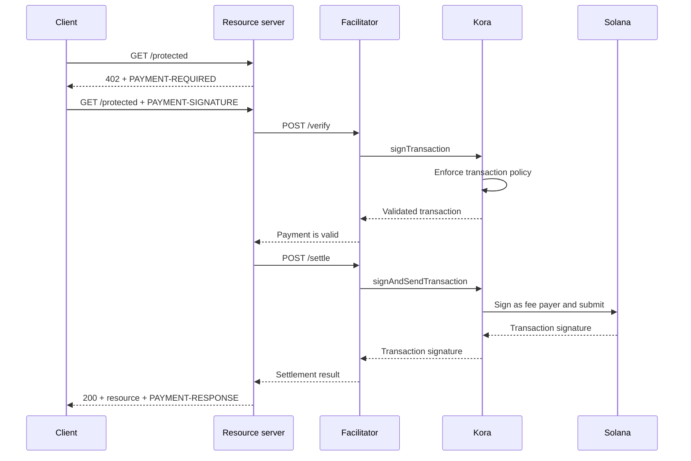

Το Kora μπορεί να παρέχει το επίπεδο υπογραφής Solana, πολιτικής συναλλαγών και χορηγίας τελών
πίσω από έναν [διευκολυντή x402 V2](/docs/tools/x402-facilitator). Ο
διευκολυντής υλοποιεί το HTTP API του x402· το Kora επικυρώνει, υπογράφει και αποστέλλει τις
συναλλαγές πληρωμής που αποδέχεται.

Αυτός ο οδηγός εκκινεί τον διευκολυντή αναφοράς Kora στο Solana Devnet. Πρόκειται για
περιβάλλον ανάπτυξης για δοκιμή της ενσωμάτωσης, όχι για παραγωγική ανάπτυξη.

## Αρχιτεκτονική



Οι τέσσερις ρόλοι της εφαρμογής παραμένουν διακριτοί:

- Ο **πελάτης** επιλέγει μια απαίτηση πληρωμής και υπογράφει την
  εξουσιοδότηση πληρωμής.
- Ο **διακομιστής πόρων** τιμολογεί μια διαδρομή και την εκπληρώνει μόνο μετά από επιτυχή
  επαλήθευση και διακανονισμό.
- Ο **διευκολυντής** εκθέτει τα endpoints `/supported`, `/verify` και `/settle` του x402.
- Το **Kora** υπογράφει μόνο συναλλαγές που επιτρέπονται από την πολιτική του και μπορεί να χορηγεί
  τα τέλη δικτύου Solana.

Το Kora δεν αντικαθιστά το πρωτόκολλο x402. Αποτελεί το όριο υπογραφής και πολιτικής
που χρησιμοποιείται από αυτή την υλοποίηση διευκολυντή.

## Εκκίνηση του διευκολυντή αναφοράς

Χρειάζεστε Git και [Docker με Compose](https://docs.docker.com/compose/). Κλωνοποιήστε
την τελευταία σταθερή έκδοση του Kora και μεταβείτε στο demo x402:

```bash
git clone --branch v2.0.5 --depth 1 https://github.com/solana-foundation/kora.git
cd kora/examples/x402/demo
cp .env.example .env
```

Ορίστε το `KORA_PRIVATE_KEY` στο `.env` σε ένα εφήμερο keypair Devnet. Η διαμόρφωση
υπογράφοντα του demo αποδέχεται ένα μυστικό base58, ένα keypair byte-array ή τη διαδρομή
σε ένα αρχείο keypair JSON. Χρηματοδοτήστε τη δημόσια διεύθυνσή του με Devnet SOL ώστε να μπορεί
να χορηγεί τέλη συναλλαγών.

<Callout type="caution" title="Χρησιμοποιήστε εφήμερο υπογράφοντα Devnet">
  Το demo Docker φορτώνει τον υπογράφοντα Kora από μια μεταβλητή περιβάλλοντος. Μην τοποθετείτε
  ένα κλειδί υπογραφής παραγωγής σε αυτό το demo ούτε να υποβάλλετε το αρχείο `.env` στο σύστημα ελέγχου εκδόσεων.
</Callout>

Εκκινήστε το Kora και τον διευκολυντή:

```bash
docker compose up --build
```

Η πρώτη κατασκευή μπορεί να διαρκέσει αρκετά λεπτά. Όταν και οι δύο έλεγχοι υγείας περάσουν, εξετάστε
τις διαφημιζόμενες δυνατότητες του διευκολυντή από άλλο τερματικό:

```bash
curl http://127.0.0.1:3000/supported
```

Η απόκριση θα πρέπει να διαφημίζει έκδοση x402 `2`, το σχήμα `exact` και τον
αναγνωριστικό δικτύου CAIP-2 του Devnet:

```json
{
  "kinds": [
    {
      "x402Version": 2,
      "scheme": "exact",
      "network": "solana:EtWTRABZaYq6iMfeYKouRu166VU2xqa1",
      "extra": {
        "feePayer": "<KORA_SIGNER_ADDRESS>"
      }
    }
  ]
}
```

Το Kora ακούει στο `127.0.0.1:8080` και ο διευκολυντής ακούει στο `127.0.0.1:3000`
από προεπιλογή. Διακόψτε το demo με `Ctrl+C`.

## Σύνδεση διακομιστή πόρων

Διαμορφώστε τον διακομιστή πόρων x402 ώστε να χρησιμοποιεί τον τοπικό διευκολυντή και τη δημόσια
διεύθυνση του υπογράφοντα Kora ως παραλήπτη:

```bash
FACILITATOR_URL=http://127.0.0.1:3000
SOLANA_PAY_TO=<KORA_SIGNER_ADDRESS>
```

Στη συνέχεια, ακολουθήστε [το x402 στο Solana](/docs/payments/agentic-payments/x402) για να προσθέσετε
middleware x402 V2 σε μια διαδρομή Express. Ένα μη πληρωμένο αίτημα λαμβάνει
`PAYMENT-REQUIRED`, η επανάληψη φέρει `PAYMENT-SIGNATURE` και μια επιτυχής
απόκριση φέρει `PAYMENT-RESPONSE`.

Μην αντιγράφετε παραδείγματα που χρησιμοποιούν `X-PAYMENT`, `X-PAYMENT-RESPONSE` ή το
όνομα δικτύου `solana-devnet`. Αυτά τα πεδία ανήκουν στο x402 V1.

Το αποθετήριο Kora περιλαμβάνει επίσης ένα προστατευμένο API και έναν πελάτη με γνώση πληρωμών στον
ίδιο κατάλογο `examples/x402/demo`. Χρησιμοποιήστε αυτές τις εφαρμογές όταν χρειάζεστε να
δοκιμάσετε την πλήρη τοπική ροή.

## Διαμόρφωση πολιτικής Kora

Το `kora/kora.toml` αναφοράς είναι σκόπιμα περιορισμένο. Η πολιτική επικύρωσής του
ελέγχει:

- ποια προγράμματα Solana επιτρέπει ο υπογράφων·
- ποιες εκδόσεις SPL token mint μπορούν να χρησιμοποιηθούν·
- τον μέγιστο αριθμό χορηγούμενων lamports και πλήθος υπογραφών·
- ποιες λειτουργίες πληρωτή τελών απαγορεύονται· και
- ποιες επεκτάσεις Token-2022 απορρίπτονται.

Το demo ενεργοποιεί μόνο τις μεθόδους Kora RPC που χρειάζεται ο διευκολυντής του:
`signTransaction`, `signAndSendTransaction`, `getBlockhash`, `getPayerSigner`,
`getConfig` και `getVersion`.

Αντιμετωπίστε την πολιτική ως το όριο ασφαλείας για το κλειδί πληρωτή τελών. Για μια
υπηρεσία παραγωγής:

1. Συμπεριλάβετε στη λίστα επιτρεπόμενων μόνο τα προγράμματα, τα token mints και τις μορφές συναλλαγών
   που παράγει το σχήμα x402 σας.
2. Απαγορεύστε μεταφορές, αλλαγές αρχής, κλείσιμο λογαριασμού και άλλες εντολές
   που μπορούν να μετακινήσουν αξία από τον υπογράφοντα Kora.
3. Ορίστε όρια συναλλαγών και χρήσης που περιορίζουν την απώλεια από παραβιασμένα
   διαπιστευτήρια διευκολυντή.
4. Χρησιμοποιήστε διαχειριζόμενο backend υπογράφοντα αντί για ιδιωτικό κλειδί που διατηρείται σε μεταβλητή περιβάλλοντος.

## Ασφάλιση της σύνδεσης διευκολυντή-Kora

Το demo ενεργοποιεί έλεγχο ταυτότητας με κλειδί API του Kora. Ο διευκολυντής αποστέλλει την τιμή του
`KORA_API_KEY`, η οποία πρέπει να αντιστοιχεί στο `[kora.auth].api_key` στο `kora.toml`.

Για παραγωγή, επίσης:

- διατηρήστε το Kora σε ιδιωτικό δίκτυο και τερματίστε το TLS σε αξιόπιστο όριο·
- αποθηκεύστε διαπιστευτήρια API σε διαχειριστή μυστικών και εναλλάσσετε τα·
- εξετάστε τον έλεγχο ταυτότητας αιτημάτων HMAC του Kora για προστασία από παραποίηση και επαναληπτικές επιθέσεις·
- διαχωρίστε τα κλειδιά πληρωτή τελών και παραλήπτη πληρωμής όταν το λογιστικό σας μοντέλο
  το απαιτεί· και
- ρυθμίστε ειδοποιήσεις για απορρίψεις πολιτικής, αποτυχίες διακανονισμού, κατανάλωση τελών και υπόλοιπο υπογράφοντα.

## Ενίσχυση του διακανονισμού πληρωμών

Το Kora επικυρώνει τη συναλλαγή Solana, αλλά ο διευκολυντής και ο διακομιστής πόρων
εξακολουθούν να είναι υπεύθυνοι για την ορθότητα του πρωτοκόλλου x402. Πριν εξυπηρετήσετε έναν πόρο, επιβάλλετε:

- την επιλεγμένη έκδοση x402, σχήμα, δίκτυο, στοιχείο, ποσό και παραλήπτη·
- τη διάρκεια ζωής εξουσιοδότησης και την ακριβή διάταξη εντολών Solana·
- ατομική προστασία από επανάληψη και ιδεμποτικό διακανονισμό·
- επιβεβαίωση στο επίπεδο δέσμευσης που απαιτεί το προϊόν· και
- ανθεκτική αντιστοίχιση μεταξύ της αγοράς, του αποτελέσματος διακανονισμού και της εκπλήρωσης.

Μην επιστρέφετε πληρωμένο περιεχόμενο απλώς επειδή το Kora αποδέχθηκε μια συναλλαγή για
υπογραφή. Εκπληρώνετε μόνο αφού ο διευκολυντής επιστρέψει επιτυχές αποτέλεσμα διακανονισμού.

## Σχετικοί πόροι

- [Αποθετήριο Kora και demo x402](https://github.com/solana-foundation/kora/tree/main/examples/x402/demo)
- [Διαμόρφωση χειριστή Kora](/docs/tools/kora/operators/configuration)
- [Backends υπογράφοντα Kora](/docs/tools/kora/operators/signers)
- [Έλεγχοι ασφαλείας Kora](/docs/tools/kora/security-audits)
- [Προδιαγραφή x402 V2](https://github.com/x402-foundation/x402/blob/main/specs/x402-specification-v2.md)
- [Επισκόπηση πληρωμών agentic](/docs/payments/agentic-payments)
