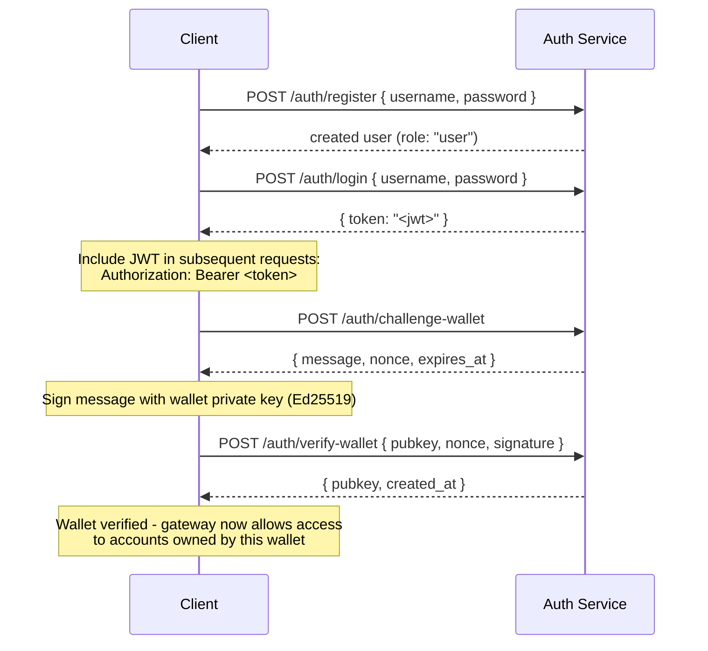

## Επισκόπηση

Τα Private Channels περιλαμβάνουν ένα προαιρετικό Auth Service που ελέγχει την πρόσβαση στο gateway
με αυθεντικοποίηση JWT και έλεγχο πρόσβασης βάσει ρόλων (RBAC). Όταν
η αυθεντικοποίηση είναι απενεργοποιημένη, το gateway αποδέχεται όλες τις συνδέσεις. Όταν είναι ενεργοποιημένη,
οι clients πρέπει να παρουσιάζουν έγκυρο JWT σε κάθε αίτημα.

Αυτή η σελίδα απευθύνεται και στα δύο κοινά:

- **Developers** - εγγραφή, σύνδεση, επαλήθευση πορτοφολιού και εκτέλεση
  αυθεντικοποιημένων αιτημάτων
- **Operators** - ενεργοποίηση του auth service, διαμόρφωση του `JWT_SECRET` και
  παροχή του ρόλου `operator`

## Ενεργοποίηση Αυθεντικοποίησης

Η αυθεντικοποίηση ενεργοποιείται ορίζοντας το `JWT_SECRET` (μη κενό) τόσο στο
gateway όσο και στο Auth Service. Το Auth Service απαιτεί επίσης
`AUTH_DATABASE_URL`.

Όταν το `JWT_SECRET` δεν έχει οριστεί, το gateway λειτουργεί σε ανοιχτή λειτουργία· δεν απαιτείται
κανένα token.

> **Docker Compose:** Το auth service είναι ένα profile του Docker Compose και **δεν
> ξεκινά από προεπιλογή**. Για να το συμπεριλάβετε, περάστε `--profile auth` στην
> εντολή `docker compose`, συμπεριλαμβάνοντας `--env-file .env` ώστε τα secrets όπως
> `JWT_SECRET` και `POSTGRES_PASSWORD` να επιλυθούν σωστά (το Compose απενεργοποιεί την
> αυτόματη φόρτωση `.env` μόλις περαστεί οποιοδήποτε flag `--env-file`):
>
> ```bash
> docker compose -f docker-compose.devnet.yml --env-file versions.env --env-file .env.devnet --env-file .env --profile auth up -d
> ```

## API Auth Service

Όλα τα endpoints βρίσκονται κάτω από το `/auth`. Το auth service ακούει στο `AUTH_PORT`
(προεπιλογή `8903`).

### `POST /auth/register`

Δημιουργία νέου λογαριασμού. Όλοι οι χρήστες εγγράφονται με τον ρόλο `user`.

```json
{ "username": "alice", "password": "hunter2" }
```

- Όνομα χρήστη: 5-32 χαρακτήρες, αλφαριθμητικοί συν `_` και `-`
- Κωδικός πρόσβασης: 6-128 χαρακτήρες
- Επιστρέφει τον δημιουργημένο χρήστη· ο κωδικός δεν επιστρέφεται ποτέ

### `POST /auth/login`

Αυθεντικοποίηση και λήψη υπογεγραμμένου JWT με ισχύ 24 ωρών.

```json
{ "username": "alice", "password": "hunter2" }
```

Επιστρέφει `{ "token": "<jwt>" }`. Τόσο λάθος όνομα χρήστη όσο και λάθος κωδικός επιστρέφουν
`401` για την αποφυγή απαρίθμησης ονομάτων χρηστών.

### `POST /auth/challenge-wallet`

Αίτημα πρόκλησης υπογραφής για απόδειξη κυριότητας πορτοφολιού Solana. Απαιτεί
έγκυρο JWT.

Επιστρέφει μήνυμα, nonce και ημερομηνία λήξης. Η πρόκληση λήγει σε 10 λεπτά.

```json
{
  "message": "PrivateChannel wallet verification\nuser: <uuid>\nnonce: <uuid>\nexpires: <unix>",
  "nonce": "<uuid>",
  "expires_at": "<iso8601>"
}
```

### `POST /auth/verify-wallet`

Υποβολή της υπογεγραμμένης πρόκλησης για καταχώριση πορτοφολιού ως επαληθευμένου. Απαιτεί
έγκυρο JWT.

```json
{
  "pubkey": "<base58 pubkey>",
  "nonce": "<uuid from challenge>",
  "signature": "<base58 Ed25519 signature>"
}
```

Η υπηρεσία ανακατασκευάζει το μήνυμα πρόκλησης, επαληθεύει την υπογραφή Ed25519
και αποθηκεύει το πορτοφόλι. Κάθε nonce μπορεί να χρησιμοποιηθεί μόνο μία φορά· οι επαναλήψεις
απορρίπτονται.

Επιστρέφει `{ "pubkey": "<base58>", "created_at": "<iso8601>" }`.

### `GET /auth/wallets`

Λίστα όλων των επαληθευμένων πορτοφολιών για τον αυθεντικοποιημένο χρήστη. Απαιτεί έγκυρο JWT.

### `DELETE /auth/wallets/{pubkey}`

Αφαίρεση επαληθευμένου πορτοφολιού από τον λογαριασμό του αυθεντικοποιημένου χρήστη. Απαιτεί
έγκυρο JWT.

### `GET /health`

Έλεγχος λειτουργίας. Επιστρέφει `200 ok`. Δεν απαιτείται αυθεντικοποίηση.

## Δομή JWT

Τα tokens χρησιμοποιούν τον αλγόριθμο HS256 και λήγουν 24 ώρες μετά την έκδοσή τους.

| Claim  | Τιμή                           |
| ------ | ------------------------------- |
| `sub`  | UUID Χρήστη                       |
| `role` | `"user"` ή `"operator"`        |
| `iss`  | `"private-channel-auth"`        |
| `aud`  | `"private-channel-gateway"`     |
| `exp`  | Unix timestamp (24h από την έκδοση) |

> `iss` και `aud` υπάρχουν στο payload του JWT αλλά επαληθεύονται από τη
> διαμόρφωση JWT του gateway, και όχι από αποσειριοποίηση στο struct των application claims.
> Ο κώδικας σε επίπεδο εφαρμογής έχει πρόσβαση μόνο στα `sub`, `role` και `exp`.

Περάστε το token στην κεφαλίδα `Authorization`:

```
Authorization: Bearer <JWT_TOKEN>
```

## Ρόλοι

### user

Προεπιλεγμένος ρόλος κατά την εγγραφή.

- Η πρόσβαση περιορίζεται στα δικά του επαληθευμένα πορτοφόλια
- Αποκλεισμός από: `getBlock`, `getTransaction`, `simulateTransaction`
- Δυνατότητες: κλήση `Deposit` στο Escrow Program, εκκίνηση αναλήψεων μέσω
  `WithdrawFunds`

### operator

Υψηλότερος ρόλος. Πρέπει να παρασχεθεί απευθείας· δεν υπάρχει διαδρομή αυτοεξυπηρέτησης
για κλιμάκωση από `user` σε `operator`.

**Εκχώρηση ρόλου**, είτε μέσω του Admin CLI (`private-channel-auth-admin`):

```bash
private-channel-auth-admin set-role --username alice --role operator
```

ή με απευθείας SQL:

<Callout type="warning">
  Αυτή είναι μια προνομιακή λειτουργία βάσης δεδομένων. Περιορίστε την πρόσβαση στη βάση δεδομένων
  του Auth Service αντίστοιχα και ελέγχετε τυχόν αλλαγές ρόλων.
</Callout>

```sql
UPDATE private_channel_auth.users SET role = 'operator' WHERE username = 'alice';
```

**Καταχώριση πορτοφολιού χωρίς τη διαδικασία αυτο-επαλήθευσης (Admin CLI,
`private-channel-auth-admin`):**

```bash
private-channel-auth-admin attach-wallet --username alice --pubkey <base58-pubkey>
```

Αυτό εισάγει ένα επαληθευμένο πορτοφόλι απευθείας στον πίνακα `verified_wallets`,
παρακάμπτοντας τη διαδικασία challenge/verify. Επιβάλλει μοναδικό περιορισμό στο
`(user_id, pubkey)`. **Δεν** εκχωρεί από μόνο του τον ρόλο `operator`· χρησιμοποιήστε
`set-role` ή την παραπάνω ενημέρωση SQL γι' αυτό. Αυτή η εντολή προορίζεται για την
σύνδεση πορτοφολιού σε λογαριασμό (π.χ. λογαριασμό υπηρεσίας) χωρίς να απαιτείται
η διαδραστική διαδικασία challenge/verify.

**Δυνατότητες:**

- Παράκαμψη όλων των ελέγχων κυριότητας πορτοφολιού
- Πλήρης πρόσβαση σε όλες τις μεθόδους RPC του gateway, συμπεριλαμβανομένων των `getBlock`,
  `getTransaction`, `simulateTransaction`
- Απαιτείται για: `ReleaseFunds`, `ResetSmtRoot`

## Πλήρης Ροή Αυθεντικοποίησης



## Εκτέλεση Αυθεντικοποιημένων Αιτημάτων

```typescript
const response = await fetch("http://localhost:8899/", {
  method: "POST",
  headers: {
    "Content-Type": "application/json",
    Authorization: `Bearer ${jwtToken}`
  },
  body: JSON.stringify({
    jsonrpc: "2.0",
    id: 1,
    method: "getBalance",
    params: [walletAddress]
  })
});
const data = await response.json();
```

## Endpoints Gateway

Τα παρακάτω endpoints δεν απαιτούν αυθεντικοποίηση:

| Endpoint  | Μέθοδος | Περιγραφή                               | Επιτυχία                  | Αποτυχία                     |
| --------- | ------ | ----------------------------------------- | ------------------------ | --------------------------- |
| `/health` | GET    | Έλεγχος λειτουργίας                            | `200 {"status":"ok"}`    | -                           |
| `/ready`  | GET    | Βαθύς έλεγχος ετοιμότητας· δοκιμάζει κόμβους εγγραφής + ανάγνωσης | `200 {"status":"ready"}` | `503 {"status":"degraded"}` |

Για την αναφορά μεταβλητών περιβάλλοντος `JWT_SECRET` και gateway, δείτε την
[Αναφορά Διαμόρφωσης](/docs/tools/private-channels/operators/configuration).

## Πίνακας Πρόσβασης Μεθόδων RPC

Οι παρακάτω μέθοδοι αναγνωρίζονται από το gateway. Όταν έχει οριστεί το `JWT_SECRET`,
η πρόσβαση εξαρτάται από τον ρόλο JWT:

| Μέθοδος                        | Δρομολόγιο      | Χωρίς JWT | `user`           | `operator` |
| ----------------------------- | ---------- | ------ | ---------------- | ---------- |
| `sendTransaction`             | Κόμβος εγγραφής | ✓      | ✓                | ✓          |
| `getLatestBlockhash`          | Κόμβος ανάγνωσης  | ✓      | ✓                | ✓          |
| `getSlot`                     | Κόμβος ανάγνωσης  | ✓      | ✓                | ✓          |
| `getRecentBlockhash`          | Κόμβος ανάγνωσης  | ✓      | ✓                | ✓          |
| `getSignatureStatuses`        | Κόμβος ανάγνωσης  | ✓      | ✓                | ✓          |
| `getTransactionCount`         | Κόμβος ανάγνωσης  | ✓      | ✓                | ✓          |
| `getFirstAvailableBlock`      | Κόμβος ανάγνωσης  | ✓      | ✓                | ✓          |
| `getBlocks`                   | Κόμβος ανάγνωσης  | ✓      | ✓                | ✓          |
| `getEpochInfo`                | Κόμβος ανάγνωσης  | ✓      | ✓                | ✓          |
| `getEpochSchedule`            | Κόμβος ανάγνωσης  | ✓      | ✓                | ✓          |
| `getRecentPerformanceSamples` | Κόμβος ανάγνωσης  | ✓      | ✓                | ✓          |
| `getBlockTime`                | Κόμβος ανάγνωσης  | ✓      | ✓                | ✓          |
| `getVoteAccounts`             | Κόμβος ανάγνωσης  | ✓      | ✓                | ✓          |
| `getSupply`                   | Κόμβος ανάγνωσης  | ✓      | ✓                | ✓          |
| `getSlotLeaders`              | Κόμβος ανάγνωσης  | ✓      | ✓                | ✓          |
| `isBlockhashValid`            | Κόμβος ανάγνωσης  | ✓      | ✓                | ✓          |
| `getAccountInfo`              | Κόμβος ανάγνωσης  | 401    | με έλεγχο κυριότητας¹ | ✓          |
| `getTokenAccountBalance`      | Κόμβος ανάγνωσης  | 401    | με έλεγχο κυριότητας¹ | ✓          |
| `getSignaturesForAddress`     | Κόμβος ανάγνωσης  | 401    | με έλεγχο κυριότητας¹ | ✓          |
| `getBlock`                    | Κόμβος ανάγνωσης  | 401    | 403              | ✓          |
| `getTransaction`              | Κόμβος ανάγνωσης  | 401    | 403              | ✓          |
| `simulateTransaction`         | Κόμβος ανάγνωσης  | 401    | 403              | ✓          |

¹ **Με έλεγχο κυριότητας**: για έναν λογαριασμό SPL Token (το πεδίο owner είναι `TokenkegQ...`
ή `TokenzQ...`, δεδομένα τουλάχιστον 165 bytes), το gateway ελέγχει ότι το πεδίο
`owner` ή `delegate` αντιστοιχεί σε ένα από τα επαληθευμένα πορτοφόλια του αυθεντικοποιημένου χρήστη. Για κάθε άλλο τύπο λογαριασμού (ένα πορτοφόλι System Program ή ένα άγνωστο
PDA), ελέγχει αντ' αυτού αν το ίδιο το ερωτώμενο pubkey είναι ένα από τα επαληθευμένα πορτοφόλια του χρήστη, καθώς τέτοιοι λογαριασμοί δεν έχουν πεδίο owner/delegate για έλεγχο.
Αν κάποιος από τους ελέγχους αποτύχει, επιστρέφεται 403.
